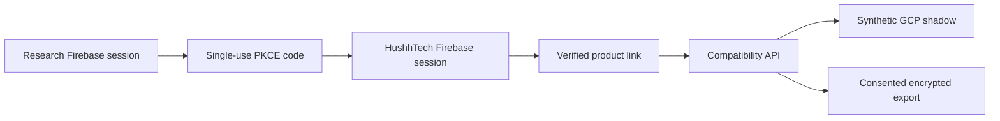

# HushhTech UAT Client

Status: UAT-only, synthetic cohort, default off. Production and every Supabase
surface remain unchanged.

## Visual Context

Canonical visual owner: [Architecture Index](README.md). This local flow shows
only the UAT client boundary introduced by this delivery.



Hussh Research is the authority for Firebase identity, consent, revocation,
connector cryptography, private-place access, and PKM. HushhTech is a product
client. It never connects to Research Cloud SQL and never receives an owner
token, a Research private key, a key wrapper, or a raw PKM endpoint.

## Flow

1. HushhTech generates a PKCE verifier/challenge and opens the Research launch page.
2. Research verifies its existing Firebase session and exact UAT audience/redirect.
3. Research stores only a peppered code hash, S256 challenge, Firebase UID, audience, redirect, and 60-second timestamps. Expired rows are compacted after a 24-hour replay-review window.
4. HushhTech exchanges the one-time code and verifier server-side.
5. Research mints a Firebase custom token for the same canonical UID, bound to the HushhTech UAT app and audience.
6. The HushhTech server proves its dedicated developer app on every link or compatibility call.
7. Synthetic linking requires recent Firebase authentication plus a server-derived synthetic legacy-session proof. Email, phone, and provider aliases are forbidden mapping keys.
8. Consented Research information uses the existing encrypted scoped-export flow and the one registered X25519 public connector key. HushhTech decrypts only on its server with its Secret Manager-held private key.

Product routes use a no-side-effect Firebase verifier. Actor identity sync starts
only after the feature flag and exact UID cohort pass, so disabled or
non-cohort calls cannot create Research rows.

## HTTP Contract

| Method | Route | Proof | Purpose |
| --- | --- | --- | --- |
| `POST` | `/api/v1/products/hushh-tech/launch/authorize` | Research Firebase bearer | Create 60-second, single-use S256 launch code |
| `POST` | `/api/v1/products/hushh-tech/launch/exchange` | code + PKCE verifier | Consume once and return product-bound Firebase custom token |
| `GET` | `/api/v1/products/hushh-tech/link/status` | Firebase bearer + server-only product token | Return `READY` or `LINK_REQUIRED` |
| `POST` | `/api/v1/products/hushh-tech/link/verify` | recent Firebase bearer + product token + synthetic legacy-session proof | Create or reuse the UID/legacy UUID link |
| `POST` | `/api/v1/products/hushh-tech/link/revoke` | recent Firebase bearer + product token | Revoke the active product link |
| `GET` | `/api/v1/products/hushh-tech/compatibility/{record_type}` | Firebase bearer + product token | Read one allowlisted synthetic compatibility record |

The same-origin Research web route is `/products/hushh-tech/launch`; its two
Next.js API proxies preserve the backend request/response fields and set
no-store caching. The callback adds only `code`, caller-provided `state`, and
`source=hushh-research` to the exact backend-returned HTTPS redirect.

Typed states are `UNAUTHENTICATED`, `LINK_REQUIRED`, `LINK_CONFLICT`,
`CONSENT_REQUIRED`, `UPSTREAM_UNAVAILABLE`, `STALE_SHADOW`, and
`FEATURE_DISABLED`; bounded abuse returns `RATE_LIMITED`. Unknown dependency failures become
`UPSTREAM_UNAVAILABLE`; raw exception or credential text is never returned.
All product responses are private and non-cacheable. Dedicated shared rate
limits bound launch, link, and compatibility traffic; the unauthenticated PKCE
exchange is IP-keyed and capped before repeated Cloud SQL lookups. A cheap
direct-ingress budget runs before Google proxy-attestation or Firebase
verification, followed by per-visitor and verified-UID budgets. The Research
Next proxy independently applies its own per-visitor Redis budget using the
rightmost edge-added address. It then sends a Google service-account identity
token plus that address. The token audience is the exact private Cloud Run
backend origin mounted as `BACKEND_URL`, not a guessed public alias. The backend
accepts the address only when the token's audience, expiry, verified email, and
exact runtime-service-account allowlist match. Raw or forged forwarding headers
fall back to the direct ingress bucket.
UAT admission requires shared Redis storage, so autoscaling cannot multiply an
in-process abuse allowance. The UAT deploy attaches the repository variable
`UAT_VPC_CONNECTOR` to both services with private-range egress; the cohort stays
off until that connector and the Redis secret are live.

## Database and Import

Migration 162 adds six additive tables to the existing Cloud SQL contract:

- hashed, short-lived launch authorizations
- active/revoked Firebase UID to synthetic legacy UUID links
- append-only link events and conflicts
- four allowlisted synthetic shadow record types: `profile`, `onboarding`, `access_state`, `report_asset`
- checksummed importer runs and checkpoints
- append-only importer start, per-record outcome, failure, and completion evidence

Migration 162 is selected only by the governed UAT overlay; production and dev
remain at migration 161. The audit table rejects every update or delete in the
database, requires a non-null Firebase UID, and keeps immutable link identifiers
without cascading rewrites. Links, events, and shadow rows accept only the exact
`hushh-tech-uat-synthetic` legacy project.

The importer accepts only the checked-in
`consent-protocol/tests/fixtures/hushh_tech/synthetic_uat_shadow.jsonl` file at
the reviewed SHA-256 hash
`3c9c9796b4765b5db9734dc4fc44f072c5043caf1e2561865088272fc4983dd8`.
Apply mode requires the exact UAT
environment and `hushh-pda-uat:us-central1:hushh-uat-pg` identity. Before any
advisory lock or write, it also reads PostgreSQL's cluster system identifier,
database name, role, and major version from the connected server and compares
them with the reviewed UAT attestation. This prevents a loopback proxy aimed at
another instance from passing on environment strings alone. A deliberate UAT
instance rebuild requires a reviewed attestation update before imports resume.
Each apply appends a start event, a record event in the same transaction as its
shadow write and checkpoint, and one terminal completion or failure event. The
event ledger stores only bounded metadata and hashes; database triggers reject
updates and deletes.
The importer has no Supabase URL, key, connection, or export mode. Replay is
deterministic; changed hashes, unexpected fields, or orphan target rows fail
closed.

## Product Registration

The UAT registration must have exactly the `hushh_tech_client` tool group,
which exposes only `request_consent`, `check_consent_status`, and
`get_encrypted_scoped_export`. Any `core_consent`, RIA, Kai, HusshOne,
Marketplace, generic capability, or additional tool-group grant makes the
compatibility routes reject that principal. Register one active
`X25519-AES256-GCM` connector public key; its private half exists only in
HushhTech UAT Secret Manager.

Use the dedicated reconciliation command, never the generic partner-app
provisioner, for this registration:

```bash
cd consent-protocol
python scripts/ops/reconcile_hushh_tech_uat_developer_app.py \
  --connector-key-id hushh-tech-uat-x25519-1 \
  --connector-public-key "$HUSSH_TECH_CONNECTOR_PUBLIC_KEY" \
  --token-output-file /secure/local/hushh-tech-uat-developer-token
```

The command requires the exact `hushh-pda-uat` project,
`hushh-pda-uat:us-central1:hushh-uat-pg` instance, and configured app id before
opening the registry. It then attests the connected server's PostgreSQL 15
cluster identifier, database, and role before any write, so a local proxy aimed
at another instance fails closed. A repeat run removes migration-era
capabilities such as `cap.one.invoke`, converges the tool groups to exactly
`hushh_tech_client`, disables generic OAuth client credentials, and verifies
exactly one active connector key. App-policy repair and connector-key rotation
commit in one transaction; the replacement key is inserted and validated
before the prior key is retired. Production and mismatched app ids fail closed.
Add `--verify-only` for a read-only policy check against the attested server.
When a token must be issued, the create-only output file is written with mode
`0600` before the database transaction commits. The raw token is never printed
or returned by the service; move it directly into HushhTech UAT Secret Manager
and delete the local file after confirming the secret version.

The same transaction revokes every legacy OAuth client plus access and refresh
token for the app. If active `hdk_` credentials are missing, duplicated, or not
the dedicated `hushh-tech-uat-primary` credential, all prior active credentials
are revoked and exactly one replacement is delivered through the owner-only
file sink. A repeat run keeps that one intended credential and never reads it
back.

A reused row is accepted only when its stable tenant binding is exact:
`agent_id` must equal `developer:{app_id}`, `application_id` must be null, and
it must not belong to a Firebase owner. Any mismatch stops before registry
writes or key rotation.

The registration can request only exact, non-wildcard `attr.*` values listed
in `HUSSH_TECH_ALLOWED_CONSENT_SCOPES`. The empty default denies every export;
owner, PKM, HusshOne, RIA, MCP, and Marketplace scopes remain unavailable.

Product-link revocation invalidates every earlier product consent epoch. After
relinking, status and request flows require fresh consent; old inline exports,
ciphertext resources, and already-open event streams fail closed with
`CONSENT_REQUIRED` or terminate before their next event. Consent issuance must
be strictly later than the current link timestamp; equal millisecond values
also fail closed and can be retried.

## Admission and Rollback

The backend feature flag, exact developer app id, audience, redirect allowlist,
Firebase UID cohort, launch pepper, shared Redis limiter, proxy audience, and
trusted proxy service-account allowlist must all be present. Production is hard-disabled
even if configuration drifts. HushhTech must also prove at build and runtime
that its Admin and web-client configuration both use the shared `hushh-pda`
Firebase authority. `hushh-pda-uat` remains the UAT runtime and Secret Manager
project; it is not a separate Firebase identity authority.

Rollback first disables both cohort flags, then restores captured prior Cloud
Run revisions if needed. Migration 162 is additive; tables remain inert and no
destructive down-migration is required. No migrated-cohort request falls back
to Supabase. It fails closed or explicitly exits to the standalone legacy app.

The exhaustive unchanged Supabase inventory is recorded in
[hushh-tech-uat-client-disposition-matrix.md](./hushh-tech-uat-client-disposition-matrix.md).
