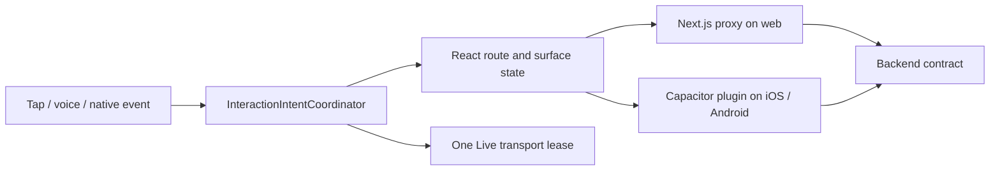

# Serialized Interaction Runtime

## Visual Map

The app shell owns interaction ordering across web, iOS, and Android. This is
not an action planner: One's generated action gateway remains the semantic
authority, while the client runtime owns lifecycle, cancellation, and UI
settlement.

## Contract

- `InteractionIntentCoordinator` serializes pathname-changing navigation,
  voice-session ownership, and generated action directive identity.
- New navigation supersedes an uncommitted older destination; same-target
  requests are idempotent. Query-only history writes remain immediate.
- One Live and Agent Chat controls acquire the same voice lease. A stale lease
  cannot update React state, play audio, navigate, or settle an action.
- Generated directives require a per-session `directiveId`; duplicate IDs do
  not execute twice and conflicting payloads fail closed. Ledgers never retain
  raw slots, credentials, OTPs, or vault material.
- Capacitor lifecycle is published once at the app shell. The VaultProvider is
  still the sole vault authority: backgrounding ends voice but preserves a
  valid in-memory vault; expiry, logout, rekey, revocation, or cold start locks.

## Transport parity

Web reaches backend APIs through Next.js proxy routes. Capacitor plugins reach
the same backend contracts directly because a packaged native app has no
Next.js server. React state and action IDs are identical above that transport
boundary; iOS/Android plugins must not own route state or invent action
semantics.

## Verification

The destructive UAT route audits prove cold-start parity. `npm run
ios:continuity:local` and `npm run android:continuity:local` are separate,
non-destructive interactive sessions for same-process route, vault, and voice
continuity. The iOS command is pinned to the iPhone 14 Plus simulator and
never installs, uninstalls, clears, or resets the app.
