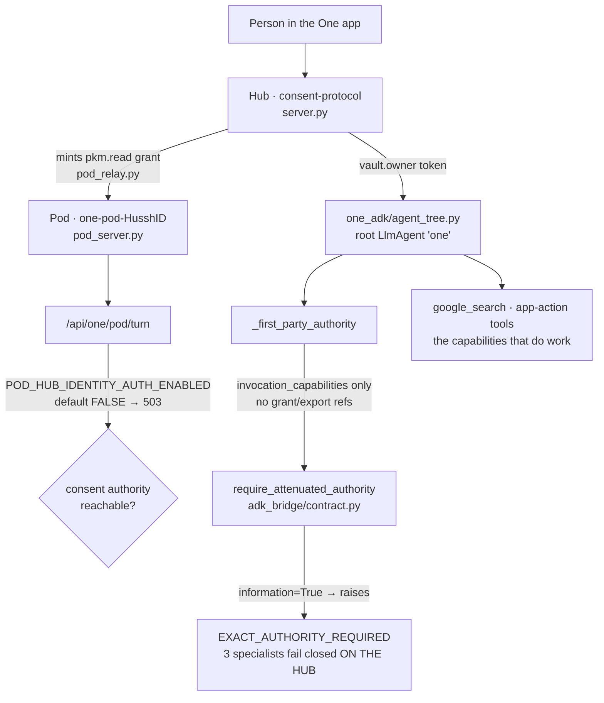

# Interface-to-agent routing — what actually reaches an agent

**Status:** verified against the working tree on 2026-08-06 (branch
`claude/hushh-infrastructure-analysis-7o991c`). Every row carries the file and symbol
that decides it. Nothing here is inferred from a flag being present.

This document exists because the question *"does every capability in the One interface
route to the right agent?"* has been answered three times from three different angles,
and all three answers disagreed with the docs. It records the reading, not the intent.

## Visual Map

## The finding that reframes everything

**Three of the six registered specialists fail closed on the hub, today, in production.**

`_first_party_authority` (`consent-protocol/hushh_mcp/one_adk/agent_tree.py`) builds an
`A2AAuthorityContext` carrying `invocation_capabilities` **only** — no
`information_grant_refs`, no `encrypted_export_refs`. `require_attenuated_authority`
(`consent-protocol/hushh_mcp/adk_bridge/contract.py`) requires *both* when
`information=True`. So `agent_email`, `agent_connections` and `agent_connected_systems`
raise `A2AAuthorityRequired` before doing any work, and `_specialist_turn` converts that
into a `scope_required` status.

The consequence for the pod programme is the part worth internalising: **there is no
working hub behaviour for a pod to reach parity with.** Any plan phrased as "run the same
handler in the pod, so behaviour is identical" would faithfully reproduce
`EXACT_AUTHORITY_REQUIRED`. Parity is not the blocker; the authority body is.

## Per-capability routing truth

| One capability | Target | Works on hub | Works in pod | Deciding reason |
|---|---|---|---|---|
| `google_search` | ADK built-in | yes | yes | Self-contained; Vertex env is injected into the pod by `gcp_backend.render_deploy_config`. |
| `open_screen`, `run_app_action`, `start_app_goal`, `continue_app_goal`, `list_app_actions` | in-process, directive-only | yes | partly | Not dispatch-backed. Directive paths work; anything touching the action-directive store needs Postgres, which a pod has no credential for — by design. |
| `ask_email_agent` | `agent_email` | **no** | no | `require_attenuated_authority(information=True)` raises — no grant/export refs are ever minted. |
| `ask_connected_systems_agent` | `agent_connected_systems` | **no** | no | Same gate, `information=True, action=True`. |
| `ask_consent_agent` → connections | `agent_connections` | **no** | no | Same gate, `information=True, action=True`. |
| `ask_consent_agent` → consent | `agent_nav` | yes | no | No authority gate, but the handler calls `validate_a2a_consent_token_with_db` — direct Postgres, absent in a pod. |
| `ask_location_agent` | `agent_location` | yes | no | No authority gate; `LocationChatService()` needs Postgres. |
| `finance` | `agent_kai` (+ RIA, investor) | yes | no | An in-process ADK `AgentTool`, never registered in the A2A `_REGISTRY`, so no network route can reach it at all. |
| KYC | 18 REST endpoints | yes (buttons) | no | Endpoints work; no conversational agent can reach them. |

## Two gates that sit above every row

1. **`POD_HUB_IDENTITY_AUTH_ENABLED` defaults to `False`.** At defaults,
   `POST /api/one/pod/turn` returns **503** (`consent authority is unavailable`) before
   any tool runs, because the pod's consent-verify call to the hub 401s. Nothing in the
   table above is reachable in a pod at default settings.

2. **The pod's turn token is `pkm.read`; `_first_party_authority` requires
   `cap.one.invoke`.** `scope_matches("pkm.read", "cap.one.invoke")` is `False`
   (`pkm.read` widens only to *dynamic* `attr.`-prefixed scopes). So in a pod
   `_first_party_authority` returns `None` on every turn, regardless of what the
   authority body is later taught to mint. On the hub the same function takes the other
   branch, because `require_vault_owner_token` yields `vault.owner`, which short-circuits
   the scope check.

   **This is the counterexample to "identical code implies identical behaviour."** Same
   function, different input authority, different outcome.

## What the pod identity header does and does not prove

`verify_pod_identity` (`consent-protocol/api/routes/one/pod_identity_auth.py`) verifies a
Google ID token's signature *and* audience, then checks the caller's service-account
email against a single allowed value. It then returns the `X-Hushh-Pod-Id` **request
header, verbatim**, compared against nothing.

Every pod runs as the *same* service account — that is precisely what lets that account
hold no project roles. So the token proves "a hussh pod is calling", never *which* pod.

A rule of the form "the header must match the token's user, else 403" is therefore a
**consistency check, not a security control**: both halves are supplied by the same
caller, so anything that can present user B's token can also assert B in the header. It
catches misconfiguration and is worth keeping — but it must not be documented as a second
independent verification, or a future reader will believe two things are checked when one
is.

The identity that *is* load-bearing is the consent token, validated hub-side against the
database on every call. Per-pod cryptographic identity is the attested tier, and it does
not exist yet.

## The recurring pattern this document is part of

Six subsystems have now been found the same way — each passed its unit tests and had
never executed:

| Subsystem | How it looked healthy |
|---|---|
| Pod provisioning | all 7 feature flags present |
| `heal_pod` | 3 tests, each passing an explicit `client=` |
| Reconcile retry | the test's stub was shaped to the broken call |
| A2A delegation | 33 attempts counted as successes; 0 succeeded |
| Liveness sweep | zero callers; the health column could only ever say `healthy` |
| Registry currency | a real drift test that was never in the CI manifest |

The shared shape: **a test written against a call site rather than against the callee's
signature passes for exactly as long as both are wrong together.** The check that has
consistently held is the one metadata cannot satisfy — running the real entry point and
asserting something was actually scheduled, dispatched, or returned.

## What would change these rows

In dependency order. Nothing later is worth starting before the one above it is real.

1. **Author `status` and `authorities` on the wired specialists.** Only 3 of 18 manifests
   declare either. Until they do there is nothing to compute an attenuation *from*. This
   is a product and consent decision, not an engineering one, and over-authoring here is
   how a fail-closed system quietly becomes fail-open — minimum viable scopes, one
   specialist at a time, each reviewed by the consent owner.
2. **Populate `information_grant_refs` and `encrypted_export_refs`** from hub-resolved
   state only, re-validated with `validate_token_with_db` so revocation still bites. This
   unblocks three specialists **on the hub first**, where the failure is observable.
   Never copy authority fields from a request body: the action gate is truthiness-only
   today, so a client-supplied string would satisfy it.
3. **Decide the pod turn's scope.** Either the relay mints `cap.one.invoke` rather than
   `pkm.read`, or `_first_party_authority` learns a pod-appropriate path. This single
   decision is what currently makes pod and hub diverge under identical code.
4. **Only then** consider a pod→hub dispatch transport — and note that `PodHubClient`
   defaults to a 10s timeout with no retry, against a 120s pod-turn budget, so a
   model-bound specialist call would fail on latency alone.

## Sources

- `consent-protocol/hushh_mcp/one_adk/agent_tree.py` — `_first_party_authority`, `_specialist_turn`, the root roster
- `consent-protocol/hushh_mcp/adk_bridge/contract.py` — `require_attenuated_authority`, `A2ATask`, `A2AAuthorityContext`
- `consent-protocol/hushh_mcp/adk_bridge/dispatch.py` — the registry and the documented transport seam
- `consent-protocol/api/routes/one/pod_identity_auth.py` — what pod identity does and does not prove
- `consent-protocol/api/routes/one/pod_turn.py`, `pod_relay.py` — the turn path and where the grant is minted
- `consent-protocol/hushh_mcp/runtime_settings.py` — `pod_hub_identity_auth_enabled` and its rationale
- `consent-protocol/hushh_mcp/consent/scope_helpers.py` — why `pkm.read` does not widen to `cap.one.invoke`
- `docs/future/personal-agent/POD-HUB-DATA-PATH.md` — the design of record for the pod↔hub seam
