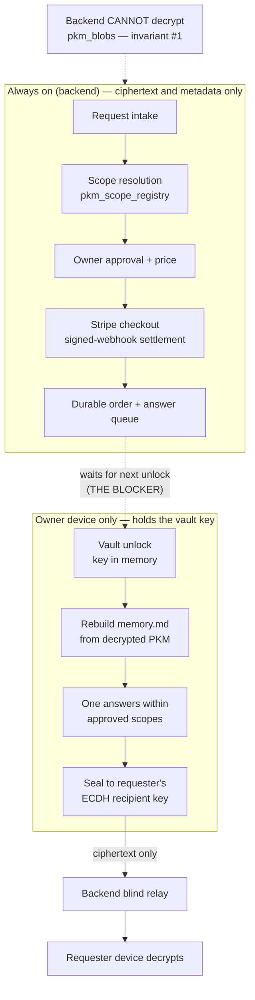

# ADR: Keeping living memory current, and answering while the owner is away

Status: **proposed — the 24/7 requirement is UNRESOLVED.**
Date: 2026-10-10

This ADR exists because a product requirement ("a living `memory.md`, kept
synchronized through durable 24/7 background processing, and paid answers
produced from the latest available information") collides with a platform
non-negotiable. It records the exact blocker, what was built anyway, and the
architectures that could actually satisfy the requirement.

Nothing in the "Candidate architectures" section is implemented. Each one
changes the security model and needs explicit owner review and sign-off first.

## Visual Map

Canonical visual owner: [the architecture overview](./architecture.md). This
page is the narrower detail beneath it: where the decryption boundary falls for
living memory and paid answers.



The dotted edge is the unresolved requirement: everything above it runs 24/7,
nothing below it can run until the owner unlocks.

## The non-negotiable

[docs/project_context_map.md](../../project_context_map.md), CRITICAL RULES:

1. **Cryptographic Primitives** — "Vault keys are derived or unlocked
   client-side. The backend stores ciphertext only."
4. **Minimal Browser Storage** — "Sensitive credentials and vault keys stay
   memory-only. Decrypted PKM stays memory-only."

> "These are invariants. If a change violates one, it is the wrong change."

Key escrow to the backend is explicitly **out of scope** for this ADR. It is not
a candidate and is not costed here.

## The exact blocker

To render `memory.md` from protected PKM, or to answer a question over it,
something must hold the vault key and decrypt `pkm_blobs` ciphertext.

Today the only thing that can is the owner's client, during an unlocked session,
with the key in memory only. Therefore:

- While every one of the owner's apps is closed, **no protected content can be
  read by anything, anywhere.** Not by a cron, not by a worker, not by One.
- A server-side background job can still do real work 24/7, but only on
  ciphertext and on the control/metadata plane: `pkm_manifests`,
  `pkm_manifest_paths`, `pkm_scope_registry`, `pkm_index`, `pkm_events`,
  `content_revision` / `manifest_revision`. That is enough to detect *that*
  something changed and to run intake, scope resolution, approval, pricing and
  payment settlement. It is not enough to produce an answer.

This is not a new discovery in this codebase. The same wall is already
documented and already worked around for the marketplace, in
[`hushh-webapp/lib/one-marketplace/delivery-sweep.ts`](../../../hushh-webapp/lib/one-marketplace/delivery-sweep.ts):

> "Agent-driven approvals (Agent One over A2A, or the marketplace chat agent)
> run server-side with no browser, so they can only flip a request to
> `approved` — they cannot seal the encrypted slice (that needs the seller's
> unlocked vault + WebCrypto). This sweep is the fulfilment half: the next time
> the seller's device is unlocked…"

So the shipped precedent for "server approves, device fulfils" is device-bound
and unlock-dependent. The requirement asks for something the platform has not
yet solved for any feature.

## What is implemented now (interim, NOT the 24/7 feature)

**Interim approach: device-bound processing with a durable server-side queue.**

| Stage | Where it runs | Needs the vault key? | Available 24/7? |
| --- | --- | --- | --- |
| Request intake, scope resolution, owner approval, pricing | Backend | No — scope registry is coarse metadata | **Yes** |
| Payment checkout + signed-webhook settlement | Backend + Stripe | No | **Yes** |
| Rebuild `memory.md`, answer the question, seal to requester | Owner's device | **Yes** | **No — unlock-dependent** |
| Requester fetches sealed envelope and decrypts | Requester's device | Requester's key | On their unlock |

**Unlock dependency, stated plainly:** an approved, paid question produces no
answer until the owner next opens and unlocks the app. If the owner does not
open the app, the answer never arrives. This is a real product limitation, not
a latency detail, and it is why the requirement remains unresolved.

Because of that, the paid flow must carry the obligations in
"[Waiting, timeout, cancellation and refund](#waiting-timeout-cancellation-and-refund)"
below. An interim implementation that charges without those is not acceptable.

## Candidate architectures for true 24/7

All three keep "the backend stores ciphertext only". They differ in *who* holds
a decryption capability while the owner is away, and each requires a reviewed
change to the current memory-only key rule.

### Option 1 — Owner-device background execution

**Where processing runs:** the owner's own phone or desktop, woken in the
background.
**Who controls decryption:** the owner's device. The key never leaves the
owner's hardware and never reaches hushh.

Mechanism: a silent push wakes the app (the repo already has a push delivery
lane, migration `290_chat_push_delivery.sql`); an iOS `BGProcessingTask` or
Android `WorkManager` job runs the memory rebuild and the answer sweep.

**Security-model change required (needs review):** today the vault key is
memory-only, so a background wake has no key. This option requires a
device-local key at rest, protected by the OS rather than by the app — an iOS
Data Protection Keychain item scoped `WhenUnlockedThisDeviceOnly`, released
only to the app, and zeroized on lock, revocation or profile change.

This is **precedented in this repo**: Hermes already seals local Source Library
state with exactly that custody model (see "Reserved Source Library domain" in
[the PKM reference](../../../consent-protocol/docs/reference/personal-knowledge-model.md)),
including the honest caveat that it is *not* Secure-Enclave-resident until a
non-exportable `SecKey` adapter ships.

- Coverage: good, not total. The device must be powered, have network, and have
  been unlocked at least once since boot. iOS background scheduling is
  best-effort and the OS may defer or skip it.
- Cost: moderate. No new server infrastructure.
- Residual risk: a device compromised while unlocked gains what the app has.
  The blast radius is one owner's device, not the fleet.

**This is the recommended first step toward the requirement**, because it is the
smallest change, it keeps the key on owner hardware, and the custody pattern is
already shipped and reviewed elsewhere in this codebase.

### Option 2 — Owner-controlled private pod

**Where processing runs:** a per-owner isolated runtime, always on.
**Who controls decryption:** the owner, through the pod's own separate topology.
hushh's shared backend still never holds a key.

This is the direction AGENTS.md already sanctions: "A private pod may have
owner-isolated encrypted recovery state and explicit recall under its separate
topology; that direction does not grant memory to the shared runtime."

- Coverage: **true 24/7.** The pod does not sleep.
- Cost: high. Per-owner provisioning, isolation, lifecycle, upgrade and
  per-owner running cost.
- Security-model change required: the pod holds owner-authorized key material
  continuously. The review question is what the pod's custody and attestation
  story is, and whether a managed pod is meaningfully owner-controlled or just
  relocated escrow. **If hushh operates the pod, this is escrow with extra
  steps and must be treated as such.**

### Option 3 — Attested confidential-computing enclave

**Where processing runs:** a hardware TEE (AMD SEV-SNP, Intel TDX, AWS Nitro
Enclave).
**Who controls decryption:** the owner's device releases a scope-limited,
time-boxed key **only after** verifying a remote attestation proving the enclave
runs exact published code that cannot export plaintext.

- Coverage: true 24/7 within the key's validity window.
- Cost: highest. Attestation chain, reproducible enclave builds, key-release
  protocol, revocation.
- Security-model change required: the trust root moves to a hardware vendor and
  an attestation verifier. "The backend cannot decrypt" becomes a
  hardware-and-attestation claim rather than a structural one. That is a
  genuine weakening of a currently absolute property and must be reviewed as
  such, even though no plaintext key is ever escrowed to hushh.

### Comparison

| | Owner device | Private pod | Attested enclave |
| --- | --- | --- | --- |
| Backend holds ciphertext only | Yes | Yes | Yes |
| Key leaves owner hardware | No | Depends on who runs the pod | Yes, to an attested TEE |
| True 24/7 | Near, best-effort | Yes | Yes |
| Infra cost | Low | High | Highest |
| New trust root | OS keychain | Pod operator | Hardware vendor + attestation |

## Waiting, timeout, cancellation and refund

Required for any interim release in which an answer can wait on the owner's
device. These are product obligations, not implementation details.

1. **Disclose before checkout.** The requester must see, on the checkout screen
   and before paying, that the answer is produced on the owner's device and may
   wait until the owner next opens the app — with the owner's last-seen
   freshness signal shown, so the wait is an informed choice.
2. **Timeout.** A paid, approved question that is not answered within a stated
   window expires. The window is quoted before payment, not after.
3. **Cancellation.** The requester may cancel while the question is still
   unanswered and receive a full refund. The owner may withdraw approval before
   the answer is sealed, which also refunds in full.
4. **Refund on expiry.** Timeout refunds automatically and in full. This
   follows the shipped Drive rule that a denied or expired request is refunded,
   and the packet rule that a *delivered* order is not.
5. **No charge for an empty answer.** If the approved scopes yield nothing, the
   requester is refunded, mirroring Drive's "no charge when the result is
   empty".

## Concrete 24/7 design, for review

The requirement is a running answer within minutes of payment, without the
owner opening anything. This is the design I would build, named down to the
runtime and who holds which key. It is **not implemented**; the lane ships
unlock-dependent until this is reviewed.

### Runtime: a per-owner answering worker on owner-controlled hardware

One always-on worker per owner, not a shared fleet. Concretely: a per-owner
container with no shared process memory, no shared filesystem, and no ambient
credential for any other owner. It does one thing — claim this owner's paid,
approved, undelivered answers, project the approved scopes, write the answer,
seal it to the requester's key.

It is the *same code path* the device sweep runs today
(`lib/answers/answer-delivery-sweep.ts`). Nothing about the projection,
exclusion or sealing changes; only where it runs.

### Key control: an answering key, not the vault key

The worker never receives the vault key. At enrolment the owner's device
derives a **separate answering key** and wraps it to the worker's attested
public key:

```
answering_key = HKDF-SHA256(ikm = vault_key, info = "hushh-answer-worker-v1")
```

It is the same construction One chat already uses for its per-request chat key
(`chat_key = HKDF(vault_key, "hussh-one-chat-v1")`), so the precedent for a
purpose-scoped derivative exists. Three properties follow:

1. **It cannot recover the vault key.** HKDF is one-way, so a worker
   compromise does not yield the vault, the recovery key or the passphrase.
2. **It is revocable without re-keying the vault.** Revocation deletes the
   wrapped copy and rotates the `info` label; the owner's own data is
   untouched.
3. **It is scope-bounded at the data layer, not by politeness.** The worker
   can only read PKM segments whose scopes appear in a currently-approved,
   currently-paid `pkm_answer_request_scopes` row. The server enforces that
   with the existing `require_paid_answer` gate before handing over any
   ciphertext.

### What this still changes, and why it needs your decision

The backend continues to store ciphertext only, and hushh still never holds a
key that opens a vault. But a key capable of decrypting *approved scopes* now
exists outside the owner's devices. That is a real change to
"decryption happens only on the owner's device", and it is the whole decision:

- **If hushh operates the worker**, this is escrow of a scoped key, however
  narrow. It should be called that in the trust documentation rather than
  described as owner-controlled.
- **If the owner operates it** (their own always-on machine, or the private
  pod topology AGENTS.md already sanctions), it is not escrow — but it is only
  available to owners who can run one.
- **If it runs in an attested enclave** with the device releasing the
  answering key only against a verified measurement, hushh cannot read it even
  while operating it — at the cost of trusting a hardware vendor and an
  attestation chain, and of reproducible enclave builds.

### Staging

1. Ship unlock-dependent (today). Honest, no boundary change.
2. Device background execution — closes most of the gap for phone owners with
   no key leaving owner hardware. Needs only the OS-protected key-at-rest
   change in Option 1 above.
3. Per-owner answering worker, in whichever of the three custody models is
   approved.

Each step is independently shippable and independently revocable, and no step
is required by the one before it.

## Decision

- Ship the interim device-bound path, explicitly labelled with its unlock
  dependency in the product surface and in this ADR.
- Keep the 24/7 requirement **open**. Do not describe the interim path as
  satisfying it, in UI copy, docs, release notes or status reports.
- Treat Option 1 as the recommended next increment, contingent on review of the
  device-local key-at-rest change.
- Do not implement any of the three options until the corresponding
  security-model change is reviewed and approved.

## Open questions for review

1. Is a device-local, OS-protected vault key at rest (Option 1) acceptable, given
   the Hermes/Source Library precedent already in the codebase?
2. If a private pod is operated by hushh rather than the owner, does it count as
   owner-controlled, or is it escrow under another name?
3. Is a hardware-attestation trust root an acceptable substitute for the current
   structural "backend cannot decrypt" guarantee?
4. What timeout window is acceptable to a paying requester, and does it differ
   by price?
5. For the answering worker above: who operates it, and if hushh does, is a
   scoped, revocable, HKDF-derived answering key an acceptable thing for hushh
   to hold — described as such?
6. Separately: the paid-answer composer sends the owner's approved plaintext
   to the backend for one request so a model can write the answer, the same
   owner-present shape One chat uses. Nothing is decrypted or stored
   server-side. Is that acceptable for this lane, or should the written answer
   wait for on-device model execution?
