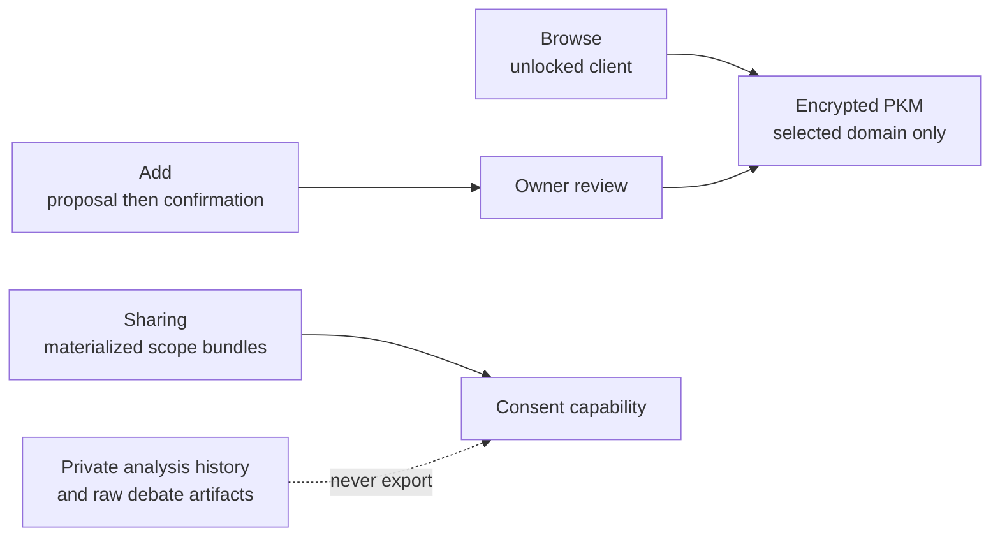

# Memory workspace and private-analysis boundary

## Visual Map

## Workspace contract

The consumer **Memory** workspace has three views:

- **Browse** decrypts only a user-selected domain in the unlocked client and presents saved details as collapsed folders.
- **Add** sends a note through the existing proposal endpoint, shows the resulting review, and saves only after explicit confirmation. It never sends a decrypted domain or duplicate candidate values to the backend.
- **Sharing** controls only existing, materialized top-level scope bundles. A parent checked, unchecked, or mixed state is a summary of those bundles; nested folders inherit the bundle setting and are not independent consent controls.

An explicit `empty` materialization is hidden from Memory and cannot be requested through consent. Legacy `unknown` materialization remains visible to its owner but cannot be newly enabled for sharing until a normal unlocked structure update resolves it.

`financial.analysis_history`, raw cards, debate transcripts, and the old broad `attr.financial.*` scope are private source material. They are rejected at manifest generation, discovery, new requests, pending approval, client export creation, export retrieval, and refresh. Compact `financial.analysis.decisions` remains the intended consentable decision surface when materialized.

PKM events and durable Kai terminal checkpoints are metadata-only. They must never retain raw cards, debate transcripts, model prose, votes, market sources, or decrypted PKM context. Migration 128 redacts existing decision-event metadata and clears the operational checkpoint cache; it does not delete encrypted owner PKM history.

The rollout seam is `NEXT_PUBLIC_MEMORY_WORKSPACE_ENABLED=true`: enable it first in UAT after migration 128 and the runtime policy guards are deployed. It is off by default. No hosted MCP handshake, developer credential authority, or encrypted export format changes.
