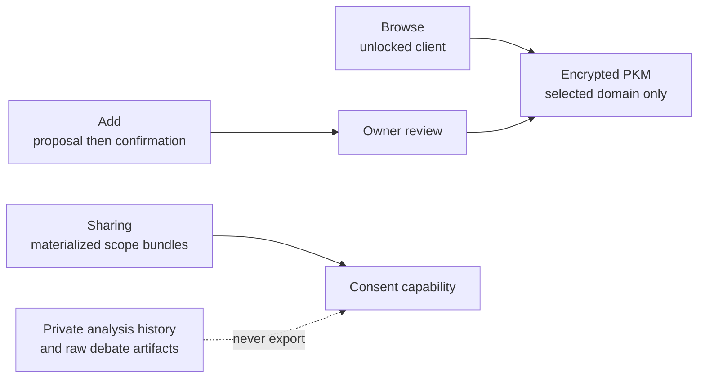

# Memory workspace and private-analysis boundary

## Visual Map

## Workspace contract

The consumer **Memory** workspace has three views:

- **Browse** decrypts only a user-selected domain in the unlocked client and presents saved details as collapsed folders.
- **Add** sends a note through the existing proposal endpoint, shows the resulting review, and saves only after explicit confirmation. It never sends a decrypted domain or duplicate candidate values to the backend.
- **Sharing** controls only existing, materialized top-level scope bundles. A parent checked, unchecked, or mixed state is a summary of those bundles; nested folders inherit the bundle setting and are not independent consent controls.

An explicit `empty` materialization is hidden from Memory and cannot be requested through consent. Legacy `unknown` materialization remains visible to its owner but cannot be newly enabled for sharing until a normal unlocked structure update resolves it.

`financial.analysis_history`, raw cards, debate transcripts, and the old broad `attr.financial.*` scope are private source material. They are rejected at manifest generation, discovery, new requests, pending approval, client export creation, export retrieval, and refresh. Compact `financial.analysis.decisions` remains the intended consentable decision surface when materialized.

PKM events and durable Kai terminal checkpoints are metadata-only. They must never retain raw cards, debate transcripts, model prose, votes, market sources, or decrypted PKM context. Migration 128 redacts existing decision-event metadata and clears the operational checkpoint cache; it does not delete encrypted owner PKM history.

Memory is available by default once the vault is unlocked. The former
`NEXT_PUBLIC_MEMORY_WORKSPACE_ENABLED` rollout flag is retired: migration 128
and the runtime policy guards are now baseline requirements. No hosted MCP
handshake, developer credential authority, or encrypted export format changes.

## Conversational capture and context transfers

Chat uses the existing Memory proposal and encrypted writer, not a second memory
store. Eligibility for an automatic private save does not publish the information,
enable request discovery, or grant consent. Sensitive or ambiguous details require
review; unsuccessful preparation must not be reported as a successful empty result.

The authored segmentation, intent, merge, structure, and One instructions live in
their `consent-protocol/hushh_mcp/agents/*/agent.yaml` manifests. Segmentation carries
source input as JSON; both ADK and direct-client execution use the manifest's system
instruction. Exact source validation remains mandatory. Context transfers must
preserve the subject, its historical, current or intended status, negation, and uncertainty.
Unknown-information lists are not affirmative facts, and embedded instructions
cannot authorize sharing or mutations. Repetition is not a reason to create
duplicate memories.

Segmentation returns at most eight candidates and an explicit
`has_more_candidates` flag. The existing proposal `split_recommended` contract
propagates that flag so the client can retry smaller passages. This is model-reported
coverage, not proof that every eligible fact was found. Source and mocked contract
tests do not establish live extraction quality for a large context transfer.

The shared client preparation path packs exact source spans rather than one
request per labeled field. Headings stay with their body through retries; an
oversized or unsplittable contextual section remains explicitly unresolved.
Saving the successfully reviewed cards does not discard unresolved source text.
Review is separate from Save, including when the preparation-only reviewer
harness is enabled.

Chat capture uses one session-only, counts-only status per answer. Jobs recheck
the validated owner, vault generation, and automatic-saving policy before
processing and encrypted writes. Policy-domain invalidation disables capture
until the encrypted setting is read again. A confirmed write receipt stays
successful after a session change, but cannot republish information into the new
session; cancellation is not a rollback of a request already accepted upstream.
Rendered continuity, extraction completeness and latency still need live proof.

UX reference: [Muse's published design](https://introducing.muse.ai/) describes quiet
background status, inspectable memory, and explicit approval for consequential
actions. These are design references, not evidence of Hussh implementation or
access to Muse's private prompts/configuration. Hussh must retain its own unlocked
client, encrypted-storage, and consent boundaries.
