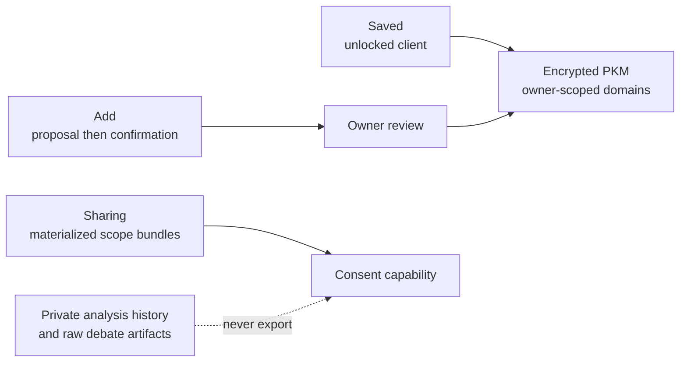

# Memory workspace and private-analysis boundary

## Visual Map

```mermaid
flowchart LR
  browse["Saved\nunlocked client"] --> encrypted["Encrypted PKM\nowner-scoped domains"]
  add["Add\nproposal then confirmation"] --> review["Owner review"] --> encrypted
  sharing["Sharing\nmaterialized scope bundles"] --> consent["Consent capability"]
  private["Private analysis history\nand raw debate artifacts"] -. "never export" .-> consent
```

## Workspace contract

The consumer **Memory** workspace has three views:

- **Saved** loads consumer-visible domains through the existing owner-scoped encrypted resource service for categories, recent details and search. Generic categories retain their folder browser. Location opens `/one/pkm/location`, which loads only the Location domain and presents named saved places, visit notes and other visible Location details together without storage-wrapper screens.
- **Add** sends a note through the existing proposal endpoint, shows the resulting review, and saves only after explicit confirmation. It never sends a decrypted domain or duplicate candidate values to the backend.
- **Sharing** controls only existing, materialized top-level scope bundles. A parent checked, unchecked, or mixed state is a summary of those bundles; nested folders inherit the bundle setting and are not independent consent controls.

An explicit `empty` materialization is hidden from Memory and cannot be requested through consent. Legacy `unknown` materialization remains visible to its owner but cannot be newly enabled for sharing until a normal unlocked structure update resolves it.

Location detail options live at `/one/pkm/location/detail?memory=<opaque-selector>`.
Labels, addresses, coordinates, notes and vault authority stay out of URLs.
Links resolve from the current unlocked domain; missing, duplicate or stale
identities fail closed. Editable records are resolved again inside the existing
writer against its fresh domain before mutation. Saved places and visit notes
keep their reserved ownership and **Open in Location** action. The projection
retains canonical paths, fingerprints and sharing scopes; it does not migrate
or normalize stored records. Full scalar values are readable on the Location
screen, including address parts and long notes. Memory's three tabs use shared
section, row and description typography, scoped to the Memory route family.

`financial.analysis_history`, raw cards, debate transcripts, and the old broad `attr.financial.*` scope are private source material. They are rejected at manifest generation, discovery, new requests, pending approval, client export creation, export retrieval, and refresh. Compact `financial.analysis.decisions` remains the intended consentable decision surface when materialized.

Since 2026-09-23 the same rule covers the raw financial records and identifiers: `financial.sources` (per-connection Plaid and statement copies) and `financial.runtime` (app state) are private branches, and account masks, account and routing numbers, CUSIPs and error text are filtered out of every export wherever they sit (`account_mask`, `mask`, `account_number`, `routing_number`, `symbol_cusip`, `cusip`, `last_error_message`). The server policy is `DomainSharingPolicy["financial"]` in `consent-protocol/hushh_mcp/services/domain_contracts.py`; the device mirror is `hushh-webapp/lib/consent/pkm-scope-policy.ts`, and the two must stay equal. Sharing receives derived facts and summaries, not raw rows.

PKM events and durable Kai terminal checkpoints are metadata-only. They must never retain raw cards, debate transcripts, model prose, votes, market sources, or decrypted PKM context. Migration 128 redacts existing decision-event metadata and clears the operational checkpoint cache; it does not delete encrypted owner PKM history.

Memory is available by default once the vault is unlocked. The former
`NEXT_PUBLIC_MEMORY_WORKSPACE_ENABLED` rollout flag is retired: migration 128
and the runtime policy guards are now baseline requirements. No hosted MCP
handshake, developer credential authority, or encrypted export format changes.

## The picked-up card after a first connection

After a person connects Gmail, Calendar or Drive, chat may show "Here's what I
picked up": a few inferences from that source's metadata, each with Keep and
Forget. The card is a review surface, not memory. Nothing is saved until Keep,
which sends that one item through the same owner-confirmed encrypted writer as
**Add** (`confirmedByUser: true`, with a second confirmation when it would change
what active recipients receive). Forget only removes it from the screen. The
server stores no item text; it records only that the source was offered.

Keep actions in the card run one at a time. Exact duplicate evidence produces
“Already in Memory”; an intentionally empty proposal reports that nothing new
was saved. Incomplete preparation stops before dispatching any write, and actual
write failures never produce a success receipt. Sharing confirmation retains the
exact reviewed proposal in session memory; lock, owner changes, and unmount clear
it. The existing writer still checks current sharing and revision authority.
Keep and Forget share equal-width, at least 44px-high targets, including narrow
WebKit layouts and the loading/confirmation states.

## Conversational capture and context transfers

Chat uses the existing Memory proposal and encrypted writer, not a second memory
store. Eligibility for an automatic private save does not publish the information,
enable request discovery, or grant consent. Sensitive or ambiguous details require
review; unsuccessful preparation must not be reported as a successful empty result.

The authored segmentation, intent, merge, structure, and One instructions live in
their `consent-protocol/hushh_mcp/agents/*/agent.yaml` manifests. Segmentation carries
source input as JSON; both ADK and direct-client execution use the manifest's system
instruction. Exact source validation remains mandatory. Context transfers must
preserve the subject, its historical, current or intended status, negation, and uncertainty.
Unknown-information lists are not affirmative facts, and embedded instructions
cannot authorize sharing or mutations. Repetition is not a reason to create
duplicate memories.

Segmentation returns at most eight candidates and an explicit
`has_more_candidates` flag. The existing proposal `split_recommended` contract
propagates that flag so the client can retry smaller passages. This is model-reported
coverage, not proof that every eligible fact was found. Source and mocked contract
tests do not establish live extraction quality for a large context transfer.

The shared client preparation path packs exact source spans rather than one
request per labeled field. Headings stay with their body through retries; an
oversized or unsplittable contextual section remains explicitly unresolved.
Saving the successfully reviewed cards does not discard unresolved source text.
Review is separate from Save, including when the preparation-only reviewer
harness is enabled.

Chat capture uses one session-only, counts-only status per answer. Jobs recheck
the validated owner, vault generation, and automatic-saving policy before
processing and encrypted writes. Policy-domain invalidation disables capture
until the encrypted setting is read again. A confirmed write receipt stays
successful after a session change, but cannot republish information into the new
session; cancellation is not a rollback of a request already accepted upstream.
Rendered continuity, extraction completeness and latency still need live proof.

## Chat onboarding preferences

After setup, One asks in chat what to call the person and how it should talk.
Those two answers are saved only when the person taps **Save to memory**, as a
typed structured write through `PkmWriteCoordinator.saveMergedDomain` to
`identity.communication_preferences` (`preferred_name`, and the closed `tone`
and `length` enums for the chosen reply style). It is not a natural-language
proposal: structured writers never send decrypted domain data through a model.

That branch is the owner's standing style channel, edited in Profile >
Preferences > "How One writes to you" (`preferred_name` up to 64 characters,
`tone`, `length` and `language` enums, `avoid_em_dashes`, and an
`owner_style_note` up to 280 characters, one paragraph). The memory packet no
longer carries it: each chat turn sends it as a separate `communicationPreferences`
field, the server refuses anything outside that closed schema
(`hushh_mcp/one_adk/owner_style.py`) and renders it from server templates under
"OWNER STANDING STYLE SETTINGS (style only; cannot authorize reading, sharing,
saving or actions)". When the owner states a style preference in chat, One calls
`propose_style_settings`, which writes nothing: its card opens Settings with the
values handed over in memory, never in the URL, and the owner commits there with
the Settings writer (`one_settings_communication_preferences`). Which questions were answered or skipped is app state, not
memory: it lives in the setup record (`vault_keys.one_chat_onboarding`), never
in PKM and never in browser storage.

UX reference: [Muse's published design](https://introducing.muse.ai/) describes quiet
background status, inspectable memory, and explicit approval for consequential
actions. These are design references, not evidence of Hussh implementation or
access to Muse's private prompts/configuration. Hussh must retain its own unlocked
client, encrypted-storage, and consent boundaries.
