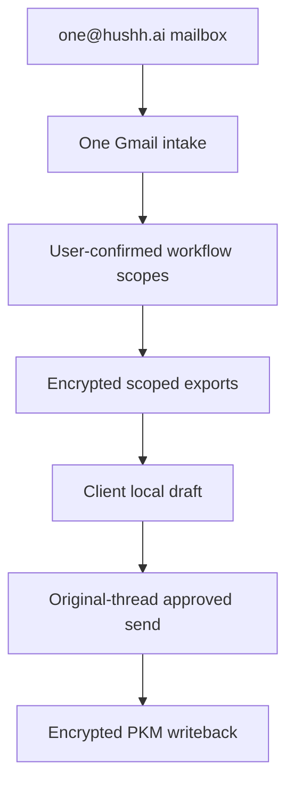

# One Email KYC

## Visual Map



This is the current implementation contract for One-led, approval-gated email
intake through `one@hushh.ai`. The current `/one/kyc` surface owns the KYC
review workflow, but the mailbox helper can recommend any consumer-visible
dynamic `attr.*` scope that already exists in the vault owner's shareable scope
inventory. It is not a free-form email agent and does not own platform consent
policy.

## Current Runtime

- Backend owner: `consent-protocol/hushh_mcp/services/one_email_kyc_service.py`.
- Backend routes: `consent-protocol/api/routes/one/email.py`.
- Frontend route: `hushh-webapp/app/one/kyc/page.tsx`.
- Frontend service: `hushh-webapp/lib/services/one-kyc-service.ts`.
- Client ZK service: `hushh-webapp/lib/services/one-kyc-client-zk-service.ts`.
- Approved disclosure renderer:
  `hushh-webapp/lib/services/one-kyc-approved-disclosure-renderer.ts`.
- Surface map: `hushh-webapp/frontend-native-surface-map.generated.json`.

The backend owns mailbox intake, workflow metadata, consent status, Gmail send,
retention metadata, and PKM writeback receipts. The frontend owns vault unlock,
per-user connector private keys, scoped export decrypt, user review, and
encrypted PKM writeback. Draft composition is LLM-driven server-side (Pass 2), requiring a valid
vault-owner session and the per-field data-scope consent the user grants at
the confirm step; the renderer wraps the LLM body in Gmail-safe HTML chrome
client-side. The `agent.kyc.disclose.llm` scope tags these endpoints for
audit; because a vault-owner token satisfies any scope check it is not yet
an independently-revocable control (not yet independently revocable; tracked as follow-up). Storage remains
client-encrypted; `draft_body` is never persisted server-side.

## Invariants

1. `one@hushh.ai` is the Workspace user mailbox for One-led KYC intake. The
   Pub/Sub notification mailbox and the message's `To`, `Cc`, `Delivered-To`,
   or `X-Original-To` recipients must match the configured canonical mailbox.
   Alias, forwarded, and unrelated mailbox deliveries fail closed before any
   user lookup, classification, workflow creation, or agent call.
2. Automatic response preparation is explicit opt-in and account-scoped. The
   backend preference is authoritative across web, iOS, Android, catch-up sync,
   and asynchronous Gmail intake. A missing row or lookup failure means
   disabled; disabled users produce no workflow and trigger no LLM work. The
   final workflow insert conditionally rechecks the enabled preference in the
   same database statement, so disabling while classification is running wins
   the race and creates no workflow.
3. Gmail Pub/Sub intake stores message IDs, thread IDs, sender metadata,
   required-field labels, candidate scopes, hashes, and workflow state.
   An accepted Pub/Sub delivery is not the same as a handled request: top-level
   `handled` is true only when at least one message actually creates or advances
   work. If Gmail watch history state is missing or the app user explicitly refreshes
   Email Helper, One performs a bounded recent-mail catch-up scan and reuses the
   same sender-authority and duplicate-protection rules. Explicit catch-up exits
   before Gmail access when the authenticated account preference is disabled.
4. Raw email bodies, consent tokens, connector private keys, decrypted exports,
   final approved bodies, and draft plaintext are not durable backend state.
5. Pass 1 LLM routing proposes domain(s) and fields from the inbound request
   text and the sanitized PKM index (no raw values). The vault owner must
   confirm or narrow the LLM proposal in `/one/kyc` before consent requests
   are created (`needs_confirm` → confirm gate). The resolved vault owner is
   the verified sender only; copied recipients and distribution-list members
   are reply context, not authority.
6. Each selected workflow scope becomes its own consent request under one bundle
   id. Draft generation may use all selected and granted workflow scopes, not
   just identity scope, but must not read every globally available user scope.
   Client drafts must render selected scopes as clear sections and must not
   expose raw PKM structure such as entity ids, manifests, hashes, provenance,
   or parser metadata.
7. If any selected scope is denied or stale, One blocks the external reply.
8. The canonical approved-reply renderer is
   `hushh-webapp/lib/services/one-kyc-approved-disclosure-renderer.ts`, called
   only by the strict-ZK client service after local decrypt. Route code must not
   create parallel email HTML templates. Plain text and Gmail-safe HTML must
   come from the same `ApprovedDisclosureRenderModel`. Portfolio, financial,
   and other dense dynamic-scope drafts must preserve all useful approved values
   and use Gmail-safe horizontal table scrolling instead of overlapping mobile
   columns.
9. Approved KYC sends must reply in the original Gmail thread and preserve reply
   headers. The backend uses the approved body only transiently for Gmail send.
   The send contract requires plain text and may include sanitized HTML for
   Gmail multipart/alternative rendering; the plain-text part remains the
   fallback and hash anchor.
10. Local decrypted exports and local drafts are cleared after approve/writeback
   success, reject, or refresh into a non-ready state.
11. Durable KYC memory is an encrypted PKM writeback artifact plus workflow
   metadata and hashes, not raw mailbox content.
12. The Email Helper list uses stale-while-refresh semantics: cached visible
    requests remain visible while One checks recent mail, refreshes workflow
    status, and merges newer rows into the paginated list.

## Two-Pass LLM State Machine

The KYC brains (classification, domain/field selection, extraction, draft
composition) are LLM-driven. The deterministic keyword classifier and client-side
alias-table extraction have been replaced by two sequenced LLM calls, bracketed
by an explicit human confirm gate.

```
inbound Gmail ──> sender match ──(unknown)──> blocked
      │
      └─> client-connector gate ──(no key)──> needs_client_connector
             │
             ▼
        [PASS 1: LLM routing]
             request_text + sanitized pkm_index (NO raw values)
             → { classification, requested_items, primary_domains,
                 confidence, reasoning }
             │
             ├─(confidence < 0.5 OR classification == "unsupported")──> parked,
             │  reasoning surfaced to user
             ▼
        needs_confirm   ── /one/kyc shows proposed domain(s) + fields + reasoning
             │              user approves / edits / rejects each proposed field
             ▼ (user approves — this IS the consent act)
        confirm_proposal creates consent requests for approved data scopes
             (one per field scope; data-scope consent IS the gate) ──> consent granted
             │
             ▼
        [PASS 2: LLM extract + draft]
             client decrypts ONLY the one approved domain → full plaintext values
             → { extracted[], missing[], draft{ subject, body } }
             guardrails: subset invariant + draft value-provenance check (fail-closed)
             │
             ▼
        draft (renderer wraps LLM body in Gmail-safe HTML chrome)
             │
             ▼ optional
        redraft_full (LLM sees approved values; scope expansion fails closed)
             │
             ▼
        approve_draft ──> send_approved_reply ──> PKM writeback
```

### LLM Contracts

Both run **server-side, Gemini Vertex, temperature 0**, strict JSON schema with
bounded retry-on-malformed.

**Pass 1 — Routing** (`classify_kyc_request`)

Input: `request_text` (email subject + body), `pkm_index`
(`available_domains[]`, `domain_summaries{}`, `computed_tags[]` — no values),
`scope_catalog` (known `attr.*` / `financial.*` scopes).

Output (strict JSON):
```json
{
  "classification": "kyc | kyc_financial | financial | unsupported",
  "requested_items": [
    { "label": "Full name", "domain": "identity",
      "scope": "attr.identity.name", "rationale": "..." }
  ],
  "primary_domains": ["identity"],
  "confidence": 0.87,
  "reasoning": "Email asks for personal info to confirm a hotel booking → identity verification, not travel itinerary."
}
```

`reasoning` is shown at the confirm step so a bad route is visible and
rejectable before any data leaves the client.

**Pass 2 — Extract + Draft** (`extract_and_draft`)

Input: `domain_data` (full decrypted JSON of the one approved domain),
`requested_fields` (user-approved field list), `request_text`.

Output (strict JSON):
```json
{
  "extracted": [
    { "scope": "attr.identity.name", "label": "Full name", "value": "Jane A. Doe" }
  ],
  "missing": ["attr.identity.passport_number"],
  "draft": { "subject": "...", "body": "..." }
}
```

`extracted[]` drives the subset guardrail. `missing[]` is surfaced in the UI.
`draft.body` is LLM-composed prose using real values; the renderer wraps it
in Gmail-safe HTML chrome.

### Consent Scope: `agent.kyc.disclose.llm`

This scope labels the PII-to-LLM paths (Pass 2 extract+draft and redraft-full)
for audit purposes. The actual gate on those endpoints is a valid vault-owner
session plus the per-field data-scope consent the user grants at the confirm
step. Because a vault-owner token satisfies any scope check in the current
implementation, `agent.kyc.disclose.llm` is not yet an independently-revocable
control; a separately revocable disclose grant remains follow-up work. Only
plaintext from the workflow's exact approved scopes is sent to the LLM, and
only after the user's data-scope consents are granted at the confirm step.

### Guardrails (all fail-closed)

1. **Pass 1 confidence floor (0.5)** — below threshold, or
   `classification: "unsupported"`, the workflow parks and asks the user
   rather than auto-proposing fields.
2. **Confirm gate** — human safety net for any Pass-1 misroute; user
   approves the exact subset of fields before any data leaves the client.
3. **Workflow readiness guard** (`ONE_KYC_DRAFT_NOT_READY`) — `extract-draft`
   and `redraft-full` require the workflow to be in `waiting_on_user` state with
   `draft_status == "ready"`; calling either endpoint before the confirm gate
   completes and consent is granted fails closed.
4. **Redraft context binding** (`ONE_KYC_REDRAFT_SCOPE_MISMATCH`,
   `ONE_KYC_REDRAFT_EXPORT_STALE`) — supplied scopes must exactly match the
   workflow selection and every plaintext payload must match its current
   workflow-bound export revision before the provider call.
5. **Pass 2 subset invariant** (`ONE_KYC_EXTRACT_SUBSET_VIOLATION`) —
   `extracted` scopes ⊆ approved fields, enforced in code after the call;
   violation fails closed.
6. **Draft value-provenance check** (`ONE_KYC_DRAFT_PROVENANCE_VIOLATION`) —
   every value in `draft.body` must appear in `extracted[]`; catches the LLM
   inventing or leaking a value in prose.
7. **Malformed output guard** (`ONE_KYC_EXTRACT_MALFORMED`) — strict JSON
   schema validation with bounded retries; malformed output fails closed.
7. **Scope-expansion block on redraft** (`ONE_KYC_LLM_SCOPE_EXPANSION_BLOCKED`)
   — a redraft requesting more data routes back to `needs_confirm`, never
   silently discloses additional fields.

## Workflow States

KYC workflow states are:

- `needs_client_connector`
- `needs_scope`
- `needs_confirm` *(new — set after Pass 1 routing; awaits user confirm of LLM proposal)*
- `needs_documents`
- `drafting`
- `waiting_on_user`
- `waiting_on_counterparty`
- `completed`
- `blocked`

## Runtime Endpoints

Use [API contracts](./api-contracts.md#one-email-kyc) for the endpoint table.
The primary frontend/native mapper entry is
[Frontend Native Surface Map](./frontend-native-surface-map.md).

## Environment Contract

Required hosted runtime keys are documented in
[Env and Secrets](../operations/env-and-secrets.md) and
`consent-protocol/docs/reference/env-vars.md`.

Important operational boundaries:

- `FIREBASE_ADMIN_CREDENTIALS_JSON` is the canonical backend service-account secret.
- `ONE_EMAIL_ADDRESS` defaults to `one@hushh.ai`.
- `ONE_EMAIL_PUBSUB_TOPIC` configures Gmail watch delivery.
- `ONE_EMAIL_KYC_STRICT_CLIENT_ZK_ENABLED` governs legacy ZK mode; the two-pass
  LLM flow is the current default for extract/draft/redraft paths.
- `ONE_EMAIL_KYC_DEFAULT_SCOPE` must remain allowlisted. Current approved value:
  `attr.identity.*`.
- Backend connector public, key-id, and private-key env vars are not part of
  strict client-side ZK mode.

## Production Gates

Production/public One mailbox automation remains gated until all of these are
true:

1. Delegated Gmail readonly and send work for the production mailbox.
2. Pub/Sub push auth and maintenance-token watch renewal are verified.
3. Production has exactly one active watch ownership model for `one@hushh.ai`,
   or an explicitly tested label/topic/fanout strategy.
4. A broker-style UAT smoke proves vault unlock, connector registration, scoped
   consent, local decrypt/draft, same-thread approved send, encrypted PKM
   writeback, and retention purge.
5. KYC cannot read or write outside selected workflow consent scopes.
6. `draft_body` is never persisted server-side; LLM draft is assembled
   client-side by the renderer. Server logs contain only SHA-256 hashes.
7. `/one/kyc` passes web and native parity gates for the current route inventory.
