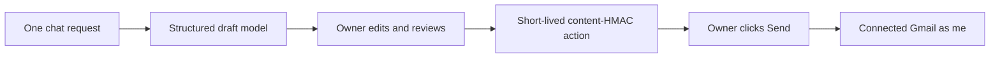

# One Email Sending

One can prepare an app-local Gmail draft for an owner, but it cannot send one
autonomously. The owner edits the visible `To`, `Cc`, `Bcc`, subject, and body,
then explicitly chooses **Review & continue** and **Send email**.

## Visual Map

## Authority and privacy

- Gmail Email-agent onboarding requests the declared `gmail.readonly` and
  `gmail.send` capability together: receipt/inbox workflows may read, while
  delivery still requires a separate owner confirmation. It remains separate
  from the One Email KYC preference.
- Provider consent is not standing sending authority. Preparing and executing a
  send action both require the current `VAULT_OWNER` owner token.
- Web OAuth runs in a same-origin popup. The original application window stays
  alive, so an already-unlocked vault remains memory-only in that window; the
  callback returns only an opaque success/failure settlement. A blocked popup
  is an explicit recoverable error, never a reason to persist a vault key.
- `google_email_send_actions` holds only an HMAC of the reviewed envelope/body,
  recipient count, expiry, status, and Gmail IDs. Draft text, subject,
  recipients, PKM values, and OAuth tokens are never stored or logged.
- A changed draft produces a different HMAC and is rejected; each action is
  single-use and expires after ten minutes. Network ambiguity becomes
  `outcome_unknown`; the product tells the owner to check Sent Mail rather than
  retrying and risking a duplicate email.

## Boundary

`GoogleEmailDeliveryService` is the provider-facing delivery operon. Gmail is
the first adapter and always sends as `me`; callers cannot choose `From` or
provide a token. The existing [One Email KYC](./one-email-kyc.md) flow remains
the separate delegated `one@hushh.ai` channel. A future KYC reply from a
connected personal mailbox may reuse this delivery boundary only after its
existing selected-scope and final-confirmation controls have grounded the draft.

V1 does not create Gmail-native drafts, send attachments, auto-send email, or
save drafts/threads to PKM. Saving any email-derived information to PKM remains
a separate consented encrypted write.
