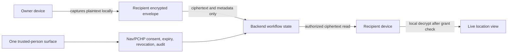

# One Location Agent

Status: v1 implementation contract
Owner: One + IAM/consent governance
Last updated: 2026-07-31

## Visual Map



## Current Truth

Merged KAI location APIs are a prototype/current-risk surface. They include a
public shared resolver and server-readable latest coordinate rows. They are not
the One Location Agent architecture and should not receive more product entry
points.

The production direction is One-owned. Authenticated recipient-scoped live
location remains ciphertext-only. Owner-created public location links are a
separate, explicit, duration-bounded snapshot-sharing mode.

## Plaintext Boundary

Plain coordinates are allowed only on:

- the owner's device while capturing foreground location
- the approved recipient's device after local decryption
- the authenticated Maps proxy in request memory while forwarding an explicit
  owner-initiated reverse-geocode lookup; neither coordinates nor results are
  persisted or logged
- the authenticated nearby check-in request in memory while verifying one fresh
  foreground point against the selected public place's fixed radius; the raw
  point and accuracy are discarded before persistence
- `one_location_public_invites.metadata.publicLocation` when the owner
  explicitly creates a snapshot-backed public location link
- public invite resolve responses when the owner explicitly attached a captured
  `publicLocation` snapshot to a public link

Plain coordinates are forbidden in:

- backend database rows outside the explicit public invite snapshot field
- backend API responses outside snapshot-backed public invite resolve
- logs and analytics
- notification payloads
- consent/audit metadata
- public URLs themselves
- support tooling and server fallback buffers

Public links may store one sanitized `publicLocation` snapshot in invite
metadata only when created through the explicit public location flow. That
snapshot is returned by token resolve while the invite is active. It is not a
live grant, ciphertext envelope, movement trail, raw owner identity, address, or
reverse-geocoded enrichment.

## Ciphertext Envelope

The web/native client creates one envelope per grant update:

```json
{
  "algorithm": "ECDH-P256-AES256-GCM",
  "recipientKeyId": "recipient-key-id",
  "ciphertext": "base64url-aes-gcm-ciphertext",
  "iv": "base64url-96-bit-iv",
  "senderEphemeralPublicKeyJwk": {},
  "capturedAt": "2026-05-20T00:00:00.000Z",
  "sourcePlatform": "web|ios|android|native",
  "metadata": { "payload": "coordinate_envelope", "plaintext": false }
}
```

The backend stores the envelope and grant metadata only. It does not parse,
reverse geocode, map, notify, or inspect latitude/longitude.

## Saved Places Contract

Saved Home, Work, and owner-labelled places are private PKM information, not
live-location grants:

- the owner confirms each save from onboarding or Location → Settings
- exact coordinates and the friendly address live under `location.saved_places`
  inside the encrypted Location PKM domain
- the backend stores only the normal encrypted PKM blob, manifest, revision,
  and non-sensitive summary count; there is no plaintext saved-place table or
  One Location saved-place API
- Location → Settings reads and mutates saved places only while the vault is
  unlocked; decrypted values remain in memory or the encrypted device cache
- reverse geocoding may send the captured point through the authenticated Maps
  proxy to obtain display copy and an ISO country code, but the Maps service
  does not persist the point or result
- one physical place may have only one saved category; a candidate within 25
  metres of any existing Home, Work, or Other place is rejected with a reminder
  to remove the existing place first. The encrypted persistence mutation
  rechecks this invariant against the latest PKM state after write conflicts,
  while existing legacy duplicates are preserved for explicit owner cleanup
- before saving, the owner may replace the captured place from the same
  onboarding prompt; authenticated Maps autocomplete and place details replace
  the display address and coordinates together in memory, while raw coordinates
  and free-form coordinate/address mismatches are never exposed
- active root-setup replay offers the saved-place step once per mounted journey
  until setup is resolved; workspace onboarding treats encrypted PKM as the
  saved-state authority and uses device storage only for an explicit skip
  outcome
- the old binary prompt marker is cleared only after an empty encrypted-PKM
  read proves it is ambiguous; no prompt marker contains coordinates, an
  address, or a place label

Saved places do not create sharing authority. They enter a consented PKM export
only when the owner separately approves the applicable Location information
scope.

## Key Contract

- Recipients register an active ECDH P-256 public JWK.
- Recipient private keys remain in client-side device storage.
- Owners encrypt with an ephemeral ECDH P-256 key and AES-GCM 256.
- Grant rows are bound to `owner_user_id`, `recipient_user_id`, and
  `recipient_key_id`.
- If recipient key material is unavailable or rotated away from the grant key,
  the owner must create a fresh grant.

## Authorization Contract

All live-location grant, envelope, approval, revocation, and state routes
require a VAULT_OWNER bearer token. Public invite routes are the only public
exceptions. Request-only invites resolve safe owner/link metadata and accept
visitor name/phone/message. Snapshot-backed public location invites resolve safe
owner/link metadata plus the attached public location snapshot.

- `actor_identity_cache.phone_verified = true` is eligibility only.
- Each recipient needs a separate active grant.
- Expiry and revocation block reads before ciphertext is returned.
- Referrals create access requests only; they never forward access.
- Request-only public invite submissions create access requests only when the visitor maps
  to a verified Hussh user with active recipient key material; otherwise they
  remain metadata-only intent for follow-up.
- Snapshot-backed public invite resolves do not create grants, requests, or
  recipient-scoped access. Anyone with the active token can view the attached
  public snapshot until expiry or revocation.
- Invite to One links are hash-only onboarding links. A signed-in visitor must
  complete the normal phone verification gate and unlock their own vault so the
  client can bootstrap only that visitor's One Location recipient key. Claiming
  creates the legacy metadata-only trusted edge; its compatibility client may
  separately materialize a mutual One Network connection. Claiming never
  creates a live location grant, exposes private owner profile data, or requests
  location permission.
- Named Circles are a separate durable metadata graph backed by
  `one_location_circles`, `one_location_circle_memberships`, and
  `one_location_circle_invite_codes`. The user's confirmed Join action on a
  valid code is membership consent: it joins immediately, bypasses a second
  connection-request approval, and creates source-aware canonical mutual
  connections with every active Circle member. It creates no
  `trusted_connections` edge, SMS selection, location grant, envelope, or
  capability.
- Every active Circle member can invite their own existing direct connections through
  `one_location_circle_member_invites`. Creating an invitation grants nothing.
  The invitee must accept before membership and Circle-sourced connection
  origins are created; this avoids a second Connect-tab request while
  preserving consent to join a group and become visible to its members. The
  actual inviter must remain an active member through acceptance. Non-owners
  may reserve at most five pending invitations, and a declined, cancelled, or
  expired invitation has a 12-hour Circle-wide cooldown before another member
  can contact the same person again.
- Codes use a 12-character human-safe alphabet, expire after 72 hours, are
  shared by the Circle, and are stored only as a domain-separated keyed HMAC
  digest. Active members may re-read and share the current code; ensuring a
  code is idempotent and does not invalidate one already being shared. Only the
  canonical `one_location_circles.owner_user_id` may rotate or revoke it.
  Legacy active codes that cannot be re-read require that explicit owner
  rotation; a member read never invalidates them. Raw codes are returned with `private,
  no-store` cache policy and must not appear in URLs, logs, analytics, or
  durable client storage.
- Owner removal is a governance boundary: ordinary members cannot select,
  invite, or restore a removed account. The owner may send a new targeted
  invitation, and only that owner-authored acceptance may reactivate the
  membership. Code join remains blocked for removed accounts.
- Active co-membership makes two people connected and eligible to start an
  explicit share, but it is not location or Save My Soul authorization.
  Every share remains per-recipient, encrypted, duration-bounded, and
  revocable. Circle-only grants always persist `source_circle_id`. On leave,
  removal, deletion, or account cleanup, a grant is reassigned to another
  active shared Circle, converted to direct provenance when a non-Circle
  connection survives, and revoked only when no eligible relationship remains.
  Account reset/deletion locks affected Circles first, revokes each shared code,
  and cancels invitations authored by the departing account before its
  membership rows are erased.
- Share and Check-In offer an explicit named-Circle target. Selecting one
  snapshots that Circle's current active, recipient-key-ready members, excludes
  the owner and setup-incomplete members with visible reasons, and still creates
  one encrypted grant/envelope per selected person. It does not include people
  who join after confirmation.
- Save My Soul keeps the stricter durable `one_location_sms_contacts` boundary.
  Choosing "Add Circle" in SMS contacts explicitly adds only the Circle's
  current phone-verified, recipient-key-ready members as individual SMS
  contacts. It never follows future membership automatically, and the user may
  remove any person independently.
- Check-In and SMS contacts surface an in-context "grow this Circle" affordance
  (shared `CircleGrowActions`) beside a selected/added Circle: "Invite people"
  reuses the same targeted `one_location_circle_member_invites` acceptance flow,
  and "Share code" reuses the member-visible 12-character code via the platform
  share sheet. These are pure relationship-consent entry points — inviting or
  sharing a code grants no location, SMS, or trusted-edge authority, and a new
  member is never retroactively added to an in-flight check-in or SMS snapshot.
  Members without invite capability still get "Share code" alone; owners/members
  with view-but-uncached codes generate one on demand before sharing.

- `connection_origins` records each independent direct, imported, legacy, or
  named-Circle source for a canonical connection. Leaving, removal, or Circle
  deletion revokes only the matching named-Circle origins and recomputes the
  canonical connection. A direct connection or another shared Circle keeps the
  pair connected.
- A member leaving or being removed atomically revokes the shared bearer code
  and cancels pending targeted invitations authored by that member. Remaining
  members can ensure a fresh code without gaining any location or SMS authority.
- Migration 126 backfills the same canonical connection and named-Circle origin
  for every active co-member pair from Circles created under migration 125, so
  rollout does not require members to leave and rejoin.
- Circle-backed grant creation, its audit event, and SMS-contact selection lock
  the Circle and both memberships in the same transaction. Membership removal,
  Circle deletion, and account cleanup use the matching lock order so a
  concurrent mutation cannot recreate authority or a stale SMS selection after
  cleanup.
- A user may belong to at most 10 active Circles. A Circle has one owner, up to
  20 active members, and one active invite code.
- Consent/audit records are metadata-only.

Capability scopes:

- `cap.location.live.share`
- `cap.location.live.view`
- `cap.location.live.request`
- `cap.location.live.revoke`
- `cap.location.live.refer_request`
- `cap.location.nearby.publish`
- `cap.location.nearby.discover`
- `cap.location.nearby.revoke`

## Unified Location Control Contract

The Location Agent header switch and Settings `Pause my location` control one
user-scoped device preference. The header is on when at least one location
channel is active: the owner's live preview, an active private grant publisher,
or an active Nearby presence. Pausing stops new foreground/background private
updates, clears the local self preview, and explicitly checks out active Nearby
presence before the UI may report `Location paused`.

`Auto-share my location` is a durable user-scoped preference, independent from
Pause. It controls continuous foreground/background updates only for private
grants the owner already approved; it never creates a grant or auto-approves a
request. Turning Auto-share off leaves consent and expiry intact and makes new
shares publish only the location the owner explicitly confirms. Pause
temporarily suppresses Auto-share without erasing that preference, so both
settings remain stable across tab changes and route remounts.

Pause does not revoke private grants. Their authored expiry remains intact and
recipients may retain the last encrypted point they already received. Resuming
requires a fresh usable foreground fix. Nearby visibility remains a separate
explicit consent: turning the header on never checks its confirmation box or
creates presence. A successful Nearby check-in clears Pause and updates the
shared control state; checkout removes only Nearby activity unless the user
chooses the global Pause control.

While Pause is active, Saved Locations must fail closed before asking the
device location provider for a new point. A capture already in flight is
discarded if Pause becomes active. Existing encrypted saved places remain
readable, repairable, and removable while the vault is unlocked.

`Location limited` means a channel is enabled but current permission or fix
accuracy is degraded. It is a signal-quality badge, not an admission verdict: a
broad fix is still usable for choosing the venue the owner is standing in. The
badge appears above 200 metres, while Nearby admission only rejects a reading
broader than 5 kilometres, which cannot place anyone at all.

## Nearby Check-In Contract

Nearby Check-In is a separate short-lived presence workflow owned by Your Map.
It never widens a private live-location grant, and a Connect relationship never
grants nearby or live-location visibility.

1. The signed-in, phone-verified vault owner opens Check in on Your Map. One
   captures a foreground point and draws a transient 500-meter search boundary.
   The drawer shows up to 20 operational, de-duplicated Google places ordered
   by server-computed distance, with explicit category filters that reuse the
   same boundary. Typed check-in search is restricted to that boundary. The
   owner then chooses the public place used for admission and display context;
   opening discovery never checks the owner in. The point and provider results
   are not persisted. There is no event code.
2. The owner chooses 30, 60, or 120 minutes and explicitly confirms showing
   their safe display label to other opted-in check-ins within the fixed
   500-meter radius. Allowing Connect requests is a separate switch and
   defaults off.
3. On confirmation, One captures a new foreground point. The backend resolves
   the selected place itself, rejects address/geocode records, closed places,
   and service-area-only businesses, and checks that the owner is plausibly at
   that place: the point must sit within 500 metres of it, widened by the
   reported accuracy up to a 2-kilometre cap. Accuracy is a tolerance on that
   plausibility test, never an expansion of the co-presence radius, which is
   measured place-to-place in step 5. The cap stops a deliberately coarse
   reading from buying unlimited reach.
4. The **selected place's** coordinates and safe label are persisted only inside
   a short-lived AES-256-GCM envelope, alongside a server-keyed six-hour spatial
   candidate token, rotating alias, consent posture, fixed radius, and expiry
   metadata. The owner's captured point is never persisted, in plaintext or
   ciphertext, and neither is its accuracy. Checkout clears all anchor
   ciphertext and candidate material synchronously. At `expires_at`, roster
   visibility and Connect authorization stop synchronously; encrypted material
   is scrubbed by the next feature operation or the hosted hourly retention job.
5. The candidate token is never accepted as proof of proximity. The service
   decrypts candidate place anchors and applies exact Haversine distance before
   returning at most 20 active people. Two people therefore match only when the
   places they each selected are at most 500 meters apart. Because the anchor is
   the venue and not a receiver reading, co-presence is exact and identical for
   a 10-metre GPS fix and a 2-kilometre browser fix. Peers never receive one
   another's place, coordinates, distance, direction, contact details, or stable
   user id.
6. Presence uses server-authoritative expiry and has no watcher, heartbeat,
   automatic extension, arrival detection, movement history, or distance
   ranking. Closing the app does not check out; the explicit Check out action
   remains available and idempotent.
7. Connect submits only the rotating alias in a JSON body. The backend performs
   the exact distance assessment, binds it to both presence versions, then
   atomically revalidates activity, expiry, phone verification, and the target's
   Connect opt-in before creating the canonical pending request. It does not
   auto-connect, create a location grant, or retain co-presence context.

An active nearby presence may hand off to the existing recipient-scoped private
Check-In as a second, explicit consent. The client shows the precise point first
and requires it to have been captured within 60 seconds of confirmation. Partial
retries retain that exact point, confirmation timestamp, operation id, and
recipient ciphertext. The optional Check-In message is inside that ciphertext;
grant, audit, URL, and push-notification metadata retain only the fixed
`check_in` reason code. For each selected connection,
`POST /api/one/location/grants/with-envelope` serializes replacement by
recipient key and owner/recipient, stores the new grant, first encrypted
envelope, latest-envelope pointer, and both audit events in one locked database
transaction, and only then emits the metadata-only notification. Recipient-key
rotation uses the same first lock and atomically revokes grants bound to the
replaced key. An identical retry returns the original publication; a reused
operation id with different details, expired publication, or rotated recipient
key fails closed. Nearby presence itself still creates no grant and exposes no
precise coordinate.

This is a visibly labelled local/UAT simulation. Its routes are rate limited per
signed principal and fail closed in production; Check out remains available as
a privacy/recovery action. Browser/device GPS is forgeable. Production requires
organizer admission proof (signed QR/NFC/provider signal), replay resistance,
shared abuse limits, and bidirectional Block/Report before trusted attendance
or spoof resistance may be claimed.

## Agent And Tool Contract

`hushh_mcp.agents.location` is the One Location Agent surface. The manifest
declares callable ADK tools for recipient listing, grant creation, encrypted
envelope publishing, ciphertext viewing, revocation, access requests, request
resolution, and referrals. Tools validate their capability scope per invocation
and delegate persistence to `OneLocationAgentService`.

The agent refuses referrals or public submissions that grant private access
without owner approval. Public bearer links may reveal only the explicit
owner-attached public snapshot, never private grants, ciphertext, movement
trails, raw tokens, or raw owner identity.

## Public Links

Public sharing has two modes: snapshot-backed public location links and legacy
request-only links.

1. The authenticated owner creates a duration-bounded public link from
   `/one/location`. It points at `/one/location/view/<token>`; the older
   `/one/location/request/<token>` path still resolves, and redirects here, so
   links minted before the rename keep working.
   One live link per owner: creating while one is live returns that same link
   with `reused: true`, its window restarted for the duration just asked for
   and its snapshot refreshed, rather than minting a second resolvable URL.
2. The backend returns the raw token once and stores only its hash.
3. If the owner attached a `publicLocation` snapshot, the public resolve
   response returns safe owner/link metadata plus that snapshot. The public page
   displays the map immediately with no name, phone, or message form, and
   re-reads the link while it is live. The owner's foreground heartbeat posts
   their position to `POST /api/one/location/public-invites/{invite_id}/location`,
   which writes `publicLocation` and nothing else - never the window - so the
   pin follows them without the link outliving what they agreed to.
4. If no snapshot is attached, the link is request-only and the public resolve
   response exposes only a safe owner label, status, duration, and expiry.
   The safe label is the sharer's display name, resolved with
   `allow_email_handle=False` so it is never a phone number and never an email
   handle; an account that resolves to neither keeps the default,
   "A trusted person". It is stamped onto the row at create time and resolved
   again on read, so a link minted before the label existed still names
   someone.
5. Request-only public links may submit metadata only. They do not display a map
   or location.
6. If the phone maps to a verified/keyed Hussh user in a request-only flow, One creates a normal
   pending access request for owner approval.
7. If the phone does not have usable Hussh identity/key material, the submission
   stays pending identity/key setup.
8. Owner approval still creates a fresh recipient-scoped grant and the owner
   device still encrypts the coordinate envelope for that recipient.

Public invite tables store token hashes, status, expiry, visitor display name,
phone hash/last4, matched user id when available, request linkage, and an
optional sanitized public location snapshot for snapshot-backed links. They must
not store raw phone numbers, raw invite tokens, addresses, map previews, or
movement/freshness trails. Public submissions are bounded per token, throttled
per phone/fingerprint hash, and never return request internals, grants, or
ciphertext to the anonymous caller.

## KAI Circle Recommendation Contract

Phase 5 KAI Circle improves the authenticated recipient directory ranking. The
service may use existing One Location sharing history, pending requests,
referrals, mutual KAI graph proximity, prior consent approvals,
advisor/investor relationship proximity, active relationship-share grants,
same-organization RIA firm membership, discoverable marketplace profiles,
shared public marketplace categories/interests, and runtime persona state as
safe recommendation signals.

Recommendation metadata can include category, tier, score, short reason labels,
public profile headline, verification badge, and last interaction timestamp. It
does not create access, replace consent, or expose coordinates, raw phone
numbers, invite tokens, grant ids, request ids, raw consent scopes, ciphertext,
or PKM payloads. Missing optional marketplace, relationship, consent, persona,
or organization tables must degrade to cold-start location-ready
recommendations instead of failing the location state API.

## Notification Contract

Location notifications are best-effort and metadata-only. Payloads may include
safe ids, actor ids, action type, expiry/countdown metadata, and `/one/location`
navigation. They must not include coordinates, addresses, map previews,
freshness trails, ciphertext, token values, or debug terminology.

Pending targeted Circle-member invitations are also projected into the shared
Consent Manager Requests read model as membership invitations with no consent
scope or location capability. Consent Manager deep-links to the focused
Location People invitation for Join/Decline; it must never route that row
through generic location Allow/Don't allow actions.

## Retention Contract

Expired or revoked One Location work is short-lived. Checkout synchronously
clears nearby captured-point ciphertext and candidate tokens. Expiry is
fail-closed for roster visibility and Connect authorization at `expires_at`;
the next feature operation also scrubs due material.
Terminal grants, metadata-only nearby-presence rows, ciphertext envelopes,
terminal access requests, referrals, and related metadata-only events are
retained for at most 12 hours after expiry or revocation, then purged from the
database. The runtime runs opportunistic cleanup during state/read flows.
Before nearby presence is enabled in a hosted environment, operators must
configure and verify the hourly `one-location-retention-purge-uat` job through
`deploy/one-location/setup_retention_scheduler.sh`. It calls
`POST /api/one/location/retention/purge?older_than_hours=12` with
`X-Hushh-Maintenance-Token` backed by the dedicated
`ONE_LOCATION_RETENTION_TOKEN`, so due encrypted material is scrubbed within
the configured scheduler interval even when no feature traffic occurs. Public
request-link invites, public submissions, Invite to One links, expired/revoked
named Circle codes, and checked-out/expired nearby presence follow the same
terminal-state retention boundary. Pending targeted Circle-member invitations
are marked expired opportunistically; accepted, declined, cancelled, and
expired invitation rows are purged through the same scheduled retention
endpoint and are also deleted with their Circle or either account.

## Native Contract

v1 is foreground-only.

- Named Circle create, code join, targeted member invitation/acceptance,
  preview, management, and share flows stay on the native-required static
  `/one/location` route for web, iOS, and Android.
- iOS and Android use the existing Capacitor Share plugin for code-only share
  text. Web uses Web Share with the shared clipboard fallback. This contract
  intentionally does not claim Universal Links or Android App Links.
- iOS uses `NSLocationWhenInUseUsageDescription` and the `HushhLocation`
  Capacitor plugin.
- Android uses fine/coarse location permissions and the `HushhLocation`
  Capacitor plugin.
- No iOS background location mode is added.
- No Android background location permission is added.
- Nearby Check-In reuses the same one-shot foreground capture on web, iOS, and
  Android. It adds no native method, geofence, or background permission.
- Android uses only the network provider when the user grants approximate
  access; Nearby Check-In then asks for precise access before publication.
- iOS one-shot capture enforces the caller's bounded timeout so a missing
  CoreLocation callback cannot strand the confirmation screen.

Denied, unavailable, approximate, and foreground-only states must be visible in
the web control surface.

## Migration From KAI Prototype

The legacy KAI location prototype (`kai_location_*` tables, migration 060) has
been fully decommissioned. Its plaintext `kai_location_latest` table stored raw
coordinates at rest, violating the zero-knowledge invariant.

1. The prototype tables were dropped in migration
   `069_drop_kai_location_plaintext.sql` (children before parents, idempotent).
2. The unmounted KAI location router and `KaiLocationService` were removed.
3. The One Location Agent (`one_location_*`) is now the only live-location
   system; updates are stored only as ciphertext in `one_location_envelopes`.
4. Account-deletion cleanup no longer references the dropped tables.

## Test Bar

The implementation must prove:

- verified directory excludes self and unverified users
- backend never returns plaintext coordinates
- encrypted envelopes are recipient-bound
- non-recipient reads fail
- expired/revoked grants block reads
- referrals create requests but no access
- Circle code join creates source-aware mutual connections, but no automatic
  trusted edge, SMS selection, location grant, envelope, or capability
- inviting an existing direct connection requires invitee acceptance before
  Circle membership
- pending targeted Circle-member invitations appear once in Consent Manager
  Requests without a location scope, capability, or generic access action
- explicit Circle targets expand only the confirmed current roster; future
  members are not auto-added, and every Share/Check-In grant remains
  recipient-specific with exact Circle provenance
- Save My Soul Circle bulk-add persists an explicit current-member SMS-contact
  snapshot rather than treating membership as emergency-delivery authority
- leave, removal, and deletion preserve direct and other-Circle connection
  origins
- notification and audit metadata contain no coordinates
- public links store token hashes only; snapshot-backed links reveal only the
  explicit public snapshot plus the sharer's display name, while request-only
  links never reveal location. No public payload ever carries the owner's id,
  phone number, or email address
- web, iOS, and Android have foreground permission parity
- saved places round-trip through encrypted Location PKM without plaintext
  local storage or a plaintext backend table
- A/B/C/D flow is covered at service, authenticated API route, and browser
  crypto levels
