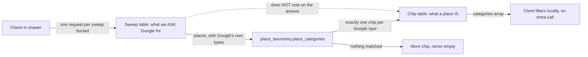

# One Location Place Taxonomy

Status: v1 implementation contract
Owner: One Location + Hussh maps integration
Last updated: 2026-08-31

The strict definition of what each category chip in the Check-in drawer means,
and the rules that decide which chip a nearby place lands in.

## Visual Map

## Current Truth

Two tables, deliberately separate, both in
[`consent-protocol/hushh_mcp/services/`](../../../consent-protocol/hushh_mcp/services/).

| Table | Where | Job | Cost |
| --- | --- | --- | --- |
| `_NEARBY_SWEEP_TYPES` | `google_maps_service.py` | Recall. What we ask Google for. | **One provider call per bucket.** Keep it at seven. |
| `CHIP_TYPES` | `place_taxonomy.py` | Meaning. What a place is shown as. | Free. Response-side only. |

They used to be one table, which made a chip cost a provider call and kept the
taxonomy at 52 hand-picked types out of Google's 478. Splitting them is what
lets the classifier be exhaustive.

## The rules

1. **Every Google Table A type belongs to exactly one chip.** Enforced at import
   time — `_build_chip_index` raises when two chips claim a type — and asserted
   against the full Table A list in `tests/test_place_taxonomy.py`.
2. **A place is classified by what it is, never by which request found it.** The
   sweep bucket that returned a place has no vote.
3. **A precise type beats a vague one.** Google tags some venues with both a
   specific type and an umbrella parent. `lounge_bar` + `lodging` is a lounge.
   An umbrella decides a place only when nothing precise is known about it,
   which is how a small guest house Google knows only as `lodging` still reaches
   Hotels.
4. **Nothing is skipped.** `place_categories` cannot return an empty list. What
   matches nothing is `other` — the **More** chip, which is visible and real.
5. **We do not overrule the provider without evidence.** If Google's only type
   for a venue is `lodging`, it appears under Hotels. Matching on a name
   ("contains Lounge") would break "Lounge Hotel" and is not a rule worth
   shipping.

## The chips

| Chip | Label | Belongs | Does not |
| --- | --- | --- | --- |
| `food_drink` | Food | Somewhere food or drink is prepared for you, including bars, pubs and lounge bars | A grocery shop |
| `health` | Health | Treatment or care by a health professional, plus pharmacies | A gym, a beauty salon |
| `shopping_services` | Shops | Buying goods, or a service performed for you: retail, groceries, banks, salons, laundry, vehicle service, trades, agents | Somewhere you eat, sleep or spend leisure time |
| `hotels_stays` | Hotels | **Somewhere you can pay to sleep for the night** — hotels, motels, hostels, inns, guest houses, resorts, B&Bs, serviced stays | A lounge, a campsite, a mobile-home park, an estate agent |
| `education` | Education | Somewhere people are taught or study | — |
| `outdoors_landmarks` | Leisure | Somewhere you spend time rather than transact: parks, nature, landmarks, museums, sport, cinemas, nightclubs, event venues, campsites | — |
| `transit` | Transit | Catching, boarding or parking transport | — |
| `worship` | Worship | A place of religious worship | — |
| `civic` | Civic | A public, government or emergency building | — |
| `other` | More | A real venue none of the above describes, plus every venue Google names but does not describe | — |

Worship, Civic and More are new. Before them a temple, a mosque, a police
station, a cinema and a stadium matched **no** chip: they appeared under All and
disappeared the moment anything was tapped.

## Why "Hotels" showed a lounge

Reported from Prayagraj with a screenshot. Three separate causes, only one of
which was what it looked like:

1. **Every matching type voted equally.** A venue Google tags as both
   `lounge_bar` and `lodging` was filed under Food *and* Hotels. Fixed by rule 3.
2. **The subtitle was Google's own word.** A row reading "Lodging" proves Google
   reports that primary type. Two of the five rows were correct and only worded
   badly — in India a "Residency" and a "lodge" *are* places you pay to sleep in.
   `DISPLAY_LABEL_OVERRIDES` says "Place to stay" instead.
3. **A place that matched nothing was filed under whichever sweep found it.**
   Written so an independent hotel Google knows only as `establishment` would
   not vanish behind the Hotels chip; the same rule put anything else the hotels
   sweep returned there too. Replaced by rule 4.

What remains, honestly: if a venue's only Google type is `lodging`, no strict
rule can tell it from a real lodge. The Places API exposes no confidence or
verification signal at any tier.

## Changing the taxonomy

- Adding a **chip** is free. Add it to `CHIP_TYPES`, the `NearbyPlaceCategory`
  Literal, `OneLocationNearbyPlaceCategory` in the webapp, `PLACE_CATEGORIES` in
  the sheet, and the `CATEGORY_LABELS` replica in
  `e2e/one-location-check-in-panel.layout.spec.ts`. A vitest contract asserts the
  replica matches, because a stale replica passes rather than fails.
- Adding a **sweep bucket** costs a provider call on every drawer open. Types
  inside a bucket are free up to Google's cap of 50.
- When Google adds place types, regenerate the families in `place_taxonomy.py`
  from the [Place Types](https://developers.google.com/maps/documentation/places/web-service/place-types)
  page. The exhaustiveness test fails rather than letting a new type go missing.

## Sources

- [Google Maps Platform — Place Types (New), Table A and Table B](https://developers.google.com/maps/documentation/places/web-service/place-types)
- [Google Maps Platform — Nearby Search (New)](https://developers.google.com/maps/documentation/places/web-service/nearby-search)
