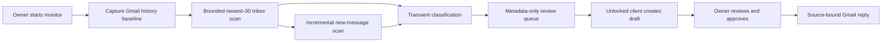

# Personal Gmail Information Requests

This is the Email Agent capability for a person's connected Gmail account. It
is distinct from both receipt sync and the `one@hushh.ai` platform-mailbox KYC
workflow.

## Visual Context

Canonical visual owner: [Hussh Platform Architecture](./architecture.md). This
diagram narrows the owner-consent and source-bound reply flow beneath that
platform map.

## Current delivery slice

1. An owner explicitly enables monitoring from the Gmail workspace.
2. Enabling captures the connected Gmail account's current History API marker,
   then transiently checks one newest-first page of up to 30 Inbox messages,
   whether read or unread. The scheduled monitor and **Check now** then read
   only Inbox messages added after that marker. A burst larger than 30 is
   drained through the saved History cursor on later bounded scans; neither
   path returns to older pre-opt-in Inbox pages. Sent, draft, spam, and trash
   messages are excluded.
3. Gemini classifies messages transiently as possible personal-information or
   KYC requests. It receives only the opted-in email during classification and
   must return field labels and domains, never extracted values. If one message
   cannot be classified, successfully processed messages remain recorded, the
   response reports the partial result, and the unadvanced Inbox or History
   slice is retried rather than being dropped.
4. The workflow persists only provider identifiers, timestamps, classifier
   confidence, requested field labels, exact manifest-leaf scope handles and
   segment identifiers, attachment-presence metadata, and keyed fingerprints.
   A separate keyed scan state prevents unchanged messages from being
   reclassified for the active monitoring generation. Terminal workflow
   activity expires after 30 days; scan-state metadata remains only while the
   owner keeps monitoring enabled, then is deleted on opt-out. It retains no
   email subject, body, address, attachment content, PKM value, decrypted
   export, or draft.
5. The Gmail workspace presents the opt-in copy and a metadata-only review
   queue. During an owner-requested check, it shows a simple completed-email
   count and adds each newly persisted request to that queue as soon as it is
   classified; it never waits to render a match until the whole bounded scan is
   complete. The stream contains only the same queue metadata, never the source
   email content, address, or provider cursor. The owner selects only exact manifest-backed leaf scope handles;
   wildcard, domain, and subtree scopes are never eligible for automatic
   drafting. `Draft with One` passes the workflow/thread reference plus
   canonical KYC field IDs into One. The unlocked client resolves those field
   aliases against the shared KYC registry and decrypts only the selected PKM
   segments. With complete coverage, One opens the existing editable,
   source-bound Gmail reply surface. With incomplete coverage, One asks for
   only the missing fields in the normal chat composer; the owner's next typed
   KYC reply confirms the restricted on-device PKM save. The client refreshes
   the local lookup after a successful write, then prepares that same reply
   surface. Attachment content is never read
   automatically; the owner must inspect it in Gmail. Opening an original
   message always goes back to Gmail.
6. The KYC reply uses the same owner-approved Gmail prepare and send routes as
   an ordinary personal email, passing only the opaque workflow reference. The
   backend derives the reply recipient, subject, reply headers, and thread id
   from the original message and ignores caller-provided envelope fields. It
   rechecks a keyed source fingerprint immediately before both actions. The
   owner reviews the exact draft, prepares a ten-minute confirmation action,
   then explicitly sends it.

`POST /api/one/email/information-requests/scan-enabled` is the maintenance
entrypoint for background runs. In hosted environments it accepts only a
signed Cloud Scheduler OIDC token with the configured audience and exact
service-account email. It claims a short Postgres lease, scans one bounded
Gmail History page per owner, and checkpoints an opaque History baseline,
page token, and private intra-page offset. This bounds message hydration even
when a History record contains many messages. A monotonic opt-in generation
prevents an in-flight scan from writing after monitoring is disabled or
re-enabled. An expired Gmail History cursor is re-baselined without scanning
older mail. This state is independent from the receipt worker. It must be
invoked by the platform scheduler; no receipt Pub/Sub watcher may be broadened
to include personal inbox messages.

The operator-owned UAT scheduler shape is
`deploy/gmail/setup_personal_information_request_monitor_scheduler.sh`. It
uses a dedicated OIDC service account and a bounded rotating `POST` job; it
does not share the `one@hushh.ai` watch-renewal token or change that mailbox's
scheduler. Cloud Scheduler's project-managed service agent mints the OIDC
token under `roles/cloudscheduler.serviceAgent`; deployments require only
`iam.serviceAccounts.actAs` for the dedicated client identity and never mutate
that identity's IAM policy.

## Consent boundary

Starting the monitor authorizes temporary classification of the newest 30 Inbox
messages, then each new Inbox message after its captured start point, whether
read or unread. The bounded Inbox scan requires the live vault owner token and
does not include sent, draft, spam, or trash messages. Neither path authorizes a
disclosure or a send. Before a draft is created, the owner explicitly selects exact
candidate leaf scopes; the unlocked client reads only their declared PKM
segments, projects only those paths, and keeps the resulting draft in memory.
The server never receives a PKM value until the owner submits the edited body
for the final source-bound Gmail action. Turning monitoring off immediately
deletes this monitor's queue and scan metadata and prevents an in-flight
classifier from inserting new metadata.

Managed drafting that receives decrypted private values requires a distinct,
independently revocable `agent.email.disclose.llm` consent before it can be
enabled. This v1 deliberately uses a deterministic client-local draft instead.

## Compatibility

`/one/kyc` and `one@hushh.ai` remain live during migration. Their data lives
in `one_email_*` tables and must not be read from or written to by the personal
Gmail monitor. Receipt sync remains a purchase-memory feature and must not
call the personal-monitoring inbox read method.
