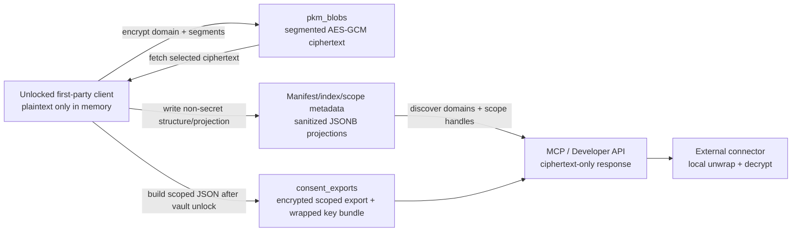

# ADR: PKM Storage and JSONB Boundaries

## Visual Context

Canonical visual owner: [Architecture Index](README.md). Use that map for the top-down system view. The detailed PKM table, read/write, cache, and PKM-to-MCP encrypted export diagrams live in [Personal Knowledge Model](../../../consent-protocol/docs/reference/personal-knowledge-model.md#visual-map).

## Status

Accepted.

## Decision

The current PKM runtime stores Personal Knowledge Model payloads as segmented encrypted blobs, not as JSONB objects with plaintext keys and encrypted leaf values.

## Why

- Zero-knowledge is a real architecture boundary, not a marketing claim.
- Plaintext keys leak semantic memory structure.
- Encrypted leaf JSONB still does not enable useful deep encrypted querying.
- Nested object and array updates become harder and noisier.
- Write amplification gets worse as PKM grows across domains.

## What JSONB is still for

- `pkm_index.summary_projection`
- `pkm_manifests.structure_decision`
- `pkm_scope_registry.summary_projection`
- sanctioned counters and flags
- append-only event metadata

## Indexing strategy

- B-tree on `pkm_blobs(user_id, domain, segment_id)`
- B-tree on `pkm_scope_registry(user_id, domain, scope_handle)`
- B-tree on `pkm_scope_registry(user_id, domain, segment_id)`
- B-tree on `pkm_events(user_id, domain, created_at desc)`
- GIN only on small sanctioned JSONB metadata where justified

## Consequences

- Fetch performance improves by reading only the encrypted segments needed for the active UI scope.
- Exact raw JSON paths stay private to first-party authenticated tooling.
- Public scope discovery must use handles and coarse metadata, not path leakage.
- Financial can remain protected while the broader PKM architecture expands across many domains.

## Reserved domain: payment_cards (2026-09-01)

Payment cards are a reserved owner-managed PKM domain, not a new table or a
`vault.*` scope. Decisions of record:

- One `pkm_blobs` row holds the whole domain; the plaintext inside has exactly
  two top-level branches, `summary` (nickname, brand, last4, expiry, issuing
  region per card id) and `secrets` (PAN, CVV, PIN, cardholder name per card
  id). Branch names line up 1:1 with the two consent-requestable scopes
  (`attr.payment_cards.summary.*`, `attr.payment_cards.secrets.*`) and the
  `secrets` key matches the client memory-context prune pattern, so card data
  can never ride into model context even if the domain-level guard regressed.
- Encryption is client-side under the vault key (the `runtime_secrets`
  template, including the conflict-retry commit); the server stores ciphertext
  plus a non-secret summary envelope it validates on every write: brand enum,
  last4 shape, expiry shape, `normalize_country_hint` on the issuing region,
  region-locked schemes (RuPay/Mir/Elo/Verve) confined to their home markets,
  and outright refusal of any secret-shaped key in the envelope. Full
  PAN/Luhn validation is client-only, by BYOK construction.
- Sharing deviates deliberately from the `source_library` template: the two
  branch wildcards are externally requestable (owner approves each grant,
  delivery via the consent-gated encrypted export); domain wildcard, exact
  paths, and public projection stay closed. This records the founder decision
  (2026-09-01) that superseded the earlier "never store CVV/PIN" stance with
  the consumer-vault model.
- The Cards specialist (`agent_cards`) has no server-side data authority; all
  card operations execute in the owner's browser through Action Gateway
  client handlers.

## Revisions and zero-loss upgrades

- Active reads use one coherent domain snapshot containing ciphertext, content revision,
  manifest revision, manifest/path/scope metadata, and an ETag. Callers must not combine
  separately cached plaintext, ciphertext, and manifest reads for a write or upgrade.
- Before an active replacement, the database archives ciphertext plus its structural
  metadata in `pkm_domain_revisions` and `pkm_domain_revision_segments` inside the same
  transaction.
- The first encrypted pre-v7 origin revision is retained for the account lifetime. Normal
  rolling revisions expire after 90 days and are pruned only by the guarded retention RPC.
- Rollback creates a new monotonic active revision. It never decrements a revision or edits
  the archived row in place.
- `pkm_domain_commits` makes retries idempotent. `pkm_upgrade_claims` binds an upgrade to
  owner, run, domain, exact source revisions, target versions, commit id, and expiry.
- Unknown or conflicting occurrences use the encrypted `__quarantine_v1` segment. Database
  policy rejects that segment if a manifest path makes it externalizable or a scope entry
  references it.
- v7 writes are fail-closed behind a server kill switch. Reader compatibility and shadow
  rehearsal ship before any v7 persistence is enabled. The policy is checked again at
  commit time so activating the kill switch also blocks an already-issued v7 claim.
