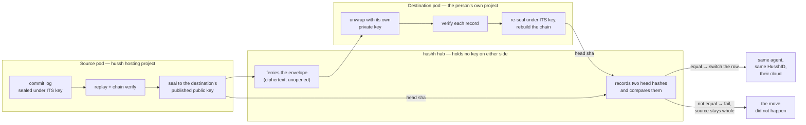

# Moving a private agent between clouds

**Status:** the cryptographic core and the durable ticket are built and tested;
the orchestration that drives the two ends and the frontend progress surface are
the remaining work. Inherits `private-agent-north-star.md` by pointer.

## Visual Map



## What the person is promised

*"Move my agent to my own cloud, and keep everything it has learned."*

One click. Same agent, same HusshID, same memory, in a project hushh has no
standing identity in. Afterwards the sentence about their agent upgrades from
"hushh does not read this pod" to "hushh **cannot** read this pod", and that
upgrade is the entire point of the hosted tier having a door out.

## The problem at the centre

Reading the source log needs the source pod's key. Writing the destination needs
the destination pod's. **hushh holds neither.** On the hosted tier the hub carries
`cloudkms.admin` on the keyring and provably not encrypt or decrypt; on BYOC it
has no path to the person's KMS at all (recorded live as a 403, which is the
control working).

The tempting workaround is to give the hub a key for the duration of the move.
That would make the migration the one minute in an agent's life when the promise
is suspended, and it would be invisible afterwards.

**The design instead moves the work to where the keys already are.**

```
source pod  --( records sealed to the destination's published public key )-->  hub
hub         --( the same ciphertext, unopened )-->                    destination pod
destination --( unwraps, verifies, re-seals under ITS OWN key )-->    its own log
```

Every byte the hub touches is ciphertext under a key it does not have. The
honesty clause is engineered rather than asserted.

## The zero-loss proof is a hash, not a count

`PodCommitLog`'s chain hash covers **plaintext-keyed fields only**:

```
sha = sha256({seq, kind, payload, prev_sha})
```

Not the ciphertext, not the nonce, not the object key. So a log rebuilt by
appending the same `(kind, payload)` values in the same order into an empty log
produces a **byte-identical head** under a completely different seal key, in a
different project, in a different cloud.

Comparing the two heads is therefore a cryptographic statement that every record
arrived intact and in order. Not a sample. Not a count.

Two consequences worth stating because they are what make it honest:

- **The import has no way to write a chosen sha.** It replays through the
  ordinary `append` path, and the hashes come out equal because the inputs were
  equal. An import that could stamp a handed-in sha would be able to make a
  broken chain look whole, which is the one thing this verification must never
  permit.
- **A record count would not have been enough.** The deepest negative control in
  `tests/test_pod_migration_bundle.py` is a bundle that decrypts cleanly and is
  simply missing a record. It opens, it verifies, its count agrees with itself,
  and only the head catches it.

## The chain, and why it is in this order

Each step is placed so the failure *before* it is survivable. Until the switch,
the source pod is intact and the worst outcome is a migration that did not happen.

| # | Stage | What happens | Why here |
|---|---|---|---|
| 1 | `freezing` | row → `migrating`; relay refuses turns and ticks; reconcile and liveness skip the row | the export's single-writer assumption is what this makes true |
| 2 | `preparing_cloud` | BYOC substrate ensured in the person's project; digest-pinned image copied | nothing is exported until there is somewhere for it to land |
| 3 | `creating_pod` | destination provisioned with the **same HusshID** | adopt-shaped, never re-minted; identity is preserved by construction |
| 4 | `collecting_target_key` | hub **pulls** the destination's published public key | pull-never-push, the same direction the collector always uses |
| 5 | `exporting` | source replays (chain-verified) and seals to that key | a broken chain is refused *before* anything is sealed |
| 6 | `transferring` | hub ferries the envelope | ciphertext only; the hub cannot open it |
| 7 | `importing` | destination unwraps, verifies, re-seals under its own key | the one process holding both is inside the person's own pod |
| 8 | `verifying` | hub compares the two recorded head hashes | a mismatch fails the job with the source frozen and whole |
| 9 | `switching_over` | one registry update: cloud coordinates, handle, `deployment_target='user_gcp'`, status `provisioned` | after the proof, never before |
| 10 | `cleaning_up` | old **host** torn down | the row must never point at a host that is gone |

**Reaping is host-only.** The HusshID, the phone hash, the A2A route and the
registry row all survive; no tombstone is written. This is the same doctrine the
idle reap follows, and confusing it with account teardown would delete a person's
agent to finish moving it.

## Freezing, and the race it closes

`migrating` is a registry status (migration 912) that every writer path reads as
a refusal. The relay declines turns and ticks with a person-language message, the
reconcile sweep skips the row entirely, and liveness suspends judgement.

The commit log's own compare-and-swap is the second half of the guarantee: the
export pins the head generation at start and re-reads it at finish, so a write
that slipped through anyway **aborts the export** rather than silently losing a
record.

## What can go wrong, and what happens

| Failure | Outcome |
|---|---|
| destination will not provision | job fails at stage 2-3; source unfrozen; nothing moved |
| source log does not verify | export refuses (409); the person is told their agent's log is damaged, which is true and separately actionable |
| bundle corrupted, truncated, re-addressed or reordered in flight | import refuses; source intact |
| destination already has history | import refuses (409) — merging two agents' memories into one chain that verifies perfectly and belongs to nobody is not a thing this code may attempt |
| heads do not match | job fails before the switch; source unfrozen and whole |
| instance restarts mid-run | ticket goes stale after 15 minutes and says so; every pre-switch stage is safe to restart |
| failure after the switch | the destination is live and verified; only cleanup retries |

There is no state in which both pods accept writes.

## Grace window for what is left behind

The source pod's sealed objects and its per-pod KMS key enter a **stated grace
window** (default 14 days) and are then purged. "hushh keeps public metadata
only" is not true of a bucket full of ciphertext that lives forever, even
unreadable ciphertext, so the residue has a declared expiry rather than an
implicit one.

## Where the code is

| Piece | Path |
|---|---|
| The sealed envelope, and the head oracle | `consent-protocol/hushh_mcp/services/pod_migration_bundle.py` |
| Export / import, **inside the pod** | `consent-protocol/api/routes/one/pod_migration.py` |
| The durable ticket and stage order | `consent-protocol/hushh_mcp/services/pod_migration_service.py` |
| The `migrating` status | `consent-protocol/db/migrations/parked/912_personal_agent_status_migrating.sql` |
| The ticket table | `consent-protocol/db/migrations/parked/911_pod_migration_jobs.sql` |
| Proof, including the negative controls | `consent-protocol/tests/test_pod_migration_bundle.py` |

Ships dark behind `HUSSH_POD_MIGRATION_ENABLED`. When off the pod routes answer
404 rather than 403, so probing reveals nothing about which pods can migrate.

## Rehearsing it before trusting it

Per the `pkm-upgrade-rehearsal` doctrine, a migration is rehearsed with
occurrence-level preservation and a negative control before it is offered to
anyone:

1. teach a hosted pod K facts through real turns;
2. run the full chain into a second project;
3. assert same HusshID, head-sha equality, record-count equality, and **real-turn
   recall of all K facts** on the destination;
4. **negative control**: corrupt one byte of a staged bundle and assert the import
   refuses;
5. assert the frozen source refused a turn mid-flight;
6. **double cycle**: keep teaching on the destination, restart it cold, and recall
   both generations — proving the migrated pod is a continuing agent, not a
   photograph of one.

Step 6 is the difference between proving the bytes moved and proving the agent
did.
