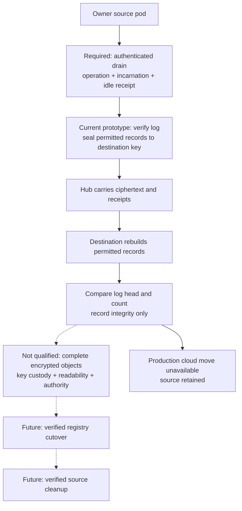

# Moving a private agent between clouds

**Status — 2026-10-08:** disabled record-transfer prototype. No production or
owner-facing GCP↔Azure move is qualified. Full memory, Files and session portability
are required before offering it. Inherits the [private-agent north star](./private-agent-north-star.md).

## Visual Map

```mermaid
flowchart TD
  S["Owner source pod"] --> F["Required: authenticated drain<br/>operation + incarnation + idle receipt"]
  F --> E["Current prototype: verify log<br/>seal permitted records to destination key"]
  E --> H["Hub carries ciphertext and receipts"]
  H --> D["Destination rebuilds permitted records"]
  D --> V["Compare log head and count<br/>record integrity only"]
  V -.-> Q["Not qualified: complete encrypted objects<br/>key custody + readability + authority"]
  Q -.-> C["Future: verified registry cutover"]
  C -.-> R["Future: verified source cleanup"]
  V --> X["Production cloud move unavailable<br/>source retained"]
```

Solid edges describe the bounded prototype. Dashed edges are requirements, not
available transitions. Head equality alone cannot authorize a whole-agent move.

## Authority and information boundary

The source pod opens its own encrypted log and seals permitted records to the
verified destination public key. The hub carries ciphertext and records receipts;
it gets no private key. The destination verifies and re-seals through the ordinary
append path. Import refuses existing history rather than merging two authorities.

The log hash covers `{seq, kind, payload, prev_sha}`. Equal rebuilt heads prove
record order and integrity. They do **not** prove readability of nested ciphertext,
complete file transfer, provider-memory portability or current consent authority.
The record-only exporter and importer refuse `agent_memory`, `agent_memory_fact`
and `browser_session_v1`. Re-sealing an outer log with a new key cannot repair its
source-key-dependent contents. Files objects also live outside that log.

Routes remain dark behind `HUSSH_POD_MIGRATION_ENABLED`. This flag is not a
qualification receipt. Enabling a route must not advertise a complete cloud move.
Erasure and ordinary same-custody image recovery retain their existing contracts.

## Required complete transition

Before offering either GCP→Azure or Azure→GCP:

1. Approve the exact source, destination, owner and incarnation. Inventory all
   encrypted recovery, Files, remembered-session and job objects with bounded,
   resumable traversal and version receipts.
2. Authenticate source drain using the existing lifecycle operation. Fence new
   work; wait for active work to finish and a committed-state receipt. A registry
   `migrating` status is not evidence that the runtime stopped writing.
3. Bootstrap an import-only destination. Transfer custody privately between pods;
   the destination must prove its workload identity can unwrap the adopted key
   before writing identity or recovery under it. Never replace an already-used
   destination key in place.
4. Copy and verify encrypted objects, rebuild indexes, retain erasure/Forget
   tombstones and check actual destination readability. Reconstruct provider-
   specific queues, watches and model credentials through owner-approved setup.
5. Verify exact owner/pod authority, capability versions, recovery, Files bytes
   and real-turn recall before publishing the new placement. Old admissions and
   Puppy bindings do not authorize a replacement incarnation.
6. Confirm routing before removing the source. Retain the cleanup inventory and
   track its receipt independently. Apply the owner-approved retention policy;
   no implemented fourteen-day purge is assumed.

These are acceptance requirements. Current production composition does not
implement the complete transition. Shared→BYOC similarly requires approved
information transfer; selecting hosting alone must not claim memory was moved.

## Failure handling in the existing sequencer

| Failure | Recorded result and safe action |
| --- | --- |
| No authenticated runtime handoff | `MIGRATION_DRAIN_UNAVAILABLE`; no destination created. |
| Source drain acknowledgement lost or invalid | `FREEZE_OUTCOME_UNKNOWN`; retain source and reconcile its fence. |
| Pre-cutover provisioning/export/import or integrity failure | Recover source admission and remove the unused destination; report failure only after those receipts. |
| Source admission or destination recovery cannot be confirmed | `recovery_pending`; retain the ticket and inventory; do not start another move. |
| Registry switch acknowledgement lost | `SWITCH_OUTCOME_UNKNOWN`; retain both hosts, no unfreeze or teardown until routing is established. |
| Source cleanup fails after acknowledged cutover | `cleanup_pending`; destination stays serving, source cleanup remains outstanding. |
| Another request arrives while running or unreconciled | Refuse instead of replacing the durable operation. |
| Superseded worker | Stop; do not release another operation's fence or tear down its destination. |

A stale ticket is evidence of an interrupted operation, not permission to restart,
unfreeze or delete resources. Raw provider errors are excluded from durable user
messages and logs. Health alone does not establish which host is authoritative.

## Source and verification owners

| Responsibility | Canonical owner |
| --- | --- |
| Sealed record envelope and integrity check | `consent-protocol/hushh_mcp/services/pod_migration_bundle.py` |
| Pod export/import and erasure routes | `consent-protocol/api/routes/one/pod_migration.py` |
| Durable ticket and recovery order | `consent-protocol/hushh_mcp/services/pod_migration_service.py` |
| Authenticated runtime handoff adapter | `consent-protocol/hushh_mcp/services/pod_migration_live_steps.py` |
| Dev schema | Parked 911/912; production graduation remains separate. |
| Contract evidence | Existing migration bundle, routes, sequence, job and live-step tests. |

Local tests establish refusal, ordering, receipt retention and record integrity.
A full cloud rehearsal additionally needs occurrence-level preservation, byte-exact
Files and session recovery, verified writer fencing, and cold restart/recall on the
destination. Test corruption, expired approvals, lost responses and recovery faults
on isolated fixtures. No owner move was performed for this documentation correction.
