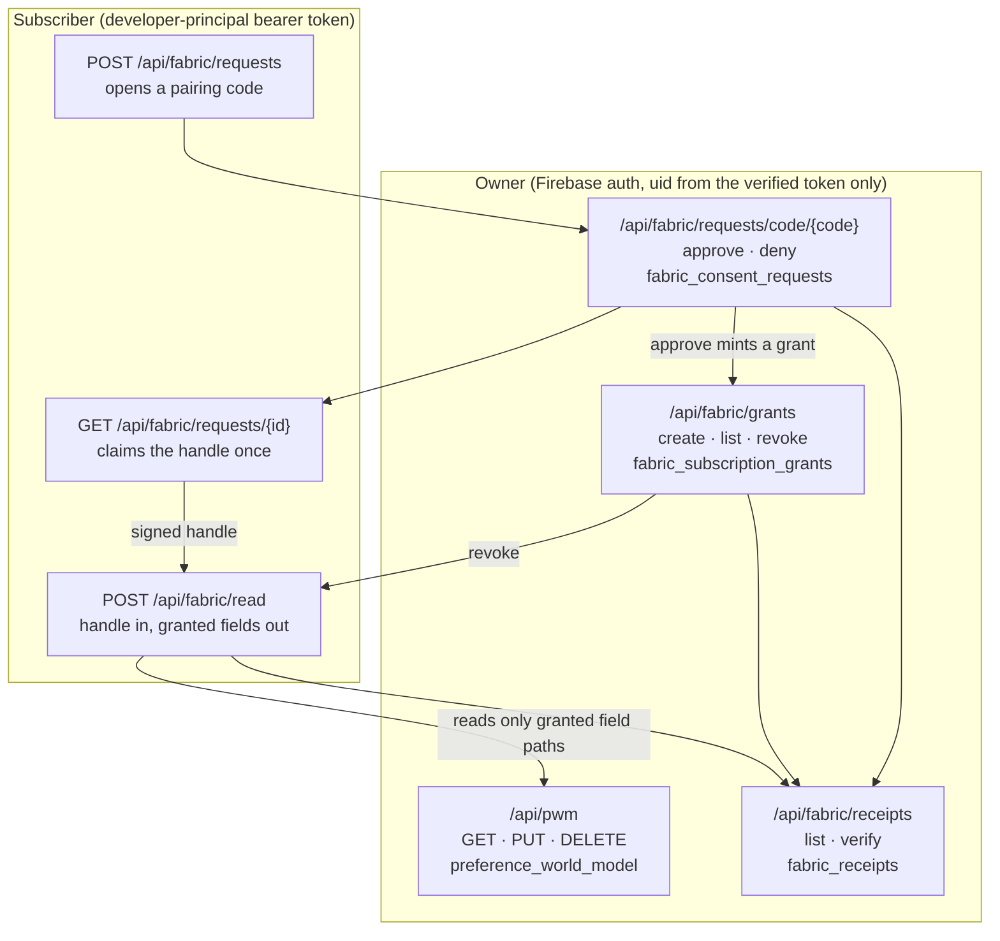

# Personal World Model and the Preference Subscription Fabric

## Visual Map

Two routers, one boundary: `/api/pwm` is the person's private preference
document, and `/api/fabric` is the only way any value from it leaves the vault,
always against a grant and always leaving a receipt.

## Visual Context

Canonical visual owner: [Architecture Index](./README.md). Use that map for the
top-down system view; this page is the narrower detail beneath it.

Implements PCHP RFC-002. Route modules: `consent-protocol/api/routes/pwm.py` and
`consent-protocol/api/routes/fabric.py`. Tables land in migrations `118`, `119`,
and `120`; their families are declared in
[runtime-db-data-plane-contract.json](./runtime-db-data-plane-contract.json).

## Personal World Model (`/api/pwm`)

The server-side home of a person's own preference document. It is the
cross-device half of "your private agent already knows you", and it replaced an
interim frontend Stripe-metadata store without changing the client contract.

| Method | Path | Behavior |
| --- | --- | --- |
| `GET` | `/api/pwm` | The caller's stored document, or `404 PWM_NOT_FOUND`. |
| `PUT` | `/api/pwm` | Merges a partial document, section-level last-writer-wins by `updatedAt`. An empty body (`{}` or no body) wipes the document. |
| `DELETE` | `/api/pwm` | Wipes the document; returns `{deleted, existed}`. |

Boundary rules:

- The uid comes only from the verified Firebase token. Any `uid`, `user_id`, or
  `userId` key in the body is dropped before storage, so a body can never assert
  identity.
- Storage is keyed by uid; a document is returned only to its owner and is fully
  wipeable.
- A `PUT` body over `PWM_MAX_TOP_LEVEL_KEYS` returns `413 PWM_BODY_TOO_LARGE`; a
  non-object body returns `422 PWM_BODY_INVALID`.

## Subscription Fabric (`/api/fabric`)

The fabric turns that private document into something a person can subscribe a
brand or agent to: scoped, dated, priced, revocable read access to specific PWM
field paths, where every grant, read, and revoke writes a signed, hash-chained
receipt.

### Owner endpoints (Firebase auth)

| Method | Path | Behavior |
| --- | --- | --- |
| `POST` | `/api/fabric/grants` | Creates a grant and returns the handle (the only time the handle is shown). |
| `GET` | `/api/fabric/grants` | Lists the caller's grants. Handles are never included. |
| `POST` | `/api/fabric/grants/{grant_id}/revoke` | Revokes a grant. |
| `GET` | `/api/fabric/receipts` | The caller's hash-chained receipt ledger (`limit`, default 200). |
| `GET` | `/api/fabric/receipts/verify` | Verifies the caller's chain integrity. |
| `GET` | `/api/fabric/requests/code/{code}` | Who is asking, for what, and why. Sign-in required; no uid binding yet. |
| `POST` | `/api/fabric/requests/{request_id}/approve` | Mints the grant and its receipt. |
| `POST` | `/api/fabric/requests/{request_id}/deny` | One-tap no. |

### Subscriber endpoints (developer-principal bearer token)

Subscriber auth reuses the developer principal (a static `hdk_` token or OAuth
client credentials). The subscriber identity is the principal's `agent_id`; a
principal with no `agent_id` is rejected with `403 FABRIC_SUBSCRIBER_UNIDENTIFIED`.

| Method | Path | Behavior |
| --- | --- | --- |
| `POST` | `/api/fabric/read` | Presents a grant handle; returns only the granted field paths, plus a receipt. |
| `POST` | `/api/fabric/requests` | Opens a pairing request and returns a short code to show the person. |
| `GET` | `/api/fabric/requests/{request_id}` | Polls the request. On approval the signed handle is returned exactly once. |

### The handshake

The pairing flow is device-authorization-shaped, which is what keeps a brand
from ever holding an unapproved handle:

1. The subscriber opens a request with scopes, purpose, optional label, TTL, and
   price, and receives a short pairing code.
2. The person's agent looks the code up and sees exactly who is asking, for
   what, and why. The request is not yet bound to any uid.
3. Approval mints the grant and its receipt, binding the uid from the verified
   token at that moment.
4. The subscriber polls once and claims the signed handle. The handle is held
   only between approval and that single claim, then cleared.

## What the backend never stores

The trust boundary is the point of the design, so it is stated per table rather
than as a slogan:

- `preference_world_model` holds the owner's own plaintext preference metadata,
  keyed by and returned only to the verified uid.
- `fabric_subscription_grants` holds grant metadata only: subscriber, scopes,
  purpose, price, and a handle fingerprint. Never the PWM values, never the
  plaintext handle.
- `fabric_receipts` holds signed, hash-chained receipt metadata only: hashes,
  signatures, and scope plus field-path labels. No PWM values.
- `fabric_consent_requests` holds workflow state and grant metadata only.

## Related

- [api-contracts.md](./api-contracts.md): the rest of the endpoint and token contracts.
- [runtime-db-fact-sheet.md](./runtime-db-fact-sheet.md): table families and data classes.
- [../iam/consent-scope-catalog.md](../iam/consent-scope-catalog.md): the consent scope vocabulary.
