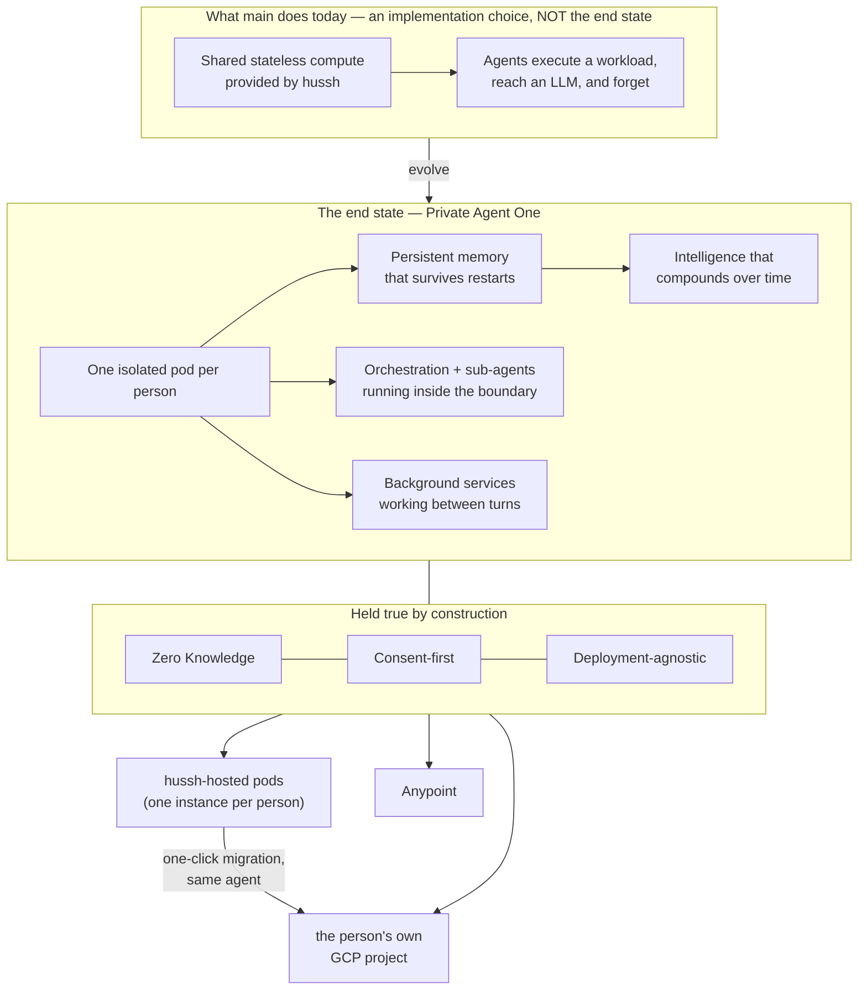

# Private Agent One — the architectural north star

**Founder directive, 2026-08-06.** This is the single architectural source of truth for
the Private Agent workstream. Every plan, persona, harness, diagram, wiki article and
runbook inherits it **by pointer** — cite this file rather than restating it, so there is
one place to change when the vision sharpens.

Where an existing implementation diverges from what is written here, the implementation is
what moves. Do not optimise around the current implementation.

## Visual Map

## The end state, stated plainly

**Every person owns an isolated pod.** Inside it runs their complete agent ecosystem —
Agent One, every sub-agent, the orchestration between them, and the background services
that keep working between conversations. It holds **persistent memory** that survives
restarts, and its intelligence **continuously evolves** as it learns that person's world.

From the person's side it behaves exactly as `main` does today. From the system's side it
is theirs, not ours.

Zero Knowledge and consent-first are not features layered on top. They are the properties
the architecture exists to preserve, and no capability ships that weakens them.

### What the stateless environment was, and was not

The shared stateless compute on `main` let agents execute workloads and reach an LLM. It
was a scaffold — a way to make the product work before pods existed. **It was never the
destination.** Statelessness is precisely what a private agent cannot be: an agent with no
memory cannot compound, cannot learn a person, cannot work between turns.

Any design that reintroduces "the agent forgets between requests" is a regression against
this document, however elegant its other properties.

> **Recorded correction (2026-08-06).** An earlier architectural analysis in this
> workstream recommended moving toward attested *stateless* workers, reasoning from
> Apple's Private Cloud Compute. That recommendation was aimed at the wrong target and is
> **withdrawn**. Its one durable finding survives and is adopted below: **attestation and
> statelessness are separable.** PCC bundles them; we need only the first. Per-person,
> *stateful*, continuously-evolving pods with per-pod cryptographic identity is the
> coherent architecture — and it is the one that closes the identity gap without giving up
> persistence.

## Simulation and production are different architectures (founder directive, 2026-08-06)

**This supersedes the deployment matrix recorded earlier the same day.** That matrix was a
3×2 of deployment target × model credential. It is replaced by **one simulation tier and
two production paths**, and the separation is the resolution rather than a narrowing.

### The simulation / validation tier

**hussh-managed pod + hussh Vertex ADC.** Its purpose is to prove the machinery:

- pod interaction and lifecycle behaviour — keep the pod alive across restarts;
- agent harness execution, grounding, orchestration, and **intelligence chaining**;
- performance metrics, and how the agent **evolves over time**;
- end-to-end connectivity with the front end and any connected surface.

**This tier is not a production deployment path.** It runs in the dev project, on hussh's
own model identity, with the HKDF master present — an environment where hussh genuinely can
reach the pod's keys, which is exactly why it may only ever claim "the lifecycle works" and
never "hussh cannot read that pod."

> **Clarified 2026-08-25.** The sentence that used to follow — "and must never become one" —
> was read as banning any hussh-operated pod from production. What it correctly bans is
> *this configuration*: hussh's dev project, hussh's model identity, a master key from which
> every pod's keys derive. The hosted production tier (path C below) is a different
> configuration of the same image — dedicated hosting project, per-pod KMS with no master,
> verified per-pod identity, turn-bounded model credentials — and it is held to conditions
> the simulation tier is not asked to meet.

### The production paths

| Path | Compute | Model credential |
|---|---|---|
| **A. User-owned GCP** | the person's own GCP project | their own Vertex ADC |
| **B. Anypoint** | user-controlled infrastructure | the person's own AI key |
| **C. hussh-hosted** | one instance per person, in a dedicated hussh hosting project | turn-bounded credential, or their own key |

> **Superseded (founder directive, 2026-08-25).** This section previously read "**the
> production paths — exactly two, both user-owned**" and closed with "**No hussh-hosted
> production tier, no exceptions**" (founder, 2026-08-06). That line is withdrawn, and
> path C above is added. The original reasoning is not discarded — it is what the
> conditions below now carry. What changed is the recognition that "connect your Google
> Cloud account" as the *only* door makes day zero unreachable for someone who arrives
> with a Google account and nothing else, and a private agent nobody can start is not a
> private agent. The separation that mattered was never *whose billing account pays* — it
> is **control plane ≠ custodian**, which is a cryptographic property and is stated as
> testable conditions below.

Onboarding is therefore a **choice**, made by the person and visible to them: "connect your
Google Cloud account" — which `user_gcp_backend.render_bootstrap_plan` already designs as a
keyless, least-privilege, one-time federation — or "connect your Anypoint org", or "host it
with hussh for now". The third door is not a lesser tier with the properties removed; it is
the same pod image, one instance per person, under the conditions below, **with a one-click
migration into the person's own project that carries the same agent and everything it has
learned**. Portability stops being a promise about the future and becomes a button.

### The hosted production tier — the conditions, each testable

Path C is legitimate **only** while all of these hold. Each names the code that enforces
it, so a claim here can be checked rather than believed:

1. **The pod mints its own keys; hussh only ever receives the public half.**
   `pod_self_registration.py` generates the keypair inside the pod; the control plane
   **pulls** the public half from the creation-time URL it recorded (`pod_key_collector.py`)
   and never accepts a pushed key. Direction is the security property.
2. **No derivable master.** On the hosting lane the pod's seal key is a pod-minted DEK
   wrapped under a **per-pod KMS key** (`byoc_key_custody.resolve_pod_log_key`, the same
   envelope BYOC uses). `HUSSH_POD_KEY_MASTER` — from which a holder could re-derive every
   pod's keys — is **not set on that lane**; the HKDF-master mode remains the
   dev-validation lane only. The hub holds `cloudkms.admin` on the keyring and provably
   **not** encrypt/decrypt on the keys.
3. **No fallback seal key.** Half a configuration refuses: hosted provisioning with the
   KMS keyring or state bucket unset fails loudly rather than degrading to an ephemeral pod.
4. **hussh holds public metadata only** — identifier, pod public key, lifecycle state. No
   hussh vault, no backup-of-record, no readable copy. Ciphertext left behind by a
   migration has a **declared expiry** rather than living indefinitely.
5. **Identity is verified, not asserted.** The pod signs its hub calls with a key the hub
   pulled from it, so presenting one pod's transport cannot let a caller speak for another
   person's agent — on either tier.
6. **The honesty clause, stated in exactly these words wherever the tier is described:**
   *hussh does **not** read this pod, and here is the migration path to where it
   structurally **cannot**.* The hosted tier never earns the sentence "hussh cannot read
   this pod." The user-owned targets earn that one, and the migration button is how a
   person moves from the first sentence to the second.

Where a condition is only partly held, it is named here rather than in a footnote: with the
current fleet-shared pod service account, per-pod key isolation is enforced by KMS key
bindings but **not** by workload identity — a pod that could read a sibling's storage prefix
could ask KMS to unwrap it. Per-pod service accounts are the recorded fix, gated on the
measured 100-per-project ceiling below.

Provisioning after the person's AI key is connected is a **required implementation** on the
simulation tier *and* on Anypoint.

### Why the separation resolves so much

With hussh Vertex ADC confined to development, the questions that made the matrix hard
stop being production questions. A `roles/aiplatform.user` grant lands in a dev project on
a dev fleet serving reviewer accounts. The fleet-shared blast radius, the measured 100
service-accounts-per-project ceiling, and "hussh's infrastructure sees the prompts" all
become dev-tier facts. And the one cell that was a genuine security problem — Anypoint
reaching hussh Vertex, which has no ambient Google identity and would need an exported
credential — **is deleted from the architecture rather than mitigated.**

### The uncomfortable part, recorded so nobody discovers it later

**The path being banned from production is the only one that works today.**
*(Updated 2026-08-25: no longer true of `UserGcpBackend` — `_execute_live` is real,
copies the digest-pinned image into the user's own registry, and served the first
live BYOC pod, Agent One, in a project hussh owns no IAM in. `AnypointBackend._execute`
still raises `NotImplementedError` when live.)* `GcpBackend` is live-wired and
functional as the SIMULATION tier; the schema fence below now has a deliberate guard
rather than an accident.

And the only thing keeping hussh-managed pods out of production right now is an
**accident**: `personal_agent_registry` lives in the parked migration lane, so UAT and
production have no such table. That is a schema side-effect, not a control, and it holds
only until someone renumbers `900` into `migrations/`. The boundary needs a guard that
fails closed.

*(Updated 2026-08-25.)* That guard now exists and is explicit rather than incidental:
`hosted_tier_guard.py` permits a hussh-operated live pod create only when the lane
affirmatively opts in, the lane is named, **and** the hosting project is explicitly aimed —
a hosted fleet is never inherited from ambient credentials. The previous stand-in,
`require_simulation_permitted`, was reused for two unrelated things (managed provisioning
and the reviewer phone-verification bypass); those are now separate controls, so opening
the hosted tier can never widen a verification bypass as a side effect.

**Correction, same day.** An earlier revision of this section claimed "the seam already
exists and is the right one," citing `runtime_providers/factory.py`. That is **one axis
off** and the error is worth keeping visible, because it would send an implementer to the
one file that does not need changing.

`factory.py`'s orthogonality is **provider × credential** — Gemini / Anthropic / OpenAI
against ADC / BYOK — and it is genuine. The seam this matrix needs is **target ×
credential**, and it does not exist. Credential mode is currently *coupled* to deployment
target: `_managed_genai_auth_mode` gates on `HUSHH_DEPLOY_ENV`, and `_vertex_project` falls
back to `google.auth.default()`, which bakes in an ambient-Google-identity assumption.

**The real gap is that neither axis is expressible per person.** Both are process-wide
environment variables. `PodSpec` — the one per-user object that crosses the backend seam —
carries neither, and `resolve_compute_backend()` is called with no argument at all three
production call sites. The registry column records what happened; it never decides
anything. So the first change is not credentials or IAM: it is putting both axes on
`PodSpec` and on a per-user column, after which the rest becomes possible.

**This supersedes standing decision D1** ("pods are BYOK-only for now", bound to
`pod_managed_model_enabled`). Managed-model pods are in scope. D1's reasoning — that BYOK
keeps the pod service account zero-role — does not disappear, and it is now a *constraint
on how* a managed cell is built rather than a reason not to build it.

Every cell must preserve the Private Agent properties: the person's holdings stay isolated
and sealed, consent is still required and revocable, and the choice of cell is visible to
the person rather than an invisible operator setting.

### Constraints that survive the separation

**Even in the simulation tier, do not grant `roles/aiplatform.user` to the pod service
account.** Verified live in `hushh-pda-dev`: that account appears in **zero** project IAM
bindings, and it is **fleet-shared** — a project-level grant hands every pod the same
Vertex access at once. Per-pod service accounts do not rescue it: the measured ceiling is
**100 per project**, ten times tighter than the 1000-service Cloud Run ceiling, with a
10/minute creation limit. The shape that works is a **turn-bounded credential** — the hub
mints a short-lived Vertex access token and passes it through the relay exactly as a BYOK
key travels today. This is now a dev-tier concern, but the isolation property is what the
simulation is supposed to be validating, so spending it would make the simulation prove
the wrong thing.

**Never render a hussh service-account key into a runtime hussh does not operate.** Under
the separation this stops being a live design question, because no production path routes
through hussh's model identity. It stays here as doctrine: the existing parity guard blocks
the literal forms, and a base64 blob under a neutral key name would slip past it.

## Deployment-agnostic is a first-class requirement

The hussh **dev** GCP environment exists **purely to validate this architecture**. It is a
simulator for the complete production environment — orchestration, deployment, scaling,
synchronisation, upgrades, recovery, backups, performance, and end-to-end interaction.

The dev environment is not the product. The deployment observations below are dated
2026-08-25 history; they do not identify the currently installed image or prove present
health. Re-earn those observations for a release candidate:

| Target | Purpose | Status (2026-08-25) |
|---|---|---|
| hussh **dev** GCP | validation and simulation only | live |
| hussh **hosted** project | one instance per person; the zero-config door, under the conditions above | building |
| the person's **own** GCP project | they own the compute | live — first BYOC pod served from the person's own registry |
| **Anypoint** | enterprise / partner deployment | not implemented — `AnypointBackend._execute` raises when live, and there is no durable object store for pod state on it |

The migration between rows two and three is a product feature, not an operations task: the
same image, the same HusshID, the same commit log, re-sealed inside the destination pod.

**By configuration, never by architectural change.** This is the test to apply to any
proposed design: *does moving this pod to someone else's project require editing code, or
setting values?* If it requires editing code, the design is wrong.

Practical consequences that follow, and are therefore requirements rather than nice-to-haves:

- No control-plane detail may be baked into a pod image. Configuration arrives at runtime.
- Pod state is **portable** — encrypted, exportable, restorable into a different project.
- Identity is derived from the workload, not borrowed from the hosting platform. A pod
  must be able to prove which pod it is somewhere hussh does not own the IAM.
- Every backend seam (`ComputeBackend`, storage, key custody) stays substitutable.

## The seven requirements, restated against this vision

Isolation, authority, identity, capability, **persistence**, portability, economics — the
same decomposition, now scored against persistent per-person pods rather than a stateless
fleet.

The following observations were recorded on 2026-08-25; they are historical evidence,
not certification of the current revision or deployed fleet. Source review on 2026-09-07
qualifies their limits below. Use `config/pod-completion-ledger.yaml` and its current
revision-bound judge receipt for completion assertions, not this summary table.

| Requirement | What the vision demands | Recorded evidence and remaining limits |
|---|---|---|
| **Isolation** | one person's information unreachable from another's | Separate services and owner checks establish particular boundaries. Cross-owner negative controls and deployed IAM/KMS authority must be verified; runtime identities need permissions for storage, keys and providers. |
| **Authority** | consented, scoped, revocable, non-repudiable | Scoped consent primitives and pod-proposes/hub-authorizes wiring exist. Complete specialist authority threading and durable receipt coverage remain to be proven. |
| **Identity** | the pod proves which person's agent it is, in any project | Per-person service-account and X25519 identity wiring exist. Current live identity after replacement is a separate assertion. |
| **Capability** | the full agent ecosystem runs inside the pod | In-process agents/tools and transitional scoped hub-read doors exist. Registry or import presence alone does not prove consented specialist execution inside a deployed pod. |
| **Persistence** | memory survives restarts and compounds | Sealed-log hydration and memory-provider integration exist; earlier simulation reported recall across two restarts. Current compute-replacement, restore and provider-memory proof remain separate. |
| **Portability** | same platform, three targets, by configuration | Earlier BYOC deployment was reported from the owner's registry. Supported migration, key custody and complete cleanup need evidence for each target; Anypoint remains unimplemented. |
| **Economics** | cost per person far below value per person | Scale-to-zero configuration and liveness policy reduce avoidable work. They do not measure billed cost or establish a cost target. |

Persistence is a named requirement because the target is a persistent private agent.
The shared multi-tenant runtime retains its own owner-scoped session contract; this
workstream does not make shared agents hold ambient personal memory.

### Memory, custody and audit boundaries

PKM is the information authority. `PodPkmStore` is its consented working replica;
`PodCommitLog` protects recovery history. Agent-experience memory is separate from PKM.
The owner-project Memory Bank adapter in
`consent-protocol/hushh_mcp/services/pod_memory_bank.py` sends readable conversation events
through `directContentsSource.events` to the provider's memory-generation API. Provider
memory is derived experience, not another PKM authority. Owner-project placement and
sealed logs do not make that provider blind to the content it processes.

`consent-protocol/hushh_mcp/services/pod_connector_keypair_service.py` registers public
keys only. This does not establish every deployment's runtime-key custody.
`consent-protocol/hushh_mcp/services/byoc_key_custody.py` wraps the recovery key in the
owner's KMS and unwraps it with runtime authority. Confidentiality depends on actual
runtime, KMS and administrative permissions, verified independently from registration.
Ciphertext-only vault routes, specific plaintext-removal migrations and diagnostic
sanitizers each establish bounded protections, not universal encryption or log coverage.

Owner authorization remains mandatory before information access. The designated access
gate in `consent-protocol/hushh_mcp/services/pod_access_audit.py` attempts an audit receipt,
but receipt persistence is best-effort and does not invalidate an otherwise authorized
request. Complete recall coverage and durable receipts remain requirements; an outer-turn
receipt does not prove that every internal read is independently receipted.

Automatic standing grants use the existing consent ledger's dev-only migration 915
renewal guard. A ledger lookup failure refuses issuance; a revoked or denied personal-agent
grant cannot be implicitly reminted or reused. The database serializes renewal, revocation
and expiry, while explicit owner reapproval remains the recovery authority. This is a
source-level correction with disposable PostgreSQL evidence, not deployed acceptance.
Deploy migration 915 before the corresponding runtime; keep its guard during an app
rollback. Removing the guard would restore the renewal defect. Retaining revocation
records remains necessary: the currently uncalled audit-log deletion helper is not an
approved personal-agent erasure path.

Dev migration916 adds the first erasure-admission phase to the existing registry.
An owner-requested deprovision that finds retained resources reserves the current
registry snapshot under the existing owner transaction locks, suspends ordinary
access, and refuses new grants and ordinary registry writes. The existing endpoint
still returns incomplete-erasure409; missing registry or unavailable reservation
also stays incomplete. The public status uses the existing failed state, not active
or first-run setup. Reserved compute still counts toward the fleet cap. This is
source-level, PostgreSQL-tested admission, not a deployed erasure receipt.

The snapshot cannot inventory provider work whose acknowledgement has not arrived.
Ordinary result publication remains refused. A bounded late upgrade acknowledgement
can now be appended to the reservation only when it matches the captured token,
service incarnation and target; conflicting replacement is refused and identical
replay is idempotent. The ordinary upgrade stops after retention. This is evidence
preservation, not proof the provider drained. Additive dev migration917 reserves
provisioning in the existing registry before substrate work, binding the observed
owner/cloud snapshot without timeout takeover. Stage publication compares the
attempt and phase, preserves heartbeat metadata, and retains substrate evidence
before host creation. Managed/BYOC creation refuses name-only adoption and retains
intended project/region/service plus the returned service UID before IAM/readiness.
Failed attempts stay suspended, retaining fleet capacity and recovery authority.
Deferred key publication compares the attempt and observed key. Late creation
evidence can be retained under failed or erasure admission without resuming the
ordinary operation. These controls do not establish deployed recovery, drainage
or complete cleanup. Pod-held log fencing and provider
reconciliation must finish before lifecycle completion. A provisioned snapshot with
no held upgrade can now reach the pod's log fence: the hub observes the captured
service UID, current controller generation and one fully serving revision, rereads
the immutable erasure reservation, and binds its OIDC proof to the exact owner,
attempt and observed incarnation. The pod checks its HusshID/service/revision and
the scoped proof before fencing. Migration capability must be enabled; unsupported
or unavailable targets remain incomplete. This is a fence-only phase: service UID
is the hub's verified observation, not independent pod attestation, and it does not
prove provider drainage. No compute, key, grant or owner identity is deleted by reservation.

Memory Bank recall reserves one bounded operation in the existing `memory_bank.json`
before credentials or retrieval. Protocol 2 records only the attempt, client incarnation
and engine identifier; it stores no query or returned information. A successful response
clears only that exact reservation while preserving generation and erasure state.
Caller cancellation leaves the admitted worker running so its validated response can
record exact completion, without releasing information to the cancelled caller. While
that worker runs, or when its response, persistence or process is lost, admission remains
unresolved without expiry; erasure cannot submit DELETE while recall is outstanding. Generation acknowledgements
merge their exact slot so concurrent recall writes cannot discard them. An admitted
generation worker also survives caller cancellation to preserve a late provider
acknowledgement; lost or uncertain submissions remain unresolved and never resubmit.
Recall rechecks
its owner-bound record before releasing the result. These are source-level safeguards,
not deployed drainage evidence: older clients must be drained before claiming coverage
of previously admitted requests, and unresolved reservations still require reconciliation.
The existing pod erasure-fence endpoint now closes the sealed log and then CAS-fences
Memory Bank admission in `memory_bank.json`. Its `admission_closed` phase preserves
ready, creating and legacy records and outstanding operations; an absent record gets
an explicit marker, never an absence-of-resources receipt. Late creation publication
can retain only a captured-generation/configuration-bound engine acknowledgement.
Startup refuses ordinary initialization under the marker. The trusted internal lifecycle
reconciler can advance it only for the matching owner/attempt and validated protocol-2
initialized engine, with no outstanding recall and matching persisted incarnation.
It then uses the existing generation-reconciliation and deletion sequence. Absent, legacy
and late-creation-only records remain incomplete; startup observation cannot initiate
this transition. Partial fence failures remain incomplete and retries preserve authority.
Protocol 2 alone does not prove older provider work has drained; the trusted coordinator
still owns that prerequisite. The public lifecycle now requests pod-held provider deletion
only after the fresh memory and unchanged initial runtime qualifications below.
The pod exposes fenced engine coordinates through a separate `memory-binding` proof
on the existing migration router. The hub appends that exact serving-revision/engine
binding to the existing erasure reservation and requires database readback before
continuing. Dev migration 918 rejects conflicting retries and preserves the reservation's
immutable snapshot; this observation is neither a deletion receipt nor historical drain
evidence. New compute creation acknowledgements retain initial generation and image
evidence only when the returned image matches a digest-pinned request. Missing optional
metadata still preserves the base service-identity receipt. The coordinator qualifies
only a completed initial provisioning attempt with fresh memory creation provenance,
unchanged first generation and the same resolved serving-image digest; adopted engines,
upgraded pods and unavailable evidence remain incomplete. A separately purpose-bound pod request verifies the
exact persisted engine binding and invokes the existing reconciler with pod-held credentials.
Only its validated provider completion is appended to the registry reservation, with active
guard validation and readback. Dev migration 919 adds exclusive compute admission and
append-only operation acknowledgement/completion to the same reservation. After provider
memory completion, the coordinator verifies the initial service generation, image, UID and
etag before deletion. A restart polls only the retained operation; missing acknowledgement
remains unresolved. Callback waits are bounded, and late retention cannot authorize a second
DELETE. Terminal operation evidence must identify the original service; it does not prove
storage erasure. Version-specific object deletion and separate retained-object inventory
checks still require live acceptance, including soft-delete-disabled and missing-bucket
recovery. Account erasure remains incomplete while storage, keys, grants or owner cleanup
lack verified outcomes. These compute changes are published but not deployed.
The substrate receipt records applied identifiers and a plan digest, including adopted
resources; that alone does not prove exclusive creation. It also retains intended IAM
members, roles and targets from the authored plan, without notes or provider bodies.
Typed resources and IAM obligations survive reported bootstrap exceptions and grant
refusal. These declarations neither prove that a grant was created nor authorize its
revocation; the resource type/ID digest does not authenticate IAM or creation evidence. New source retains intended
resource types and selectively records acknowledged bucket creation with its generation,
project number and creation time. Adopted buckets and missing evidence gain no creation
claim; contradictory returned bucket names fail bootstrap. Receipt-backed cleanup resolves
its configured project number before bucket access, compares creation identity before and
after object cleanup, and uses a current metageneration for bucket deletion. It checks
both live absence and the retained soft-deleted generation; retention is incomplete.
GCS log HTTP runs off the event loop; cancelled write callers wait for their worker
to terminate before cancellation completes. That process-local join is not durable
upload reconciliation or proof of remote completion after a transport error.
Metageneration is not an atomic incarnation precondition. The remaining bucket integration
must preserve the existing lifecycle reservation and recheck the captured writer's disabled
state and bucket identity before final deletion. Current pod writes use single-request
media uploads. Final deletion acknowledgement followed by live-bucket and captured
soft-deleted-generation absence is the required provider-visible outcome; it does not
claim that every earlier HTTP request drained. This inference uses Cloud Storage's
[nonempty-bucket deletion refusal](https://docs.cloud.google.com/storage/docs/json_api/v1/buckets/delete)
and [strongly consistent bucket read-after-delete](https://docs.cloud.google.com/storage/docs/consistency).
Keep exact-object-generation cleanup retryable before final bucket DELETE admission:
retention can pause that work without a bucket DELETE having occurred. Retain final
DELETE admission and acknowledgement separately; acknowledged retries observe, while
uncertain acknowledgements remain unresolved. Dev migration 922 and the coordinator
now draft those bucket stages under the existing immutable erasure reservation. Missing
creation evidence refuses before provider access; final admission rechecks writer
revocation. Other resource cleanup and live acceptance remain open. These bucket
changes are not deployed.
Only bounded identity fields
are retained, never provider response bodies. Pod service-account creation likewise retains
validated project/email and the stable numeric identity; adoption or missing identity creates
no ownership claim. KMS creation receipts retain key name, purpose and creation time;
receipt-backed cleanup checks that identity before examining version destruction. Signing-secret
receipts retain creation identity and verified project aliases. Their cleanup requests stay
bound to the configured project, compare creation identity, use a current etag and verify absence.
Neither a numeric alias nor a resource name selects another project's cleanup authority.
Mail topic, subscription and scheduler creation acknowledgements now retain configured
names and relationships, excluding message contents. These are not immutable provider
incarnations; 409 adoption and missing acknowledgements confer no cleanup ownership.
Dev migration 923 and the owner coordinator retain ordered mail cleanup admission,
acknowledgement and absence under the same erasure reservation. Preflight checks the
database contract before provider access, and uncertain deletes never replay. Shared
image repositories and remaining recovery resources still require reconciliation.
These lifecycle changes are not deployed.
The bootstrap applier requires explicit terminal operation evidence; empty responses do not
prove completion. Polls must match the acknowledged operation and diagnostics omit provider errors. The shared `one-pod` image repository
must not be deleted solely because its derived name appears in a cleanup plan. Before
connecting substrate cleanup, retain typed inventory and resource-specific ownership
alongside the existing erasure reservation, then persist partial outcomes before releasing
bootstrap authority. Dev migration 920 retains the exact captured substrate receipt after
validated compute completion, under the same owner locks and immutable erasure guard.
Dev migration 921 adds append-only runtime credential revocation admission and disabled
receipts. The owner-cloud path checks the captured runtime account's numeric identity,
preserves a distinct bootstrap account and rechecks disabled state after admission.
An admitted retry only observes; it never submits another disable request. This draft
is not deployed and does not prove that previously accepted uploads have drained.
The hub reads inventory back before continuing. This preserves shared and unresolved inventory;
it does not grant cleanup eligibility. Dev migrations 924–930 and the existing coordinator
connect KMS destruction, signing-secret deletion, runtime-account deletion, runtime project-grant
revocation and repository-writer revocation to retained admission and outcome callbacks.
Repository creation evidence comes from the completed provider operation; adopted repositories
without that evidence remain unqualified. Grant cleanup preserves conditional and unrelated
bindings and refuses uncertain write replay. The repository itself is retained.
Bootstrap impersonation revocation and shared-image contents reconciliation remain unconnected
to final account removal. These source changes are not deployed and do not establish live erasure.
The existing live drill remains unavailable until disposable ownership and complete cleanup
satisfy those same contracts.
An already-admitted Memory Bank DELETE worker retains its acknowledgement after caller
cancellation. Lost worker or transport outcomes remain `delete_submitting` and cannot
resubmit DELETE. These source changes require dev rollout and lifecycle acceptance.
Internal Memory Bank erasure reconciliation records durable progress under a log fence.
Pod startup can resume observation of an acknowledged deletion from that durable record
without initializing ordinary memory. It requires the matching owner/attempt log fence;
waiting and unacknowledged submissions remain pending, and startup never submits DELETE.
The existing migration transport refuses redirects while carrying hub proof and exposes
only bounded refusal diagnostics; malformed success responses are typed failures.
New initialization captures the provider resource name and `createTime` in the existing
`memory_bank.json` before admitting use; these are observed provider fields, not the
local record timestamp. New records initialize protocol 2 and empty recall/generation
slots before first use. Only a successful creation response, matching the subsequent
engine observation, can attach creation provenance tied to the reserved object generation.
Discovery, configured-engine adoption and recovery without that acknowledgement do not
acquire freshness evidence. Runtime-image provenance and historical-work reconciliation
remain separate prerequisites for coordinated deletion. The provider fields follow Google's
[ReasoningEngine resource contract](https://docs.cloud.google.com/vertex-ai/docs/reference/rest/v1beta1/projects.locations.reasoningEngines).
Erasure refuses missing or mismatched persisted incarnation evidence before provider
access and requires a matching current observation before deletion. Legacy records
remain readable but are not silently upgraded into historical erasure proof. This
does not establish provider-side conditional deletion or inventory uncertain creates.
It does not activate complete account deletion. Public lifecycle completion still needs
coordinated owner admission, in-flight provider reconciliation, retained retry authority
and verified cleanup of all resources. The account service currently refuses destructive
teardown while required external resources remain; this containment must not be described
as successful erasure. Verify no resurrection through replay, restore or regeneration
before claiming the lifecycle complete. Substrate cleanup rejects malformed inventory
before any deletion; silently dropping an entry cannot count as complete cleanup.

The existing read-only reconciler can enumerate a captured `one-pod` repository:
from `consent-protocol/`, run `PYTHONPATH=. uv run python scripts/ops/pod_reconcile.py
--project <project> --region <region> --repository-created-at <retained-createTime>`
as one command. It uses the existing operator credential loader, checks the repository
incarnation before and after bounded pagination, and emits image names/URIs without tags.
Access failures, malformed responses, duplicate entries and repeated page tokens refuse
rather than report an empty inventory. Every successful observation remains `unresolved`:
it is not an atomic snapshot, an inventory of incomplete uploads, ownership evidence,
or permission to delete shared storage. Durable classification in the existing erasure
reservation is still required before bootstrap release. The enumeration follows the
[Artifact Registry Docker image list contract](https://docs.cloud.google.com/artifact-registry/docs/reference/rest/v1/projects.locations.repositories.dockerImages/list).

## What this changes about the work

1. **Pod-native persistent memory is on the critical path**, not deferred. An agent that
   forgets is not the product. Agent memory already appends to and hydrates from
   `PodCommitLog` through `pod_memory_service.py`; `PodPkmStore` owns the separate PKM
   working copy. Keep restart/replay and owner-isolation evidence current when either
   storage path changes.
   The local PKM resolver reserves the consent-verified Firebase owner UID before
   hydration and shares one retained initialization task across same-owner callers.
   A cancelled waiter cannot release initialization while SQLite work continues;
   a failed rebuild retains the owner binding for same-owner retry. This is
   process-local initialization protection, not cross-process erasure fencing or
   proof of current information freshness.
2. **Specialists must be re-homed into the pod**, not proxied to the hub indefinitely. A
   pod that forwards every specialist call to a central database is a thin client with a
   local model — an acceptable *transitional* step, never the destination, and it must be
   labelled as transitional wherever it appears.
3. **Per-pod cryptographic identity replaces the fleet-shared account.** This is the gate
   on any cohort larger than the team, and on deployment into a project hussh does not own.
4. **Economy tier becomes the default.** Persistence must not require a warm instance;
   state lives outside the container so scale-to-zero costs nothing but a cold start.
5. **The hussh dev environment is measured as a simulator.** Its job is to prove upgrades,
   recovery, backup, sync and scale work — not to be the place the product lives.
   *(Updated 2026-08-25: this said "the hussh GCP environment", which now needs the
   distinction. The **dev** project is the simulator. The **hosted** project is a
   production tier under the stated conditions, and it is measured as production —
   per-pod KMS custody, verified identity, real cost per person from a billing export.)*
   Host-absence recovery now compares the registry snapshot captured before an
   external probe. A confirmed absent host clears cloud authorization only through
   a conditional update of that same stable lifecycle and host/authority snapshot.
   Changed observations return retry guidance; unavailable persistence cannot earn
   fresh-setup guidance. Managed selection preserves parked BYOC onboarding through
   the existing cloud resolver and rechecks its resolved authority after probing.
   These are optimistic observation checks, not durable compute-incarnation fencing,
   a provisioning reservation, or complete external-memory erasure.
   Image-upgrade admission now retains its existing registry token after timeout
   or provider failure; elapsed time never permits a second claimant. Known terminal
   publication releases it. PostgreSQL checks cover retention and release. This
   deliberately pauses uncertain upgrades; automated provider reconciliation and
   protection against every other registry writer remain incomplete. Do not clear
   an unresolved token based on age or service health alone. Older running hub
   revisions still use the former expiry rule; drain them before claiming this
   admission guarantee for a deployed environment.
   New hub upgrades also stamp the revision template with an opaque digest of
   the registry attempt; readiness polling refuses another or missing binding
   and requires a real controller generation. This detects a replaced attempt,
   and replacement acknowledgement is persisted through the same registry CAS
   before polling: service UID, generation, attempt, deployed image and requested
   target. Failure to persist stops polling and retains admission. A later timeout
   cannot erase that receipt. The existing upgrade sweep now reconciles stored
   acknowledgements using GET-only backend observation of that exact service UID,
   attempt, image and generation. Unknown or changed observations retain admission;
   a terminal controller verdict publishes through the original token/host CAS.
   PostgreSQL checks prove delayed old-worker success or failure cannot overwrite
   a subsequent claimant. Source/provider-double tests cover restart recovery, not
   live provider success, serving traffic, recall or complete erasure admission.
   Missing acknowledgements still require independent reconciliation; never retry
   their provider mutation just because the worker disappeared. Unrelated writers can preserve template annotations, so a matching
   annotation alone is never a complete recovery proof.
6. **Migration is a first-class product surface.** A person who started on the hosted tier
   must be able to move their agent into their own project with one click, keeping the same
   HusshID and everything the agent has learned, with the re-seal happening inside the
   destination pod because hussh structurally cannot perform it.

## Open questions this document does not yet answer

Raised by the lanes that inherit it, on the first cycle after it was written. Recorded
here rather than resolved silently, because seven lanes each guessing differently is the
drift this file exists to prevent.

**Q1 — RESOLVED (founder, 2026-08-06). Can a hussh-managed pod hold a durable key at all?**
`pod_self_registration.py` defines *durable* as storage only that pod's runtime can read,
naming the **user's** project or attested sealed storage — neither of which exists on
hussh-managed GCP. Read strictly, that made persistence unvalidatable on the exact
environment designated as the simulator.

**The resolution is to simulate the full hussh-managed pod lifecycle: keep the pod alive,
chain intelligence across turns and restarts, and validate how the agent evolves over
time.** The simulator's job is to prove *evolution*, not merely that a key survives. So a
hussh-managed pod holds a durable key to make that simulation real, and the thing being
validated is the compounding — continuity across restart, knowledge from an early turn used
much later, and quality that does not decay over a long horizon.

Two consequences worth stating, because they are what make this honest rather than a
loophole:

- The claim the simulator earns is **"the lifecycle works"**, not "hussh cannot read this
  pod." On hussh-managed compute, hussh operates the environment. Sovereignty is the
  customer-owned targets; the hussh tier proves the machinery.
- **"The agent evolved" must be an assertion, not a vibe.** A long-horizon run that nobody
  measures is a soak test with good intentions. It needs a metric, negative controls, and
  an observed recall *tool call* — a model can produce a plausible answer by guessing, and
  only the tool call proves it remembered.

**Q2 — Economy-tier-by-default and background-services-between-turns are in tension.** A
pod at `minScale=0` has no process to run background work in. Asserting both without
reconciling them means one lane builds an always-on loop and another builds a scheduler,
both citing this file.

*Working answer:* between-turn work is **event-woken**, not resident. The BYOC bootstrap
already designs exactly this shape. An always-on loop is not the intended reading.

**Q3 — Is "one isolated pod per person" a required implementation or a required
property?** The two readings differ by an order of magnitude in economics, because a
service per person carries a hard platform ceiling that scale-to-zero does **not** relieve
— the quota counts services, not instances, so a sleeping pod holds a slot exactly like a
warm one. The only lever that removes the ceiling is the person's own project, which
reframes BYO-Compute from a sovereignty tier into **the scale path**.

*Working answer (2026-08-25), pending the founder's decision on the scale shape.* It is a
required **property** — one person's holdings unreachable from another's — which the
one-service-per-person implementation currently delivers and which nothing else in the
codebase delivers today. The ceiling is real and is not relieved by scale-to-zero, so the
scale shape is **sharded hosting projects**: the pod's project is already recorded per row
in `backend_metadata.project`, so a second hosting project is a routing decision at
provision time rather than an architectural change. The person's own project remains the
path that removes the ceiling entirely, which is why the migration button is a scale
strategy as much as a sovereignty one. **What still needs the founder: approval of the
sharded shape, and the measured cost-per-person that decides how urgent it is.**

## How to use this file

- **Plans and personas** cite it by pointer, per `AGENTS.md`. Do not copy it into a prompt.
- **Any design review** asks two questions of the proposal: *does the agent still remember?*
  and *does this move to another project by configuration alone?*
- **When something in the repo still reflects the stateless scaffold** where it should not,
  evolve it and say so in the commit — the divergence is the finding.

## Sources

- Founder directive, 2026-08-06, realigning execution with the intended architecture.
- Companion records: the plan of record and the interface-to-agent routing map in this same directory; the dev fast-lane runbook in `docs/reference/operations/`.
