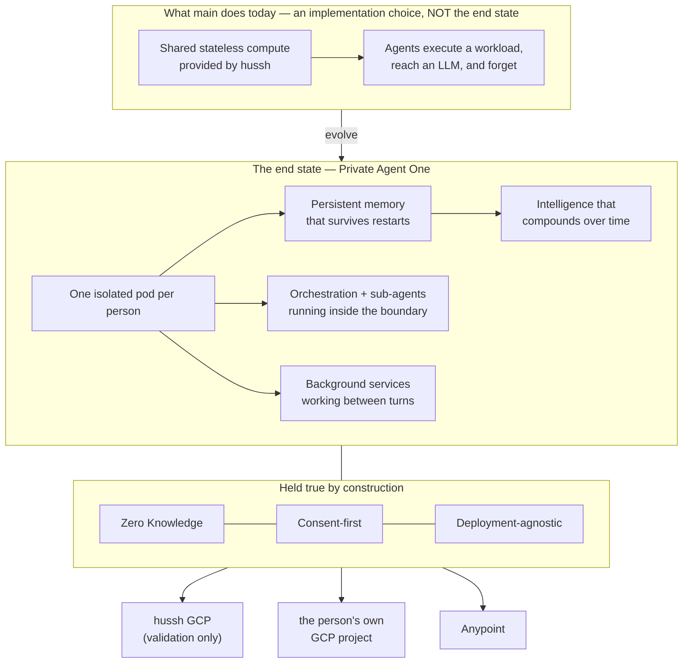

# Private Agent One — the architectural north star

**Founder directive, 2026-08-06.** This is the single architectural source of truth for
the Private Agent workstream. Every plan, persona, harness, diagram, wiki article and
runbook inherits it **by pointer** — cite this file rather than restating it, so there is
one place to change when the vision sharpens.

Where an existing implementation diverges from what is written here, the implementation is
what moves. Do not optimise around the current implementation.

## Visual Map

## The end state, stated plainly

**Every person owns an isolated pod.** Inside it runs their complete agent ecosystem —
Agent One, every sub-agent, the orchestration between them, and the background services
that keep working between conversations. It holds **persistent memory** that survives
restarts, and its intelligence **continuously evolves** as it learns that person's world.

From the person's side it behaves exactly as `main` does today. From the system's side it
is theirs, not ours.

Zero Knowledge and consent-first are not features layered on top. They are the properties
the architecture exists to preserve, and no capability ships that weakens them.

### What the stateless environment was, and was not

The shared stateless compute on `main` let agents execute workloads and reach an LLM. It
was a scaffold — a way to make the product work before pods existed. **It was never the
destination.** Statelessness is precisely what a private agent cannot be: an agent with no
memory cannot compound, cannot learn a person, cannot work between turns.

Any design that reintroduces "the agent forgets between requests" is a regression against
this document, however elegant its other properties.

> **Recorded correction (2026-08-06).** An earlier architectural analysis in this
> workstream recommended moving toward attested *stateless* workers, reasoning from
> Apple's Private Cloud Compute. That recommendation was aimed at the wrong target and is
> **withdrawn**. Its one durable finding survives and is adopted below: **attestation and
> statelessness are separable.** PCC bundles them; we need only the first. Per-person,
> *stateful*, continuously-evolving pods with per-pod cryptographic identity is the
> coherent architecture — and it is the one that closes the identity gap without giving up
> persistence.

## Deployment-agnostic is a first-class requirement

The hussh-managed GCP environment exists **purely to validate this architecture**. It is a
simulator for the complete production environment — orchestration, deployment, scaling,
synchronisation, upgrades, recovery, backups, performance, and end-to-end interaction.

It is not the product. The same platform must later run:

| Target | Purpose |
|---|---|
| hussh-managed GCP | validation and simulation only |
| the person's **own** GCP project | they own the compute |
| **Anypoint** | enterprise / partner deployment |

**By configuration, never by architectural change.** This is the test to apply to any
proposed design: *does moving this pod to someone else's project require editing code, or
setting values?* If it requires editing code, the design is wrong.

Practical consequences that follow, and are therefore requirements rather than nice-to-haves:

- No control-plane detail may be baked into a pod image. Configuration arrives at runtime.
- Pod state is **portable** — encrypted, exportable, restorable into a different project.
- Identity is derived from the workload, not borrowed from the hosting platform. A pod
  must be able to prove which pod it is somewhere hussh does not own the IAM.
- Every backend seam (`ComputeBackend`, storage, key custody) stays substitutable.

## The six requirements, restated against this vision

Isolation, authority, identity, capability, portability, economics — the same
decomposition, now scored against persistent per-person pods rather than a stateless fleet.

| Requirement | What the vision demands | Current state |
|---|---|---|
| **Isolation** | one person's holdings unreachable from another's | met — separate service, no shared credential, zero-permission identity |
| **Authority** | consented, scoped, revocable, non-repudiable | partial — primitive strong, body empty, signing symmetric, primary audit chain unshipped |
| **Identity** | the pod proves *which* person's agent it is, in any project | **absent** — fleet-shared service account proves only "a pod" |
| **Capability** | the full agent ecosystem runs *inside* the pod | **absent** — 2 of 12 tools succeed; specialists depend on a database the pod deliberately cannot reach |
| **Persistence** | memory survives restarts and compounds | **absent** — agent memory is an in-process list, erased every restart |
| **Portability** | same platform, three targets, by configuration | **absent** — config baked into the image |
| **Economics** | cost per person far below value per person | at risk — warm tier is the default |

Note the change from the previous framing: **persistence is now a named requirement.** It
was not one when the target was a stateless fleet, which is exactly how it went missing.

## What this changes about the work

1. **Pod-native persistent memory is on the critical path**, not deferred. An agent that
   forgets is not the product. `PodPkmStore` / `PodCommitLog` exist; agent memory does not
   use them.
2. **Specialists must be re-homed into the pod**, not proxied to the hub indefinitely. A
   pod that forwards every specialist call to a central database is a thin client with a
   local model — an acceptable *transitional* step, never the destination, and it must be
   labelled as transitional wherever it appears.
3. **Per-pod cryptographic identity replaces the fleet-shared account.** This is the gate
   on any cohort larger than the team, and on deployment into a project hussh does not own.
4. **Economy tier becomes the default.** Persistence must not require a warm instance;
   state lives outside the container so scale-to-zero costs nothing but a cold start.
5. **The hussh GCP environment is measured as a simulator.** Its job is to prove upgrades,
   recovery, backup, sync and scale work — not to be the place the product lives.

## How to use this file

- **Plans and personas** cite it by pointer, per `AGENTS.md`. Do not copy it into a prompt.
- **Any design review** asks two questions of the proposal: *does the agent still remember?*
  and *does this move to another project by configuration alone?*
- **When something in the repo still reflects the stateless scaffold** where it should not,
  evolve it and say so in the commit — the divergence is the finding.

## Sources

- Founder directive, 2026-08-06, realigning execution with the intended architecture.
- Companion records: the plan of record and the interface-to-agent routing map in this same directory; the dev fast-lane runbook in `docs/reference/operations/`.
