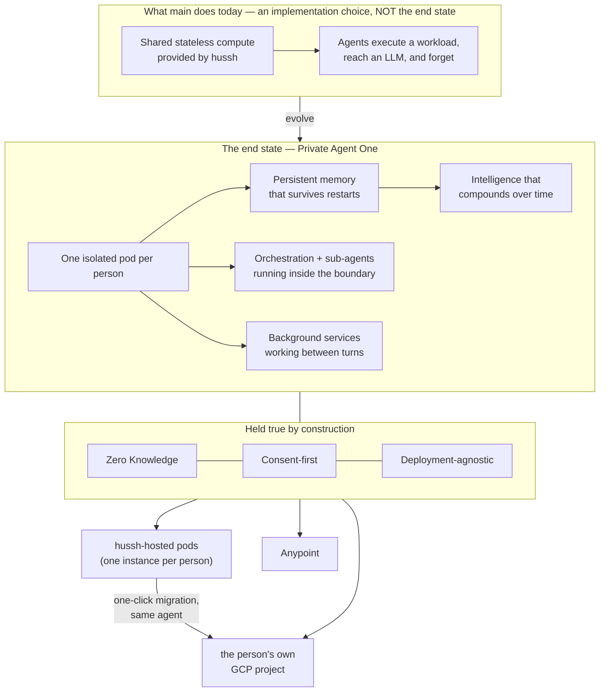

# Private Agent One — the architectural north star

**Founder directive, 2026-08-06.** This is the single architectural source of truth for
the Private Agent workstream. Every plan, persona, harness, diagram, wiki article and
runbook inherits it **by pointer** — cite this file rather than restating it, so there is
one place to change when the vision sharpens.

Where an existing implementation diverges from what is written here, the implementation is
what moves. Do not optimise around the current implementation.

## Visual Map

## The end state, stated plainly

**Every person owns an isolated pod.** Inside it runs their complete agent ecosystem —
Agent One, every sub-agent, the orchestration between them, and the background services
that keep working between conversations. It holds **persistent memory** that survives
restarts, and its intelligence **continuously evolves** as it learns that person's world.

From the person's side it behaves exactly as `main` does today. From the system's side it
is theirs, not ours.

Zero Knowledge and consent-first are not features layered on top. They are the properties
the architecture exists to preserve, and no capability ships that weakens them.

### What the stateless environment was, and was not

The shared stateless compute on `main` let agents execute workloads and reach an LLM. It
was a scaffold — a way to make the product work before pods existed. **It was never the
destination.** Statelessness is precisely what a private agent cannot be: an agent with no
memory cannot compound, cannot learn a person, cannot work between turns.

Any design that reintroduces "the agent forgets between requests" is a regression against
this document, however elegant its other properties.

> **Recorded correction (2026-08-06).** An earlier architectural analysis in this
> workstream recommended moving toward attested *stateless* workers, reasoning from
> Apple's Private Cloud Compute. That recommendation was aimed at the wrong target and is
> **withdrawn**. Its one durable finding survives and is adopted below: **attestation and
> statelessness are separable.** PCC bundles them; we need only the first. Per-person,
> *stateful*, continuously-evolving pods with per-pod cryptographic identity is the
> coherent architecture — and it is the one that closes the identity gap without giving up
> persistence.

## Simulation and production are different architectures (founder directive, 2026-08-06)

**This supersedes the deployment matrix recorded earlier the same day.** That matrix was a
3×2 of deployment target × model credential. It is replaced by **one simulation tier and
two production paths**, and the separation is the resolution rather than a narrowing.

### The simulation / validation tier

**hussh-managed pod + hussh Vertex ADC.** Its purpose is to prove the machinery:

- pod interaction and lifecycle behaviour — keep the pod alive across restarts;
- agent harness execution, grounding, orchestration, and **intelligence chaining**;
- performance metrics, and how the agent **evolves over time**;
- end-to-end connectivity with the front end and any connected surface.

**This tier is not a production deployment path.** It runs in the dev project, on hussh's
own model identity, with the HKDF master present — an environment where hussh genuinely can
reach the pod's keys, which is exactly why it may only ever claim "the lifecycle works" and
never "hussh cannot read that pod."

> **Clarified 2026-08-25.** The sentence that used to follow — "and must never become one" —
> was read as banning any hussh-operated pod from production. What it correctly bans is
> *this configuration*: hussh's dev project, hussh's model identity, a master key from which
> every pod's keys derive. The hosted production tier (path C below) is a different
> configuration of the same image — dedicated hosting project, per-pod KMS with no master,
> verified per-pod identity, turn-bounded model credentials — and it is held to conditions
> the simulation tier is not asked to meet.

### The production paths

| Path | Compute | Model credential |
|---|---|---|
| **A. User-owned GCP** | the person's own GCP project | their own Vertex ADC |
| **B. Anypoint** | user-controlled infrastructure | the person's own AI key |
| **C. hussh-hosted** | one instance per person, in a dedicated hussh hosting project | turn-bounded credential, or their own key |

> **Superseded (founder directive, 2026-08-25).** This section previously read "**the
> production paths — exactly two, both user-owned**" and closed with "**No hussh-hosted
> production tier, no exceptions**" (founder, 2026-08-06). That line is withdrawn, and
> path C above is added. The original reasoning is not discarded — it is what the
> conditions below now carry. What changed is the recognition that "connect your Google
> Cloud account" as the *only* door makes day zero unreachable for someone who arrives
> with a Google account and nothing else, and a private agent nobody can start is not a
> private agent. The separation that mattered was never *whose billing account pays* — it
> is **control plane ≠ custodian**, which is a cryptographic property and is stated as
> testable conditions below.

Onboarding is therefore a **choice**, made by the person and visible to them: "connect your
Google Cloud account" — which `user_gcp_backend.render_bootstrap_plan` already designs as a
keyless, least-privilege, one-time federation — or "connect your Anypoint org", or "host it
with hussh for now". The third door is not a lesser tier with the properties removed; it is
the same pod image, one instance per person, under the conditions below, **with a one-click
migration into the person's own project that carries the same agent and everything it has
learned**. Portability stops being a promise about the future and becomes a button.

### The hosted production tier — the conditions, each testable

Path C is legitimate **only** while all of these hold. Each names the code that enforces
it, so a claim here can be checked rather than believed:

1. **The pod mints its own keys; hussh only ever receives the public half.**
   `pod_self_registration.py` generates the keypair inside the pod; the control plane
   **pulls** the public half from the creation-time URL it recorded (`pod_key_collector.py`)
   and never accepts a pushed key. Direction is the security property.
2. **No derivable master.** On the hosting lane the pod's seal key is a pod-minted DEK
   wrapped under a **per-pod KMS key** (`byoc_key_custody.resolve_pod_log_key`, the same
   envelope BYOC uses). `HUSSH_POD_KEY_MASTER` — from which a holder could re-derive every
   pod's keys — is **not set on that lane**; the HKDF-master mode remains the
   dev-validation lane only. The hub holds `cloudkms.admin` on the keyring and provably
   **not** encrypt/decrypt on the keys.
3. **No fallback seal key.** Half a configuration refuses: hosted provisioning with the
   KMS keyring or state bucket unset fails loudly rather than degrading to an ephemeral pod.
4. **hussh holds public metadata only** — identifier, pod public key, lifecycle state. No
   hussh vault, no backup-of-record, no readable copy. Ciphertext left behind by a
   migration has a **declared expiry** rather than living indefinitely.
5. **Identity is verified, not asserted.** The pod signs its hub calls with a key the hub
   pulled from it, so presenting one pod's transport cannot let a caller speak for another
   person's agent — on either tier.
6. **The honesty clause, stated in exactly these words wherever the tier is described:**
   *hussh does **not** read this pod, and here is the migration path to where it
   structurally **cannot**.* The hosted tier never earns the sentence "hussh cannot read
   this pod." The user-owned targets earn that one, and the migration button is how a
   person moves from the first sentence to the second.

Where a condition is only partly held, it is named here rather than in a footnote: with the
current fleet-shared pod service account, per-pod key isolation is enforced by KMS key
bindings but **not** by workload identity — a pod that could read a sibling's storage prefix
could ask KMS to unwrap it. Per-pod service accounts are the recorded fix, gated on the
measured 100-per-project ceiling below.

Provisioning after the person's AI key is connected is a **required implementation** on the
simulation tier *and* on Anypoint.

### Why the separation resolves so much

With hussh Vertex ADC confined to development, the questions that made the matrix hard
stop being production questions. A `roles/aiplatform.user` grant lands in a dev project on
a dev fleet serving reviewer accounts. The fleet-shared blast radius, the measured 100
service-accounts-per-project ceiling, and "hussh's infrastructure sees the prompts" all
become dev-tier facts. And the one cell that was a genuine security problem — Anypoint
reaching hussh Vertex, which has no ambient Google identity and would need an exported
credential — **is deleted from the architecture rather than mitigated.**

### The uncomfortable part, recorded so nobody discovers it later

**The path being banned from production is the only one that works today.**
*(Updated 2026-08-25: no longer true of `UserGcpBackend` — `_execute_live` is real,
copies the digest-pinned image into the user's own registry, and served the first
live BYOC pod, Agent One, in a project hussh owns no IAM in. `AnypointBackend._execute`
still raises `NotImplementedError` when live.)* `GcpBackend` is live-wired and
functional as the SIMULATION tier; the schema fence below now has a deliberate guard
rather than an accident.

And the only thing keeping hussh-managed pods out of production right now is an
**accident**: `personal_agent_registry` lives in the parked migration lane, so UAT and
production have no such table. That is a schema side-effect, not a control, and it holds
only until someone renumbers `900` into `migrations/`. The boundary needs a guard that
fails closed.

*(Updated 2026-08-25.)* That guard now exists and is explicit rather than incidental:
`hosted_tier_guard.py` permits a hussh-operated live pod create only when the lane
affirmatively opts in, the lane is named, **and** the hosting project is explicitly aimed —
a hosted fleet is never inherited from ambient credentials. The previous stand-in,
`require_simulation_permitted`, was reused for two unrelated things (managed provisioning
and the reviewer phone-verification bypass); those are now separate controls, so opening
the hosted tier can never widen a verification bypass as a side effect.

**Correction, same day.** An earlier revision of this section claimed "the seam already
exists and is the right one," citing `runtime_providers/factory.py`. That is **one axis
off** and the error is worth keeping visible, because it would send an implementer to the
one file that does not need changing.

`factory.py`'s orthogonality is **provider × credential** — Gemini / Anthropic / OpenAI
against ADC / BYOK — and it is genuine. The seam this matrix needs is **target ×
credential**, and it does not exist. Credential mode is currently *coupled* to deployment
target: `_managed_genai_auth_mode` gates on `HUSHH_DEPLOY_ENV`, and `_vertex_project` falls
back to `google.auth.default()`, which bakes in an ambient-Google-identity assumption.

**The real gap is that neither axis is expressible per person.** Both are process-wide
environment variables. `PodSpec` — the one per-user object that crosses the backend seam —
carries neither, and `resolve_compute_backend()` is called with no argument at all three
production call sites. The registry column records what happened; it never decides
anything. So the first change is not credentials or IAM: it is putting both axes on
`PodSpec` and on a per-user column, after which the rest becomes possible.

**This supersedes standing decision D1** ("pods are BYOK-only for now", bound to
`pod_managed_model_enabled`). Managed-model pods are in scope. D1's reasoning — that BYOK
keeps the pod service account zero-role — does not disappear, and it is now a *constraint
on how* a managed cell is built rather than a reason not to build it.

Every cell must preserve the Private Agent properties: the person's holdings stay isolated
and sealed, consent is still required and revocable, and the choice of cell is visible to
the person rather than an invisible operator setting.

### Constraints that survive the separation

**Even in the simulation tier, do not grant `roles/aiplatform.user` to the pod service
account.** Verified live in `hushh-pda-dev`: that account appears in **zero** project IAM
bindings, and it is **fleet-shared** — a project-level grant hands every pod the same
Vertex access at once. Per-pod service accounts do not rescue it: the measured ceiling is
**100 per project**, ten times tighter than the 1000-service Cloud Run ceiling, with a
10/minute creation limit. The shape that works is a **turn-bounded credential** — the hub
mints a short-lived Vertex access token and passes it through the relay exactly as a BYOK
key travels today. This is now a dev-tier concern, but the isolation property is what the
simulation is supposed to be validating, so spending it would make the simulation prove
the wrong thing.

**Never render a hussh service-account key into a runtime hussh does not operate.** Under
the separation this stops being a live design question, because no production path routes
through hussh's model identity. It stays here as doctrine: the existing parity guard blocks
the literal forms, and a base64 blob under a neutral key name would slip past it.

## Deployment-agnostic is a first-class requirement

The hussh **dev** GCP environment exists **purely to validate this architecture**. It is a
simulator for the complete production environment — orchestration, deployment, scaling,
synchronisation, upgrades, recovery, backups, performance, and end-to-end interaction.

The dev environment is not the product. The same platform runs, or must be able to run,
every row below — and a row's status is stated honestly rather than aspirationally:

| Target | Purpose | Status (2026-08-25) |
|---|---|---|
| hussh **dev** GCP | validation and simulation only | live |
| hussh **hosted** project | one instance per person; the zero-config door, under the conditions above | building |
| the person's **own** GCP project | they own the compute | live — first BYOC pod served from the person's own registry |
| **Anypoint** | enterprise / partner deployment | not implemented — `AnypointBackend._execute` raises when live, and there is no durable object store for pod state on it |

The migration between rows two and three is a product feature, not an operations task: the
same image, the same HusshID, the same commit log, re-sealed inside the destination pod.

**By configuration, never by architectural change.** This is the test to apply to any
proposed design: *does moving this pod to someone else's project require editing code, or
setting values?* If it requires editing code, the design is wrong.

Practical consequences that follow, and are therefore requirements rather than nice-to-haves:

- No control-plane detail may be baked into a pod image. Configuration arrives at runtime.
- Pod state is **portable** — encrypted, exportable, restorable into a different project.
- Identity is derived from the workload, not borrowed from the hosting platform. A pod
  must be able to prove which pod it is somewhere hussh does not own the IAM.
- Every backend seam (`ComputeBackend`, storage, key custody) stays substitutable.

## The seven requirements, restated against this vision

Isolation, authority, identity, capability, **persistence**, portability, economics — the
same decomposition, now scored against persistent per-person pods rather than a stateless
fleet.

*(Corrected 2026-08-25: this heading read "the six requirements" while the table below
listed seven. Persistence was added as a named requirement when the target stopped being a
stateless fleet — see the note under the table — and the count was never updated, so
"all the requirements" had no citable referent. It does now.)*

| Requirement | What the vision demands | Current state (updated 2026-08-25) |
|---|---|---|
| **Isolation** | one person's holdings unreachable from another's | met — separate service, no shared credential, zero-permission identity |
| **Authority** | consented, scoped, revocable, non-repudiable | partial — primitive strong, pod proposes/hub authorizes; Ed25519 signing staged on dev (existence-gated flip, `test_consent_signing_dev_rollout_contract`) |
| **Identity** | the pod proves *which* person's agent it is, in any project | shown — BYOC pods run as a per-person service account + X25519 key; `verify_pod_identity` binds the asserted HusshID to it (`runtime_service_account` in the registry row) |
| **Capability** | the full agent ecosystem runs *inside* the pod | partial — the pod runs the ENTIRE agent tree in-process (Finance/Kai, RIA, Investor, search, action tools, recall); the DB-backed dispatch specialists read the owner's real state through the staged data door: **location and email are OPEN** (fail-closed projection, per-turn scope, `serve_specialist_via_data_door`), with nav and connections next on the same dispatch hook. Calendar and finance are in-process tools rather than dispatch specialists, so their doors also need an in-process-tool→broker bridge; finance is special — a keyless pod can read CONNECTION STATUS (which brokerages, sync state) through a `cap.finance.connections.view` door, while the vault-key-gated portfolio itself can never cross a hub read and stays browser-executed |
| **Persistence** | memory survives restarts and compounds | shown — the tier-agnostic key resolver is wired, the first live pod served `memoryEnabled=true`, and the evolution simulation measures recall 1.0 across two restarts with a negative control |
| **Portability** | same platform, three targets, by configuration | shown — Agent One served in the user's own project from the user's own registry (digest-pinned copy, no hussh runtime dependency) |
| **Economics** | cost per person far below value per person | improving — economy (minScale 0) is the default and BYOC handles now record `livenessMode`, so the sweep never probes/wakes/bills a healthy sleeping pod |

Note the change from the previous framing: **persistence is now a named requirement.** It
was not one when the target was a stateless fleet, which is exactly how it went missing.

## What this changes about the work

1. **Pod-native persistent memory is on the critical path**, not deferred. An agent that
   forgets is not the product. `PodPkmStore` / `PodCommitLog` exist; agent memory does not
   use them.
2. **Specialists must be re-homed into the pod**, not proxied to the hub indefinitely. A
   pod that forwards every specialist call to a central database is a thin client with a
   local model — an acceptable *transitional* step, never the destination, and it must be
   labelled as transitional wherever it appears.
3. **Per-pod cryptographic identity replaces the fleet-shared account.** This is the gate
   on any cohort larger than the team, and on deployment into a project hussh does not own.
4. **Economy tier becomes the default.** Persistence must not require a warm instance;
   state lives outside the container so scale-to-zero costs nothing but a cold start.
5. **The hussh dev environment is measured as a simulator.** Its job is to prove upgrades,
   recovery, backup, sync and scale work — not to be the place the product lives.
   *(Updated 2026-08-25: this said "the hussh GCP environment", which now needs the
   distinction. The **dev** project is the simulator. The **hosted** project is a
   production tier under the stated conditions, and it is measured as production —
   per-pod KMS custody, verified identity, real cost per person from a billing export.)*
6. **Migration is a first-class product surface.** A person who started on the hosted tier
   must be able to move their agent into their own project with one click, keeping the same
   HusshID and everything the agent has learned, with the re-seal happening inside the
   destination pod because hussh structurally cannot perform it.

## Open questions this document does not yet answer

Raised by the lanes that inherit it, on the first cycle after it was written. Recorded
here rather than resolved silently, because seven lanes each guessing differently is the
drift this file exists to prevent.

**Q1 — RESOLVED (founder, 2026-08-06). Can a hussh-managed pod hold a durable key at all?**
`pod_self_registration.py` defines *durable* as storage only that pod's runtime can read,
naming the **user's** project or attested sealed storage — neither of which exists on
hussh-managed GCP. Read strictly, that made persistence unvalidatable on the exact
environment designated as the simulator.

**The resolution is to simulate the full hussh-managed pod lifecycle: keep the pod alive,
chain intelligence across turns and restarts, and validate how the agent evolves over
time.** The simulator's job is to prove *evolution*, not merely that a key survives. So a
hussh-managed pod holds a durable key to make that simulation real, and the thing being
validated is the compounding — continuity across restart, knowledge from an early turn used
much later, and quality that does not decay over a long horizon.

Two consequences worth stating, because they are what make this honest rather than a
loophole:

- The claim the simulator earns is **"the lifecycle works"**, not "hussh cannot read this
  pod." On hussh-managed compute, hussh operates the environment. Sovereignty is the
  customer-owned targets; the hussh tier proves the machinery.
- **"The agent evolved" must be an assertion, not a vibe.** A long-horizon run that nobody
  measures is a soak test with good intentions. It needs a metric, negative controls, and
  an observed recall *tool call* — a model can produce a plausible answer by guessing, and
  only the tool call proves it remembered.

**Q2 — Economy-tier-by-default and background-services-between-turns are in tension.** A
pod at `minScale=0` has no process to run background work in. Asserting both without
reconciling them means one lane builds an always-on loop and another builds a scheduler,
both citing this file.

*Working answer:* between-turn work is **event-woken**, not resident. The BYOC bootstrap
already designs exactly this shape. An always-on loop is not the intended reading.

**Q3 — Is "one isolated pod per person" a required implementation or a required
property?** The two readings differ by an order of magnitude in economics, because a
service per person carries a hard platform ceiling that scale-to-zero does **not** relieve
— the quota counts services, not instances, so a sleeping pod holds a slot exactly like a
warm one. The only lever that removes the ceiling is the person's own project, which
reframes BYO-Compute from a sovereignty tier into **the scale path**.

*Working answer (2026-08-25), pending the founder's decision on the scale shape.* It is a
required **property** — one person's holdings unreachable from another's — which the
one-service-per-person implementation currently delivers and which nothing else in the
codebase delivers today. The ceiling is real and is not relieved by scale-to-zero, so the
scale shape is **sharded hosting projects**: the pod's project is already recorded per row
in `backend_metadata.project`, so a second hosting project is a routing decision at
provision time rather than an architectural change. The person's own project remains the
path that removes the ceiling entirely, which is why the migration button is a scale
strategy as much as a sovereignty one. **What still needs the founder: approval of the
sharded shape, and the measured cost-per-person that decides how urgent it is.**

## How to use this file

- **Plans and personas** cite it by pointer, per `AGENTS.md`. Do not copy it into a prompt.
- **Any design review** asks two questions of the proposal: *does the agent still remember?*
  and *does this move to another project by configuration alone?*
- **When something in the repo still reflects the stateless scaffold** where it should not,
  evolve it and say so in the commit — the divergence is the finding.

## Sources

- Founder directive, 2026-08-06, realigning execution with the intended architecture.
- Companion records: the plan of record and the interface-to-agent routing map in this same directory; the dev fast-lane runbook in `docs/reference/operations/`.
