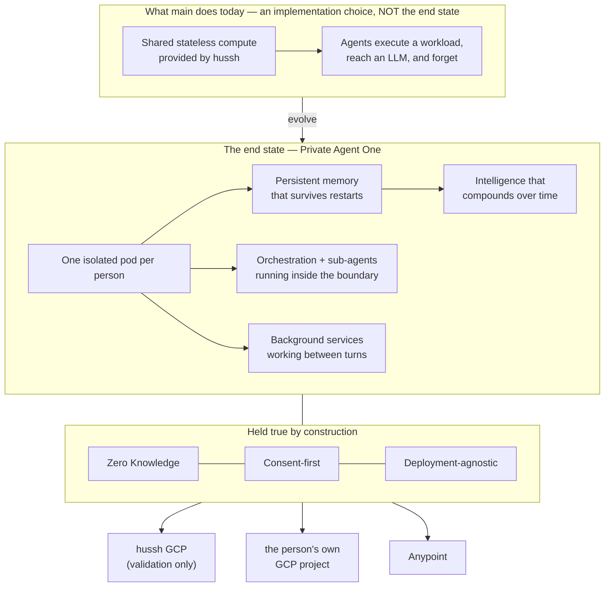

# Private Agent One — the architectural north star

**Founder directive, 2026-08-06.** This is the single architectural source of truth for
the Private Agent workstream. Every plan, persona, harness, diagram, wiki article and
runbook inherits it **by pointer** — cite this file rather than restating it, so there is
one place to change when the vision sharpens.

Where an existing implementation diverges from what is written here, the implementation is
what moves. Do not optimise around the current implementation.

## Visual Map

## The end state, stated plainly

**Every person owns an isolated pod.** Inside it runs their complete agent ecosystem —
Agent One, every sub-agent, the orchestration between them, and the background services
that keep working between conversations. It holds **persistent memory** that survives
restarts, and its intelligence **continuously evolves** as it learns that person's world.

From the person's side it behaves exactly as `main` does today. From the system's side it
is theirs, not ours.

Zero Knowledge and consent-first are not features layered on top. They are the properties
the architecture exists to preserve, and no capability ships that weakens them.

### What the stateless environment was, and was not

The shared stateless compute on `main` let agents execute workloads and reach an LLM. It
was a scaffold — a way to make the product work before pods existed. **It was never the
destination.** Statelessness is precisely what a private agent cannot be: an agent with no
memory cannot compound, cannot learn a person, cannot work between turns.

Any design that reintroduces "the agent forgets between requests" is a regression against
this document, however elegant its other properties.

> **Recorded correction (2026-08-06).** An earlier architectural analysis in this
> workstream recommended moving toward attested *stateless* workers, reasoning from
> Apple's Private Cloud Compute. That recommendation was aimed at the wrong target and is
> **withdrawn**. Its one durable finding survives and is adopted below: **attestation and
> statelessness are separable.** PCC bundles them; we need only the first. Per-person,
> *stateful*, continuously-evolving pods with per-pod cryptographic identity is the
> coherent architecture — and it is the one that closes the identity gap without giving up
> persistence.

## The deployment matrix (founder directive, 2026-08-06)

Deployment target and model credential are **two independent axes**, and the platform must
support the cells below. Provisioning the person's agent after their AI key is connected is
a **required implementation** on the hussh-managed pod *and* on Anypoint — not a hussh-GCP-
only path with the others deferred.

| Deployment target | Model credential |
|---|---|
| The person's **own GCP project** | their own Vertex ADC, **or** hussh Vertex ADC |
| **hussh-managed pod** | hussh Vertex ADC, **or** the person's own AI key |
| **Anypoint** | the person's own AI key, **or** hussh Vertex ADC |

**Correction, same day.** An earlier revision of this section claimed "the seam already
exists and is the right one," citing `runtime_providers/factory.py`. That is **one axis
off** and the error is worth keeping visible, because it would send an implementer to the
one file that does not need changing.

`factory.py`'s orthogonality is **provider × credential** — Gemini / Anthropic / OpenAI
against ADC / BYOK — and it is genuine. The seam this matrix needs is **target ×
credential**, and it does not exist. Credential mode is currently *coupled* to deployment
target: `_managed_genai_auth_mode` gates on `HUSHH_DEPLOY_ENV`, and `_vertex_project` falls
back to `google.auth.default()`, which bakes in an ambient-Google-identity assumption.

**The real gap is that neither axis is expressible per person.** Both are process-wide
environment variables. `PodSpec` — the one per-user object that crosses the backend seam —
carries neither, and `resolve_compute_backend()` is called with no argument at all three
production call sites. The registry column records what happened; it never decides
anything. So the first change is not credentials or IAM: it is putting both axes on
`PodSpec` and on a per-user column, after which the rest becomes possible.

**This supersedes standing decision D1** ("pods are BYOK-only for now", bound to
`pod_managed_model_enabled`). Managed-model pods are in scope. D1's reasoning — that BYOK
keeps the pod service account zero-role — does not disappear, and it is now a *constraint
on how* a managed cell is built rather than a reason not to build it.

Every cell must preserve the Private Agent properties: the person's holdings stay isolated
and sealed, consent is still required and revocable, and the choice of cell is visible to
the person rather than an invisible operator setting.

### Two constraints on how a managed cell is built

Both come from measured facts, not caution.

**Do not grant `roles/aiplatform.user` to the pod service account.** Verified live in
`hushh-pda-dev`: that account appears in **zero** project IAM bindings — the zero-role
property is real, not aspirational. It is also **fleet-shared**, so a project-level grant
hands every pod the same Vertex access at once and spends the isolation property
permanently. Per-pod service accounts do not rescue it either: the measured
service-account ceiling is **100 per project**, ten times tighter than the 1000-service
Cloud Run ceiling already named as a sharding trigger, with a 10/minute creation limit that
would make burst provisioning fail somewhere nobody tests.

The shape that works instead is a **turn-bounded credential**: the hub mints a short-lived
Vertex access token and passes it through the relay exactly as a BYOK key travels today.
The pod holds no refreshable credential, the pod service account stays at zero roles, and
the same mechanism serves Anypoint — where ambient ADC is impossible — with no additional
design.

**Never render a hussh service-account key into a runtime hussh does not operate.** For
Anypoint that would be a standing credential in someone else's cloud, and it is the one
construction in this matrix that is a security problem rather than an engineering gap. The
existing parity guard blocks the literal forms; a base64 blob under a neutral key name
would slip past it, so this is stated here as doctrine rather than left to the test.

## Deployment-agnostic is a first-class requirement

The hussh-managed GCP environment exists **purely to validate this architecture**. It is a
simulator for the complete production environment — orchestration, deployment, scaling,
synchronisation, upgrades, recovery, backups, performance, and end-to-end interaction.

It is not the product. The same platform must later run:

| Target | Purpose |
|---|---|
| hussh-managed GCP | validation and simulation only |
| the person's **own** GCP project | they own the compute |
| **Anypoint** | enterprise / partner deployment |

**By configuration, never by architectural change.** This is the test to apply to any
proposed design: *does moving this pod to someone else's project require editing code, or
setting values?* If it requires editing code, the design is wrong.

Practical consequences that follow, and are therefore requirements rather than nice-to-haves:

- No control-plane detail may be baked into a pod image. Configuration arrives at runtime.
- Pod state is **portable** — encrypted, exportable, restorable into a different project.
- Identity is derived from the workload, not borrowed from the hosting platform. A pod
  must be able to prove which pod it is somewhere hussh does not own the IAM.
- Every backend seam (`ComputeBackend`, storage, key custody) stays substitutable.

## The six requirements, restated against this vision

Isolation, authority, identity, capability, portability, economics — the same
decomposition, now scored against persistent per-person pods rather than a stateless fleet.

| Requirement | What the vision demands | Current state |
|---|---|---|
| **Isolation** | one person's holdings unreachable from another's | met — separate service, no shared credential, zero-permission identity |
| **Authority** | consented, scoped, revocable, non-repudiable | partial — primitive strong, body empty, signing symmetric, primary audit chain unshipped |
| **Identity** | the pod proves *which* person's agent it is, in any project | **absent** — fleet-shared service account proves only "a pod" |
| **Capability** | the full agent ecosystem runs *inside* the pod | **absent** — 2 of 12 tools succeed; specialists depend on a database the pod deliberately cannot reach |
| **Persistence** | memory survives restarts and compounds | **absent** — agent memory is an in-process list, erased every restart |
| **Portability** | same platform, three targets, by configuration | **absent** — config baked into the image |
| **Economics** | cost per person far below value per person | at risk — warm tier is the default |

Note the change from the previous framing: **persistence is now a named requirement.** It
was not one when the target was a stateless fleet, which is exactly how it went missing.

## What this changes about the work

1. **Pod-native persistent memory is on the critical path**, not deferred. An agent that
   forgets is not the product. `PodPkmStore` / `PodCommitLog` exist; agent memory does not
   use them.
2. **Specialists must be re-homed into the pod**, not proxied to the hub indefinitely. A
   pod that forwards every specialist call to a central database is a thin client with a
   local model — an acceptable *transitional* step, never the destination, and it must be
   labelled as transitional wherever it appears.
3. **Per-pod cryptographic identity replaces the fleet-shared account.** This is the gate
   on any cohort larger than the team, and on deployment into a project hussh does not own.
4. **Economy tier becomes the default.** Persistence must not require a warm instance;
   state lives outside the container so scale-to-zero costs nothing but a cold start.
5. **The hussh GCP environment is measured as a simulator.** Its job is to prove upgrades,
   recovery, backup, sync and scale work — not to be the place the product lives.

## Open questions this document does not yet answer

Raised by the lanes that inherit it, on the first cycle after it was written. Recorded
here rather than resolved silently, because seven lanes each guessing differently is the
drift this file exists to prevent.

**Q1 — RESOLVED (founder, 2026-08-06). Can a hussh-managed pod hold a durable key at all?**
`pod_self_registration.py` defines *durable* as storage only that pod's runtime can read,
naming the **user's** project or attested sealed storage — neither of which exists on
hussh-managed GCP. Read strictly, that made persistence unvalidatable on the exact
environment designated as the simulator.

**The resolution is to simulate the full hussh-managed pod lifecycle: keep the pod alive,
chain intelligence across turns and restarts, and validate how the agent evolves over
time.** The simulator's job is to prove *evolution*, not merely that a key survives. So a
hussh-managed pod holds a durable key to make that simulation real, and the thing being
validated is the compounding — continuity across restart, knowledge from an early turn used
much later, and quality that does not decay over a long horizon.

Two consequences worth stating, because they are what make this honest rather than a
loophole:

- The claim the simulator earns is **"the lifecycle works"**, not "hussh cannot read this
  pod." On hussh-managed compute, hussh operates the environment. Sovereignty is the
  customer-owned targets; the hussh tier proves the machinery.
- **"The agent evolved" must be an assertion, not a vibe.** A long-horizon run that nobody
  measures is a soak test with good intentions. It needs a metric, negative controls, and
  an observed recall *tool call* — a model can produce a plausible answer by guessing, and
  only the tool call proves it remembered.

**Q2 — Economy-tier-by-default and background-services-between-turns are in tension.** A
pod at `minScale=0` has no process to run background work in. Asserting both without
reconciling them means one lane builds an always-on loop and another builds a scheduler,
both citing this file.

*Working answer:* between-turn work is **event-woken**, not resident. The BYOC bootstrap
already designs exactly this shape. An always-on loop is not the intended reading.

**Q3 — Is "one isolated pod per person" a required implementation or a required
property?** The two readings differ by an order of magnitude in economics, because a
service per person carries a hard platform ceiling that scale-to-zero does **not** relieve
— the quota counts services, not instances, so a sleeping pod holds a slot exactly like a
warm one. The only lever that removes the ceiling is the person's own project, which
reframes BYO-Compute from a sovereignty tier into **the scale path**.

*Not answered here.* It needs a founder decision, and it should be made against a measured
cost-per-person rather than an estimate.

## How to use this file

- **Plans and personas** cite it by pointer, per `AGENTS.md`. Do not copy it into a prompt.
- **Any design review** asks two questions of the proposal: *does the agent still remember?*
  and *does this move to another project by configuration alone?*
- **When something in the repo still reflects the stateless scaffold** where it should not,
  evolve it and say so in the commit — the divergence is the finding.

## Sources

- Founder directive, 2026-08-06, realigning execution with the intended architecture.
- Companion records: the plan of record and the interface-to-agent routing map in this same directory; the dev fast-lane runbook in `docs/reference/operations/`.
