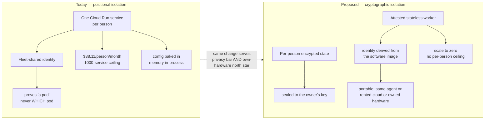

# Private Agent One — plan of record

**Dated 2026-08-06.** Specific enough to be wrong in public, which is the point. The
narrative version of this analysis is written for a wider audience; this file is the
operating record: the decisions, the ledger, and what is deliberately not being built.

Supersedes nothing. Sits alongside
[`interface-to-agent-routing.md`](./interface-to-agent-routing.md) (what reaches an agent
today) and the dev fast-lane runbook (why the fleet is empty).

## Visual Map

## The ledger

Readings of the code and the live environment, not of the documentation. The two
disagreed, which is how several of these were found.

| Requirement | State | Evidence |
|---|---|---|
| **Isolation** — one person cannot reach another | met | Separate service, no database credential, no shared data key, zero-permission runtime identity. |
| **Authority** — consented, scoped, revocable, audited | primitive met, body empty | Signed/expiring/revocable grants with a chained tamper-evident ledger. But `_first_party_authority` carries `invocation_capabilities` only, so `require_attenuated_authority(information=True)` refuses. |
| **Identity** — which agent is acting | **absent** | Every pod runs as the same service account. A verified call proves *a* pod is calling, never which. |
| **Capability** — it does useful things | **absent** | 2 of 12 tools succeed. 3 specialists refuse before doing work — on the hub, today. |
| **Portability** — runs on hardware the person owns | **absent** | Configuration baked into the image; agent memory in-process, erased on restart. |
| **Economics** — cost far below value | at risk | $38.11/person/month warm before inference. The economy tier exists and is not the default. |

**Measured, 2026-08-04 → 08-06:** cold start 3.94 s · idle 211.9 MB · 58% of boot in
framework import · 1000 services per project per region · gate 1426 passing.

**Never happened:** no pod has served a turn, in any environment, for anyone.
`personal_agent_registry` has never been created in dev.

## The finding that reorders the work

We bought **isolation** by spending **identity, portability and economics**. A
service per person is a legible way to get a blast radius of one — but it costs a hard
platform ceiling, a standing monthly charge per person, a cold start each, and it *still
does not yield identity*, because a fleet sharing one credential cannot prove which member
is calling.

We paid the full price of per-person infrastructure and did not receive the property that
price was meant to buy.

This is architectural, not a longer backlog.

### What the published answers do

- **Apple's Private Cloud Compute** does not give each person a server. A shared
  **stateless** fleet, trust from **attestation** of the exact software build, a public
  transparency log the client checks before sending anything, and no privileged runtime
  access. A stronger guarantee than ours, from a cheaper topology.
- **Google's building blocks** solve the same shape: confidential computing with an
  attestation token bound to the image; **SPIFFE/SPIRE** for per-workload cryptographic
  identity — precisely the fix for our weakest link; workload identity federation to
  remove long-lived keys.

### Why this serves the own-hardware north star rather than fighting it

What makes a workload portable is what makes it attestable: stateless compute, encrypted
state held outside it, identity derived from the software rather than from where it runs.
A pod built that way runs on rented cloud today and owned hardware tomorrow, unchanged.
A pod built as ours is cannot move at all.

**Decision D3 (proposed, reversible):** keep the per-person *boundary* as the product
promise; stop implementing it as a per-person always-on service. Make the boundary
cryptographic rather than positional. Honest cost: a real rework of the compute layer, on
the order of a quarter, and the loss of the simplest mental model.

## The method problem, and the practice that replaces it

Six subsystems passed their tests and had never executed: pod provisioning, pod healing,
the provisioning retry, A2A delegation, the liveness sweep, the registry drift check.

**Shared shape:** *a test written against a call site rather than against the thing it
calls passes for exactly as long as both are wrong together.*

**Root cause:** breadth before first light. Five phases landed before any pod served any
turn, so the only available feedback was feedback we constructed, and constructed feedback
converges on what we already believe.

**Second habit:** verification by proxy. Flags present → healthy. `Ready=True` → serving.
Deploy green → working. Each is a real signal about something; none is a signal about
whether a person's agent answered a question.

**The checks that held, every time,** were the ones metadata cannot satisfy: run the real
entry point and assert something was genuinely scheduled; read the roster from disk rather
than a typed list; print the true exit code, not the wrapper's; **break the guard on
purpose and confirm it fails.** A guard never seen to fail is not a guard. Three times
this week a background process reported success over a failed gate; echoing the real exit
code caught all three.

## Sequence

Small focused team, no mid-phase direction change.

| Phase | Outcome | Cost |
|---|---|---|
| **0** | **First light** — one real person's agent answers one real grounded question, observed. | days; ~0 eng (gated on a dispatch and a real account) |
| **1** | **One capability, flawless** — grounded conversation over the person's own records. Authority body filled, data path working, honest copy at every state. | 4–8 weeks |
| **2** | **Identity that means something** — attested workload identity. Gate on every cohort larger than the team. | 6–10 weeks |
| **3** | **Lifecycle and portability** — encrypted portable state, versioned backups, restore, upgrade, teardown. | 8–12 weeks |
| **4** | **Parity, then commerce** — remaining capabilities re-homed inside the boundary, then payments on the consent primitive. | 3–6 months |

**9–15 months** to a product worth the name — and the number is the least useful part.
The dominant variable is **scope discipline**, not throughput. Nine capabilities that
partly work is not ninety percent of a product; it is zero, because a person who hits a
refusal on the one thing they came for does not care that eight other refusals were
available. **The product is not blocked on engineering. It is blocked on choosing.**

## Commerce — the prerequisite that is not negotiable

A payment authorisation and a consent receipt are the same object. Agent-payment
standards model authorisation as a signed, verifiable mandate — what the human agreed to,
bound to a specific transaction, presentable later as proof. That is what PCHP grants
already are. The work is to **project the primitive we have** into the format the rails
expect, not to bolt a second authorisation system alongside it.

**Hard prerequisite.** The gate that authorises an agent to *act* rather than read
currently accepts any non-empty string as its confirmation of human intent
(`require_attenuated_authority`, truthiness-only on `confirmation_receipt`). Not
exploitable today — nothing in production can reach it — but a payment is exactly an act,
and commerce is the feature that lights that gate up. A proper receipt already exists in
this codebase (`PkmConfirmationReceiptV2`: subject binding, plan/domain/scope match,
single-use `consume()`). **Rebuild the action gate to that standard before one cent moves
through it.** Before, not alongside.

## Standing decisions

- **D1** — pods are BYOK-only for now, bound to `pod_managed_model_enabled`. Reversible.
- **D2** — durability by hub configuration, not new queue infrastructure. Reversible.
- **D3** — cryptographic rather than positional isolation (above). **Proposed**, needs
  founder sign-off; it changes the compute layer and the IAM posture permanently.

## Not being built yet, deliberately

The list of what we are not doing is the plan. Pod-type chooser · autonomous learning
loop · dashboard insights · BYO-GCP and Anypoint live paths · prompt-sync client half ·
per-capability readiness events · reaping (structurally unreachable today) · anything
requiring a cohort larger than the team, which is blocked on Phase 2.

## The eight actions

1. **First light this week.** One dispatch, one real account, one answered question,
   observed rather than inferred. Nothing else here is worth starting first.
2. **Stop verifying by proxy.** Every "it works" cites a real artifact — a served
   response, a genuine exit code, a row that changed. Every new guard is broken once on
   purpose to prove it fails.
3. **Choose the one capability**, and write down publicly what is deliberately deferred.
4. **Fill the authority body on the hub first**, where the failure is observable. Three
   specialists become real the moment it lands. Never copy authority fields from a
   request body.
5. **Commit to attested identity** as the replacement for the shared credential; treat
   every cohort beyond the team as blocked on it.
6. **Make the economy tier the default**, warm a choice, so the cost curve is not a
   surprise at the moment it matters.
7. **Rebuild the action gate** to the receipt standard already in the codebase, before
   any commerce work begins.
8. **Keep this ledger current.** It is the only document that would have prevented any
   of the six.

## Sources

- Live reads of `hushh-pda-dev` and the deploy history, 2026-08-04 → 2026-08-06
- `consent-protocol/hushh_mcp/one_adk/agent_tree.py`, `adk_bridge/contract.py`, `adk_bridge/dispatch.py`
- `consent-protocol/api/routes/one/pod_identity_auth.py`, `pod_turn.py`, `pod_relay.py`
- `consent-protocol/hushh_mcp/services/pkm_mutation_contracts.py` — the receipt standard
- `docs/future/personal-agent/POD-HUB-DATA-PATH.md` — the pod↔hub design of record
- Apple, *Private Cloud Compute* security architecture (public documentation)
- Google Cloud confidential computing and workload attestation; SPIFFE/SPIRE workload identity (public specifications)
