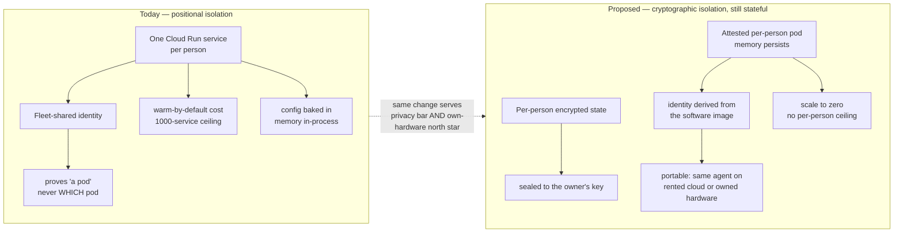

# Private Agent One — plan of record

**Dated 2026-08-06.** Specific enough to be wrong in public, which is the point. The
narrative version of this analysis is written for a wider audience; this file is the
operating record: the decisions, the ledger, and what is deliberately not being built.

**Inherits [`private-agent-north-star.md`](./private-agent-north-star.md) by pointer.**
That file is the architecture; this one is the execution record against it. Where the two
disagree, the north star wins and this file is wrong.

Sits alongside [`interface-to-agent-routing.md`](./interface-to-agent-routing.md) (what
reaches an agent today) and the dev fast-lane runbook (why the fleet is empty).

## Visual Map

## The ledger

Readings of the code and the live environment, not of the documentation. The two
disagreed, which is how several of these were found.

| Requirement | State | Evidence |
|---|---|---|
| **Isolation** — one person cannot reach another | met | Separate service, no database credential, no shared data key, zero-permission runtime identity. |
| **Authority** — consented, scoped, revocable, audited | partial | Signed, scoped, expiring, revocable with immediate fail-closed revocation — genuinely good. But `_first_party_authority` carries `invocation_capabilities` only, so `require_attenuated_authority(information=True)` refuses; signing defaults to **HMAC**, not Ed25519; and the chain over the **primary** consent ledger is parked and flag-off. See the commerce section. |
| **Identity** — which agent is acting | **absent** | Every pod runs as the same service account. A verified call proves *a* pod is calling, never which. |
| **Capability** — it does useful things | **absent** | 2 of 12 tools succeed. 3 specialists refuse before doing work — on the hub, today. |
| **Persistence** — memory survives restarts and compounds | **absent** | `PodMemoryStore._records: list[SealedMemory] = []` (`pod_memory_service.py:230`), erased on every restart — proven with a two-process probe, not inferred. `PodPkmStore` / `PodCommitLog` are durable, correct, and called by nothing in the agent runtime. **Five independent breaks:** no write trigger, no recall tool, no durable substrate, no runner in a pod that carries a memory service, and no configuration rendered to reach any of it. |
| **Portability** — runs on hardware the person owns | **absent** | The pod *image* is clean — `Dockerfile.pod` bakes nothing control-plane-specific. The coupling is in the renderer and the deploy script: registry, hub URL, Vertex coordinates and the runtime identity are read from the hub's own ambient environment, and the pod service account is set on the dev lane only. |
| **Economics** — cost far below value | at risk | Warm tier is the default and costs real money per person per month before any inference. The economy tier exists and is not the default. **See the cost-figure caveat below.** |

**Measured, 2026-08-04 → 08-06:** cold start 3.94 s · idle 211.9 MB · 58% of boot in
framework import · 1000 services per project per region · gate 1426 passing.

**Cost-figure caveat (correction, 2026-08-06).** An earlier revision of this file stated
**$38.11/person/month** alongside those measurements, which implied it was one of them. It
is not. It was arithmetic over published Cloud Run rates for the chosen 500m/1Gi warm
shape, done in-session, with no derivation committed anywhere and no billing export to
check it against. The only cost figure that exists **in the code** is
`gcp_backend.py` — *"~$65/user/month"* at Cloud Run's own 1 vCPU / 512 MiB defaults, cited
as the reason sizing is chosen explicitly rather than inherited.

Treat the per-person cost as **unverified**. It belongs in the same category as the
`PLAID_ENV` question: a live read nobody has taken. The right fix is a committed
derivation script or a billing-export reading, not a tidier number — and until one exists,
"warm-by-default costs real money per person" is the honest form of the claim. Mixing an
estimate into a list of measurements is exactly the proxy-verification failure this
document is about.

**Never happened:** no pod has served a turn, in any environment, for anyone.
`personal_agent_registry` has never been created in dev.

## The finding that reorders the work

We bought **isolation** by spending **identity, portability and economics**. A
service per person is a legible way to get a blast radius of one — but it costs a hard
platform ceiling, a standing monthly charge per person, a cold start each, and it *still
does not yield identity*, because a fleet sharing one credential cannot prove which member
is calling.

We paid the full price of per-person infrastructure and did not receive the property that
price was meant to buy.

This is architectural, not a longer backlog.

### What the published answers do

- **Apple's Private Cloud Compute** does not give each person a server. A shared
  **stateless** fleet, trust from **attestation** of the exact software build, a public
  transparency log the client checks before sending anything, and no privileged runtime
  access. **We adopt the attestation and reject the statelessness** — the two are
  separable, PCC bundles them, and an agent that forgets cannot compound. See
  [the north star](./private-agent-north-star.md) § *What the stateless environment was,
  and was not*.
- **Google's building blocks** solve the same shape: confidential computing with an
  attestation token bound to the image; **SPIFFE/SPIRE** for per-workload cryptographic
  identity — precisely the fix for our weakest link; workload identity federation to
  remove long-lived keys.

### Why this serves the own-hardware north star rather than fighting it

What makes a workload portable is what makes it attestable: **encrypted state held outside
the container**, and identity derived from the software rather than from where it runs. A
pod built that way runs on rented cloud today and owned hardware tomorrow, unchanged. A pod
built as ours is cannot move at all.

Note carefully what survives here and what does not. "Encrypted state held outside the
container" is **correct and load-bearing** — it is the same claim the north star makes, and
it is what lets a pod scale to zero without amnesia. "Stateless compute" was the error, and
deleting the whole sentence would have thrown away the finding along with it.

**Decision D3 (revised 2026-08-06, reversible):** keep the per-person *boundary* as the
product promise **and keep it stateful**. Make the boundary **cryptographic rather than
positional** — per-pod attested identity, with persistent state sealed outside the
container so it survives restarts and moves between projects.

The original D3 proposed replacing per-person services with attested *stateless* workers.
The founder directive of 2026-08-06 withdrew that half; the north star records the
withdrawal. What remains is the identity half, which was always the stronger part.

## The method problem, and the practice that replaces it

Six subsystems passed their tests and had never executed: pod provisioning, pod healing,
the provisioning retry, A2A delegation, the liveness sweep, the registry drift check.

**Shared shape:** *a test written against a call site rather than against the thing it
calls passes for exactly as long as both are wrong together.*

**Root cause:** breadth before first light. Five phases landed before any pod served any
turn, so the only available feedback was feedback we constructed, and constructed feedback
converges on what we already believe.

**Second habit:** verification by proxy. Flags present → healthy. `Ready=True` → serving.
Deploy green → working. Each is a real signal about something; none is a signal about
whether a person's agent answered a question.

**The checks that held, every time,** were the ones metadata cannot satisfy: run the real
entry point and assert something was genuinely scheduled; read the roster from disk rather
than a typed list; print the true exit code, not the wrapper's; **break the guard on
purpose and confirm it fails.** A guard never seen to fail is not a guard. Three times
this week a background process reported success over a failed gate; echoing the real exit
code caught all three.

## Sequence

Small focused team, no mid-phase direction change.

| Phase | Outcome | Cost |
|---|---|---|
| **0** | **First light** — one real person's agent answers one real grounded question, observed. | days; ~0 eng (gated on a dispatch and a real account) |
| **1** | **One capability, flawless** — grounded conversation over the person's own records. Authority body filled, data path working, honest copy at every state. | 4–8 weeks |
| **2** | **Identity that means something** — attested workload identity. Gate on every cohort larger than the team. | 6–10 weeks |
| **3** | **Lifecycle and portability** — encrypted portable state, versioned backups, restore, upgrade, teardown. | 8–12 weeks |
| **4** | **Parity, then commerce** — remaining capabilities re-homed inside the boundary, then payments on the consent primitive. | 3–6 months |

**9–15 months** to a product worth the name — and the number is the least useful part.
The dominant variable is **scope discipline**, not throughput. Nine capabilities that
partly work is not ninety percent of a product; it is zero, because a person who hits a
refusal on the one thing they came for does not care that eight other refusals were
available. **The product is not blocked on engineering. It is blocked on choosing.**

## Commerce — money already moves, and this is now item one

**Correction to an earlier draft of this file, and to the published narrative.** Commerce
was treated as Phase 4. It is not a future phase. A funds-transfer rail exists and is
wired end to end — ACH between a person's bank and their brokerage account
(`api/routes/kai/plaid.py` → `broker_funding_service.py`, Plaid Transfer + Alpaca). It has
been there throughout.

**One precision, because overclaiming here would be its own failure.** `PLAID_ENV`
defaults to `sandbox` (`integrations/plaid/config.py`). Whether the deployed production
environment sets it to `production` was **not verified** — that is a live-runtime read, not
a code read. So the honest statement is: *the integration is real and its authorisation is
not transaction-bound.* Whether real dollars are moving through it today is the first
thing to check, with `scripts/ops/verify-env-secrets-parity.py` against the live service,
and it changes the urgency but not the fix.

### The gap, precisely

`POST /plaid/transfers/create` is gated by exactly one control:
`require_consent_scope("brokerage.transfer.write")` (`api/middleware.py`), which validates
signature, expiry, revocation and scope — **and nothing else**. Amount, direction and
destination account arrive in the request body, unbound to the token. Consequences:

- One `brokerage.transfer.write` token authorises **any amount, to any linked account, for
  up to 7 days** (`DEFAULT_CONSENT_TOKEN_EXPIRY_MS`).
- `vault.owner` satisfies it as a super-scope (`consent/scope_helpers.py` — "master key
  grants everything").
- `ActionDirectiveStore` is not involved: zero references to it in
  `broker_funding_service.py`.

**Authorisation must be bound to the transaction, not to a category of transaction. A
permission that does not name the amount is a standing permission, whatever its expiry
says.**

### We already built the fix and did not connect it

`hushh_mcp/services/action_directive_ledger.py` — **shipped** (migration `114` is in
`db/release_migration_manifest.json`). A four-state machine:
`issued → confirmed → consumed → settled`, each transition an atomic conditional UPDATE.
`issue()` HMACs the action contract and slots *before* the human sees it; TTL clamped
30–300 s. `confirm()` mints a receipt and stores only its hash. `consume()` requires the
receipt hash **and** `state='confirmed'` — a second call finds no row and raises. That is
genuine single-use replay protection. `settle()` records the terminal status.

Propose → authorise → capture → settle. **That is a payment mandate lifecycle, complete,
in production, and unused by the one route that moves money.**

Note this corrects an earlier recommendation in this file: `PkmConfirmationReceiptV2` has
excellent *binding* (subject, plan, domain, scope, timestamp window) but **no `consume()`
and no persistence**, so within its 7-day window it replays indefinitely.
`ActionDirectiveStore` is the right primitive; `PkmConfirmationReceiptV2` is the right
*shape* for its payload.

### Ordered fix

1. **Bind `create_transfer` to a directive.** Add `directive_id` + `receipt` to the
   request, call `consume()` before `create_transfer`, and put
   `{amount, currency, direction, funding_account_id}` in the HMAC'd `slots`. Amount
   binding, single-use and a 300-second window, from code that already ships.
2. **Call `settle()` on the terminal transfer states** — `broker_funding_service.py`
   already computes them. The directive ledger then *is* the mandate-to-settlement trail,
   with no new table.
3. **Then** the A2A action gate: `require_attenuated_authority` is truthiness-only on
   `confirmation_receipt` (`adk_bridge/contract.py`). Unreachable today because
   `_first_party_authority` never populates it — but it is the gate an agent would spend
   through. Make it carry `(directive_id, receipt)` and call `consume()`.
4. **Turn on asymmetric signing** (`token_signing.py` is complete; issuance defaults to
   HMAC). Under HMAC the issuer can forge any past authorisation — fatal for
   non-repudiation on a payment.
5. **Un-park `904_consent_audit_receipts.sql` and default `CONSENT_AUDIT_CHAIN_ENABLED`
   on.** See the correction below.

### Correction: the primary consent ledger is not chained in production

An earlier claim in this workstream — that the consent audit ledger is chained and
tamper-evident — is **half true and the wrong half ships**.

- `fabric_receipts_service.py` — real, chained, in the **release** manifest (migration
  `119`). Covers **fabric grants only**.
- `consent_audit_chain_service.py` — the chain over the **primary** `consent_audit`
  ledger. Migration is **parked** (`parked/904`), which
  `db/dev_migration_manifest.json` states is "never applied in UAT or production", and
  `CONSENT_AUDIT_CHAIN_ENABLED` defaults **False**.

The service's own docstring is candid: `consent_audit` "is mutable and unchained: a silent
edit or delete of an audit row is not detectable." **AU-9/AU-10 non-repudiation is not met
for consent events.** A payment mandate written to a mutable ledger is not a mandate.

### Absent, and blocking for third-party funds (not for fixing the above)

No identity verification of our own user (the "KYC" surfaces are the agent *responding to*
a third party's request, not verifying us) · no AML or sanctions screening · no
double-entry accounting. Operational hygiene on the existing rail is good — DB-enforced
idempotency keys, a status machine, reconciliation, encrypted access tokens — and the
regulated-entity boundary is correctly delegated to the broker-dealer.

### Candor — copy that outruns code, fix today

1. `hushh-search-console/src/app/commerce/page.tsx` states payments are consent-gated,
   purpose-bound, "no standing access." `src/app/api/commerce/checkout/route.ts` contains
   **zero** consent or token references. Either make it true or remove the claim.
2. `hushh-search-console/public/.well-known/agent.json` lists **AP2** and **UCP** under
   protocols spoken, with no status qualifier. Neither repo contains an implementation of
   either. The human-facing page correctly labels them `roadmap`; the **machine-readable**
   manifest does not, and other agents parse that file.
3. "Ships now" on service payments and subscriptions — both return **501** without keys.
   Say "built, not activated."

Worth preserving as the model: the backend's own comments are markedly more honest than
the marketing surface (`marketplace_information_service.py`: "there is NO payment rail
yet… `accrued_cents` is always 0"; `agent_tree.py`: "that emptiness is the honest
boundary"). The standard already exists internally; it has not reached the front door.

## Standing decisions

- **D1** — ~~pods are BYOK-only for now~~ **SUPERSEDED 2026-08-06** by the deployment
  matrix in [the north star](./private-agent-north-star.md). Managed-model pods are in
  scope on all three targets. D1's *reasoning* survives as a constraint: BYOK is what kept
  the pod service account at zero roles, and a managed cell must preserve that — which is
  why the shape is a turn-bounded token rather than an IAM grant.
- **D2** — durability by hub configuration, not new queue infrastructure. Reversible.
- **D3** — **revised 2026-08-06.** Cryptographic rather than positional isolation, and
  **stateful**. The original proposed attested *stateless* workers; the founder directive
  withdrew that half and the north star records the withdrawal. Still needs sign-off: it
  changes the compute layer and the IAM posture permanently.
- **D4** — the deployment/credential choice must be **per person**, carried on `PodSpec`
  and a registry column, not resolved from process-wide environment. This is the
  prerequisite for the matrix and is the smallest change in the set. Not yet implemented.

## Not being built yet, deliberately

The list of what we are not doing is the plan. Pod-type chooser · autonomous learning
loop · dashboard insights · BYO-GCP and Anypoint live paths · prompt-sync client half ·
per-capability readiness events · reaping (structurally unreachable today) · anything
requiring a cohort larger than the team, which is blocked on Phase 2.

## The actions

1. **First light this week.** One dispatch, one real account, one answered question,
   observed rather than inferred. Nothing else here is worth starting first.
2. **Stop verifying by proxy.** Every "it works" cites a real artifact — a served
   response, a genuine exit code, a row that changed. Every new guard is broken once on
   purpose to prove it fails.
3. **Choose the one capability**, and write down publicly what is deliberately deferred.
4. **Fill the authority body on the hub first**, where the failure is observable. Three
   specialists become real the moment it lands. Never copy authority fields from a
   request body.
5. **Commit to attested identity** as the replacement for the shared credential; treat
   every cohort beyond the team as blocked on it.
6. **Make the economy tier the default**, warm a choice, so the cost curve is not a
   surprise at the moment it matters.
7. **Bind the live money route to `ActionDirectiveStore`** so an authorisation names the
   amount and destination and can be used exactly once. This is item one on the
   engineering list; it was not on the list at all when this file was first drafted.
8. **Correct the commerce copy and the agent manifest** to match the code. An hour of
   work, and the only item here with a compliance consequence.
9. **Turn on Ed25519 issuance and the primary audit chain.** Both are built. Both are off.
10. **Keep this ledger current.** It is the only document that would have prevented any
   of the six — or this correction.

## Sources

- Live reads of `hushh-pda-dev` and the deploy history, 2026-08-04 → 2026-08-06
- `consent-protocol/hushh_mcp/one_adk/agent_tree.py`, `adk_bridge/contract.py`, `adk_bridge/dispatch.py`
- `consent-protocol/api/routes/one/pod_identity_auth.py`, `pod_turn.py`, `pod_relay.py`
- `consent-protocol/hushh_mcp/services/pkm_mutation_contracts.py` — the receipt standard
- `docs/future/personal-agent/POD-HUB-DATA-PATH.md` — the pod↔hub design of record
- Apple, *Private Cloud Compute* security architecture (public documentation)
- Google Cloud confidential computing and workload attestation; SPIFFE/SPIRE workload identity (public specifications)
