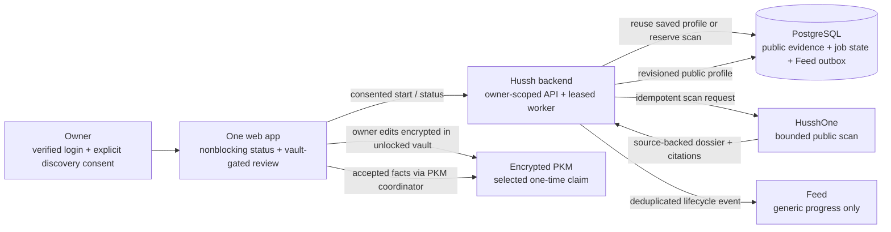

# Public Profile Discovery and One-time PKM Claim

This reference describes the implemented 100,000-profile release boundary. It is
not evidence that a hosted cohort, scanner credential, migration, or scheduler
has been enabled.

## Visual Map

## Current flow

After verified-phone onboarding, the setup hub offers an optional, explicit
one-time public-web search. Consent v2 discloses use of the account name,
account email, and any submitted search hints. The profile name, source-linked
findings, and public profile URL may be retained in the restricted pool for
future exact-profile matches; this release has no scheduled pool refresh or
self-serve pool deletion, including when the owner deletes their account.
Sending the verified phone number to HusshOne is a separate unchecked choice.
Optional name, email, public profile URL, employer, and city details help when
account identity information is incomplete. Discovery does not block setup or
vault creation. The setup hub and One home show the same persisted status, and a
ready profile opens a vault-gated review screen.

The owner sees source-linked facts, confidence, collection time, conflicts, and
warnings. The typed PKM preview is produced by the existing intelligence
proposal pipeline. Owner corrections remain separately labeled and travel only
inside the encrypted draft. The owner can select proposed PKM cards, reject
everything, or retry a partial save. Selected facts use the existing
`addToPKM` / `PkmWriteCoordinator` path with a stable per-review idempotency
scope. A successful save or reject-all makes the owner job terminal as
`claimed`; the public evidence pool is not updated by that choice.

## Persistence and authority

PostgreSQL migration 240 adds service-only public entities, exact public-profile
URL anchors, sources, revisioned findings, owner jobs, transition events, a Feed
outbox, and UTC daily acquisition counters. Opaque entity IDs are durable
references; the owner's public profile URL is the only exact reusable anchor
currently wired into retrieval. Optional email, employer, and city hints are
kept on the owner job only while search needs them, then cleared after a ready
profile, cancellation, a result without reviewable evidence, or an exhausted
retry budget. Name remains a matching/display anchor in the shared entity
pool. Job status does not expose search hints or the submitted URL; only the
owner sees the prepared profile.
The owner job is unique by user, and its `claimed` state cannot restart.

The shared public pool and worker routes are inaccessible to browser database
roles. Firebase auth scopes status and discovery operations to the caller.
Draft persistence and claim completion require the caller's memory-only
`VAULT_OWNER` token. Feed metadata carries only a closed lifecycle event and
generic status string; findings, URLs, and draft content stay out of Feed.

HusshOne remains the acquisition boundary. The root service uses its existing
`POST /api/v1/scan` and `GET /api/v1/scan/{scanId}` API, forwards the consent
version, and uses an idempotency key persisted before each scan-start request.
Jobs use PostgreSQL leases, `SKIP LOCKED`, bounded retries, a 45-minute scan
deadline, a four-job worker batch, and a default 1,000 scan-start daily cap.
An OIDC-only Cloud Scheduler drain is supplied for UAT; both the feature and
worker gates remain default off.

## Release gaps that remain explicit

- Retrieval reuses a saved profile only by exact canonical profile URL. A GIN
  full-text index exists for names, employer, and city, but name search and
  semantic candidate assessment are not yet connected to the service. The
  existing PostgreSQL instance's `pgvector` support has not been verified, and
  no embeddings are generated or queried. Same-name and recycled-phone
  disambiguation therefore still needs a production-quality identity-assessment
  step before broader cohort rollout.
- HusshOne's v1 completion response exposes a markdown dossier with
  `rich.evidence` empty. The backend converts source-ledger rows, or source-linked
  bullets when the ledger is absent, into bounded typed review findings; it
  keeps row-level URLs and stated confidence and asks for more details instead
  of opening an empty review.
- The current HusshOne response exposes a dossier and citations, not raw source
  documents. Migration 240 stores bounded typed findings parsed from the
  source-ledger output and its source references; it does not copy raw pages to
  Cloud Storage.
- No existing-record import has run. Unique entity counts, duplicate rates,
  provenance/reuse permission, and serialized-size distributions must be
  measured before any import. Account exports do not become shared public
  evidence by default.
- The 100,000-profile retrieval benchmark, 1,000-request/second capacity
  scenario, provider-cost measurement, ingestion-interference test, and p95/p99
  targets have not been run against a representative PostgreSQL instance.
  Current GIN storage and worker limits are implementation choices, not measured
  capacity claims.
- The claim endpoint trusts the authenticated owner client to report that all
  selected PKM writes succeeded. PKM writes themselves are protected and
  retry-safe through the existing coordinator; a backend-verifiable write
  receipt is not yet attached to the claim transition.

## UAT release sequence

1. Apply migration 240 through the governed database migration lane and verify
   the exact UAT schema contract.
2. Configure the HusshOne service credential only on the backend runtime. Set
   the dedicated UAT Cloud Scheduler identity, exact audience, and scheduler
   allowlist, then use `deploy/profile-discovery/setup_scheduler.sh` and verify
   the job metadata.
3. Keep both gates off until the database instance, scanner allowlist,
   small-cohort Firebase UID list, and rate limit are reviewed. Do not use a
   wildcard cohort.
4. Run privacy, owner-isolation, worker-recovery, duplicate-start, PKM retry,
   Feed deduplication, and RIA compatibility checks before enabling one test
   account.
5. Complete the 100,000-profile and 1,000-request/second benchmarks before
   increasing the cohort. Resize the existing database only from observed load.

There is no automatic personal refresh after a job reaches `claimed`. Any
future shared-pool cleanup or source refresh cadence is independent of owner
claim status.
