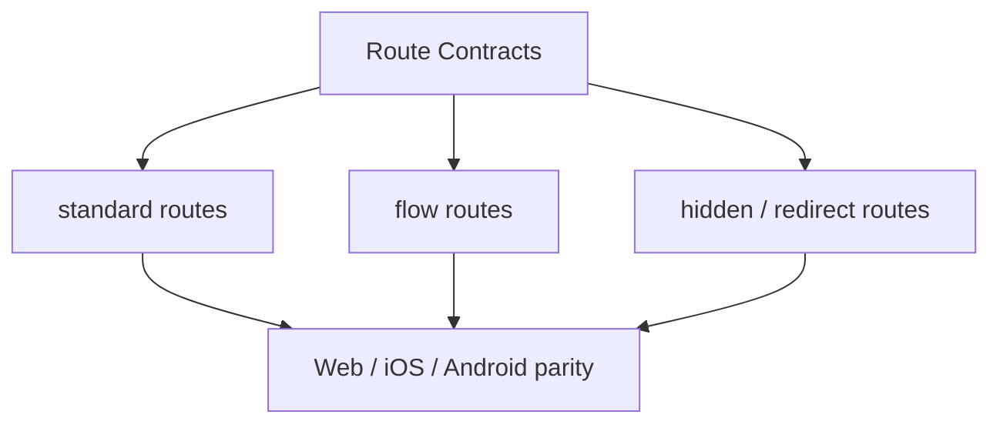

# Route Contracts

> Governance for Next.js proxy routes, native plugin parity, and app navigation truth.

## Visual Map

Hussh uses a code-owned route contract plus docs/runtime checks to keep the declared runtime surface aligned across:

- Next.js API route handlers under `hushh-webapp/app/api/**/route.ts`
- backend router prefixes and path families
- Capacitor TypeScript, iOS, and Android plugin surfaces
- mobile parity guidance for the visible page tree

For One Voice onboarding, middleware remains route protection and static
redirect infrastructure only. It cannot be the mutable journey planner because
it cannot reliably observe Firebase callback settlement or browser-local UI
state. The browser publishes the canonical redacted route state derived by
`deriveVoiceRouteScreen`; the generated action gateway and `/api/one/[...path]`
BFF validate and execute the permitted action. See
[One Voice Onboarding Journey](../one/one-voice-onboarding-journey.md).

Every physical page also has one required `voicePlaybook` in
`app-route-layout.contract.json`. The surface-map and route-index generators reject
missing, duplicate, structurally ambiguous, or action-incompatible entries. Playbooks
are prompt posture only; generated actions and their guards remain execution authority.

## Files

- Canonical app route source: `hushh-webapp/lib/navigation/routes.ts`
- Route governance reference: `docs/reference/architecture/route-contracts.md`
- Frontend/native surface mapper: `docs/reference/architecture/frontend-native-surface-map.md`
- Mobile parity reference: `docs/reference/mobile/capacitor-parity-audit.md`
- Docs/runtime verification:
  - `bash scripts/ci/docs-parity-check.sh`
  - `node scripts/verify-doc-runtime-parity.cjs`

## Canonical App Routes

Keep navigation documentation aligned with `hushh-webapp/lib/navigation/routes.ts`:

- `/`
- `/welcome?tab=<research|blog|developers>`
- `/login`
- `/register-phone`
- `/logout`
- `/agent`
- `/people/[personRef]`
- `/one/profile`
- `/one/profile/regulatory`
- `/one/profile/account`
- `/one/profile/account/phone`
- `/one/profile/preferences`
- `/one/profile/preferences/kai`
- `/one/profile/preferences/device`
- `/one/profile/preferences/gemini`
- `/one/profile/security`
- `/one/profile/security/vault`
- `/one/profile/security/session`
- `/one/profile/security/devices`
- `/one/profile/security/devices/authorize`
- `/one/profile/my-data`
- `/one/profile/my-data/domain?key=<domain_key>`
- `/one/profile/access`
- `/one/profile/access/connection?id=<connection_id>`
- `/one/profile/connected-systems`
- `/one/connected-systems`
- `/one/connected-systems/[systemId]`
- `/one/profile/gmail`
- `/one/profile/gmail/connection`
- `/one/profile/gmail/actions`
- `/one/profile/support`
- `/one/profile/support/routing`
- `/one/profile/support/compose?kind=<support_kind>`

`/people/[personRef]` is the deliberate exception: it is the sole canonical,
unguessable public person URL and cannot be reduced to a directory or a finite
identifier set. Web renders it server-side so invalid and suppressed profiles
produce a non-enumerating `404`. The Capacitor export emits one inert route
fixture so the shared dynamic client bundle is available; actual profile reads
use `ApiService.apiFetch` and never embed a real person reference at build time.
- `/one/profile/receipts`
- `/one/profile/gmail/oauth/return`
- `/one/connect`
- `/one/connect/settings`
- `/one/consent`
- `/one/feed`
- `/one/setup`
- `/one/setup/finance`
- `/one/setup/finance/import`
- `/one/setup/kai`
- `/one/setup/calendar`
- `/one/setup/[capability]`
- `/one/calendar`
- `/one/cards`
- `/one/gmail`
- `/one/email`
- `/one/kyc`
- `/one/location`
- `/one/location/map`
- `/one/location/check-in`
- `/one/location/check-in/hotel?stay=<opaque_stay_id>` — eligibility-gated and fail-closed until a supported hotel stay provider exists
- `/one/marketplace`
- `/marketplace`
- `/marketplace/ria`
- `/ria/profile`
- `/ria/onboarding`
- `/ria/clients`
- `/ria/picks`
- `/ria/requests`
- `/ria/settings`
- `/one/kai?tab=market`
- `/one/kai/news`
- `/one/kai/import`
- `/one/kai/plaid/oauth/return`
- `/one/kai/alpaca/oauth/return`
- `/one/kai?tab=portfolio`
- `/one/kai/portfolio/holdings`
- `/one/kai/portfolio/allocation`
- `/one/kai/portfolio/performance`
- `/one/kai/portfolio/sources`
- `/one/kai/analysis`

`/kai/optimize` and `/one/kai/optimize` are one-release compatibility
redirects to the canonical Portfolio tab. They are not product, native,
command, or voice surfaces.

Detail entrypoints that require an identifier use query-backed static routes so Capacitor export stays compatible:

- `/marketplace/ria?riaId=<ria_id>`
- `/ria/workspace?clientId=<investor_user_id>`
- `/one/profile/my-data/domain?key=<domain_key>`
- `/one/profile/access/connection?id=<connection_id>`
- `/one/profile/support/compose?kind=<support_kind>`

Legacy `/kai` and `/one/kai/onboarding` remain compatibility redirect surfaces only. They must not be documented as canonical navigation surfaces or reintroduced as primary routes without updating both `routes.ts` and this reference.

`/ria/profile` is the canonical RIA home. `/ria` is a compatibility redirect for
saved links and native intents; it must not become a second RIA workspace. The
RIA shell exposes `Profile`, `Clients`, and `Picks`. `profile_regulatory` is a
legacy telemetry identifier for this screen, not a separate product route.

`/developers`, `/research`, and `/blog` are also compatibility redirects. Their
canonical public-workspace destinations are `/welcome?tab=developers`,
`/welcome?tab=research`, and `/welcome?tab=blog`. Query-backed workspace tabs
are semantic routes: they are individually indexed by the runtime topology
maintenance contract even when Next.js mounts one physical page file.

Canonical `/one/kai?tab=<market|portfolio|analysis>` is the One-owned finance workspace, not a persona shell route. Its shared top-shell back control returns to `/one`; page-level role mismatch guards must not block it just because the active persona is RIA. Generated action contracts remain responsible for enforcing finance action guards, consent, and any required persona settlement. Portfolio overview is the tab scene; its finite detail routes live under `/one/kai/portfolio/*` and intentionally suppress the Finance swipe tabs. Legacy `/kai/*` aliases remain redirect-only.

`/one/kai/news` is a finite Market workspace, not a fourth Finance tab. The Market preview's **All news** control opens it, and its shared top-shell back control returns to Market. Its opaque server cursor addresses one cached market-news snapshot: requesting another page must slice that snapshot rather than initiate another provider fetch.

Legacy `/profile?panel=...&detail=...` URLs remain compatibility inputs only.
They redirect into the canonical `/one/profile/<panel>` family, which is owned
by `hushh-webapp/lib/navigation/profile-routes.ts`.

`/one/calendar` is a first-class One agent workspace. The former
`/one/profile/integrations` address is a compatibility redirect only and must
not be reintroduced as a Connected apps settings surface. Calendar OAuth
returns through `/one/profile/google/oauth/return` and routes back to Calendar.

The access manager is the One-owned `/one/consent` workspace. Legacy
`/consents` links redirect there while preserving transient query state such as
the selected review tab and request identifier.

## Route Contract Cascade

Every added, removed, or renamed app route must update the route contract cascade in one change:

- `hushh-webapp/lib/navigation/routes.ts`, route builders, breadcrumbs, bottom navigation, and signed-in route coverage
- `hushh-webapp/lib/navigation/app-route-layout.contract.json`
- `hushh-webapp/frontend-native-surface-map.generated.json`
- `hushh-webapp/cache-coherence-screen-manifest.generated.json`
- `hushh-webapp/native-route-inventory.json`
- local `.voice-action-contract.json` files and generated voice gateway artifacts when route/action reachability changes
- route docs, cache-coherence docs, One Voice docs, mobile parity docs, and owning Codex skill reads/checks

Preserve query params for transient state such as OAuth callbacks, filters, pagination, `unlock_vault`, `return_to`, redirects, and static-export-sensitive identifiers. Do not use query params as durable panel/detail navigation when a finite nested route exists.

## Visible Route Coverage

`hushh-webapp/lib/navigation/routes.ts` is the declared inventory for the canonical app navigation surface. The mobile parity docs must classify visible routes as:

- native-supported
- intentionally web-only

If a route is added to the navigation contract, the corresponding architecture/mobile docs must be updated in the same change.

Auth-only routes can still be mandatory even when they intentionally bypass the standard shell. Current hidden auth routes include:

- `/login`
- `/register-phone`
- `/logout`

## Public SEO and answer-engine projection

Route playbooks and public search semantics share stable route and playbook identifiers,
not prose. `hushh-webapp/lib/seo/site.ts` owns the public index allowlist and editorial
title/description/schema projection; a parity test requires each entry to resolve to its
typed route playbook. Sitemap and public `WebPage`/`CollectionPage` JSON-LD are generated
from that allowlist.

Never copy runtime recovery guidance, action aliases, trust-boundary details, journey
state, or private-route playbooks into crawler metadata. Authenticated routes and Login
remain non-indexable. This keeps SEO/AEO aligned with the same route ontology without
turning orchestration prompts into public content or making search markup an execution
authority.

## When To Update Route Governance

Update the route contract docs whenever you:

- add a new Next.js API route under `hushh-webapp/app/api/`
- change a backend router prefix or supported backend path family
- add, remove, or rename a Capacitor plugin method that must exist in TS, iOS, and Android
- intentionally retire an old proxy or plugin surface

## Contract Shape

The practical contract is split across:

- `hushh-webapp/lib/navigation/routes.ts` for app-visible routes
- backend route modules and Next.js proxy handlers for API surfaces
- mobile parity docs for platform-specific expectations and exceptions
- `hushh-webapp/frontend-native-surface-map.generated.json` for the
  route-to-API/native/plugin/voice scaffold used by Codex agents and parity audits
- `contracts/architecture/runtime-topology-index.v1.json` for the generated
  physical-route, semantic-route, compatibility, agent, and database-family
  maintenance projection

Connections-owned runtime configuration is intentionally a non-agent route pair:
`/one/setup/connections` is the setup preface and `/one/connect/settings` is its
management re-entry point. They publish no voice action contract because a
provider-secret mutation must remain a direct, vault-gated UI action.
The setup preface is admitted as a non-capability root-setup navigation route.
An explicit managed/BYOK choice writes a bounded non-secret marker plus the
strict `one_runtime_setup_choice` enum to existing pre-vault state. Its only
values are `hushh_managed_vertex` and `byok_pending_vault`; it cannot contain a
credential, credential reference, vault key, or access token. The root setup
cannot Skip or Finish until that preference is freshly verified. A pending BYOK
choice is applied only after setup, when the person creates or opens their
private vault and saves the encrypted key through the existing settings route.

## Relationship To Other Docs

- [api-contracts.md](./api-contracts.md) describes the API surface itself.
- `hushh-webapp/lib/navigation/routes.ts` is the code-owned navigation source of truth.
- [../mobile/capacitor-parity-audit.md](../mobile/capacitor-parity-audit.md) defines the stricter mobile release gate layered on top of route contracts.
