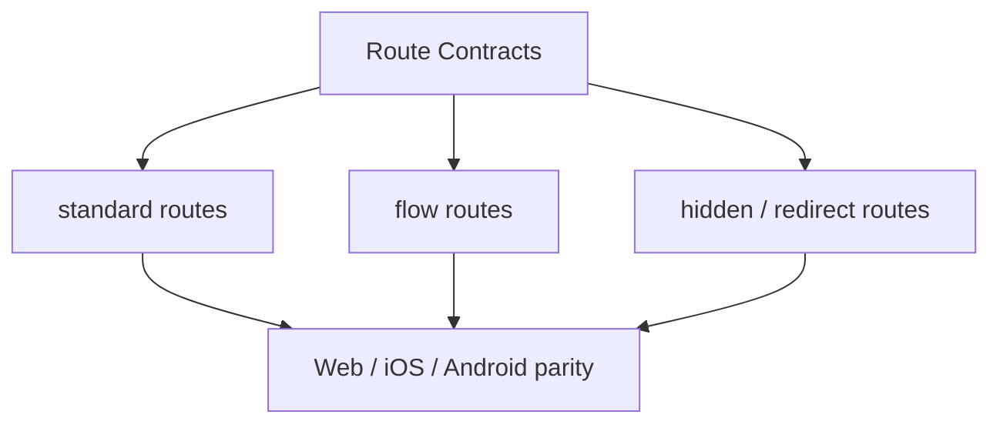

# Route Contracts

> Governance for Next.js proxy routes, native plugin parity, and app navigation truth.

## Visual Map

Hussh uses a code-owned route contract plus docs/runtime checks to keep the declared runtime surface aligned across:

- Next.js API route handlers under `hushh-webapp/app/api/**/route.ts`
- backend router prefixes and path families
- Capacitor TypeScript, iOS, and Android plugin surfaces
- mobile parity guidance for the visible page tree

For One Voice onboarding, middleware remains route protection and static
redirect infrastructure only. It cannot be the mutable journey planner because
it cannot reliably observe Firebase callback settlement or browser-local UI
state. The browser publishes the canonical redacted route state derived by
`deriveVoiceRouteScreen`; the generated action gateway and `/api/one/[...path]`
BFF validate and execute the permitted action. See
[One Voice Onboarding Journey](../one/one-voice-onboarding-journey.md).

Every physical page also has one required `voicePlaybook` in
`app-route-layout.contract.json`. The surface-map and route-index generators reject
missing, duplicate, structurally ambiguous, or action-incompatible entries. Playbooks
are prompt posture only; generated actions and their guards remain execution authority.

## Files

- Canonical app route source: `hushh-webapp/lib/navigation/routes.ts`
- Route governance reference: `docs/reference/architecture/route-contracts.md`
- Frontend/native surface mapper: `docs/reference/architecture/frontend-native-surface-map.md`
- Mobile parity reference: `docs/reference/mobile/capacitor-parity-audit.md`
- Docs/runtime verification:
  - `bash scripts/ci/docs-parity-check.sh`
  - `node scripts/verify-doc-runtime-parity.cjs`

## Canonical App Routes

Keep navigation documentation aligned with `hushh-webapp/lib/navigation/routes.ts`:

- `/`
- `/developers`
- `/login`
- `/register-phone`
- `/logout`
- `/agent`
- `/profile`
- `/profile/account`
- `/profile/account/phone`
- `/profile/preferences`
- `/profile/preferences/kai`
- `/profile/preferences/device`
- `/profile/security`
- `/profile/security/vault`
- `/profile/security/session`
- `/profile/my-data`
- `/profile/my-data/domain?key=<domain_key>`
- `/profile/access`
- `/profile/access/connection?id=<connection_id>`
- `/profile/connected-systems`
- `/profile/gmail`
- `/profile/gmail/connection`
- `/profile/gmail/actions`
- `/profile/support`
- `/profile/support/routing`
- `/profile/support/compose?kind=<support_kind>`
- `/profile/receipts`
- `/profile/gmail/oauth/return`
- `/consents`
- `/one/setup`
- `/one/setup/kai`
- `/one/setup/[capability]`
- `/one/kyc`
- `/one/marketplace`
- `/marketplace`
- `/marketplace/ria`
- `/ria`
- `/ria/onboarding`
- `/ria/clients`
- `/ria/picks`
- `/ria/requests`
- `/ria/settings`
- `/one/kai`
- `/one/kai/import`
- `/one/kai/plaid/oauth/return`
- `/one/kai/alpaca/oauth/return`
- `/one/kai/investments`
- `/one/kai/funding-trade`
- `/one/kai/portfolio`
- `/one/kai/analysis`
- `/one/kai/optimize`

Detail entrypoints that require an identifier use query-backed static routes so Capacitor export stays compatible:

- `/marketplace/ria?riaId=<ria_id>`
- `/ria/workspace?clientId=<investor_user_id>`
- `/profile/my-data/domain?key=<domain_key>`
- `/profile/access/connection?id=<connection_id>`
- `/profile/support/compose?kind=<support_kind>`

Legacy `/kai/*` aliases and `/one/kai/onboarding` remain compatibility redirect surfaces only. They must not be documented as canonical navigation surfaces or reintroduced as primary routes without updating both `routes.ts` and this reference.

Canonical `/one/kai/*` routes are One-owned finance surfaces, not persona shell routes. Page-level role mismatch guards must not block `/one/kai`, `/one/kai/analysis`, `/one/kai/portfolio`, or other canonical One finance routes just because the active persona is RIA; generated action contracts remain responsible for enforcing finance action guards, consent, and any required persona settlement. Legacy `/kai/*` aliases may stay investor-scoped until removed.

Legacy `/profile?panel=...&detail=...` URLs remain compatibility inputs only. Canonical profile navigation is nested under `/profile/<panel>` and owned by `hushh-webapp/lib/navigation/profile-routes.ts`.

## Route Contract Cascade

Every added, removed, or renamed app route must update the route contract cascade in one change:

- `hushh-webapp/lib/navigation/routes.ts`, route builders, breadcrumbs, bottom navigation, and signed-in route coverage
- `hushh-webapp/lib/navigation/app-route-layout.contract.json`
- `hushh-webapp/frontend-native-surface-map.generated.json`
- `hushh-webapp/cache-coherence-screen-manifest.generated.json`
- `hushh-webapp/native-route-inventory.json`
- local `.voice-action-contract.json` files and generated voice gateway artifacts when route/action reachability changes
- route docs, cache-coherence docs, One Voice docs, mobile parity docs, and owning Codex skill reads/checks

Preserve query params for transient state such as OAuth callbacks, filters, pagination, `unlock_vault`, `return_to`, redirects, and static-export-sensitive identifiers. Do not use query params as durable panel/detail navigation when a finite nested route exists.

## Visible Route Coverage

`hushh-webapp/lib/navigation/routes.ts` is the declared inventory for the canonical app navigation surface. The mobile parity docs must classify visible routes as:

- native-supported
- intentionally web-only

If a route is added to the navigation contract, the corresponding architecture/mobile docs must be updated in the same change.

Auth-only routes can still be mandatory even when they intentionally bypass the standard shell. Current hidden auth routes include:

- `/login`
- `/register-phone`
- `/logout`

## Public SEO and answer-engine projection

Route playbooks and public search semantics share stable route and playbook identifiers,
not prose. `hushh-webapp/lib/seo/site.ts` owns the public index allowlist and editorial
title/description/schema projection; a parity test requires each entry to resolve to its
typed route playbook. Sitemap and public `WebPage`/`CollectionPage` JSON-LD are generated
from that allowlist.

Never copy runtime recovery guidance, action aliases, trust-boundary details, journey
state, or private-route playbooks into crawler metadata. Authenticated routes and Login
remain non-indexable. This keeps SEO/AEO aligned with the same route ontology without
turning orchestration prompts into public content or making search markup an execution
authority.

## When To Update Route Governance

Update the route contract docs whenever you:

- add a new Next.js API route under `hushh-webapp/app/api/`
- change a backend router prefix or supported backend path family
- add, remove, or rename a Capacitor plugin method that must exist in TS, iOS, and Android
- intentionally retire an old proxy or plugin surface

## Contract Shape

The practical contract is split across:

- `hushh-webapp/lib/navigation/routes.ts` for app-visible routes
- backend route modules and Next.js proxy handlers for API surfaces
- mobile parity docs for platform-specific expectations and exceptions
- `hushh-webapp/frontend-native-surface-map.generated.json` for the
  route-to-API/native/plugin/voice scaffold used by Codex agents and parity audits

## Relationship To Other Docs

- [api-contracts.md](./api-contracts.md) describes the API surface itself.
- `hushh-webapp/lib/navigation/routes.ts` is the code-owned navigation source of truth.
- [../mobile/capacitor-parity-audit.md](../mobile/capacitor-parity-audit.md) defines the stricter mobile release gate layered on top of route contracts.
