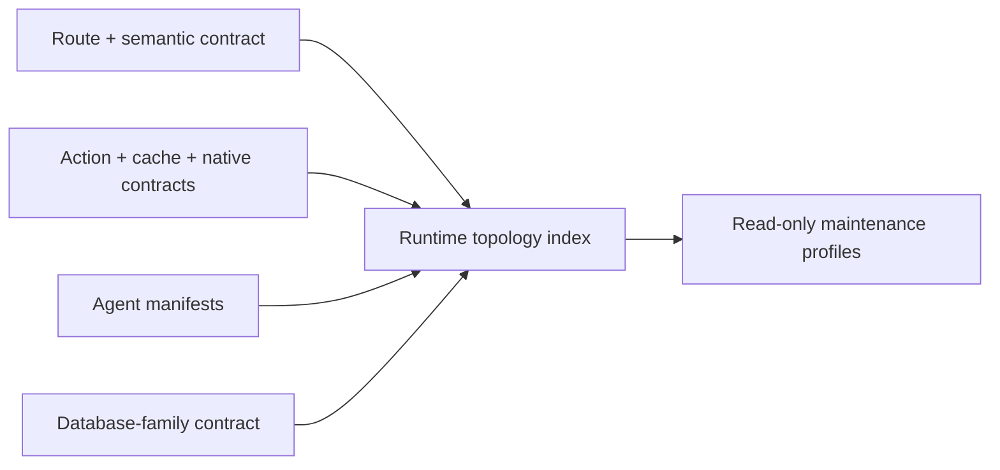

# Runtime Topology Maintenance

Classification: `canonical`.

## Visual Map



## Purpose

The runtime topology index makes the project's structural context auditable
without creating another source of execution authority. It joins the existing
route, cache, native, voice/action, product-agent, and database-family
contracts into one generated, metadata-only projection.

It records structure only: routes, semantic tab variants, owning modules,
action identifiers, declared agent hierarchy, table-family ownership, and
compatibility lifecycle. It never contains user information, credentials,
decrypted PKM, request payloads, vault material, or executable action policy.

## Sources of truth

| Concern | Authored source | Generated projection |
| --- | --- | --- |
| Physical routes and playbooks | `hushh-webapp/lib/navigation/app-route-layout.contract.json` | surface map, route-orchestration index |
| Semantic query-tab routes and aliases | `config/runtime-topology-maintenance.json` | runtime topology index |
| API/native/cache/action joins | frontend surface map, cache manifest, action gateway | runtime topology index |
| Product agents | `consent-protocol/hushh_mcp/agents/*/agent.yaml` plus declared One/A2A/dispatch wiring | product-agent registry and runtime topology index |
| Database families | `runtime-db-data-plane-contract.json` | runtime topology index |
| Compatibility and retirement decisions | `config/runtime-topology-maintenance.json` | runtime topology index |

Generated output: `contracts/architecture/runtime-topology-index.v1.json`.

Run:

```bash
python3 scripts/ops/generate_runtime_topology_index.py --check
python3 scripts/ops/generate_runtime_topology_index.py --profile finance
```

## Maintenance profiles

Profiles are deterministic review bundles, not product agents or LLM routing.
They select existing read-only evidence lanes based on the affected product
persona and structural surface:

- `one_core`: One and onboarding
- `finance`: Kai, Investor, and RIA
- `privacy_connections`: Nav, Location, and Connections
- `information_identity`: KYC, Email, Connected Systems, and Personal
  Information

The existing curated `.codex/agents` fleet remains the implementation. Adding
a generic maintenance agent would exceed the governed fleet cap and duplicate
the governor, frontend, backend, data-model, documentation, security, and
voice evidence lanes.

## Compatibility and removal discipline

An alias is not automatically stale. It remains a supported compatibility
surface until its record names a canonical successor, owner, reason, and
retirement policy. The index fails if a route page redirects while its route
contract claims it is a standard active page.

Destructive database cleanup is never an autonomous maintenance action. A
pending table retirement must stay visible in the index until an owner has
verified live row count, retention requirements, backup/recovery posture, and
a forward-only migration plan. Do not rewrite an historical migration to make
the index green.

## Product-agent boundary

One remains the only private-agent routing head. The topology index does not
change dispatch, A2A, tool admission, consent, or action authority. Runtime
agent creation follows [One Agent Hierarchy](../one/one-agent-hierarchy.md) and
the `product-agent-development` workflow; engineering maintenance follows
`runtime-topology-maintenance`.

## Wiki knowledge maintenance

During authorized Wiki maintenance, reconcile affected claims against the owning
source and dated evidence. Distinguish requirements, implementation, deployment
and observed outcomes. Label older snapshots explicitly; do not refresh their
dates or promote roadmap claims without verification.

Keep durable architecture, decisions and operating guidance. Release timelines
belong in the release history; preserve unique lessons in canonical articles
before removing duplicate Wiki pages. Inspect incoming links and repair them
without exposing private destinations to public readers. Read back corrections
and verify deleted pages are absent from both direct reads and the index.

A timed-out write or deletion has an uncertain outcome. Reconcile serving state
before retrying: missing local files alone do not prove durable removal. Keep
mutations sequential when the backend cannot atomically publish a batch. Record
unresolved publication failures in the existing audit evidence, not as completion.
