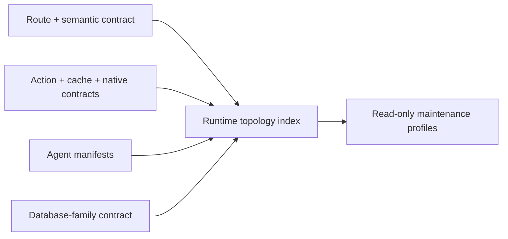

# Runtime Topology Maintenance

Classification: `canonical`.

## Visual Map



## Purpose

The runtime topology index makes the project's structural context auditable
without creating another source of execution authority. It joins the existing
route, cache, native, voice/action, product-agent, and database-family
contracts into one generated, metadata-only projection.

It records structure only: routes, semantic tab variants, owning modules,
action identifiers, declared agent hierarchy, table-family ownership, and
compatibility lifecycle. It never contains user information, credentials,
decrypted PKM, request payloads, vault material, or executable action policy.

## Sources of truth

| Concern | Authored source | Generated projection |
| --- | --- | --- |
| Physical routes and playbooks | `hushh-webapp/lib/navigation/app-route-layout.contract.json` | surface map, route-orchestration index |
| Semantic query-tab routes and aliases | `config/runtime-topology-maintenance.json` | runtime topology index |
| API/native/cache/action joins | frontend surface map, cache manifest, action gateway | runtime topology index |
| Product agents | `consent-protocol/hushh_mcp/agents/*/agent.yaml` plus declared One/A2A/dispatch wiring | product-agent registry and runtime topology index |
| Database families | `runtime-db-data-plane-contract.json` | runtime topology index |
| Compatibility and retirement decisions | `config/runtime-topology-maintenance.json` | runtime topology index |

Generated output: `contracts/architecture/runtime-topology-index.v1.json`.

Run:

```bash
python3 scripts/ops/generate_runtime_topology_index.py --check
python3 scripts/ops/generate_runtime_topology_index.py --profile finance
```

## Maintenance profiles

Profiles are deterministic review bundles, not product agents or LLM routing.
They select existing read-only evidence lanes based on the affected product
persona and structural surface:

- `one_core`: One and onboarding
- `finance`: Kai, Investor, and RIA
- `privacy_connections`: Nav, Location, and Connections
- `information_identity`: KYC, Email, Connected Systems, and Personal
  Information

The existing curated `agents` fleet remains the implementation. Adding
a generic maintenance agent would exceed the governed fleet cap and duplicate
the governor, frontend, backend, data-model, documentation, security, and
voice evidence lanes.

## Compatibility and removal discipline

An alias is not automatically stale. It remains a supported compatibility
surface until its record names a canonical successor, owner, reason, and
retirement policy. The index fails if a route page redirects while its route
contract claims it is a standard active page.

Destructive database cleanup is never an autonomous maintenance action. A
pending table retirement must stay visible in the index until an owner has
verified live row count, retention requirements, backup/recovery posture, and
a forward-only migration plan. Do not rewrite an historical migration to make
the index green.

## Product-agent boundary

One remains the only private-agent routing head. The topology index does not
change dispatch, A2A, tool admission, consent, or action authority. Runtime
agent creation follows [One Agent Hierarchy](../one/one-agent-hierarchy.md) and
the `product-agent-development` workflow; engineering maintenance follows
`runtime-topology-maintenance`.

## Recurring audit cadence

Run the existing `runtime-topology-maintenance` workflow manually when adopting
a new model or agent host. Its playbook composes shared-rule alignment, database,
environment, native and wiki evidence. This cadence does not install a scheduler
or grant deployment, publishing, database mutation or account-reset authority.

`python3 scripts/ops/audit_agents_md_alignment.py --json` exposes drift candidates;
`--strict` returns nonzero for findings and `--self-test` exercises the portable
bridge checks. Existing skill lint verifies canonical bridge metadata and targets
on both supported hosts. Platform-specific procedures and imported bundles still
need explicit classification before migration; an inventory is not proof they
are unused.

C7/C8 distinguish hash-verified classifications from unclassified or changed
resources. Pending imported-resource review remains an explicit `review_debt`
result and still makes the full `--strict` audit nonzero. A classified host
adapter is not an ungoverned duplicate, and an unchanged imported agent is not
an authored engineering lane. Skill lint retains the structural ratchet.

Persist a sanitized revision-bound report and compare it with the prior run.
Preserve failed and unverified results, then correct one independently reversible
boundary at a time. New model evaluations use the same contract fixtures and
negative controls as the prior baseline.

### Audit closure and branch-specific transfers

An architecture audit and an operational release have different evidence requirements.
Close the audit by inspecting the declared surfaces, correcting verified defects and
contradictory instructions, and recording each remaining implementation or access gap
with its owning workflow and acceptance evidence. An open requirement is not a passing
capability. Release completion still requires the applicable existing pod ledger and
release gates; never rename missing provider or lifecycle evidence as an exclusion.

Reuse passing evidence when its owning source and dependencies are unchanged. After a
bounded correction, run the smallest authoritative checks and the required owner gate.
Run the combined release gate once on the integrated candidate; repeat only affected
checks after subsequent changes. Retain behavioral and security negative controls.
Remove one-off tests or source-text assertions only when their protection is redundant
or disconnected, and record what retained check covers the behavior.

For shared-runtime and private-pod branches:

1. Record each worktree's branch, exact revision, dirty paths and remote relationship.
2. Classify a correction as portable, target-adapted or private-only before transfer.
3. Transfer bounded commits through the existing shared-runtime worktree/review lane.
   Preserve its session, routing, setup, deployment and fleet contracts; never copy the
   private branch's router, lifecycle or entire agent fleet into it.
4. Regenerate projections from the target's authored sources and run target-owned checks.
   A clean cherry-pick is not proof of architectural compatibility.
5. Preserve independently active edits and unpublished commits. Review and publication
   follow the existing branch-freshness and PR workflows; do not overwrite shared history
   or bypass review to clear an audit checklist.

Keep the transfer map and sanitized receipts in the revision-bound audit report. This
procedure reuses existing workflows and the pod ledger; it creates no second completion
authority, scheduler or patch queue.

### Platform-source ratchet

`skill_lint.py` reuses the alignment audit's bridge and classification checks.
Canonical twins are discovered from `skills/`; governed owners from `skill.json`.
Remaining host aliases, adapters and imported resources are explicitly inventoried in
`.codex/skills/agent-orchestration-governance/references/platform-source-inventory.json`.
Unclassified additions (including short files), changed classified behavior, broken
canonical pointers and stale inventory entries fail lint. Updating a digest requires
reviewing the actual behavior; a pending import or migration classification is recorded
debt, not proof that the source meets the canonical contract. Impeccable's pinned
upstream tree, outer license/notices and vendored screenshot license were verified
on 2026-09-05; exact receipts and retained license paths live in the inventory above.
The importer did not record the original revision of its derived platform references.
Optional parser dependencies and bypassing host launchers still constrain execution
and relocation. Keep the bundle intact and its nested writers outside the canonical
evidence fleet; confirmed provenance is not approval to execute imported wrappers.

Existing pod receipt checks prove only the declared date window and a tracked reproduction
path. They do not establish that the current revision passed a live drill. A release audit
must re-earn runtime evidence against its exact candidate and record image and environment;
source tests, dated receipts and simulator results must remain distinguishable.

### Fleet inventory evidence

`pod_fleet.py --assert-empty` and `pod_reconcile.py` use the existing Cloud Run
client's complete paginated inventory. Redirects, malformed records, unreachable
locations, repeated continuation tokens and later-page failures are unavailable
evidence; they cannot establish an empty fleet. The assertion returns 0 only for
a complete empty observation, 1 for observed pods, and 77 when unavailable.

The report-only reconciler reads host claims in one unrestricted registry SELECT,
separate from the bounded liveness sweep. It joins recorded service identifiers
within the requested project and region. Migrating rows retain their host claims;
inactive rows with a live host are reported separately from unclaimed services.
Missing coordinates and conflicting claims produce an incomplete report (exit 2)
and suppress orphan conclusions. The legacy unscoped pure classifier remains
available for offline callers and now also recognizes migrating rows.

Cloud inventory and the registry snapshot are separate observations. Their
mismatches are review candidates, never authority to delete, adopt or retry a
resource. Neither an empty fleet nor a successful report proves provider-memory,
object-version, key or backup erasure.

### Live lifecycle producer admission

`pod_lifecycle_drill.py --live` currently returns incomplete before acquiring
cloud resources or consent authority. Its retained `GcpFleet` adapter is a
migration surface, not an approved disposable-resource runner. Its compute client
now refuses adoption on conflict, captures an acknowledged creation UID before
IAM/readiness, and requires that UID plus a fresh v2 etag precondition for
deletion. Accepted deletion is followed by absence checks; a changed incarnation
or unavailable observation remains incomplete. These receipts are in-process;
an uncertain creation remains unresolved and is never deleted by name alone.

Existing-owner upsert, durable attempt recovery and external erasure still need
repair through the existing registry and lifecycle services. The structured
cleanup result distinguishes verified compute absence from full disposal and
never declares full completion. Re-enabling requires exclusive durable attempt
ownership and verified cleanup, including external erasure. Existing product
client callers retain their create/adopt and delete compatibility behavior;
only the retained drill selects the stricter options. The existing dry-run and
its schedule continue to test the oracle only; no new schedule is added.
