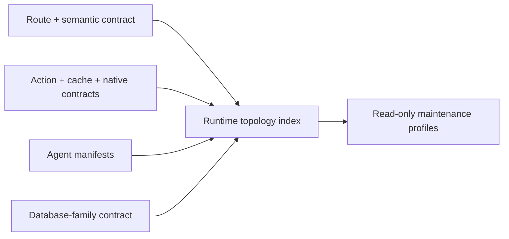

# Runtime Topology Maintenance

Classification: `canonical`.

## Visual Map



## Purpose

The runtime topology index makes the project's structural context auditable
without creating another source of execution authority. It joins the existing
route, cache, native, voice/action, product-agent, and database-family
contracts into one generated, metadata-only projection.

It records structure only: routes, semantic tab variants, owning modules,
action identifiers, declared agent hierarchy, table-family ownership, and
compatibility lifecycle. It never contains user information, credentials,
decrypted PKM, request payloads, vault material, or executable action policy.

## Sources of truth

| Concern | Authored source | Generated projection |
| --- | --- | --- |
| Physical routes and playbooks | `hushh-webapp/lib/navigation/app-route-layout.contract.json` | surface map, route-orchestration index |
| Semantic query-tab routes and aliases | `config/runtime-topology-maintenance.json` | runtime topology index |
| API/native/cache/action joins | frontend surface map, cache manifest, action gateway | runtime topology index |
| Product agents | `consent-protocol/hushh_mcp/agents/*/agent.yaml` plus declared One/A2A/dispatch wiring | product-agent registry and runtime topology index |
| Database families | `runtime-db-data-plane-contract.json` | runtime topology index |
| Compatibility and retirement decisions | `config/runtime-topology-maintenance.json` | runtime topology index |

Generated output: `contracts/architecture/runtime-topology-index.v1.json`.

Run:

```bash
python3 scripts/ops/generate_runtime_topology_index.py --check
python3 scripts/ops/generate_runtime_topology_index.py --profile finance
```

## Maintenance profiles

Profiles are deterministic review bundles, not product agents or LLM routing.
They select existing read-only evidence lanes based on the affected product
persona and structural surface:

- `one_core`: One and onboarding
- `finance`: Kai, Investor, and RIA
- `privacy_connections`: Nav, Location, and Connections
- `information_identity`: KYC, Email, Connected Systems, and Personal
  Information

The existing curated `agents` fleet remains the implementation. Adding
a generic maintenance agent would exceed the governed fleet cap and duplicate
the governor, frontend, backend, data-model, documentation, security, and
voice evidence lanes.

## Compatibility and removal discipline

An alias is not automatically stale. It remains a supported compatibility
surface until its record names a canonical successor, owner, reason, and
retirement policy. The index fails if a route page redirects while its route
contract claims it is a standard active page.

Destructive database cleanup is never an autonomous maintenance action. A
pending table retirement must stay visible in the index until an owner has
verified live row count, retention requirements, backup/recovery posture, and
a forward-only migration plan. Do not rewrite an historical migration to make
the index green.

## Product-agent boundary

One remains the only private-agent routing head. The topology index does not
change dispatch, A2A, tool admission, consent, or action authority. Runtime
agent creation follows [One Agent Hierarchy](../one/one-agent-hierarchy.md) and
the `product-agent-development` workflow; engineering maintenance follows
`runtime-topology-maintenance`.

## Recurring audit cadence

Run the existing `runtime-topology-maintenance` workflow manually when adopting
a new model or agent host. Its playbook composes shared-rule alignment, database,
environment, native and wiki evidence. This cadence does not install a scheduler
or grant deployment, publishing, database mutation or account-reset authority.

`python3 scripts/ops/audit_agents_md_alignment.py --json` exposes drift candidates;
`--strict` returns nonzero for findings and `--self-test` exercises the portable
bridge checks. Existing skill lint verifies canonical bridge metadata and targets
on both supported hosts. Platform-specific procedures and imported bundles still
need explicit classification before migration; an inventory is not proof they
are unused.

Persist a sanitized revision-bound report and compare it with the prior run.
Preserve failed and unverified results, then correct one independently reversible
boundary at a time. New model evaluations use the same contract fixtures and
negative controls as the prior baseline.

### Platform-source ratchet

`skill_lint.py` reuses the alignment audit's bridge and classification checks.
Canonical twins are discovered from `skills/`; governed owners from `skill.json`.
Remaining host aliases, adapters and imported resources are explicitly inventoried in
`.codex/skills/agent-orchestration-governance/references/platform-source-inventory.json`.
Unclassified additions (including short files), changed classified behavior, broken
canonical pointers and stale inventory entries fail lint. Updating a digest requires
reviewing the actual behavior; a pending import or migration classification is recorded
debt, not proof that the source meets the canonical contract. Impeccable's import license
and provenance remain unresolved; its bundle must stay intact pending that review.

Existing pod receipt checks prove only the declared date window and a tracked reproduction
path. They do not establish that the current revision passed a live drill. A release audit
must re-earn runtime evidence against its exact candidate and record image and environment;
source tests, dated receipts and simulator results must remain distinguishable.
