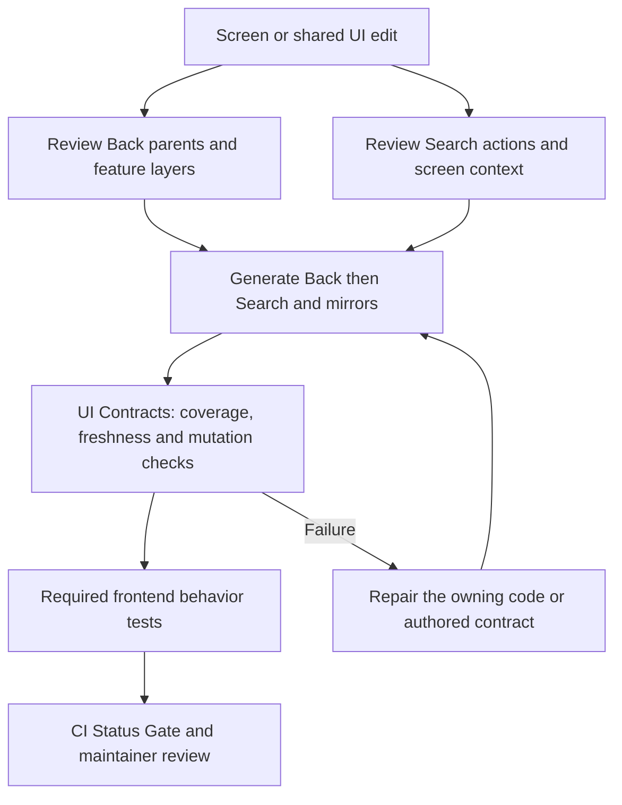

# UI contracts: Back and Search contribution scaffold

Read this before editing a screen, route, layout, shared UI module or action.
Back and Search share the authored route and action contracts. Generated files
join these owners; they do not define another navigation or action router.

## Visual Map



## Start before editing

From `hushh-webapp`, run `npm run ui:doctor`. It is read-only and prints all
structural, freshness and generated-mirror failures together. If app dependencies
are absent, install only the locked parser first:

```bash
cd hushh-webapp/scripts/architecture/ui-contract-tools
npm ci --ignore-scripts --no-audit --progress=false
cd ../../..
npm run ui:doctor
```

The execution target is 5–10 seconds. Dependency download, GitHub queue time,
checkout and runner startup are separate. The command prints its measured
execution time; it never trades correctness for a timing budget.

## Choose the owning edits

| Change | Authored edits | Evidence before generation |
| --- | --- | --- |
| New or renamed route | Route constants/builders and `lib/navigation/app-route-layout.contract.json`: shell verification, voice playbook and Back cases | Production parent resolution, direct entry, query state and eventual root reachability |
| Dialog, editor, map or nested feature state | Existing feature callback registered through `lib/navigation/back-layers.ts` | First Back unwinds the deepest local state; next Back reaches its parent; inactive/unmounted layers release ownership |
| Search action or screen context | Owning `*.voice-action-contract.json` plus route `voicePlaybook` | Correct screen, reachable control/action, query defaults, guards and platform boundaries |
| Shared UI or layout edit | Review affected Back states and Search actions even when behavior seems unchanged | Existing cases remain valid; add cases for changed interactions |
| Merge main into a feature branch | Preserve authored route cases and action meanings from both branches | Review the combined behavior, then regenerate all mirrors in dependency order |

## Back scaffold

The shared hierarchy is overlay, deepest active feature layer, authored route
parent, then native root handling. Shell Back, iOS edge gestures and Android
system Back use this hierarchy. Reuse the feature's existing cancel/reset
callback, including consent review cleanup and busy-state handling.

```tsx
// Import useBackLayer from "@/lib/navigation/back-layers".
const closeEditor = useCallback(() => {
  if (!editorOpen) return false;
  if (saving) return true; // Consume Back while the existing mutation settles.
  cancelEditor(); // The feature's existing cleanup owner.
  return true;
}, [editorOpen, saving, cancelEditor]);
useBackLayer(owningRoute, active && editorOpen ? 2 : 0, closeEditor);
```

Use the depth appropriate to the owning feature. An inactive pane must use zero
depth. Do not add `router.back()` or raw browser history to application route
Back. Do not extend reviewed history exceptions to avoid writing a parent.

Every physical route needs `backVerification.cases` in the existing layout
contract. Copy the nearest equivalent route's case shape and check its expected
target against production `resolveTopShellBackAction`; query parents and entry,
redirect or hidden boundaries need explicit cases/reasons. Extend the nearest
behavior test when changing nested state, query behavior or a cancel callback.

## Search scaffold

Extend the owning local action contract, not a separate Search catalog. Match
its existing schema and include action identity, meaning, control IDs,
reachability, execution target, guards and Search/context defaults. The route's
`voicePlaybook.screen` must describe the actual screen, including query-backed
tabs; its primary/happy-path actions must reference real declared actions.

For a newly exposed control, add its literal `data-voice-control-id` to the
owning action's `control_ids`. Preserve authentication, vault, consent and
platform/build guards. Declare only public query dimensions; private values and
the Search visibility marker must not leak into navigation targets. Test current
screen suggestions and same-screen filter changes through the existing action
runtime tests. A refreshed hash cannot prove a label or action's meaning.

## Finish the edit

```bash
cd hushh-webapp
npm run build:ui-contracts
npm run verify:ui-contracts
npm run test:ui-contracts
```

`build:ui-contracts` runs the existing Back behavior pack before stamping its
reviewed source, then runs Search generation, gateway, surface map, route index,
capability graph and runtime topology generation. Full app/backend tooling is
required for generation and behavioral tests; the tiny parser install is only
for fast validation. Review and commit authored changes and generated mirrors
together. Verification and the pre-push hook never stamp or repair files.

CI has one mandatory **UI Contracts** job for Back/Search structure, source
freshness, Surface Map, Gateway, Siri and Route Orchestration mirrors, plus validator mutation regressions. Required
Web Core runs validator mutation regressions. The required full Vitest suite
retains the Back and Search interaction tests. Both aggregate gates reject a
non-success UI job; frontend changes also require core and full-suite success.
This is repository contract verification, not deployed or physical-device proof.

## Resolve failures and conflicts

| Failure | Repair |
| --- | --- |
| New route lacks coverage | Add its shell/playbook and Back cases before regeneration |
| Back history bypass | Route through the shared hierarchy or register the feature layer |
| Search control lacks an action | Update the owning action and `control_ids`; do not add an exemption |
| Source revision or mirror is stale | Review semantics, run `build:ui-contracts`, inspect and commit outputs |
| Generated file conflicts after another PR lands | Merge main, reconcile authored fields, regenerate Back before Search, then verify |
| Validator/test failure | Fix the behavior or owning declaration; do not skip tests or stamp blindly |

Freshness evidence lives in immutable, content-addressed JSON receipts under
`hushh-webapp/contracts/ui-review/{back,search}/<source-revision>.json`, not in
authored route/action contracts or runtime gateway metadata. Back still hashes
the full UI source set and authored route cases; Search still hashes the complete
route import graph. Relevant source changes require the exact receipt for the current
sources. An unrelated PR may inherit its target branch's evidence when none of the
owner's sources, authored contracts or validator inputs changed against that base.
CI pins the PR/merge-group base SHA; local checks use an ancestor `origin/main`.
Missing history, invalid bases, deleted/new UI modules and changed imported information
fail closed. Validation never creates or repairs evidence. Existing history-bypass,
route coverage, action/control coverage and behavior checks remain mandatory.

Independent branches add different receipt files, so source-only reviews no longer
rewrite a shared stamp across every contract and generated mirror. Preserve both
branches' receipts during merges. A combined source revision with relevant PR changes
requires a fresh review/build receipt even when each parent passed. An asset/docs-only
PR does not need to repair main's combined review receipt. Historical receipts do not
authorize different sources. Real overlapping authored edits can still conflict;
reconcile those semantically. Do not use a Git merge driver to silently choose a
side, auto-stamp during verification, or treat receipts as proof of action meaning.

`app-route-layout.contract.json` and local action contracts are authored authority;
never resolve them wholesale as generated files. Keep generated gateway,
capability and topology copies consistent across their deployment contexts.

Canonical architecture: [route contracts](./route-contracts.md).
Agent owner: [frontend architecture skill](../../../.codex/skills/frontend-architecture/SKILL.md).
