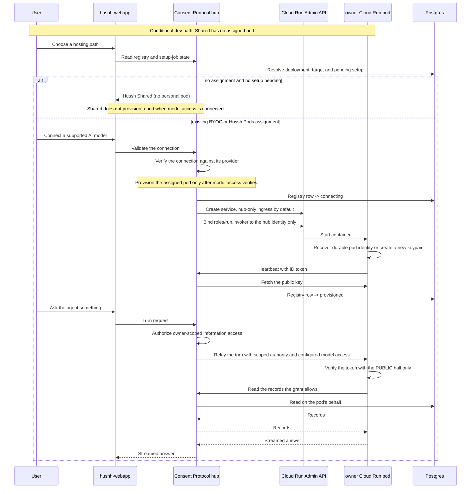
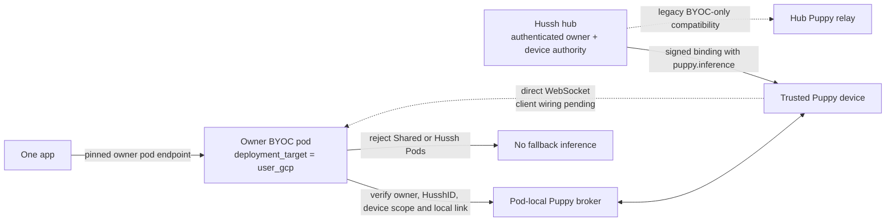
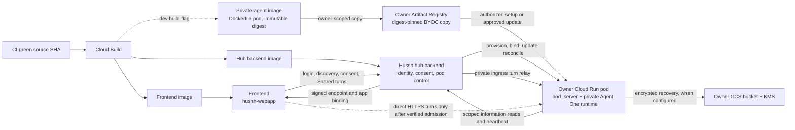

# Deployment views

## Visual Context

The [architecture index](../README.md) provides the top-down visual map; the [view catalog](../architecture-view-catalog.md) indexes this page and its figure status.

Canonical diagrams for this concern. Return to the [architecture view catalog](../architecture-view-catalog.md).

## Dynamic View: Assigned Pod Provisioning and Standard First Turn

View metadata:

| Field | Value |
| --- | --- |
| Stakeholders | platform, security, backend, frontend, operations |
| Concern | How an assigned pod comes into existence, proves itself, and serves a standard grounded turn |
| Model kind | C4 dynamic / sequence diagram |
| Source anchors | `consent-protocol/hushh_mcp/services/ai_connection_gate.py`, `consent-protocol/api/routes/one/runtime.py`, `consent-protocol/hushh_mcp/services/gcp_backend.py`, `consent-protocol/api/routes/one/pod_heartbeat.py`, `consent-protocol/api/routes/one/pod_relay.py`, `consent-protocol/hushh_mcp/services/personal_agent_grant_service.py` |

Assigned-pod journey rules:

- **Placement and model access are separate.** No assignment plus no pending setup resolves to Hussh Shared. A verified AI connection may start provisioning only for an assigned BYOC or Hussh Pods target.
- **The AI connection is the provisioning gate.** No assigned pod is created until supported model access verifies.
- **Model access follows the hosting target.** A turn may use owner-supplied BYOK, a configured Vertex identity in the owner's project, or managed Vertex where that tier is enabled. Do not describe every pod as zero-role or every turn as BYOK; Vertex paths require scoped IAM.
- **The pod verifies consent, it cannot mint it.** It carries `CONSENT_ED25519_PUBLIC_KEYS`, the verifying half only, so it can check a token at its own door while holding nothing that could forge one.
- **Silence means different things at different tiers.** A `warm` pod (minScale ≥ 1) that stops heart-beating is a fault; an `economy` pod (minScale 0) that goes quiet is healthy and scaled to zero. Never draw one liveness rule for both.

## Dynamic View: Puppy Inference Through the Owner's BYOC Relay

The root source accepts Puppy only through an active owner `user_gcp` deployment.
The app's turn is sent to the pinned pod; the pod checks the signed device binding,
owner and HusshID, `puppy.inference` scope, and its local device broker. Shared and
Hussh Pods are refused. The separate Hermes client has not yet implemented signed
binding discovery and direct connection, so the direct lane below is a source
contract, not an end-to-end verified product flow. The legacy hub relay remains a
BYOC-gated compatibility path and does not prove same-pod connectivity.

The direct lane's server-side checks and fail-closed behavior are covered by
source tests. Hermes binding discovery, a real device-to-BYOC socket, installed
pod image, and live owner/device rehearsal remain unverified.

## Deployment / Network / Physical View

View metadata:

| Field | Value |
| --- | --- |
| Stakeholders | platform, operations, security, release owners |
| Concern | Runtime environments, deploy authority, service topology, and external communication paths |
| Model kind | C4 deployment view with UML deployment vocabulary |
| Source anchors | `deploy/README.md`, `.github/workflows/deploy-dev.yml`, `.github/workflows/deploy-uat.yml`, `.github/workflows/deploy-production.yml`, `docs/guides/environment-model.md`, `docs/reference/operations/env-and-secrets.md`, `docs/reference/operations/branch-governance.md`, `docs/reference/operations/dev-fast-lane.md`, `docs/reference/architecture/crd-scraping-api.md` |

```mermaid
flowchart TB
  accTitle: Hussh deployment topology
  accDescr: Build authority and separate dev, UAT, and production runtime lanes.
  subgraph local["Local development"]
    localWeb["Next.js dev server<br/>localhost:3000"]
    localBackend["Consent Protocol local backend<br/>development profile"]
    localMcp["Local @hushh/mcp stdio bridge<br/>when host needs local process"]
    localEnv["Local env files<br/>uncommitted, chmod 600"]
  end

  subgraph github["GitHub authority plane"]
    pr["Pull request / merge queue"]
    ciGate["CI Status Gate"]
    main["main"]
    smoke["Main Post-Merge Smoke Gate"]
    devWorkflow["Deploy to Dev<br/>any CI-green ref, never promotes"]
    uatWorkflow["Deploy to UAT<br/>manual exact green main SHA"]
    prodWorkflow["Deploy to Production<br/>governed exact green main SHA"]
  end

  subgraph devEnv["Dev hosted runtime — shared integration lane"]
    devProject["GCP project<br/>hushh-pda-dev"]
    devRegion["Region<br/>us-central1"]
    devFrontend["Cloud Run service<br/>hushh-webapp"]
    devBackend["Cloud Run service<br/>consent-protocol (the hub)"]
    devApp["App origin<br/>https://dev.one.hushh.ai"]
    devDb["Dev Cloud SQL / Postgres<br/>hushh-pda-dev:us-central1:hushh-dev-pg"]
    devPods["Per-user pod fleet<br/>one-pod-&lt;HusshID&gt;, app=hussh-one-pod<br/>hub-only default; direct ingress is a dev pilot"]
    devPodSa["Pod runtime identity<br/>hussh-one-pod@hushh-pda-dev<br/>no project roles"]
  end

  subgraph uat["UAT hosted runtime"]
    uatProject["GCP project<br/>hushh-pda-uat"]
    uatRegion["Region<br/>us-central1"]
    uatFrontend["Cloud Run service<br/>hushh-webapp"]
    uatBackend["Cloud Run service<br/>consent-protocol"]
    uatApp["App origin<br/>https://uat.one.hushh.ai"]
    uatApi["API origin<br/>https://api.uat.hushh.ai"]
    uatMcp["Remote MCP<br/>/mcp/ trailing-slash endpoint"]
    uatDb["UAT Cloud SQL / Postgres path<br/>hushh-uat-pg via governed workflow"]
  end

  subgraph prod["Production hosted runtime"]
    prodProject["GCP project<br/>hushh-pda"]
    prodRegion["Region<br/>us-central1"]
    prodFrontend["Cloud Run service<br/>hushh-webapp"]
    prodBackend["Cloud Run service<br/>consent-protocol"]
    prodApp["App origin<br/>https://one.hushh.ai"]
    prodBackup["Production backup posture<br/>Cloud SQL automated backups + PITR"]
    prodDb["Production Cloud SQL/Postgres path<br/>runtime DB_* contract"]
  end

  subgraph managed["Managed services and external providers"]
    secretManager["GCP Secret Manager<br/>runtime secrets and config"]
    cloudBuild["Cloud Build<br/>Docker image build and deploy"]
    firebase["Firebase<br/>auth and FCM"]
    riaIntel["RIA Intelligence API<br/>CRD and verification provider lane"]
    plaid["Plaid<br/>portfolio connectivity"]
    gmail["Gmail / Workspace<br/>One email and receipts"]
    market["Market data providers<br/>Finnhub, PMP/FMP, yfinance, news"]
  end

  localWeb --> localBackend
  localMcp --> localBackend
  localEnv --> localWeb
  localEnv --> localBackend

  pr --> ciGate
  ciGate --> devWorkflow
  pr --> main --> smoke
  smoke --> uatWorkflow
  smoke --> prodWorkflow

  devWorkflow --> cloudBuild
  uatWorkflow --> cloudBuild
  prodWorkflow --> cloudBuild
  cloudBuild --> devFrontend
  cloudBuild --> devBackend
  cloudBuild --> uatFrontend
  cloudBuild --> uatBackend
  cloudBuild --> prodFrontend
  cloudBuild --> prodBackend

  devProject --> devRegion
  devRegion --> devFrontend
  devRegion --> devBackend
  devRegion --> devPods
  devFrontend --> devApp
  devBackend --> devDb
  devBackend -->|"Cloud Run Admin API<br/>create / bind invoker / delete"| devPods
  devPods --> devPodSa
  devPods -->|"all data-plane reads"| devBackend
  devBackend --> secretManager
  devBackend --> firebase

  uatProject --> uatRegion
  uatRegion --> uatFrontend
  uatRegion --> uatBackend
  uatFrontend --> uatApp
  uatBackend --> uatApi
  uatApi --> uatMcp
  uatBackend --> uatDb

  prodProject --> prodRegion
  prodRegion --> prodFrontend
  prodRegion --> prodBackend
  prodFrontend --> prodApp
  prodBackend --> prodDb
  prodBackend --> prodBackup

  uatBackend --> secretManager
  prodBackend --> secretManager
  uatFrontend --> secretManager
  prodFrontend --> secretManager
  uatBackend --> firebase
  prodBackend --> firebase
  uatBackend --> riaIntel
  prodBackend --> riaIntel
  uatBackend --> plaid
  prodBackend --> plaid
  uatBackend --> gmail
  prodBackend --> gmail
  uatBackend --> market
  prodBackend --> market
```

Topology limits:

- This is a service/environment topology, not a packet-level OSI diagram.
- It intentionally does not invent VPC, subnet, firewall, load-balancer, or private service-connect details that are not documented in the repo.
- UAT exposes Developer API and remote MCP; production defaults keep developer API and remote MCP disabled unless a later approved deploy contract changes that.

Dev lane rules:

- **Dev is the only environment the per-user pod fleet exists in.** Do not draw pods under UAT or production until a deploy lane actually provisions them there.
- Dev accepts **any CI-green ref**, not only `main`, which is what makes it the lane for previewing an unmerged branch. It **never promotes** — a dev deploy is not a step toward UAT.
- Dev is **shared and costed**. A dispatch replaces whatever was last deployed, and live pods left running spend money, so the fleet is checked before pods are created and torn down after.
- The dev hub keeps the **UAT runtime identity** (`_RUNTIME_ENVIRONMENT=uat`) so behaviour matches the next lane up. Read the deploy *lane* from `_DEPLOY_ENV`, not from the runtime environment name — they deliberately differ.
- The managed fleet's shared pod runtime identity holds **no project roles**; its ID token proves only that a caller is *a* pod, not *which* pod. BYOC has a separate owner-project identity with narrowly scoped storage, KMS, and optional Vertex permissions. The hub pulls a pod's key rather than accepting a pushed one.

### Dev BYOC image and private-agent flow

Deployment and request-flow view for founders, CTOs, platform engineers, and
security reviewers. It joins the build artifact to the request path. The hub
and frontend deploy paths are current; the pod image build is conditional on
the explicit dev build flag. BYOC setup and direct ingress are gated dev paths,
not evidence of a live owner installation. Source anchors: `deploy/backend.cloudbuild.yaml`,
`consent-protocol/Dockerfile.pod`, `consent-protocol/hushh_mcp/services/user_gcp_backend.py`,
`consent-protocol/hushh_mcp/services/pod_image_copy.py`,
`consent-protocol/hushh_mcp/services/pod_binding_service.py`, and
`hushh-webapp/lib/services/owner-pod-endpoint.ts`.

The frontend, hub, and pod are separate images. An explicitly selected dev build
creates the pod image; the hub copies its resolved digest into the owner's
registry for authorized BYOC setup or an approved update. Reconcile and heal
preserve the installed digest instead of silently changing the version. The
hub remains the control and consent authority. A direct browser-to-pod turn is
conditional on a verified owner endpoint, binding, pod session, and live ingress.
Before direct cutover, the private hub relay is the pod path; after cutover, a
failed direct turn is surfaced rather than silently rerouted. Shared turns stay
on the hub runtime and do not create an owner pod. Hub-owned information reads
return through the hub; encrypted BYOC recovery uses owner-owned storage.
