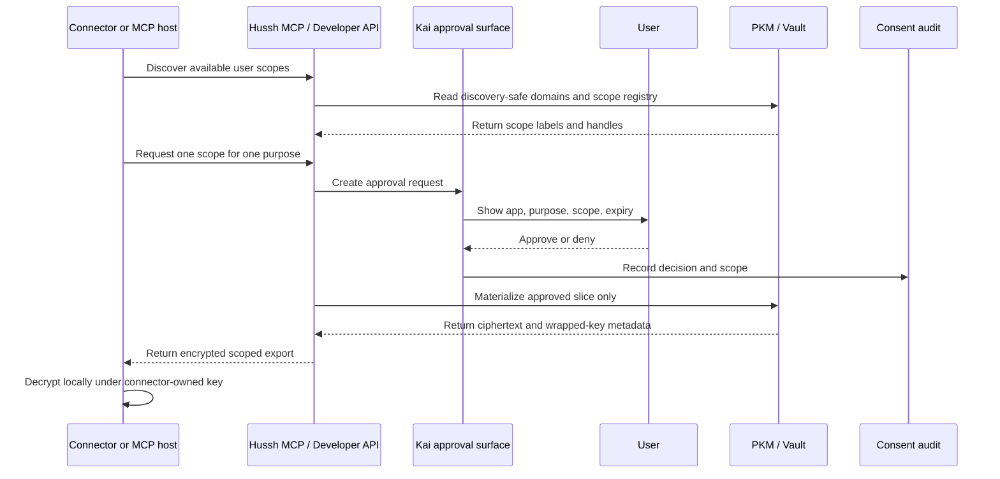
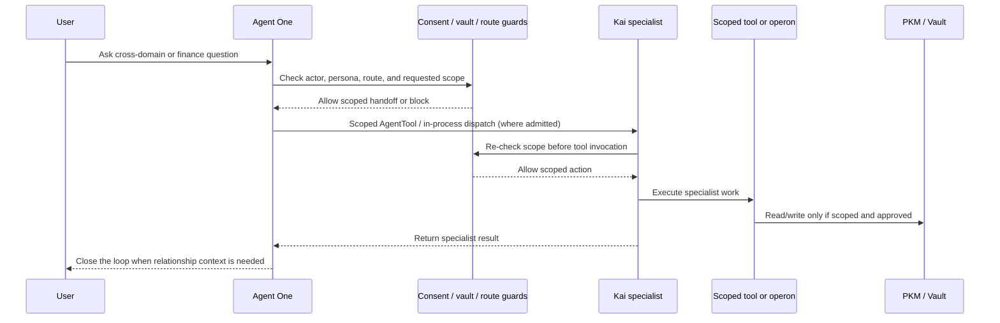
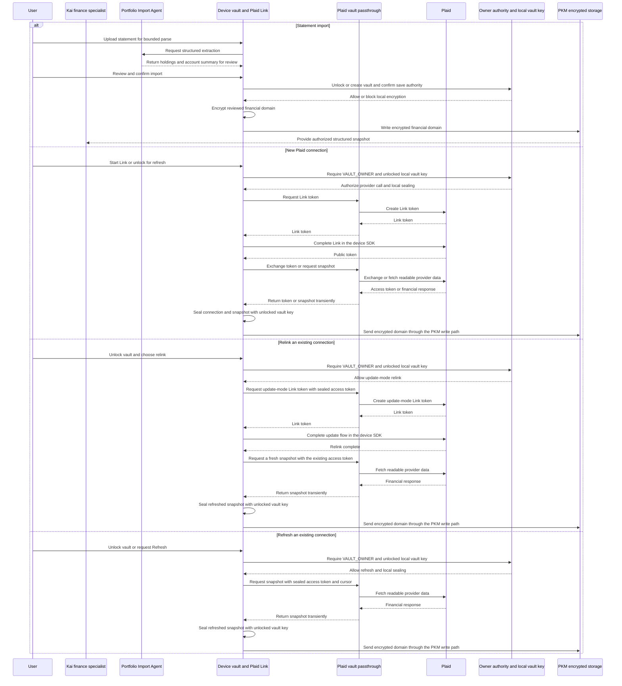
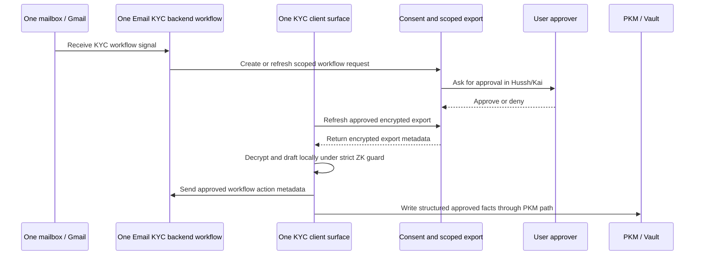

# Flow views

## Visual Context

The [architecture index](../README.md) provides the top-down visual map; the [view catalog](../architecture-view-catalog.md) indexes this page and its figure status.

Canonical diagrams for this concern. Return to the [architecture view catalog](../architecture-view-catalog.md).

## Dynamic View: Consented Encrypted Export

View metadata:

| Field | Value |
| --- | --- |
| Stakeholders | partners, security, developer-platform engineers |
| Concern | How a connector receives only an approved encrypted export |
| Model kind | C4 dynamic / sequence diagram |
| Source anchors | `consent-protocol/docs/reference/developer-api.md`, `packages/hushh-mcp/README.md`, `docs/reference/iam/architecture.md` |

Partner boundary: if a connector decrypts PII and writes plaintext into a CRM, that copy is outside the Hussh zero-knowledge boundary and needs explicit purpose, consent scope, retention, encryption or masking, access control, deletion, and audit ownership.

## Dynamic View: One / Kai Specialist Delegation

View metadata:

| Field | Value |
| --- | --- |
| Stakeholders | product, agent-runtime engineers, security |
| Concern | How specialist handoffs should inherit authority instead of minting broader access |
| Model kind | C4 dynamic / sequence diagram |
| Source anchors | `docs/vision/agent-ontology.md`, `docs/reference/kai/kai-action-gateway-vnext.md`, `docs/reference/kai/kai-architecture-specification-v1.md`, `consent-protocol/hushh_mcp/agents/one/agent.yaml` |

Delegation rule: specialist delegation never bypasses consent, vault, persona, workspace, route, rollout, or kill-switch checks.

## Dynamic View: Portfolio Import

View metadata:

| Field | Value |
| --- | --- |
| Stakeholders | Kai engineers, security, product |
| Concern | How import work stays under portfolio/import and vault/PKM authority |
| Model kind | C4 dynamic / sequence diagram |
| Source anchors | `consent-protocol/hushh_mcp/agents/portfolio_import/agent.yaml`, `docs/reference/kai/kai-architecture-specification-v1.md`, `docs/guides/plaid-activation-and-testing.md` |

Import rule: statement parsing does not give Kai or the import agent broad access to the
vault. Plaid calls transiently process provider tokens and readable responses on the backend;
the device seals connection data before writing the encrypted domain. This diagram describes
the vault route, not completion of legacy server-row cleanup in deployed environments.

## Dynamic View: One Email KYC

View metadata:

| Field | Value |
| --- | --- |
| Stakeholders | KYC, backend, frontend, security |
| Concern | Mailbox intake, approval-gated draft, scoped export refresh, and structured writeback |
| Model kind | C4 dynamic / sequence diagram |
| Source anchors | `docs/reference/architecture/one-email-kyc.md`, `consent-protocol/hushh_mcp/services/one_email_kyc_service.py`, `hushh-webapp/lib/services/one-kyc-client-zk-service.ts` |

KYC rule: backend orchestrates workflow metadata and mail/send surfaces; strict client-side zero-knowledge behavior must not turn the backend into a plaintext review-draft store.
