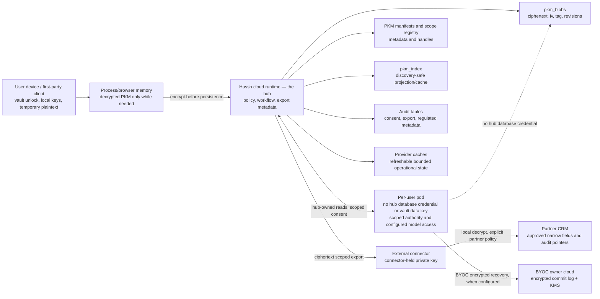

# Information boundary views

## Visual Context

The [architecture index](../README.md) provides the top-down visual map; the [view catalog](../architecture-view-catalog.md) indexes this page and its figure status.

Canonical diagrams for this concern. Return to the [architecture view catalog](../architecture-view-catalog.md).

## Data Boundary View

View metadata:

| Field | Value |
| --- | --- |
| Stakeholders | security, partners, platform, compliance reviewers |
| Concern | Where sensitive data, ciphertext, audit metadata, keys, and partner fields may reside |
| Model kind | ISO 42010 data/security view |
| Source anchors | `docs/reference/architecture/runtime-db-fact-sheet.md`, `docs/reference/architecture/data-model-governance.md`, `docs/reference/architecture/pkm-cutover-runbook.md`, `consent-protocol/docs/reference/developer-api.md`, `packages/hushh-mcp/README.md` |

Boundary rules:

- Vault keys and decrypted PKM stay memory-only.
- **A pod holds no hub database credential or vault data key.** Hub-owned Postgres reads go through the hub under scoped authority. A configured BYOC pod separately accesses its owner's encrypted commit log and KMS and keeps an encrypted local working copy. The dotted arrow prohibits direct hub database reads; it does not prohibit owner-cloud recovery.
- **A pod verifies consent; it cannot mint it.** It carries `CONSENT_ED25519_PUBLIC_KEYS` — the verifying half only. Signing material reaches a pod by reference (`secretKeyRef`), never as a rendered value, because with HMAC the power to verify is the power to forge.
- **A BYOK model key is turn-bounded.** It arrives with the request and is isolated by construction from backend ADC and environment keys; it is never rendered into a deploy artifact and never persisted in the pod.
- `pkm_blobs` stores encrypted private content.
- PKM manifests and scope registry are authority for structure and exposure handles.
- `pkm_index` is discovery projection/cache, not canonical private memory.
- Provider caches are not durable user memory unless a consented encrypted PKM write makes them so.
- Partner CRM may store consent receipt ids, scope labels, status, expiry, audit references, and narrow approved workflow fields.
- Partner CRM must not store broad PKM, vault contents, vault keys, full email bodies, broad KYC packages, durable One memory, or reusable secrets by default.
