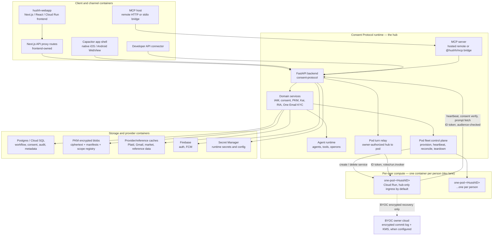
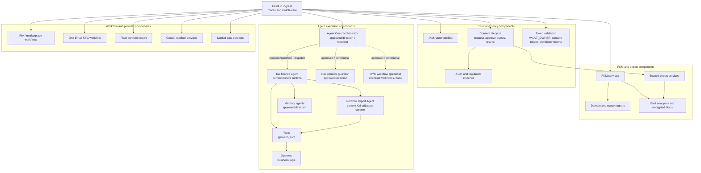

# Runtime views

## Visual Context

The [architecture index](../README.md) provides the top-down visual map; the [view catalog](../architecture-view-catalog.md) indexes this page and its figure status.

Canonical diagrams for this concern. Return to the [architecture view catalog](../architecture-view-catalog.md).

## Container View

View metadata:

| Field | Value |
| --- | --- |
| Stakeholders | frontend, backend, platform, security |
| Concern | Runtime containers, stores, providers, and external transport lanes |
| Model kind | C4 container view |
| Source anchors | `consent-protocol/README.md`, `docs/project_context_map.md`, `docs/reference/architecture/api-contracts.md`, `packages/hushh-mcp/README.md`, `docs/guides/mobile.md`, `consent-protocol/hushh_mcp/services/gcp_backend.py`, `consent-protocol/pod_server.py` |

Container rule: clients call service/proxy boundaries; they do not become policy authorities or memory stores.

Pod container rule: a pod has no hub Postgres credential or vault data key. Hub-owned information reads travel pod → hub → Postgres over `HUSSH_HUB_BASE_URL`; a configured BYOC pod can also reach its owner's encrypted commit-log bucket and KMS for recovery. Default hub-only reachability uses internal ingress plus the narrow hub `roles/run.invoker` binding. A separately gated dev direct mode uses public ingress and a public Cloud Run invoker, with pod-level signed binding and session admission as its application lock. Do not mistake public transport reachability for information authority.

## Component View

View metadata:

| Field | Value |
| --- | --- |
| Stakeholders | backend, agent, frontend-service, security reviewers |
| Concern | Major components inside the Consent Protocol runtime |
| Model kind | C4 component view |
| Source anchors | `consent-protocol/docs/reference/agent-development.md`, `consent-protocol/docs/reference/kai-agents.md`, `docs/reference/iam/architecture.md`, `docs/reference/architecture/runtime-db-fact-sheet.md` |

Component rule: agents orchestrate, tools expose callable operations, operons hold business logic, and services own persistence boundaries. Kai is the current mature specialist runtime. One, Nav, KYC, and memory-agent nodes are included only where checked manifests, route surfaces, or approved direction exist; do not read this diagram as proof that full One/Nav default runtime has shipped.
