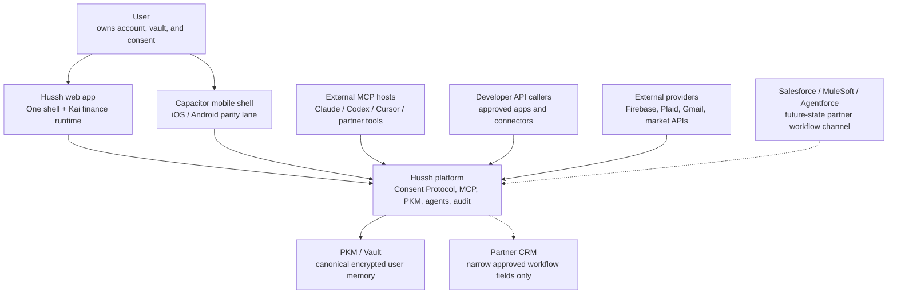
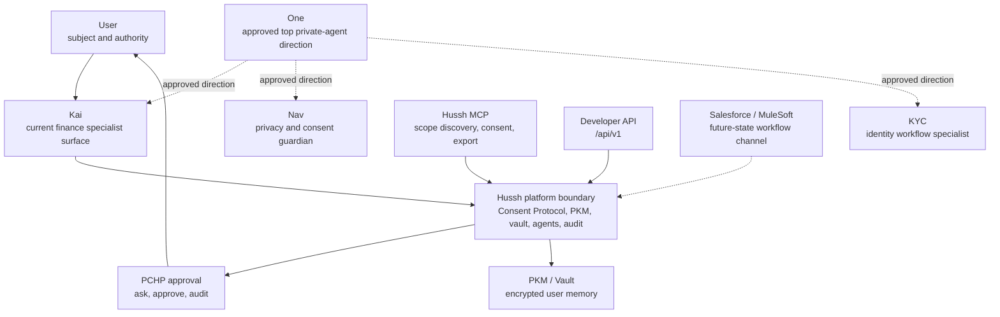

# System views

## Visual Context

The [architecture index](../README.md) provides the top-down visual map; the [view catalog](../architecture-view-catalog.md) indexes this page and its figure status.

Canonical diagrams for this concern. Return to the [architecture view catalog](../architecture-view-catalog.md).

## System Landscape

View metadata:

| Field | Value |
| --- | --- |
| Stakeholders | founders, partners, engineering, security |
| Concern | External landscape around Hussh, including current channels and future-state partner lanes |
| Model kind | C4 system landscape |
| Source anchors | `docs/project_context_map.md`, `docs/reference/architecture/architecture.md`, `docs/vision/agent-ontology.md`, `packages/hushh-mcp/README.md`, `docs/future/hussh-one-infra/salesforce-mulesoft-brief.md` |

Reading rule: Hussh owns the trust and memory boundary. External systems are channels, providers, or workflow endpoints.

## System Context

View metadata:

| Field | Value |
| --- | --- |
| Stakeholders | product, engineering, security, partners |
| Concern | Hussh boundary, user authority, agent roles, MCP/developer access, and partner limitations |
| Model kind | C4 system context |
| Source anchors | `docs/vision/agent-ontology.md`, `docs/reference/iam/architecture.md`, `consent-protocol/docs/reference/developer-api.md`, `packages/hushh-mcp/README.md` |

Current-state boundary: One, Nav, and KYC are approved ontology directions with checked-in manifests. Kai remains the most mature current product runtime unless a specific route proves otherwise.
