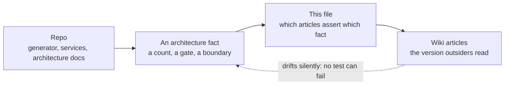

# Wiki ⇄ architecture parity

Status: canonical. The map between **architecture facts that live in this repo** and
the **wiki articles that restate them for a wider audience**.

## Visual Map

The dotted edge is the whole problem. Code that goes stale breaks a test; a wiki page
that goes stale just keeps reading well.

## Why this file exists

The wiki is the version of the architecture that people outside this repo read. It is
also the version nobody edits when they change code, so it drifts silently — and it
drifts *confidently*, because a wiki page carries no test that can fail.

This file names, for each architecture fact, the wiki articles that assert it. When a
fact changes, this is the list of pages that became wrong at the same moment.

It is not a backlog. A row here is only meaningful while the wiki disagrees with the
repo; once an article is corrected, the row records where the claim lives so the next
change knows what to revisit.

## The parity map

| Architecture fact | Repo source of truth | Wiki articles that restate it |
|---|---|---|
| Layer/flow counts on the platform map | `hussh-mega-map.gen.py` (generator prints them) | `wiki/about/hussh-mega-map.md` (public), `wiki/about/hussh-mega-map-internal.md` (private) |
| What the Infrastructure layer contains | `hussh-mega-map.gen.py` → `LAYERS_ALL` | both mega-map articles |
| Where setup gates the account, and on what | `docs/reference/quality/one-onboarding-architecture.md` | `wiki/products/one-app-shell.md` (public), `wiki/products/one-app-shell-operational.md` (private) |
| The per-user pod's properties and journey | `docs/reference/architecture/architecture.md` § 1a | the Private Agent One pod concept article (private) |
| Consent boundary and PCHP phases | `docs/reference/architecture/architecture-view-catalog.md` | `wiki/products/pchp.md` |
| Which backends can host a pod | `consent-protocol/hushh_mcp/services/compute_backend.py` | `wiki/concepts/byoa.md` |

Read the counts from the generator rather than from either article — it prints
`layers N flows M` for each of the four renders, and that is the only number that
cannot be stale.

## 2026-08-06 sync — what landed

The per-user Private Agent One pod reached the repo's architecture docs and the Mega Map
while the wiki still had **zero** articles describing it, and two articles carried flow
counts the regenerated map contradicts. All prose is now reconciled.

| Wiki article | Visibility | What changed |
|---|---|---|
| The Hussh Mega Map | public | ten journeys → **eleven**; journey 11 *Your own private agent*; Infrastructure gains one managed container per person; frontmatter, TL;DR and lane count corrected |
| The Hussh Mega Map — internal | private | twelve flows → **thirteen**; flow ⑬ with its three load-bearing orderings; layer 8 gains the pod and the fleet control plane; the Regenerate section now names the generator's printed counts as authority |
| One App Shell | public | AI access documented as the **compute gate**, plus a plain-language walkthrough of where a person's agent comes from |
| One App Shell — operational | private | the trigger table, pod property table, liveness/tier rules, capacity, and the dev-lane-only boundary |
| Private Agent One pod | private | **new article** — the per-user compute concept, explicitly disambiguated from Puppy One, Grid One and Compute Burst |

The new article is private on purpose: the pod runs in the dev lane only and has not been
promoted, so a public page would describe something a reader cannot yet have. Promote it
when it ships. It is linked only from private pages — a public page linking a private one
is a lint error, not a style preference.

Public wording stays sanitized. The public render says "managed container" and contains
zero occurrences of the host service name; prose must not reintroduce it.

### Still open: the embedded renders

Both mega-map articles embed their SVG inline, and those embeds are the **pre-pod render**
— verified rather than assumed: the currently-embedded public SVG contains zero
occurrences of "private agent", "one-pod", or "managed container". So the words on those
two pages are now correct and the pictures are one generation behind.

Each page carries a short note saying exactly that, so a reader who counts lanes is not
misled. Closing it needs the regenerated files re-uploaded:

| Article | Files to re-embed |
|---|---|
| The Hussh Mega Map (public) | `hussh-mega-map.light.public.svg`, `hussh-mega-map.dark.public.svg` |
| The Hussh Mega Map — internal | `hussh-mega-map.dark.svg` (and `.light.svg` if a light embed is added) |

Regenerate first with `python3 hussh-mega-map.gen.py`; it prints the authoritative counts
per render (`layers 7 flows 11` public, `layers 8 flows 13` internal).

This was not done in the same pass for a mechanical reason worth recording: the four
renders total roughly 709 KB, and the wiki edit path takes SVG as inline text rather than
by file reference. A partially-written SVG on a public page is worse than a stale one, so
the honest note was preferred over a risky paste. Re-embedding wants a file-upload path.

## Maintenance rule

When a change moves any fact in the parity map, update the wiki article in the same
change, or record the delta here with the reason it could not be applied. A delta with no
reason is indistinguishable from an oversight.
