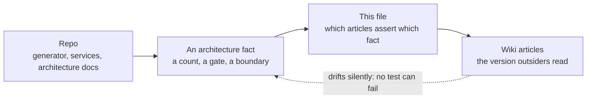

# Wiki ⇄ architecture parity

Status: canonical. The map between **architecture facts that live in this repo** and
the **wiki articles that restate them for a wider audience**.

## Visual Map

The dotted edge is the whole problem. Code that goes stale breaks a test; a wiki page
that goes stale just keeps reading well.

## Why this file exists

The wiki is the version of the architecture that people outside this repo read. It is
also the version nobody edits when they change code, so it drifts silently — and it
drifts *confidently*, because a wiki page carries no test that can fail.

This file names, for each architecture fact, the wiki articles that assert it. When a
fact changes, this is the list of pages that became wrong at the same moment.

It is not a backlog. A row here is only meaningful while the wiki disagrees with the
repo; once an article is corrected, the row records where the claim lives so the next
change knows what to revisit.

## The parity map

| Architecture fact | Repo source of truth | Wiki articles that restate it |
|---|---|---|
| Layer/flow counts on the platform map | `hussh-mega-map.gen.py` (generator prints them) | `wiki/about/hussh-mega-map.md` (public), `wiki/about/hussh-mega-map-internal.md` (private) |
| What the Infrastructure layer contains | `hussh-mega-map.gen.py` → `LAYERS_ALL` | both mega-map articles |
| Where setup gates the account, and on what | `docs/reference/quality/one-onboarding-architecture.md` | `wiki/products/one-app-shell.md` (public), `wiki/products/one-app-shell-operational.md` (private) |
| The per-user pod's properties and journey | `docs/reference/architecture/architecture.md` § 1a | *no article exists yet* |
| Consent boundary and PCHP phases | `docs/reference/architecture/architecture-view-catalog.md` | `wiki/products/pchp.md` |
| Which backends can host a pod | `consent-protocol/hushh_mcp/services/compute_backend.py` | `wiki/concepts/byoa.md` |

Read the counts from the generator rather than from either article — it prints
`layers N flows M` for each of the four renders, and that is the only number that
cannot be stale.

## Open delta — 2026-08-06

The per-user Private Agent One pod landed in the repo's architecture docs and on the
Mega Map. The wiki has **not** been updated: a wiki search for the pod returns zero
articles, and two articles now carry counts that the regenerated map contradicts.

Wiki writes could not be performed from the session that found this — the wiki service
returned `No refresh token is set`, so a patch applied locally and failed to persist.
The delta is recorded here rather than left in a session transcript.

### 1. `wiki/about/hussh-mega-map.md` (public)

Currently claims **ten** journeys; the public render now has **eleven**. The eleventh
is *Your own private agent*.

- Frontmatter `description` and the body TL;DR both say "ten end-to-end user-story flows".
- `## The ten journeys — how it connects` needs its heading, an eleventh entry, and the
  ordering note: nothing is built for an account whose model connection has not been
  proved to work.
- Layer 7 (Infrastructure) should gain one managed container per person, plus the control
  plane that builds it, hears its heartbeat, and repairs it.
- "all ten lanes share the same step span" → eleven.
- The embedded light and dark SVGs are the pre-pod render and must be replaced from
  `hussh-mega-map.light.public.svg` / `hussh-mega-map.dark.public.svg`.

Public wording only. The public render already sanitizes the host name to "managed
container" — verified: zero occurrences of the vendor service name in the public SVG.
Do not reintroduce it in prose.

### 2. `wiki/about/hussh-mega-map-internal.md` (private)

Currently `## The twelve flows`; the internal render now has **thirteen**.

- Frontmatter `description` says "12 flows".
- Add flow ⑬ *Your own private agent*: choose an AI → verify it with a real generation →
  create the pod with a zero-role identity and internal-only ingress → pod boots and
  heart-beats → hub pulls its public key and mints a standing `pkm.read` → the turn runs
  inside the pod on the owner's own key.
- Layer 8 (Infrastructure) should gain the per-user pod and the fleet control plane.
- Replace the embedded SVG from `hussh-mega-map.dark.svg` / `hussh-mega-map.light.svg`.

### 3. `wiki/products/one-app-shell.md` (public) and `-operational.md` (private)

These describe the onboarding architecture, and its gate changed: **AI access is now the
compute gate.** Choosing how the agent thinks — Hussh-managed or the person's own key —
is the only event that provisions a pod, and only after the key is proved with a real
generation.

Both branches contact the server (`POST /api/one/runtime/managed/select` and
`.../gemini/validate`) and both return whether an agent was scheduled. Provisioning used
to fire on phone verification, which stood up warm, billable compute behind an event that
says nothing about whether the agent could answer anything.

### 4. A new article for the pod

No wiki article describes per-user compute. The nearest neighbours are about physically
different things and should not be conflated:

- **Puppy One / Grid One / Factory One** — hardware a person or business owns and operates.
- **Xtreme Compute Burst** — bursting a Mac workload into the user's own cloud project.
- **The Private Agent One pod** — a per-person managed container that Hussh provisions and
  operates on the person's behalf, which is none of the above.

Start it **private**: the pod is live in the dev lane only and has not been promoted, so a
public page would describe something a reader cannot yet have. Promote it when it ships.

Its honest current state, which the article must preserve: the dev hub can create a pod and
a pod can run a turn, with every flag live on the serving revision — and **no pod has yet
served a turn for a real person**, because that needs an account with a verified phone and
a validated AI key. Until that happens the page describes a capability, not a track record.

## Maintenance rule

When a change moves any fact in the parity map, update the wiki article in the same
change, or record the delta here with the reason it could not be applied. A delta with no
reason is indistinguishable from an oversight.
