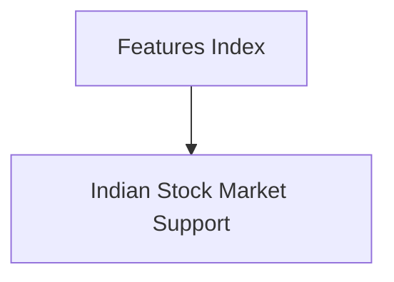

# Features Reference

## Visual Map

Cross-cutting feature documentation for Hushh and Kai product capabilities.

Each page covers a shipped feature's scope, architecture, integration points, and operational requirements.

## Contents

| Document | Description |
|---|---|
| [Indian Stock Market Support](./indian-market-support.md) | First-class NSE/BSE equity, index, and broker support — yfinance data provider with Zerodha/Upstox adapter skeletons |

## Placement

- Cross-cutting features that touch both backend and frontend belong here.
- Backend-only feature docs belong in `consent-protocol/docs/`.
- Frontend-only feature docs belong in `hushh-webapp/docs/`.
- Each feature doc must expose `## Visual Context` linking back to this index.

## Canonical Owner

This index is a child of the [Kai Index](../kai/README.md). Use that map for the top-down product surface view.
