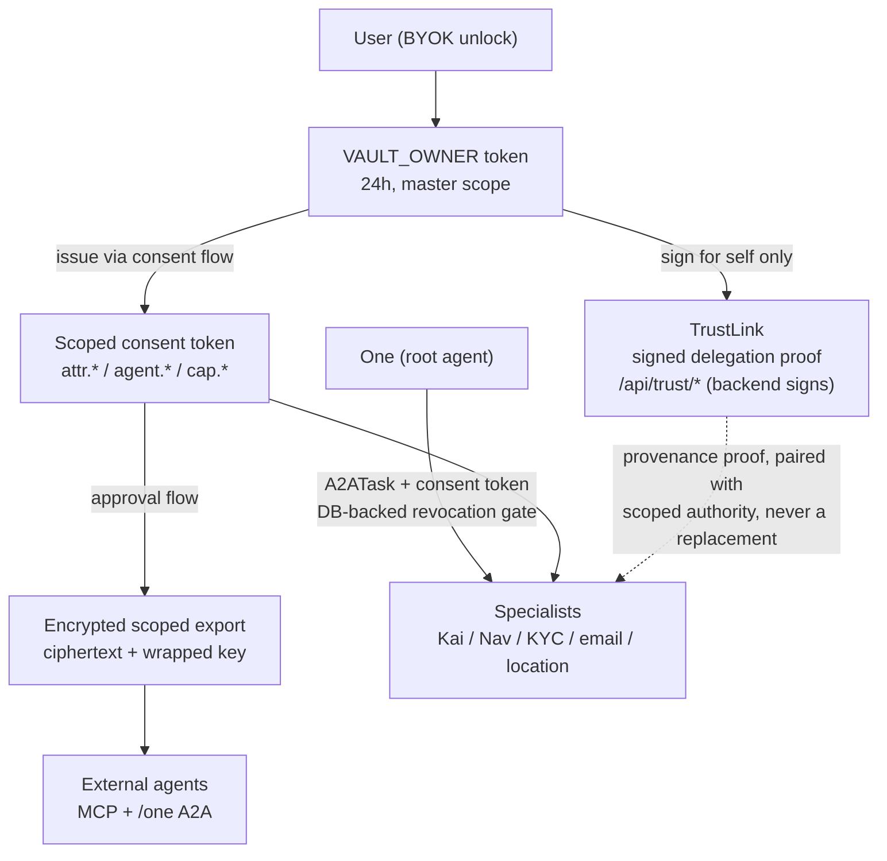

# Agent Delegation Boundary

## Visual Context

Canonical visual owner: [IAM Reference](README.md). This page defines how delegated agents receive authority under that IAM model.



## Purpose

Define the current boundary between consent tokens, encrypted scoped exports, TrustLinks, and A2A specialist delegation.

This is an implementation contract, not a roadmap. It exists because Hussh has more than one delegated-agent path and those paths must not be treated as interchangeable.

Durable principles behind this contract live in the Project-Wide Agent Architecture Doctrine in `AGENTS.md` (statefulness decided by runtime topology — the shared hub dumb by default, a per-user pod an intelligent private agent with its own encrypted memory — delegation as a wrapped function of current behavior, per-hop scoped encrypted exports, one routing authority per surface).

## Runtime Authority Types

| Authority | Current use | Data boundary |
| --- | --- | --- |
| `VAULT_OWNER` token | First-party vault-owner routes after BYOK unlock | Owner-only, memory-carried, broad scope; must not be handed to external agents |
| Scoped consent token | MCP tools, developer API, Agent One A2A, specialist A2A gates | Bounded by `scope`, `user_id`, expiry, revocation, and caller checks |
| Encrypted scoped export | External connector or MCP agent data release | Ciphertext plus wrapped export-key metadata only; connector decrypts locally |
| TrustLink | Signed A2A delegation proof for MCP/native delegated-agent flows | Proof of delegation; not a data export and not sufficient without scope validation |
| Device capability token | One Location device-to-device grants | Signed HCT capability scoped to the exact workflow, recipient, and expiry |

## TrustLink Contract

A TrustLink proves that one agent delegated a scoped task to another agent for a user.

Current implementation:

1. `create_trust_link` signs `from_agent`, `to_agent`, `scope`, creation time, expiry, `signed_by_user`, and optional `session_id`.
2. `verify_trust_link` verifies expiry and HMAC integrity.
3. When `expected_session_id` is provided, verification also rejects cross-session replay.
4. `is_trusted_for_scope` verifies both the requested scope and the TrustLink proof.
5. The backend is the single signing authority: `POST /api/trust/create-link` (requires `VAULT_OWNER`; users sign only for themselves) and `POST /api/trust/verify-link` (pure verification). The Capacitor consent plugin delegates both operations to these routes on every platform; devices never sign locally because they never hold the signing key.

A TrustLink is not a vault key, not a consent token, and not an encrypted export. It should be paired with the relevant scoped consent or export boundary before any private data leaves the current trust boundary.

One Voice adds a preceding, generated route-admission check for its own
generated actions and A2A specialist turns. The route index can refuse a
specialist outside its declared workspace, but it neither signs nor verifies a
TrustLink and never replaces scoped consent, export, or TrustLink validation.

Evolution note: TrustLinks are the reserved delegation-provenance primitive. When specialist dispatch crosses a process or network boundary, per-hop delegation rides ADK's Task API with TrustLink-shaped provenance attached (see the Agent Architecture Doctrine); until then in-process dispatch relies on scoped consent tokens with DB-backed revocation at the specialist gates.

## External MCP Agent Boundary

External agents and connectors use the strict zero-knowledge export path:

1. discover available domains/scopes
2. request explicit user consent
3. validate the approved scoped token
4. receive `encrypted_data`, `iv`, `tag`, and `wrapped_key_bundle`
5. decrypt locally with the connector private key

Hosted MCP code must not return plaintext user data or plaintext export keys to developer callers.

## Internal A2A Boundary

Agent One and internal specialists use A2A tasks and scoped consent-token gates.

The current One-led app-agent hierarchy is mapped in [One Agent Hierarchy](../one/one-agent-hierarchy.md). Use that registry to distinguish product/runtime agents from Codex read-only engineering subagents.

Current implementation facts:

1. The contained Agent One invocation preview requires `X-Consent-Token` scoped `cap.one.invoke` and checks the token app against the developer principal. This endpoint is not official A2A v1; official Tasks remain release-blocked by the pinned ADK/a2a-sdk incompatibility.
2. Specialist A2A scopes are centralized in `SPECIALIST_A2A_SCOPE_MAP`.
3. `VAULT_OWNER` remains a token hierarchy superset and can satisfy specialist scopes in first-party owner routes.
4. In-app compatibility routes may still pass the vault-owner token into internal specialist work.

The target rule is stricter: before a specialist crosses an external, vendor, process, or network boundary, the caller should pass either an attenuated specialist token or a strict encrypted scoped export, not raw `VAULT_OWNER`.

## Required Checks

Use these checks when this boundary changes:

```bash
cd consent-protocol && python3 -m pytest tests/test_trust.py tests/test_trust_link_session_binding.py tests/test_trust_routes.py tests/test_a2a_delegation_scopes.py -q
cd consent-protocol && python3 scripts/verify_adk_a2a_compliance.py
cd consent-protocol && python3 -m pytest tests/test_developer_response_bounds_cwe400.py tests/test_consent_exports_ttl_eviction.py tests/test_pkm_preview_cache_lru_privacy.py -q
```
