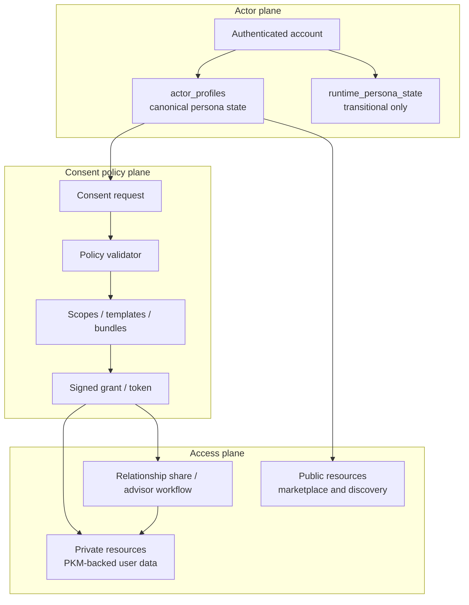

# IAM Architecture

## Visual Map

## Purpose

Define identity, actor boundaries, and consent IAM control flow for Investor + RIA experiences.

Founder-language translation for this doc:

- `Capability Tokens`: the current token model built from `VAULT_OWNER`, consent tokens, and delegated scoped tokens
- `PCHP`: the public approval handshake that results in app-scoped consent and encrypted export access
- `TrustLink / A2A delegation`: delegated-agent authority described in [Agent Delegation Boundary](./agent-delegation-boundary.md)
- `Separation of Duties`: the split between actor identity, policy validation, private data access, and public discovery surfaces

## Invariants

1. Cryptographic Primitives: no plaintext-at-rest for private user data.
2. Capability Tokens + PCHP: private data access requires active consent-token scope and explicit approval.
3. Separation of Duties: web, iOS, and Android must keep route/contract parity.
4. Least privilege: scopes are domain/path-specific by default.

### Commercial Consent Attribute

Commercial usage is a signed consent-token attribute, not a billing system and not a replacement for audit rows.

1. Tokens without the commercial marker remain non-commercial for backward compatibility.
2. Commercial tokens include the marker in the signed payload, so the marker cannot be appended or stripped after issuance.
3. Runtime enforcement is explicit: a monetized operation must validate with `require_commercial=True`.
4. Critical routes should use the DB-backed validation path so commercial checks and revocation checks stay on the same authority path.

## Actor Model

1. `investor`: subject and owner of personal financial context.
2. `ria`: advisor actor that requests scoped access.
3. `firm`: optional organizational context for advisor membership and policy.
4. `admin_ops`: operational role for verification/review workflows.

A single authenticated account may hold both `investor` and `ria` personas. Runtime defaults to `last_active_persona`.

### Persona State Model

1. `actor_profiles.last_active_persona` is the canonical persisted persona state.
2. `runtime_persona_state` is transitional compatibility state only.
3. Runtime state exists solely to preserve the "same account, entering RIA setup before full activation" path.
4. Once an account truly holds both personas, `actor_profiles` owns the persisted actor context and runtime state must not override it.

## Route Model

1. Investor route tree remains under existing Kai surfaces.
2. RIA route tree is isolated under `/ria/*`.
3. Shared discovery entry is `/marketplace` with dual-sided tabs.
4. Shared workflow hub is `/one/consent`; `/consents` is inbound compatibility only.
5. `/ria/requests` is a compatibility alias into the consent center, not a first-class workflow surface.

## Consent IAM Control Plane

1. Requester submits actor-aware consent request.
2. Policy validator checks actor status, scope family, and duration bounds.
3. Investor receives pending request and can approve/deny/revoke.
4. Active token grants scoped access only to approved domains/paths.
5. Revocation and expiry immediately remove access rights.
6. Connection provenance does not widen or narrow later consent policy: active
   request-accepted and contact-sync relationships are evaluated identically by
   owner-configured relationship rules. A connection alone grants no private
   information or live-location capability.

## Ecosystem Contract Mapping

1. Agents: consume only consent-approved data slices.
2. Operons: perform business logic only after scope check in calling path.
3. MCP: external/tool access remains token-scoped and audit-backed.
4. A2A: delegated actions inherit consent boundaries; no scope escalation. TrustLinks are signed delegation proofs, not standalone data-access grants.
5. Tamper-Evident History: reviewable consent and share history comes from the audit tables and verification artifacts checked into the current runtime.
5. ADK checks: route/contract/compliance gates must pass before release.

## Public vs Private Boundary

Public discovery data may be shown in marketplace cards.
Private data is always consent-gated and scoped.

### Contact-sync relationship boundary

1. Contact sync has one combined, explicit setting: verified people who already
   hold the account's verified phone number may find and automatically connect
   with it. The setting defaults off and records the exact authored disclosure,
   a server enablement timestamp, and a monotonic consent-rule version. Enabling
   without `contact_find_auto_connect_v1` fails, so legacy default-on state or an
   older findability-only client is not relationship consent.
2. Every current, unambiguous verified-phone match that passes that setting is
   connected immediately. A requester may also map an exact verified-phone
   proof to a canonical relationship that is already active, because that
   person is already visible in the requester's ONE graph. When the target is
   not currently discoverable, this recognition adds no contact-sync origin or
   Trusted/Circle projection. An explicit disconnect tombstone remains dominant:
   without current target consent, a revoked pair is not disclosed at all; with
   current consent, it is reported only as suppressed. A later explicit
   request/accept flow remains a separate user action.
3. Contact-sync provenance may create only the canonical relationship, its
   source ledger, cancellation of redundant unscoped pending requests, and the
   Trusted-list projection. A capability-bearing request stays pending for
   explicit scope review. Contact sync never grants location, PKM,
   personal-information, consent-scope, Circle sharing, SMS, envelope, or
   capability access.
4. Disabling the setting prevents discovery by new people and automatic edge
   creation. It does not hide an exact contact mapping to an already-active
   relationship. Existing relationships remain visible and individually
   disconnectable so preference changes do not silently destroy a user's graph.
5. iOS/native and Google Contacts share one country-aware E.164 normalizer and
   bounded hash/batch pipeline. Explicit international numbers ignore regional
   hints. A country code stored without `+` overrides the region only when it
   resolves to a valid mobile and the regional reading is not itself valid;
   ambiguous valid local numbers keep the region to prevent wrong-person
   matches. Google People's E.164 `canonicalForm` outranks its display value.
   Bare national numbers use the home SIM region first, then the signed-in
   account's verified-phone country, then locale. Unknown-region national
   numbers fail closed instead of being guessed.
6. A verified E.164 phone has at most one identity-cache owner. Migration 198
   clears every member of a legacy ambiguous group and forces its shadow stale
   for source-of-truth refresh; the database check and partial unique index stop
   malformed or duplicate verified bindings from returning.

### Storage Boundary

1. Relational tables own identity, consent workflow, verification/compliance, firm membership, public discovery, and query-heavy shared market datasets.
2. `pkm_blobs` stores encrypted user-owned private content only.
3. `pkm_index` stores sanitized metadata only.
4. RIA verification/compliance and relationship workflow do not belong in the PKM.
5. Live-location coordinates are never stored in the clear. The One Location Agent (`one_location_*` tables) persists ciphertext-only envelopes; recipient private keys stay on-device. The legacy plaintext prototype (`kai_location_*`) was removed in migration `069_drop_kai_location_plaintext.sql`.
6. Nearby presence is an explicit, short-lived workflow. A fresh point is used
   to resolve suggestions, and a new point is captured at final confirmation.
   The confirmed check-in point is persisted only as an authenticated encryption
   envelope plus a short-epoch server-keyed candidate token; accuracy is not
   persisted. Checkout clears both synchronously. Expiry synchronously blocks roster
   and Connect access; the next feature operation or required hosted hourly
   retention job scrubs the due envelope and token. Candidate tokens are
   broad-phase only: exact radius is rechecked against decrypted check-in points before
   roster or Connect authorization. Both people must remain explicitly active;
   a Connect edge or phone-verification flag alone is never presence consent.
   The GPS-spoofable verifier is non-production simulation code and fails
   closed in production.
7. The developer-token registry (`developer_applications`, `developer_apps`, `developer_tokens`) is defined by versioned migration `070_developer_registry.sql` and registered in `release_migration_manifest.json` (the `developer` lane); only peppered HMAC-SHA256 token hashes are stored, never raw tokens.
8. Connected Systems stores owner-scoped external record pointers separately
   from immutable workflow/audit history. A missing remote record is not an
   authorization failure: the backend reports a typed recovery state, and only
   explicit `VAULT_OWNER` confirmation may transition the local pointer from
   `active` to `disconnected`. This never invokes remote deletion.
9. `source_library` is a fixed, owner-managed PKM capability boundary. Every
   `attr.source_library.*` form is non-discoverable and non-authorizing, and the
   domain cannot publish a public-profile projection. Mounted provider files remain
   authoritative blobs; encrypted PKM holds private semantic/control memory; and
   profile-scoped SQLite holds only rebuildable opaque mapping and operation state.
   Filesystem-first sharing uses a pinned object revision plus an opaque `share_ref`
   and owner-bound mounted target. A SQLite row is neither access authority nor
   revocation proof, and Hermes does not claim verified provider ACL recipients.
   Hermes additionally derives local Source Library encryption from the unlocked
   vault key plus a device-only, local-user-presence Data Protection Keychain
   secret. This is Keychain protection, not a Secure Enclave key claim.

### Device-to-Device Capability Tokens

Cross-device sharing rides the consent protocol as a standard. A live-location grant mints a signed HCT consent token scoped `cap.location.live.view`, bound to a `device:<recipient_user_id>` agent identity, expiring with the grant. The recipient device exercises this token as its capability; the backend validates signature, expiry, and scope before accepting any ciphertext envelope. This makes the grant's authority a verifiable cryptographic capability rather than a descriptive column.

### First-Party Hermes Trusted Devices

Hermes is an additive first-party device surface, not a developer-token
elevation:

1. Firebase OAuth identifies the account through Authorization Code + PKCE.
2. A registered P-256 device key proves the exact Hermes installation.
3. The approval browser may reuse an RP-compatible One passkey to unwrap and
   hash-validate the vault key locally, seal it to an ephemeral Hermes key, and
   attach ciphertext to the one-time authorization. The PKCE exchange consumes
   that ciphertext exactly once.
4. If no usable passkey exists, Hermes fetches the mandatory passphrase wrapper
   and unwraps it through a native masked prompt. The passphrase and plaintext
   vault key never enter Hussh infrastructure or model context.
5. A signed, single-use device challenge permits a 15-minute
   device-bound `VAULT_OWNER` capability.
6. PKM ciphertext and `PkmMutationPlanV2` continue through the existing
   validation/store endpoints and optimistic concurrency contract.
7. Developer tokens remain application identity only. They never map to
   `VAULT_OWNER`, PKM write, vault unwrap, or a trusted-device credential.

The 15-minute capability is an automatically renewable in-memory lease, not
the trusted-device lifetime. Device registration and Keychain-bound local
custody remain durable until lock, disconnect, or revocation. Hermes uses the
native connector for owner writes; the hosted MCP handshake is unchanged.

Postgres `pkm_events.id` is the metadata-only encrypted-replica cursor today.
Trusted devices fetch current ciphertext through the existing snapshot
contract, and revision-safe domain deletion leaves a durable tombstone. This is
the replaceable outbox seam for future Redis/Memorystore fan-out.

Postgres owns one-time codes, nonce replay protection, device state, and
metadata-only audit today. `TrustedDeviceStore` is the replaceable seam for a
future Redis/Memorystore replay and revocation fan-out adapter.

Canonical enrollment, custody, failure, and UAT verification contract:
[Hermes Trusted-Device Vault Enrollment](./hermes-trusted-device-vault-enrollment.md).

## Change Control

Any IAM contract change must update, in the same PR:

1. This architecture doc
2. Relevant API/route contracts
3. Validation checklist
4. Dependency policy (if external provider behavior changes)
