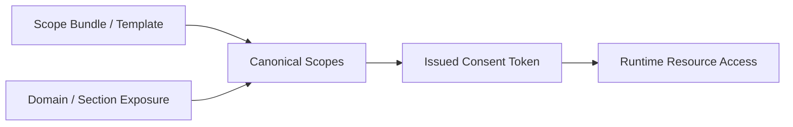

# Consent Scope Catalog

## Visual Map

## Purpose

Define canonical scope families and template policy for Investor + RIA consent requests.

## Namespace Policy

1. User-private PKM scopes use `attr.{domain}.{path}.*`.
2. Domain wildcards use `attr.{domain}.*` only when exposure rules allow the full top-level domain to be shared.
3. Relationship-share entitlements such as `ria_active_picks_feed_v1` are separate from `attr.*` PKM scopes.
4. Live location uses `cap.location.live.*` capability scopes, not
   `attr.location.*` PKM scopes. `attr.location.*` remains for durable
   user-approved preferences or PKM facts, not live coordinates.
5. No broad cross-domain wildcard scopes are allowed by default.
6. Public profiles are owner-published resources addressed by an opaque
   `public_profile_handle`; they are not `attr.*` scopes and never authorize
   private PKM access.
7. One-to-One capabilities are proposed with server-issued opaque handles in
   `connection_scope_proposals`. A connection is accepted separately from its
   scopes; only the capability owner can activate a requested handle, and an
   offered handle requires recipient opt-in. Proposal metadata never contains
   PKM content or authorizes an `attr.*` export.
8. `source_library` is a reserved owner-managed capability boundary, not a
   shareable PKM scope. Every `attr.source_library.*` form is non-discoverable,
   non-requestable, non-issuable, and non-authorizing.
9. `wallet` is a reserved owner-managed PKM domain that is deliberately
   shareable, unlike `source_library`: exactly two branch wildcards,
   `attr.wallet.summary.*` (nickname, brand, last4, expiry, issuing
   region) and `attr.wallet.secrets.*` (PAN, CVV, PIN, cardholder
   name), are externally requestable, and every grant is an explicit owner
   approval delivered through the encrypted-export path. The domain wildcard,
   exact-path scopes, and public projection stay closed. Natural-language
   structuring can never invent or repurpose the domain, and scope display
   metadata carries a `reserved` indicator so chat and consent surfaces render
   reserved-domain grants distinctly from ordinary dynamic ones.

### Source Library object-share boundary

Source Library sharing addresses one pinned file revision or one reviewed
knowledge artifact through an opaque `share_ref` and an owner-bound mounted
share target. The reference is local mapping state; it does not become an
`attr.*` scope, reveal PKM content, grant a provider ACL, or prove that a named
recipient can access the target. Publication and revocation complete only when
the deterministic filesystem operation succeeds and the resulting artifact
state is reconciled.

## Display Metadata Contract

Consent UIs and MCP discovery surfaces should not hand-author labels for dynamic scopes.
Scope presentation resolves from:

1. domain contracts for canonical domain display metadata
2. dynamic scope helpers for label and description generation
3. optional bundle metadata for common consent entrypoints

Expected display metadata fields:

1. `label`
2. `description`
3. `icon_name`
4. `color_hex`

Scope discovery also returns server-derived origin metadata:

| Scope family | `scope_origin` | `scope_origin_code` | `source_kind` |
| --- | --- | --- | --- |
| Reserved capability or operation scope | `reserved` | `r` | `reserved_registry` |
| Manifest-generated `attr.*` scope | `dynamic` | `d` | `manifest_branch` |

Origin metadata is diagnostic only. Authorization continues to use the exact canonical
scope string, token, grant, registry handle, and consent policy. Existing `attr.*` strings
and handles are never renamed to insert the origin code. Retired and unknown values remain
non-authorizing.

## Template Catalog (V1)

| Template ID | Actor Direction | Scope Set | Default Duration |
| --- | --- | --- | --- |
| `ria_financial_summary_v1` | RIA -> Investor | `attr.financial.*` | `7d` |
| `ria_risk_profile_v1` | RIA -> Investor | `attr.financial.risk.*`, `attr.professional.*` | `7d` |
| `investor_advisor_disclosure_v1` | Investor -> RIA | `attr.ria.disclosures.*`, `attr.ria.strategy.*` | `7d` |

## Common Scope Bundles

These are UX bundles, not a second authorization system. Bundles expand into canonical scopes before consent issuance.

| Bundle Key | Intended UX Label | Representative Scope Set |
| --- | --- | --- |
| `financial_overview` | Financial Overview | `attr.financial.portfolio.*`, `attr.financial.profile.*`, `attr.financial.documents.*` |
| `full_portfolio_review` | Full Portfolio Review | `attr.financial.*` |
| `risk_assessment` | Risk Assessment | `attr.financial.profile.*`, `attr.financial.portfolio.*` |
| `health_wellness` | Health & Wellness | `attr.health.*` |
| `lifestyle_preferences` | Lifestyle Preferences | `attr.food.*`, `attr.travel.*`, `attr.entertainment.*`, `attr.shopping.*` |

## One Location Agent Capability Scopes

These are workflow capabilities rather than durable PKM attributes.
`phone_verified = true` is an eligibility signal only and does not imply
consent.

| Scope | Intended Use |
| --- | --- |
| `cap.location.live.share` | Owner creates a duration-bounded live-location grant |
| `cap.location.live.view` | Exact approved recipient reads ciphertext for an active grant |
| `cap.location.live.request` | Verified user requests access from an owner |
| `cap.location.live.revoke` | Owner revokes active grant |
| `cap.location.live.refer_request` | Recipient refers another verified user into a request flow |

Consent and audit metadata for these scopes may include actor ids, request ids,
grant ids, duration, timestamps, status, and reason codes. It must not include
coordinates, addresses, map previews, or movement traces.

Standing auto-approval is off by default and names either all currently
eligible Location contacts or one explicit Circle. The first-party client may
pre-screen pending requests for responsiveness, but that snapshot is not
authority. When it submits an automatic approval, the backend verifies that the
request arrived after the standing rule was enabled, then revalidates the
requester against the named relationship scope under the same lock that writes
the grant. An active contact-sync connection is evaluated by the same
`all_contacts` rule as an active request-accepted connection; the pre-existing
standing rule and the later location request remain the authority, while the
connection alone grants no location access. Every approval declares `manual`
or `automatic`; missing intent is
rejected so an older automatic client cannot fall through to the manual path.
A Circle rule is limited to an active, person-created Circle owned by
the approving user. A relationship removed before the mutation, a pre-existing
request, or a partial rule fails closed and leaves the request pending. Manual
owner approval remains a separate explicit-consent path and may answer a direct
request from a new person. A standing rule never approves `until_stopped`;
ongoing access always requires an explicit owner decision.

## One Nearby Presence Capability Scopes

Nearby presence is short-lived workflow state, separate from
`cap.location.live.*`. These actions require a fresh first-party VAULT_OWNER
session plus explicit in-flow confirmation; the scopes remain internal
capability vocabulary and are not externally requestable.

| Scope | Intended Use |
| --- | --- |
| `cap.location.nearby.publish` | Publish a 30/60/120-minute opted-in presence after final-point and selected-place verification |
| `cap.location.nearby.discover` | Read only the caller's active, exact-radius, mutually opted-in nearby projection |
| `cap.location.nearby.revoke` | Check out, clear anchor material, and immediately remove the caller from discovery |

These scopes never authorize a location grant. Accuracy is request-memory-only.
Allowed active persistence is limited to the confirmed check-in point and safe
place label inside AES-256-GCM ciphertext, a short-epoch keyed
candidate token, rotating attendee alias, fixed radius, consent/audience
posture, status, and expiry metadata. Plaintext coordinates, exact distance,
provider place ids, place labels, roster contents, email, phone, and stable
public user ids are forbidden in nearby-presence persistence, logs, analytics,
and audit metadata. Peer responses expose none of the encrypted anchor fields.

### One Place Rating Capability Scopes

| Scope | Intended Use |
| --- | --- |
| `cap.location.place_rating.publish` | Save the caller's own 1–5 star rating for a place they were recorded at |
| `cap.location.place_rating.discover` | Read an anonymous per-place average that meets the publication threshold |
| `cap.location.place_rating.revoke` | Delete the caller's rating and remove it from the average |

**A narrow, named exception to the paragraph above.** A rating cannot exist
without a durable link between a person and a venue, which nearby presence
exists to prevent. Rather than leave the contract and the schema disagreeing,
the exception is stated here and bounded to two tables:

- `one_location_nearby_visits` may hold the provider place id and place label
  **only inside AES-256-GCM ciphertext**, owner-bound by AAD exactly as the
  presence anchor is, alongside a server-keyed equality token. Rows expire and
  are purged. This table also carries the check-in continuity anchor, which the
  presence row deliberately destroys on checkout.
- `one_location_place_ratings` may hold a **plaintext** provider place id and
  place label, permanently. A row is created only when its author accepts
  `one-location-place-rating-v1`, a named consent that says in words that being
  at the place is what makes them eligible to rate it.

Everything else in the paragraph above is unchanged, and this exception grants
nothing further: a rating is private to its author, no read projection may
return an author identifier of any kind next to a place id, review text is
never stored server-side, and the only cross-user projection is an anonymous
count and average, withheld below the publication threshold and reported in
buckets so that polling cannot recover an individual rating by subtraction.
Places in health, worship, legal, funeral and shelter categories never carry a
public average at all.

### Capability token enforcement

Each live-location grant mints a signed HCT consent token scoped
`cap.location.live.view`, bound to a `device:<recipient_user_id>` agent identity,
and expiring with the grant. The token is the cryptographic capability the
recipient device exercises; it is persisted in the grant's metadata and
validated (signature, expiry, scope) before any ciphertext envelope is accepted.
Grants created before per-grant minting carry no token and fall back to the
DB-backed status and expiry checks, so the change is backward compatible.

### Zero-knowledge envelope model

Live coordinates are never stored in the clear. Recipient devices generate an
ECDH P-256 keypair locally and register only the public key
(`one_location_recipient_keys`). Senders derive a per-message shared secret with
an ephemeral key and AES-256-GCM, and the backend persists ciphertext-only
envelopes (`one_location_envelopes`). The legacy plaintext prototype
(`kai_location_*`, migration 060) was removed in migration
`069_drop_kai_location_plaintext.sql`; the One Location Agent
(`one_location_*`) is the only live-location system.

## One Email Disclosure Bundles

One Email KYC/dev-UAT disclosure workflows use the same bundle metadata pattern
for user-confirmed candidate scopes. One detects text-only requested domains
against the vault owner's current consumer-visible scope inventory, the vault
owner confirms or narrows the recommendation, and each selected canonical scope
becomes its own consent request under one `bundle_id`.

Representative selected scopes:

1. `attr.identity.*` for KYC/compliance identity disclosures.
2. `attr.financial.*` for explicit full financial-information requests.
3. `attr.financial.portfolio.*`, `attr.financial.profile.*`, or `attr.financial.documents.*` for narrower financial requests.
4. Any consumer-visible dynamic `attr.<domain>.*` or `attr.<domain>.<path>.*`
   scope already available for the user, such as `attr.travel.*` for favorite
   locations or `attr.food.*` for food preferences.

Each dynamic PKM scope has one visibility posture:

1. `Private`: the section is hidden from external discovery.
2. `Ask first`: the section is discoverable by label, but data still requires consent and a strict zero-knowledge encrypted export.
3. `Available by default`: the user has published a safe consumer-visible projection that authenticated connectors can read without creating a consent request.

`Available by default` never means raw PKM, `pkm.read`, internal manifests, hashes, provenance, workflow artifacts, or broad encrypted blobs. It is a narrow projection path with audit events and revocation state.

Denied selected scopes block external reply-all. Missing fields inside an
approved export are described in the client-generated draft; the backend never
decrypts or drafts from the scoped data.

## Agent Coordination Scopes

Agent coordination scopes authorize bounded agent entrypoints. They do not
replace specialist scopes or PKM/data scopes.

| Scope | Intended Use |
| --- | --- |
| `cap.one.invoke` | Create or resume an Agent One task; grants no private-data read or mutation authority |
| `agent.kai.analyze` | Invoke Kai for finance, portfolio, market, and RIA/investor analysis |
| `agent.wallet.manage` | Invoke the Cards specialist for storing, listing, and revealing wallet cards; control-plane only, never a `wallet` data read |
| `agent.nav.review` | Invoke Nav for privacy, consent, vault, deletion, and scope-review guidance |
| `agent.kyc.process` | Invoke KYC for identity workflow state and approval-gated KYC processing |

Specialist execution remains scoped at the specialist boundary. A caller using
The contained external invocation preview presents `cap.one.invoke`; any delegated
specialist entrypoint validates its own required scope before doing specialist
work. First-party in-app compatibility paths may still carry `vault.owner`
through the token hierarchy; do not use that pattern for external, vendor,
network, or cross-process specialist boundaries. See
[Agent Delegation Boundary](./agent-delegation-boundary.md).

## Consent Lifecycle From Agent Chat

One can run the person-to-person lifecycle from chat on the same service
layer the REST routes use (`hushh_mcp/services/consent_lifecycle_service.py`,
`information_request_service.py`), never on a second copy of a ledger write.

| Step | Chat surface | Guard |
|---|---|---|
| Discover | `discover_person_information` (connections, then the directory) | VAULT_OWNER re-validated; labels and opaque `psr_` refs only |
| Propose | `propose_information_request(person, fields, purpose, duration_hours)` parks a proposal under an opaque id | fields matched by label or domain; 8 to 500 character purpose; 1 to 720 hours |
| Request | `consent.request` (backend-direct, `confirmed: true` after a spoken yes) | proposal re-resolved through `resolve_scope_refs`; requires the requester's active client connector, else One points to the profile once |
| Pending | `list_pending_information_requests` | the browser renders each request as the existing pending-consent card |
| Approve | the owner's tap on that card | never a tool: the export is encrypted under the vault key in the owner's browser |
| Deny / revoke / cancel | `consent.deny`, `consent.revoke`, `consent.cancel_request` (backend-direct, spoken yes) | same ledger writes as `/api/consent/pending/deny`, `/api/consent/revoke`, `/api/one/information-requests/{bundle}/cancel` |

The four `consent.*` actions are `BACKEND_DIRECT_VERBAL_CONFIRMATION_IDS`: the
spoken `confirmed` slot is the gate, and the person's tap-confirmation
preference does not park a browser directive for them (nothing on any page
could run it). The model never sees a raw `attr.*` scope, and One is told to
say nothing was sent, denied, or revoked until the action result says so.

## Duration Policy

1. Presets: `24h`, `7d`, `30d`, `90d`
2. Custom duration allowed up to `365d`
3. No no-expiry grants

## Validation Rules

1. Actor direction must match template policy.
2. Requested scopes must belong to allowed namespace family.
3. Requested scope must be allowlisted in the template.
4. Requests above duration cap are rejected.
5. Unverified `ria` requester is rejected.
6. Bundle-driven requests must expand to canonical scopes before token issuance.
7. Disabled PKM top-level sections must not be surfaced as discoverable scopes.
8. Source Library discovery must return no `attr.source_library.*` scope; stale
   grants, tokens, registries, and forged manifests cannot restore one.

## Audit Metadata Contract

Consent request events should include:

1. `template_id`
2. `template_version`
3. `scope_count`
4. `duration_mode`
5. `duration_hours`
6. `requester_actor_type`
7. `subject_actor_type`
8. `requester_entity_id`

## Compatibility Rules

1. Keep compatibility with dynamic scope resolver conventions.
2. Never mutate historical template semantics in place.
3. Introduce new template versions with explicit migration note.
4. Deprecated legacy domain aliases may resolve to canonical PKM domains, but new callers must use the canonical keys directly.
