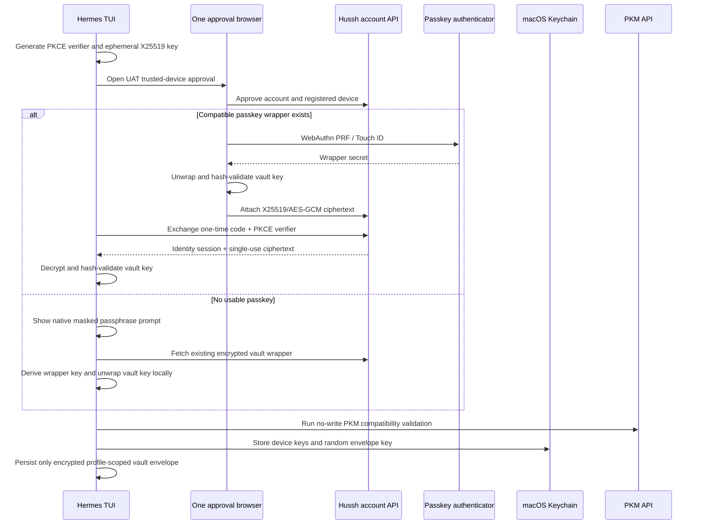

# Hermes Trusted-Device Vault Enrollment

> Canonical current-state contract for linking a local Hermes profile to One,
> reusing an existing passkey when possible, and retaining the passphrase path
> as the universal BYOK fallback.

## Visual Map

## Product Contract

The integration has two intentionally separate lanes:

1. The hosted Hussh MCP remains the consent-gated path for external agents.
   Reads use PCHP scopes and encrypted exports. Developer tokens identify
   applications and never become vault-owner credentials.
2. The native Hermes adapter is a first-party trusted-device path for the
   owner. It can create, update, merge, and delete PKM information only after
   local approval, optimistic-concurrency validation, and acquisition of a
   short-lived device-bound `VAULT_OWNER` action capability.

The native lane does not add tools to the hosted MCP handshake. Durable access
comes from a revocable trusted-device registration plus a Keychain-bound local
encrypted envelope. The `VAULT_OWNER` bearer is deliberately short-lived and
renewed only when an approved action needs it.

## Enrollment State Machine

| Local state | Command/UI action | Result |
| --- | --- | --- |
| Not connected | `/hussh-one connect` | Opens browser OAuth/PKCE approval |
| Connected, remote vault exists | Automatic continuation or `/hussh-one enroll` | Attempts passkey reuse, then masked passphrase fallback |
| Connected, no remote vault | Automatic continuation or `/hussh-one enroll` | Creates passphrase and recovery wrappers through native protected UI |
| Enrolled and locked | `/hussh-one unlock` | Opens the Keychain-bound local envelope |
| Enrolled and unlocked | `/hussh-one lock` | Clears vault key and action credentials from memory |
| Any connected state | `/hussh-one disconnect` | Revokes the device and removes local custody |

Browser identity is authoritative. Hermes displays the server-verified email
returned by the exchange; an email typed into chat, a URL, or configuration is
never accepted as identity.

## Passkey Fast Path

Every valid vault retains its mandatory passphrase wrapper. Passkey wrappers
are optional quick-unlock wrappers for the same 32-byte vault key.

The approval browser:

1. Reads the authenticated encrypted vault state.
2. Selects a passkey wrapper compatible with the current WebAuthn RP.
   An exact hostname RP is preferred, then a compatible parent RP, then the
   most recently used wrapper.
3. Invokes WebAuthn PRF using that wrapper's exact credential, PRF salt, and RP.
4. Decrypts that exact wrapper rather than reselecting by method.
5. Verifies the unwrapped vault key against `vaultKeyHash`.
6. Seals the vault key to Hermes's ephemeral X25519 public key with
   AES-256-GCM.

Authenticated information binds the ciphertext to:

- OAuth state;
- trusted-device authorization and device identifiers;
- owner identifier;
- authorization expiry;
- vault-key hash;
- selected wrapper identifier and RP ID;
- UAT or production environment;
- recipient ephemeral public key.

The browser attaches ciphertext only to the pending authorization. The account
API returns it only when the matching PKCE verifier atomically consumes the
one-time code. The backend never receives plaintext vault material.

Hermes discards the ephemeral private key after success, timeout, or failure.
It re-reads the remote vault state and validates the decrypted key hash before
creating its existing Keychain-bound envelope.

## Passphrase and First-Vault Fallback

Passkey reuse is an optimization, never a prerequisite. Hermes immediately
continues with the native masked passphrase ceremony when:

- no passkey wrapper exists;
- the stored RP is incompatible;
- WebAuthn PRF or browser X25519 is unavailable;
- Touch ID is canceled;
- the wrapper is stale or corrupt;
- the PKCE-bound ciphertext is missing or invalid;
- vault hash or readiness validation fails.

For an existing vault, the passphrase derives the wrapper key and unwraps the
same canonical vault key locally. For a first vault, Hermes generates the vault
key and creates the existing mandatory passphrase and recovery wrappers. The
recovery key is shown once through native protected UI and must be acknowledged
before persistence.

No passphrase, recovery key, PRF output, raw vault key, refresh token, or owner
token may enter chat, model context, MCP configuration, environment variables,
redirect URLs, logs, traces, screenshots, or committed files.

## Account API Contract

| Method | Route | Purpose |
| --- | --- | --- |
| `POST` | `/api/account/trusted-device-authorizations` | Create a short-lived PKCE-bound device authorization |
| `POST` | `/api/account/trusted-device-authorizations/{authorization_id}/vault-handoff` | Attach bounded X25519/AES-GCM ciphertext once |
| `POST` | `/api/account/trusted-device-authorizations/exchange` | Atomically consume PKCE, activate the device, and return optional ciphertext |
| `GET` | `/api/account/trusted-devices` | List the owner's devices |
| `DELETE` | `/api/account/trusted-devices/{device_id}` | Revoke a device |
| `POST` | `/api/consent/vault-owner-token/device` | Issue a short-lived action capability after signed nonce proof |

Migration `124_trusted_device_vault_handoff.sql` adds only `oauth_state` and a
short-lived JSONB ciphertext envelope to the authorization record. Postgres is
the shared replay and state tier today behind `TrustedDeviceStore`; that port
can move nonce/revocation fan-out to Redis or Memorystore without changing the
route contract.

## Local Custody and PKM Behavior

macOS Keychain stores:

- the durable P-256 device signing key;
- the Firebase refresh credential;
- the random local envelope-wrapping key.

For the private Source Library plane, Hermes also uses a distinct random local
custody secret in the macOS Data Protection Keychain. It is configured as
`WhenUnlockedThisDeviceOnly`, non-synchronizable, and local-user-presence
protected. Source Library AES-GCM keys derive from both that secret and the
unlocked vault key, with profile, owner, device, purpose, and record identity
bound as authenticated data. The secret is cached only while the bridge is
unlocked, then zeroized on lock, profile change, revocation, or disconnect.

This is device-bound Keychain + LocalAuthentication protection, **not** a
non-exportable Secure Enclave key. A future Secure Enclave `SecKey` adapter
would require a new device registration and recovery lifecycle; it is not
silently substituted for the current custody contract.

The Hermes profile stores only:

- server-verified non-secret identity metadata;
- the AES-GCM-encrypted vault-key envelope;
- ciphertext-only PKM replicas and metadata cursor.
- encrypted Source Library records, artifacts, and sealed SQLite columns; the
  rebuildable SQLite mapping plane retains only opaque references and lifecycle
  metadata in plaintext.

The raw vault key and short-lived tokens stay in process memory. Native PKM
writes remain proposal-first. The local approval shows affected domain and
paths, mutation summary, sharing/export impact, and stale-scope risk. Commit
re-reads the current revision, constructs `PkmMutationPlanV2`, encrypts locally,
and uses the existing validation/store contract. Conflicts reload and
recompute; they never silently overwrite newer information.

## Failure, Recovery, and Revocation

| Failure | Required behavior |
| --- | --- |
| Browser approval expires or state/PKCE mismatches | No device activation; restart connect |
| Passkey or encrypted handoff fails | Continue through protected passphrase flow |
| Wrong passphrase or corrupt wrapper | Stay locked; retain connected identity |
| Remote vault appears during first-vault creation | Do not replace it; restart normal enrollment |
| Remote vault persists but local envelope fails | Report remote creation and re-enroll with the passphrase |
| Keychain unavailable or locked | Fail closed without local envelope |
| Source Library custody missing with existing ciphertext | Fail closed as recovery/rebuild required; never generate a replacement secret |
| Device revoked | Block refresh, owner-capability issuance, unlock recovery, and writes |
| PKM compatibility validation fails | Keep the bridge locked and update client/server contract |

Disconnect revokes the remote device, removes the native connector
registration, deletes the local envelope and ciphertext replica, removes
related Keychain entries and the local Source Library plane, and clears in-memory credentials. Hosted MCP and
existing vault wrappers remain unchanged.

## UAT Verification

Current rollout is macOS-only, UAT-only, feature-flagged, and allowlisted.
Verification requires:

1. browser approval with the expected verified account;
2. both passkey reuse and protected-passphrase fallback;
3. shared TypeScript/Python X25519-AES-GCM golden-vector parity;
4. no-write PKM compatibility validation;
5. an approved isolated synthetic write and encrypted read-back;
6. lock/restart recovery;
7. disconnect and remote revocation proof;
8. confirmation that logs and artifacts contain no credentials or decrypted
   PKM information.
9. signed macOS proof that Source Library custody is a Data Protection Keychain,
   device-only, local-user-presence item; cancellation and locked-device access
   fail closed.

Production selection must use an allowlisted immutable environment bundle. It
must not accept arbitrary origins, and switching environments requires
disconnecting and clearing local custody first.

## Related References

- [IAM Architecture](./architecture.md)
- [IAM Validation Checklist](./validation-checklist.md)
- [Backend trusted-device handoff](../../../consent-protocol/docs/reference/trusted-device-vault-handoff.md)
