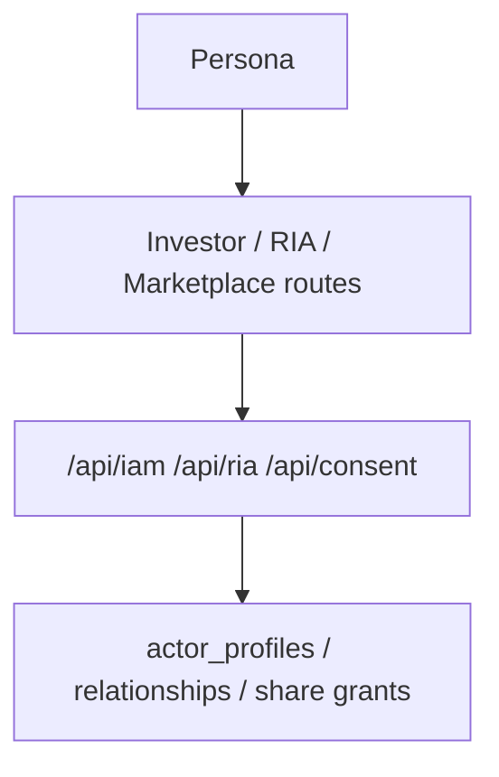

# Runtime Surface

## Visual Map

## Purpose

Describe the current implemented Investor + RIA runtime surface (backend + web + MCP).

Founder-language note:

- this file documents the runtime side of `Separation of Duties`
- `Capability Tokens` remain explicit as route-level requirements because the reader needs exact runtime labels
- `TrustLink / A2A delegation` should be understood through [Agent Delegation Boundary](./agent-delegation-boundary.md): delegated proof and scoped access share the same IAM model, not a second authority system

## Runtime Contract

| Variable | Layer | Role |
| --- | --- | --- |
| `ENVIRONMENT` | backend | Canonical runtime environment identity (`development`, `uat`, `production`) |
| `NEXT_PUBLIC_APP_ENV` | frontend | Canonical client environment identity (`development`, `uat`, `production`) |

Compatibility fallback (temporary): frontend still accepts `NEXT_PUBLIC_OBSERVABILITY_ENV` and `NEXT_PUBLIC_ENVIRONMENT_MODE` if `NEXT_PUBLIC_APP_ENV` is unset.

## IAM Schema Compatibility Mode

1. IAM activation is migration-gated, not startup-mutated.
2. Run explicit commands:
   `python db/migrate.py --iam`
   `python db/verify/verify_iam_schema.py`
3. If IAM schema is missing:
4. `GET /api/iam/persona` returns `200` investor-safe payload with:
   `iam_schema_ready=false`, `mode="compat_investor"`.
5. `POST /api/iam/persona/switch` allows `investor` and returns `503 IAM_SCHEMA_NOT_READY` for `ria`.
6. `/api/ria/*` and `/api/marketplace/*` return `503` with code `IAM_SCHEMA_NOT_READY`.

## Route Families

1. Investor routes remain under existing `/kai/*`, `/one/consent`, `/one/profile`.
2. RIA routes:
   1. `/ria/onboarding`
   2. `/ria/clients`
   3. `/ria/workspace?clientId=<investor_user_id>`
3. Compatibility aliases:
   1. `/ria/requests` -> `/one/consent?actor=ria&view=outgoing`
   2. `/ria/settings` -> `/one/profile?section=ria`
4. Marketplace route: `/marketplace`.

## Backend API Surface

### IAM

1. `GET /api/iam/persona`
2. `POST /api/iam/persona/switch`
3. `POST /api/iam/marketplace/opt-in`

### RIA

1. `POST /api/ria/onboarding/submit`
2. `GET /api/ria/onboarding/status`
3. `GET /api/ria/firms`
4. `GET /api/ria/clients`
5. `GET /api/ria/requests` (compatibility alias)
6. `POST /api/ria/requests` (compatibility alias)
7. `GET /api/ria/clients/{investor_user_id}`
8. `GET /api/ria/workspace/{investor_user_id}`
9. `GET /api/ria/invites`
10. `POST /api/ria/invites`

### Consent Center

1. `GET /api/consent/center` (compatibility read model)
2. `GET /api/consent/center/summary`
3. `GET /api/consent/center/list`
4. `GET /api/consent/requests/outgoing`
5. `POST /api/consent/requests`

Consent-center and scope-discovery payloads may include scope display metadata for user-facing presentation:

1. `scopeLabel`
2. `scopeDescription`
3. `scopeIconName`
4. `scopeColorHex`

These fields are presentation metadata only. Authorization still evaluates the canonical scope string.

Consent-manager surface rules:

1. `/one/consent` is the One user access manager for incoming user-owned consent state.
2. `actor` is compatibility routing metadata, not One page identity. Missing actor, `actor=one`, and legacy `actor=investor` resolve to the same One consent lane.
3. RIA advisor workflows must opt in explicitly with `actor=ria&view=outgoing`; `/ria/requests` remains the compatibility launcher for that path.
4. The canonical page flow is `summary + one paginated list surface + detail panel`.
5. Normal `/one/consent` tabs use `GET /api/consent/center/summary` and `GET /api/consent/center/list`. `GET /api/consent/center` is reserved for compatibility and the relationships surface until that surface is paginated.
6. `/one/consent` keeps the canonical consent-manager URL, but the shared shell treats it as the `Profile > Privacy` workspace for breadcrumbs and bottom-nav context.
7. The top-shell shield is the consent inbox:
   - badge source: `summary.counts.pending`
   - preview rows: first `5` items from the cached actorless `center/list?surface=pending&page=1&limit=20` payload for the One lane
8. Internal consent-review links must stay on SPA-native app routing; full document redirects are reserved for true external URLs only.
9. Long consent lists must use backend-backed pagination metadata and must not rely on a load-all-then-slice page contract.
10. Investor consent reads expand the authenticated Firebase UID to the account-owned identifier set before filtering `consent_audit`: Firebase UID, verified Firebase-auth email/phone, and verified non-revoked email aliases including Apple relay emails.
11. Pending approve/deny/cancel and active revoke actions resolve through the same owned identifier set, then write terminal audit rows against the matched request or token subject id.
12. History rows are identifier-grouped for the One user lane: requester/system/advisor identity plus subject user id appears once, with scope/request chains exposed as nested activity trails ordered by event time.

### Marketplace

1. `GET /api/marketplace/rias`
2. `GET /api/marketplace/investors`
3. `GET /api/marketplace/ria/{ria_id}`

## IAM Data Tables

1. `actor_profiles`
2. `ria_profiles`
3. `ria_firms`
4. `ria_firm_memberships`
5. `ria_verification_events`
6. `advisor_investor_relationships`
7. `ria_client_invites`
8. `consent_scope_templates`
9. `relationship_share_grants`
10. `relationship_share_events`
11. `connection_scope_proposals`
12. `connection_scope_proposal_events`
13. `marketplace_public_profiles`
14. `runtime_persona_state` (transitional compatibility only)

## Persona State Ownership

1. `actor_profiles.last_active_persona` is the canonical persisted persona state.
2. `runtime_persona_state` is used only for transitional setup continuity before an account fully earns the `ria` persona.
3. Full-mode persona responses must prefer `actor_profiles` and never let runtime state override a real dual-persona account.

## Consent Integration

1. RIA requests for investor information write `REQUESTED` rows into `consent_audit` with actor metadata. They are independent of connection capabilities.
2. A generic `attr.*` consent decision never activates an advisor relationship or an advisor-picks source.
3. A connection can be accepted with zero scopes. `connection_scope_proposals` is the only authority for One-to-One capabilities: the owner approves requested scopes and the recipient explicitly opts into offered scopes.
4. `ria_active_picks_feed_v1` activates only through its current proposal → relationship-share grant → artifact lineage. The grant and each immutable share lifecycle event store the request and proposal identifiers for auditability.
5. The RIA workspace may use a generic active RIA consent capability. Market, preview, and Debate require the exact active Picks lineage; revocation, expiry, or disconnect removes new Picks access immediately.
6. Relationship-share grants are tracked outside `consent_audit` because advisor picks are advisor-authored relationship information, not investor PKM. Legacy implicit grants are retired and cannot authorize access.
7. Invite state is pre-consent workflow only; it is surfaced through the same consent-center read model but remains distinct from the canonical audit ledger.

## Legacy Picks Retirement

1. Migration `129_ria_pick_legacy_retirement.sql` deliberately retires the obsolete `ria_pick_uploads` and `ria_pick_upload_rows` tables. Legacy Picks are not imported into encrypted PKM; owners start with an empty encrypted `ria.advisor_package`.
2. `ria_pick_legacy_retirements` retains only the retired upload identifier, owner/profile identifiers, aggregate row count, timestamp, and product-authorized reason. It contains no Pick values, package metadata, PKM material, or access authority.
3. The reset revokes every active legacy Picks grant/artifact that lacks explicit proposal lineage before dropping the tables. Historical proposal/share events remain immutable.

## Relationship Share Integration

1. Investor private information flowing to an RIA stays on the shared `/one/consent` lane and `consent_audit`.
2. Advisor-authored content flowing back to the investor uses `connection_scope_proposals`, `relationship_share_grants`, and append-only proposal/share event histories.
3. The reserved capability is `ria_active_picks_feed_v1`; connection acceptance alone never enables it.
4. Kai only exposes `ria:*` pick sources when the relationship, proposal, grant, and artifact are all active and refer to the same approved capability.
5. Active PKM-derived Picks syncs update the entitled artifact without requiring a new request. An advisor's bounded investor debate thesis travels only inside that same artifact and is used as attributed context for a selected investor's live Debate; it is not new `attr.*` scope authority, source lineage, event payload, or durable run history. A later revocation blocks new Market, preview, Debate, retry, and refresh reads, while an already-running Debate uses its authorized start-time snapshot.

## MCP Read-Only Tools

1. `list_ria_profiles`
2. `get_ria_profile`
3. `list_marketplace_investors`
4. `get_ria_verification_status`
5. `get_ria_client_access_summary`

These tools remain read-only in V1 and are gated by auth + consent + scope policy checks.
