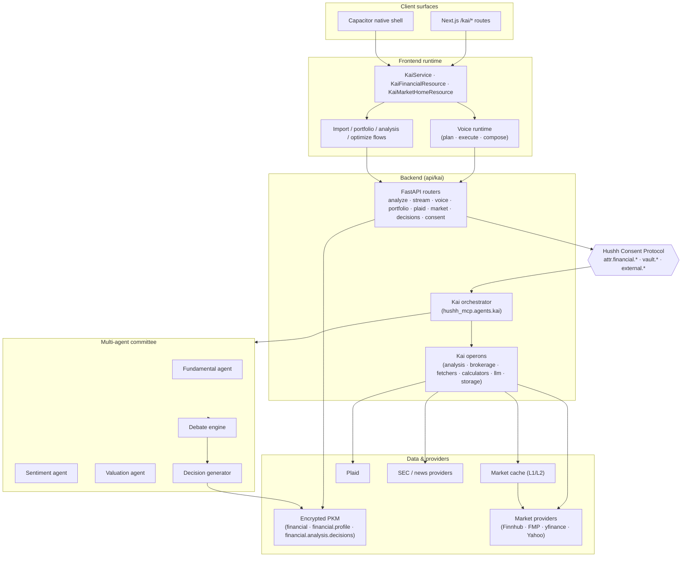

# Agent Kai Architecture

Agent Kai is Hushh's explainable, multi-agent investing copilot. It spans the Next.js webapp, the `consent-protocol` FastAPI backend, and the mobile shell (Capacitor). This document is the canonical system-level entry point: it explains what Agent Kai is made of, how the pieces fit together, and where each subsystem's source of truth lives. It does not restate the specialist docs — it links to them.

For the product thesis, north-star, and legal framing see [../../vision/kai/README.md](../../vision/kai/README.md). This document is architecture-only.

## Visual Map

## Code layout

Single table mapping where Kai code lives to what it does.

| Path | Tier | Purpose |
| --- | --- | --- |
| `contracts/kai/` | Shared | Cross-tier semantic contracts (e.g. voice action manifest). |
| `hushh-webapp/app/kai/` | Frontend | Next.js route surfaces: `/kai`, `/kai/import`, `/kai/portfolio`, `/kai/analysis`, `/kai/optimize`, `/kai/onboarding`, `/kai/dashboard`, `/kai/plaid`, `/kai/alpaca`, `/kai/funding-trade`, `/kai/investments`. |
| `hushh-webapp/components/kai/` | Frontend | UI: views, cards, debate stream, decision cards, onboarding, voice surfaces. |
| `hushh-webapp/lib/kai/` | Frontend | Runtime services: command executor, session store, preferences. |
| `hushh-webapp/lib/services/kai-service.ts` | Frontend | Service-layer entry point the UI calls into. |
| `hushh-webapp/lib/capacitor/kai.ts` | Mobile | Native plugin binding for the Capacitor shell. |
| `consent-protocol/api/routes/kai/` | Backend | FastAPI sub-routers aggregated under `/api/kai`: `analyze`, `stream`, `voice`, `portfolio`, `plaid`, `market_insights`, `losers`, `decisions`, `consent`, `chat`, `gmail`, `support`, `health`. See `__init__.py` `KAI_ROUTE_CONTRACT_PATHS` for the enforced path contract. |
| `consent-protocol/hushh_mcp/agents/kai/` | Backend | Multi-agent layer: `agent.yaml` (canonical manifest), `orchestrator.py`, `fundamental_agent.py`, `sentiment_agent.py`, `valuation_agent.py`, `debate_engine.py`, `decision_generator.py`, plus `renaissance_agent.py` and shared `tools.py`. |
| `consent-protocol/hushh_mcp/operons/kai/` | Backend | Reusable workflows: `analysis.py`, `brokerage.py`, `calculators.py`, `fetchers.py`, `llm.py`, `storage.py`. |
| `consent-protocol/hushh_mcp/kai_import/` | Backend | Portfolio-import pipeline and stream contracts. |
| `consent-protocol/tests/agents/kai/` | Tests | Agent test suites. |

## Subsystems

### 1. Multi-agent committee

The investment "committee" is declared in `consent-protocol/hushh_mcp/agents/kai/agent.yaml` (`id: agent_kai`, `name: Kai Financial Agent`). The manifest exposes three tools — `perform_fundamental_analysis`, `perform_sentiment_analysis`, `perform_valuation_analysis` — each implemented in `tools.py` and each gated by the `attr.financial.*` scope. `orchestrator.py` calls the three specialist agents, `debate_engine.py` runs the round-robin reconciliation, and `decision_generator.py` assembles the Decision Card (Buy/Hold/Reduce + confidence + citations).

Authoritative source: the code itself. `agent.yaml` is the manifest; there is no separate spec doc yet, so treat the Python files under `consent-protocol/hushh_mcp/agents/kai/` as canonical.

### 2. Analysis stream & Decision Card

Users request an analysis from `/kai/analysis`. The frontend streams from `/api/kai/analyze/stream` (or the run-scoped variants `/analyze/run/start`, `/analyze/run/{run_id}/stream`, `/analyze/run/{run_id}/cancel`). The backend dispatches through the orchestrator, streams agent tokens and debate rounds as SSE events, and persists the final decision under the PKM domain `financial.analysis.decisions`.

Authoritative docs: [kai-interconnection-map.md](./kai-interconnection-map.md) §"Debate context usage"; [kai-accuracy-contract.md](./kai-accuracy-contract.md) for output expectations and provenance rules.

### 3. Voice runtime

The in-app voice assistant runs a plan → execute → compose → TTS loop. The frontend posts speech to `/api/kai/voice/stt`, then to `/api/kai/voice/plan`, executes the planned action locally (routing through the voice action manifest in `contracts/kai/`), posts results to `/api/kai/voice/compose`, and finally to `/api/kai/voice/tts`. Canonical plan modes are `answer_now`, `execute_and_wait`, `start_background_and_ack`, `clarify`.

Authoritative doc: [kai-voice-runtime-architecture.md](./kai-voice-runtime-architecture.md). The older [kai-voice-assistant-architecture.md](./kai-voice-assistant-architecture.md) is retained as the migration record but is not the source of truth.

### 4. Portfolio import

Users upload a statement at `/kai/import`; the frontend streams from `/api/kai/portfolio/import/stream` (or run-scoped variants). The pipeline parses, validates, and emits a terminal `quality_gate` + `quality_report_v2`; on strict-validation failure it emits terminal `aborted` (no silent success). Validated holdings are saved via `/api/pkm/store-domain` into the encrypted `financial` PKM domain.

Authoritative docs: [kai-interconnection-map.md](./kai-interconnection-map.md) §"Import → financial Domain"; [kai-accuracy-contract.md](./kai-accuracy-contract.md) for the quality-gate contract.

### 5. Brokerage / Plaid

Plaid provides read-only holdings sync. Core routes: `/api/kai/plaid/link-token`, `/plaid/exchange-public-token`, `/plaid/source`, `/plaid/refresh`, `/plaid/webhook`, plus OAuth resume and the funding-transfer family. The frontend chooses between statement-import and Plaid as a portfolio source; refreshes feed into the same encrypted `financial` domain used by the import pipeline.

Authoritative doc: [kai-brokerage-connectivity-architecture.md](./kai-brokerage-connectivity-architecture.md).

### 6. Market cache & providers

The market cache is tiered (in-memory L1 + Postgres L2) and is fronted by a provider fallback chain (Finnhub → FMP → yfinance → Yahoo). Frontend surfaces (Kai home, analysis, optimize) read quotes through `KaiMarketHomeResource` and the market-insights routes (`/api/kai/market/insights/*`, `/api/kai/stock-preview/{user_id}`).

Authoritative docs: [kai-interconnection-map.md](./kai-interconnection-map.md) §"Kai Home"; [kai-rate-limit-playbook.md](./kai-rate-limit-playbook.md).

### 7. Optimize engine

`/kai/optimize` runs a deterministic first pass (eligibility, policy, concentration checks) against the user's `financial` PKM domain, then uses an LLM layer to synthesize explainability over the deterministic result. No optimization runs on speculative data — the engine reads only from already-settled PKM.

Authoritative doc: [kai-interconnection-map.md](./kai-interconnection-map.md) §Optimize.

### 8. Mobile parity

The Capacitor shell wraps the same web surfaces, with a native plugin (`hushh-webapp/lib/capacitor/kai.ts`) for platform-specific affordances such as on-device inference (MLX on iOS, Gemma on Android) in the vision roadmap. Current primary runtime remains cloud-backed; on-device is tracked as a future path.

Authoritative docs: [mobile-kai-parity-map.md](./mobile-kai-parity-map.md); [../ai/on-device-future-plan/README.md](../ai/on-device-future-plan/README.md) for on-device status; [../../vision/kai/README.md](../../vision/kai/README.md) §"On-Device AI" for the product framing.

## Runtime flow — analyze a ticker (end-to-end)

Canonical voice-initiated journey from "analyze NVDA" to a persisted decision:

1. **Capture.** User speaks in the webapp or mobile shell. The frontend voice runtime streams audio to `/api/kai/voice/stt`.
2. **Plan.** Transcript posts to `/api/kai/voice/plan`. Planner returns one of `answer_now | execute_and_wait | start_background_and_ack | clarify`. For "analyze NVDA" this is `execute_and_wait` with an action from the voice action manifest (`contracts/kai/`).
3. **Execute.** Frontend executor dispatches the action to `/api/kai/analyze/stream` (or `/analyze/run/start` for run-scoped). Consent is checked by the route; the call must present a token covering `attr.financial.*`.
4. **Orchestrate.** Backend enters `hushh_mcp.agents.kai.orchestrator`, which invokes `perform_fundamental_analysis`, `perform_sentiment_analysis`, `perform_valuation_analysis` in parallel. Each tool reads from operons (`fetchers.py` for providers, `calculators.py` for deterministic math, `storage.py` for cached data).
5. **Debate.** `debate_engine.py` runs round-robin reconciliation across the three agents' outputs, surfacing dissent.
6. **Decide.** `decision_generator.py` assembles the Decision Card: Buy/Hold/Reduce + confidence + citations + risk-persona alignment.
7. **Stream.** SSE events (`agent_token`, round transitions, decision) stream back to the frontend; the debate-stream UI renders live.
8. **Persist.** The final decision writes to the encrypted PKM domain `financial.analysis.decisions`; cache-sync updates index projections.
9. **Compose + speak.** Frontend posts the decision summary to `/api/kai/voice/compose`, then to `/api/kai/voice/tts`; the result is spoken to the user.

Shorter flows (see the interconnection map for row-level detail):

- **Import** — `/kai/import` → `/api/kai/portfolio/import/stream` → parse → quality gate → `store-domain` → encrypted `financial`. See [kai-interconnection-map.md](./kai-interconnection-map.md) §2.
- **Plaid source** — `/api/kai/plaid/link-token` → OAuth → `exchange-public-token` → `/plaid/source` → `/plaid/refresh` → encrypted `financial`. See [kai-interconnection-map.md](./kai-interconnection-map.md) §2b.

## Trust & consent boundaries

Agent Kai operates under the Hushh Consent Protocol. Two layers of enforcement are in play today:

**Agent-level (enforced).** `agent.yaml` declares `required_scopes: [attr.financial.*]`; every tool in `tools.py` also declares `required_scope: attr.financial.*`. Any call into the orchestrator must present a consent token satisfying this scope. This is the authoritative runtime gate for the multi-agent committee.

**Route-level.** FastAPI routers under `consent-protocol/api/routes/kai/` check user identity (Firebase UID) and consent before any PKM read/write. Write routes (`/api/pkm/store-domain`, the decisions persistence path) require elevated scopes for vault writes.

The product vision in [../../vision/kai/README.md](../../vision/kai/README.md) §"Consent Scopes for Kai" describes a finer-grained scope model (`agent.kai.analyze_stock`, `external.sec.filings`, `vault.write.decision`, etc.). That is the target model; current enforcement is the coarser `attr.financial.*` grant. When the vision's finer grants ship, update this document and the agent manifest together.

## Data & persistence

Kai writes to three encrypted PKM domains:

| Domain | Written by | Contents |
| --- | --- | --- |
| `financial.profile` | Onboarding / profile flows | Risk persona, onboarding state, nav-tour flags. |
| `financial` | Portfolio import, Plaid refresh | Holdings, accounts, source metadata. |
| `financial.analysis.decisions` | Decision generator | Decision Cards with debate digest, citations, confidence. |

Persistence is vault-key bound — PKM blobs are encrypted at rest and keyed to the user's vault. The market cache (L1 memory, L2 Postgres) is orthogonal to PKM: it stores shared, non-PII provider data.

Authoritative doc: [kai-interconnection-map.md](./kai-interconnection-map.md).

## Operating posture

- **Accuracy & real-data-only.** Kai treats synthetic or placeholder data as a correctness bug. Quality gates are strict; on failure the pipeline emits a terminal `aborted`. See [kai-accuracy-contract.md](./kai-accuracy-contract.md).
- **Rate limits.** Provider chains have documented fallback and backoff behavior; user-facing degraded mode is first-class. See [kai-rate-limit-playbook.md](./kai-rate-limit-playbook.md).
- **Route audit.** Every `/api/kai/*` path is enumerated in `KAI_ROUTE_CONTRACT_PATHS` and matched against the live router by the route-contract verifier. See [kai-route-audit-matrix.md](./kai-route-audit-matrix.md).
- **Smoke testing.** Pre-release runtime checklist lives in [kai-runtime-smoke-checklist.md](./kai-runtime-smoke-checklist.md).
- **Change blast radius.** Use [kai-change-impact-matrix.md](./kai-change-impact-matrix.md) before any cross-surface Kai change.

## Legal & regulatory posture

Agent Kai is an educational and informational tool. It is not a registered investment adviser and is not part of Hushh Technology Fund L.P.'s advisory services. Every Decision Card carries the required disclaimer. Full regulatory framing — including FINRA alignment, CCPA/CPRA posture, and entity structure — lives in [../../vision/kai/README.md](../../vision/kai/README.md) §"Important Legal Notice".

## Related documents

- Index: [README.md](./README.md)
- [kai-interconnection-map.md](./kai-interconnection-map.md)
- [kai-voice-runtime-architecture.md](./kai-voice-runtime-architecture.md)
- [kai-voice-assistant-architecture.md](./kai-voice-assistant-architecture.md)
- [kai-brokerage-connectivity-architecture.md](./kai-brokerage-connectivity-architecture.md)
- [kai-accuracy-contract.md](./kai-accuracy-contract.md)
- [kai-rate-limit-playbook.md](./kai-rate-limit-playbook.md)
- [kai-route-audit-matrix.md](./kai-route-audit-matrix.md)
- [kai-runtime-smoke-checklist.md](./kai-runtime-smoke-checklist.md)
- [kai-change-impact-matrix.md](./kai-change-impact-matrix.md)
- [kai-v6-execution-plan.md](./kai-v6-execution-plan.md)
- [mobile-kai-parity-map.md](./mobile-kai-parity-map.md)
- Vision: [../../vision/kai/README.md](../../vision/kai/README.md)
- Future: [../../future/kai/README.md](../../future/kai/README.md)
