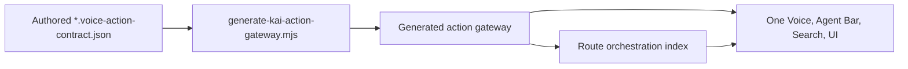

# Kai Action Gateway vNext

Status: canonical capability-authoring reference for One, Kai, Search, and UI
actions. `kai` remains a compatibility identifier in generated paths; One is
the private-agent product surface and Kai is its finance specialist.

## Visual Map



## Contract

An authored `*.voice-action-contract.json` is the only source that can make a
capability discoverable. The generator produces:

- [Generated action gateway](../../../contracts/kai/kai-action-gateway.vnext.json)
- [Route orchestration index](../../../contracts/kai/one-route-orchestration-index.v1.json)

Generated output is never hand-edited. Run:

```bash
cd hushh-webapp && npm run build:voice-gateway
cd hushh-webapp && npm run build:route-orchestration-index
cd hushh-webapp && npm run verify:voice-gateway
```

The gateway is discovery and policy metadata, not a consent grant or a second
planner. Every action still passes generated policy, active route, interaction
layer, authentication, vault, consent, confirmation, and browser-settlement
checks.

## Authoring Rules

Each action must declare a clear `action_id`, meaning, aliases, search keywords,
reachability, guard ids, risk level, execution policy, target, control ids, and
goal metadata. Use flat, product-facing language and keep state exposure
redacted. A UI control cannot become executable merely because it appears in
the DOM.

Valid execution policies are:

| Policy | Effect |
| --- | --- |
| `allow_direct` | The generated policy may issue a browser directive after all guards pass. |
| `confirm_required` | The app must present explicit confirmation before execution. |
| `manual_only` | The private agent may explain where to complete the human action, not execute it. |

Actions with a delegate agent must still have an ingress-validated authority
path. Until that exists, they remain unwired and fail closed.

### Settled journeys

A cross-screen flow is authored as a settled journey, not improvised by the
model. Its first `action` step names an explicit `settlement_target` (`route`
and `screen`), followed by an optional `choice` step naming only generated
action IDs that are valid on that destination. A source-route fallback is
invalid for a route-changing local handler.

The browser publishes the destination's redacted context snapshot and waits
for the relay acknowledgement before it reports the originating settlement.
Only then can `continue_app_goal` make the authored choices eligible. An
explicit user choice is retained as its generated action ID only, in the live
session, and is cleared on timeout, cancellation, sign-out, route mismatch,
back navigation, or session end. It never carries speech, slots, credentials,
or durable intent across screens.

## Runtime Consumers

- Frontend validation and search: [kai-action-gateway.ts](../../../hushh-webapp/lib/voice/kai-action-gateway.ts)
- Shared client execution: [agent-action-runtime.ts](../../../hushh-webapp/lib/agent/agent-action-runtime.ts)
- Backend generated-gateway loader: [action_gateway.py](../../../consent-protocol/hushh_mcp/services/action_gateway.py)
- One policy tools: [action_tools.py](../../../consent-protocol/hushh_mcp/one_adk/action_tools.py)
- One Live relay: [adk_live.py](../../../consent-protocol/api/routes/one/adk_live.py)

Gmail is deliberately absent from generated discovery while it is paused. Its
route and manifest remain dormant for an explicit future enablement; no action
contract, Search result, or One tool can reactivate it by implication.

## Verification

```bash
cd hushh-webapp && npx vitest run __tests__/voice/kai-action-gateway.test.ts
cd hushh-webapp && npm run verify:voice-gateway
cd hushh-webapp && npm run verify:surface-map
cd consent-protocol && python3 -m pytest tests/test_one_adk_agent_tree.py -q
```

## Related References

- [One Voice Runtime Architecture](../one/one-voice-runtime-architecture.md)
- [One Voice Kai Compatibility Runtime](../one/one-voice-kai-compatibility-runtime.md)
- [Route Contracts](../architecture/route-contracts.md)
