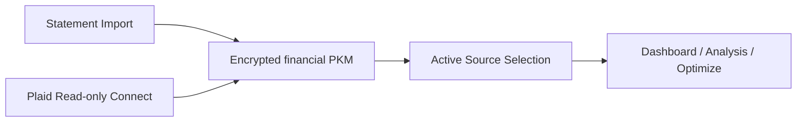

# Kai Brokerage Connectivity Architecture

## Visual Map

Canonical reference for how Kai handles brokerage connectivity today and how the model stays compatible with future broker execution.

Founder-language framing:

- this surface is governed by `Separation of Duties`: brokerage transport, app-facing context, and future execution adapters stay intentionally split
- `Capability Tokens` gate portfolio access and source selection
- `Cryptographic Primitives` keep private investor context encrypted while Plaid server-state stays outside PKM
- future execution requires stronger approval flows beyond today's PCHP-backed read path

## North Stars

- Consent before access and consent before action
- Cryptographic Primitives and memory-only sensitive state
- Tri-flow parity across web, iOS, and Android
- Low-friction investor answers, with debate remaining separate
- Clear provenance: editable statement data vs immutable broker-sourced data
- No capability overclaiming: Plaid is read-only connectivity, not trade execution

## Capability Boundary

### Current

- Statement import: editable
- Plaid: read-only holdings, accounts, transactions, refresh on unlock, relink, OAuth return; connections sealed in the person's vault
- Combined: comparison-only rollup, not a direct analysis or execution source

### Not Current

- live trade execution
- broker order placement
- auto-trading from debate or optimize

Future trade execution must use a separate broker-adapter layer and distinct consent/approval flows.

## Modularization Boundary

Current implementation shape is intentional:

- backend integration mechanics live under `hushh_mcp/integrations/plaid/`
- Kai-facing brokerage orchestration stays in `hushh_mcp/services/plaid_portfolio_service.py`
- agent-facing pure brokerage logic belongs in `hushh_mcp/operons/kai/brokerage.py`
- frontend brokerage runtime helpers live under `hushh-webapp/lib/kai/brokerage/`

This keeps Link/OAuth/webhook plumbing out of ADK/A2A/MCP while still giving Kai a clean brokerage context layer for future agent and execution work.

## Source Model

Kai exposes three portfolio views:

- `Statement`
  - editable
  - parser provenance and confidence preserved
- `Plaid`
  - immutable
  - broker-sourced freshness and sync status preserved
- `Combined`
  - read-only comparison view
  - overlap counts, source totals, and coverage
  - not a direct Debate or Optimize source

## Persistence Model

### Editable PKM contract

- `financial.sources.statement`
- `financial.sources.active_source`
- `financial.rollups.combined_summary`
- `financial.portfolio`
- `financial.analytics`

`financial.portfolio` and `financial.analytics` remain the app-consumed shape and are derived from the active source.

### Plaid connections live in the person's vault

Since 2026-09-23 Plaid access tokens and every bank record are sealed in the owner's encrypted
financial memory (`connections_v1`, `accounts_v1`, `holdings_v1`, `securities_v1`,
`transactions_v1`, `derived_v1`); only `summary` is shareable. The server is a stateless relay
(`/api/kai/plaid/vault/*`) and stores nothing: the old `kai_plaid_*`,
`kai_portfolio_source_preferences` and `kai_funding_*` tables are dropped by migration 239, and
the old `financial.sources.plaid` copy is removed on the next save. Contract and device behaviour:
[Plaid Vault Passthrough](./plaid-vault-passthrough.md).

## OAuth and Web Callback Model

Callback path: `/one/kai/plaid/oauth/return` (behind the vault unlock screen).

1. The device requests a vault link token with a frontend-derived https `redirect_uri`
   (none on native Android, where the SDK hands the login back).
2. Native shells run Link in their own process, so the bank's return lands back in Link.
3. On the web the bank takes the whole page away. Before Link opens, the device stores only the
   link token, redirect URI and return path in tab session storage (30 minutes, single use).
4. On return, after unlock, the page re-opens Link with `receivedRedirectUri`, exchanges the
   `public_token`, and seals the connection in the vault.

## Refresh and Freshness

- The device refreshes sealed connections once per vault session on unlock (single-flight),
  and on an explicit Refresh. There are no webhooks and no server refresh runs.
- A connection that needs a new login shows "needs relink"; relink uses Plaid update mode with
  the sealed token, then forces a refresh.

## Multiple Accounts and Institutions

Defaults:

- one user can have multiple Plaid Items
- one Item can have multiple investment accounts
- aggregation is additive, never overwrite-based
- update mode is used for reconnect and add-account flows

Identity rules:

- account identity: `item_id + account_id`
- relink anchor: `persistent_account_id` when present
- holding identity: `item_id + account_id + security_id`
- security churn fallback: `proxy_security_id`

## Debate and Optimize Context

Kai enriches the active source context with:

- holdings
- source metadata
- freshness/sync state
- investment transactions
- income, fee, and gain/loss summaries

Current guardrails:

- debate and optimize can run on `statement` or `plaid`
- combined requires explicit source selection first
- optimize remains fail-closed when realtime market dependencies are missing

## Future Broker Execution Shape

Execution-ready reserved contracts:

- `BrokerConnection`
- `ExecutionBroker`
- `ExecutionAccount`
- `OrderIntent`
- `OrderPreview`
- `ExecutionApproval`
- `ExecutionOrder`
- `ExecutionStatus`

Execution principles:

- broker-adapter based, not Plaid based
- explicit human approval by default
- audit logging and idempotency mandatory
- post-trade reconciliation writes back into the PKM as a separate source of truth
