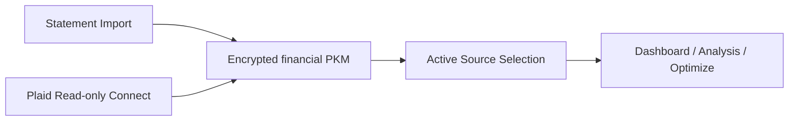

# Kai Brokerage Connectivity Architecture

## Visual Map

Canonical reference for how Kai handles brokerage connectivity today and how the model stays compatible with future broker execution.

Founder-language framing:

- this surface is governed by `Separation of Duties`: brokerage transport, app-facing context, and future execution adapters stay intentionally split
- `Capability Tokens` gate portfolio access and source selection
- `Cryptographic Primitives` keep private investor context encrypted while Plaid server-state stays outside PKM
- future execution requires stronger approval flows beyond today's PCHP-backed read path

## North Stars

- Consent before access and consent before action
- Cryptographic Primitives and memory-only sensitive state
- Tri-flow parity across web, iOS, and Android
- Low-friction investor answers, with debate remaining separate
- Clear provenance: editable statement data vs immutable broker-sourced data
- No capability overclaiming: Plaid is read-only connectivity, not trade execution

## Capability Boundary

### Current

- Statement import: editable
- Plaid: read-only holdings, accounts, investment transactions, refresh, OAuth resume
- Combined: comparison-only rollup, not a direct analysis or execution source
- **Trading specialist (added 2026-05)**: strategy research, walk-forward backtesting,
  and paper trading run inside the consent-protocol process. Live broker
  execution is gated behind every rule below and ships paper-first per
  milestone — see `kai-trading-system.md` for the milestone gate.

### Permissioned Execution Rules (binding)

Every live broker order placed by the Trading specialist must satisfy ALL of
the following. None are aspirational — code paths that cannot satisfy a rule
must fail closed.

1. **Separate broker-adapter layer.** Execution does not flow through Plaid.
   It uses a distinct adapter under `hushh_mcp/integrations/<broker>_trading/`,
   isolated from `hushh_mcp/integrations/plaid/`.
2. **Distinct consent scopes.** `agent.kai.trade.simulate`,
   `agent.kai.trade.execute`, and `agent.kai.trade.approve` are independent.
   `EXECUTE` alone is never sufficient; each individual `OrderIntent` must
   carry a freshly-signed `ExecutionApproval` whose token chains to a
   vault-owner consent token.
3. **Per-order human approval.** No agent may auto-trade from debate, optimize,
   backtest, or paper. Every order is rendered as an `OrderPreview` (qty,
   side, est. price, fees, portfolio impact, risk-limit headroom) and
   requires explicit click-to-sign.
4. **Idempotency.** Every `OrderIntent` carries an `idempotency_key` reused
   as the broker's client-order-id. Resubmissions are a no-op.
5. **Audit logging.** An append-only hash-chained `kai_execution_audit` log
   records every Intent, Preview, Approval, Order, Status, Fill, and
   reconciliation. Audit rows use the same encryption envelope as PKM.
6. **Post-trade reconciliation.** Broker fills write back to the PKM under
   `financial.trading.live.book` as a separate source-of-truth, then are
   cross-checked against Plaid holdings on the next sync.
7. **Risk + kill switch.** Daily-loss / drawdown / leverage / concentration
   circuit breakers run before any submit. The env var
   `KAI_TRADING_MODE=paper|live|halt` is honored as a global override; `halt`
   blocks every `ExecutionBroker.submit` and rejects in-flight calls.
8. **Honest IRR reporting.** Realized IRR is reported alongside Sharpe,
   Sortino, Calmar, max drawdown, and turnover. The 69.69% North Star is a
   target, never a guarantee — copy and code must not imply otherwise.

### Not Current

- auto-trading from debate or optimize (still forbidden — only the Trading
  specialist may emit OrderIntents, and only via the per-order approval flow)
- order placement that bypasses any of the eight rules above

## Modularization Boundary

Current implementation shape is intentional:

- backend integration mechanics live under `hushh_mcp/integrations/plaid/`
- Kai-facing brokerage orchestration stays in `hushh_mcp/services/plaid_portfolio_service.py`
- agent-facing pure brokerage logic belongs in `hushh_mcp/operons/kai/brokerage.py`
- frontend brokerage runtime helpers live under `hushh-webapp/lib/kai/brokerage/`

This keeps Link/OAuth/webhook plumbing out of ADK/A2A/MCP while still giving Kai a clean brokerage context layer for future agent and execution work.

## Source Model

Kai exposes three portfolio views:

- `Statement`
  - editable
  - parser provenance and confidence preserved
- `Plaid`
  - immutable
  - broker-sourced freshness and sync status preserved
- `Combined`
  - read-only comparison view
  - overlap counts, source totals, and coverage
  - not a direct Debate or Optimize source

## Persistence Model

### Editable PKM contract

- `financial.sources.statement`
- `financial.sources.plaid`
- `financial.rollups.combined_summary`
- `financial.portfolio`
- `financial.analytics`

`financial.portfolio` and `financial.analytics` remain the app-consumed shape and are derived from the active source.

### Server-side Plaid storage

- `kai_plaid_items`
  - encrypted Plaid access token envelope
  - normalized accounts, holdings, securities, transactions
  - connection health and latest sync metadata
- `kai_plaid_refresh_runs`
  - refresh lifecycle and webhook-driven completion
- `kai_plaid_link_sessions`
  - short-lived OAuth resume sessions
- `kai_portfolio_source_preferences`
  - active source selection

Plaid access tokens never live in the PKM.

## OAuth and Web Callback Model

Callback path:

- `/kai/plaid/oauth/return`

Runtime rules:

1. Client requests a Link token with a frontend-derived absolute `redirect_uri`.
2. Backend validates the origin against `APP_FRONTEND_ORIGIN` and the path against `PLAID_REDIRECT_PATH`.
3. Backend persists an opaque `resume_session_id` in `kai_plaid_link_sessions`.
4. Browser stores only that opaque session id, never the vault key or a persisted vault token.
5. On return from the institution, Kai re-issues a fresh `VAULT_OWNER` token, fetches the stored Link token, resumes Link with `receivedRedirectUri`, exchanges the `public_token`, and clears the session.

## Refresh and Freshness

Manual refresh flow:

1. User clicks `Refresh`
2. Backend creates a refresh run
3. `/investments/refresh` when supported
4. Wait for `HOLDINGS: DEFAULT_UPDATE`
5. Pull fresh holdings and transactions
6. Update aggregate freshness + sync state

Fallback:

- If `/investments/refresh` is unsupported, Kai falls back to `holdings/get` and preserves stale/freshness messaging.

## Multiple Accounts and Institutions

Defaults:

- one user can have multiple Plaid Items
- one Item can have multiple investment accounts
- aggregation is additive, never overwrite-based
- update mode is used for reconnect and add-account flows

Identity rules:

- account identity: `item_id + account_id`
- relink anchor: `persistent_account_id` when present
- holding identity: `item_id + account_id + security_id`
- security churn fallback: `proxy_security_id`

## Debate and Optimize Context

Kai enriches the active source context with:

- holdings
- source metadata
- freshness/sync state
- investment transactions
- income, fee, and gain/loss summaries

Current guardrails:

- debate and optimize can run on `statement` or `plaid`
- combined requires explicit source selection first
- optimize remains fail-closed when realtime market dependencies are missing

## Broker Execution Shape

The contracts below were reserved in earlier revisions and are now
concrete — see `hushh_mcp/operons/kai/trading/execution/contracts.py`.

- `BrokerConnection`
- `ExecutionBroker`
- `ExecutionAccount`
- `OrderIntent`
- `OrderPreview`
- `ExecutionApproval`
- `ExecutionOrder`
- `ExecutionStatus`

The execution principles below restate the binding rules under "Permissioned
Execution Rules" above:

- broker-adapter based, not Plaid based
- explicit per-order human approval, no auto-trade paths
- audit logging and idempotency mandatory
- post-trade reconciliation writes back into the PKM as a separate source of truth
- realized-IRR reporting is honest; the 69.69% North Star is a target, not a
  guarantee
