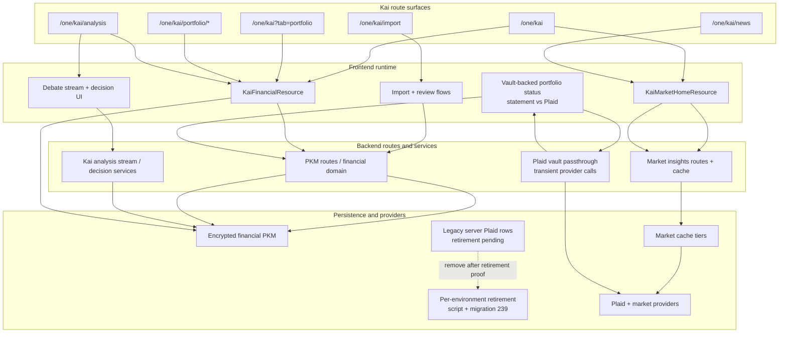

# Kai Interconnection Map

## Visual Map

Single source map for how Kai surfaces are connected across routes, service layer, cache, PKM, providers, and mobile parity paths.

Founder-language lens:

- this map is one slice of the platform's `Separation of Duties`
- Kai route surfaces consume `Capability Tokens` and encrypted PKM rather than owning an independent trust model
- developer and delegated access flows join this same map through `PCHP` and `TrustLink / A2A delegation`, not through a separate Kai-only authority plane

## Core Flows

### 1) Onboarding/Profile -> `financial.profile`

| Step | Route/UI | Web Service Layer | Backend Route | Persistence | Cache / Sync |
| --- | --- | --- | --- | --- | --- |
| Persona/preferences capture | `/one/setup/finance`, `/one/profile` | `KaiProfileService`, `PersonalKnowledgeModelService` | `/api/pkm/store-domain` | `pkm_blobs(financial/one/profile)` + `pkm_index.summary_projection.financial` | `CacheSyncService.onPkmDomainStored(...)` patches PKM metadata and the encrypted domain cache |
| Completion + nav tour state | onboarding components + nav tour | `KaiNavTourSyncService` / profile sync | `/api/pkm/store-domain` | encrypted `financial.profile` fields | cache write-through + metadata reconciliation |

Notes:
- `financial.profile` is the canonical encrypted source for onboarding state.
- Local pending/on-device flags are transitional and must reconcile after vault unlock.

### 2) Import -> `financial` Domain -> Dashboard/Home/Debate

| Step | Route/UI | Web Service Layer | Backend Route | Persistence | Cache / Sync |
| --- | --- | --- | --- | --- | --- |
| Statement upload/stream | `/one/kai/import` | `ApiService.streamPortfolioImport`, `kai-flow` | `/api/kai/portfolio/import/stream` | stream output only until commit | stage timeline + extracted holdings state in UI |
| Save validated holdings | portfolio review / save CTA | `PersonalKnowledgeModelService.storeDomainData`, `CacheSyncService.onPortfolioUpserted` | `/api/pkm/store-domain` | encrypted `financial` PKM domain + summary in index | portfolio summary cache + PKM metadata cache + domain blob cache write-through |
| Import quality gate | import stream terminal | canonical SSE envelope | `/api/kai/portfolio/import/stream` | terminal `quality_gate` + `quality_report_v2` diagnostics | emits terminal `aborted` on strict validation failure (no silent success) |
| Dashboard render + holdings manage fusion | `/one/kai/portfolio?tab=overview|holdings` | `DashboardDataMapper`, `ManagePortfolioView`, `CacheService` | optional refresh via `/api/pkm/*` and market APIs | reads encrypted domain via vault key | cache-first with metadata/domain reconciliation |
| Dashboard profile picks | `/one/kai/portfolio` profile picks card | `ApiService.getDashboardProfilePicks` | `/api/kai/dashboard/profile-picks/{user_id}` | no new persistence (derived response) | quote-backed, risk-profile aware additive payload |
| Debate context usage | `/one/kai/analysis` + stream views | `ApiService.streamKaiAnalysis` | `/api/kai/analyze/stream` | decision persisted under `financial.analysis.decisions` | context derived from index summaries + optional decrypted domain fields |

### 2b) Plaid Brokerage Connect -> Read-Only Source -> Dashboard/Debate/Optimize

| Step | Route/UI | Web Service Layer | Backend Route | Persistence | Cache / Sync |
| --- | --- | --- | --- | --- | --- |
| Link token and OAuth start | `/one/kai/import`, `/one/kai/portfolio` | `plaid-link-loader`, `vault-sync.ts`, vault OAuth session helper | `/api/kai/plaid/vault/link-token` | no persistent connection row in the vault route; token is returned to the device | web stores the Link token for one OAuth return; native SDK retains the in-process Link session |
| Exchange, first snapshot and seal | Link completion | `vault-sync.ts` | `/api/kai/plaid/vault/exchange`, `/api/kai/plaid/vault/snapshot` | device seals the connection and snapshot into the owner's encrypted financial domain | backend transiently processes the token and readable response; the route does not persist them |
| Refresh and relink | unlock refresh or explicit Refresh; Link update mode | `vault-sync.ts`, `usePortfolioSources` | `/api/kai/plaid/vault/snapshot`, `/api/kai/plaid/vault/link-token`, `/api/kai/plaid/vault/remove` | sealed state remains in the owner vault; source selection is in encrypted `financial` data | unlock refresh is single-flight; no webhook or server refresh-run queue |
| Legacy server data retirement | operator procedure per environment | `plaid_server_custody_retire.py` | Plaid `/item/remove` through the retirement script | existing server rows until script and migration 239 succeed | branch code does not establish migration, disconnection or cleanup in a deployed environment |
| Portfolio source selection | dashboard / analysis / optimize entry | `usePortfolioSources`, `kai-session-store` | PKM read/write route | active source in encrypted `financial` data | Statement editable, Plaid read-only, Combined comparison-only |

### 3) Kai Home (`/one/kai`) -> Token Guard -> Market Cache -> Providers

| Step | Route/UI | Web Service Layer | Backend Route | Cache Layer | Provider Layer |
| --- | --- | --- | --- | --- | --- |
| Token resolution | `/one/kai` | `ensureKaiVaultOwnerToken` (`lib/services/kai-token-guard.ts`) | `/api/consent/vault-owner-token` (through web proxy) | in-memory token + expiry in vault context | N/A |
| Home fetch | `KaiMarketPreviewView` | `ApiService.getKaiMarketInsights` | `/api/kai/market/insights/{user_id}` | frontend memory/session cache (3 min), backend L1 memory + L2 postgres (`kai_market_cache_entries`) | Finnhub -> PMP/FMP -> fallbacks with cooldowns |
| Refresh behavior | manual refresh + poll | same as above | same as above | cache-first while fresh; stale fallback if provider errors | degraded labels and provider status emitted in payload |
| Startup/unlock warm | vault unlock flow + onboarding bridge | `UnlockWarmOrchestrator` (single-flight) | same endpoints as above | route-priority warm (`/one/kai` -> market cache first, `/one/kai/portfolio` -> financial + profile picks first, `/one/kai/analysis` -> analysis context first) | avoids duplicate warm calls across components |

### 3a) Market News (`/one/kai/news`) -> Cached Snapshot -> Providers

| Step | Route/UI | Web Service Layer | Backend Route | Cache Layer | Provider Layer |
| --- | --- | --- | --- | --- | --- |
| Open full feed | Market preview **All news** -> `/one/kai/news` | `KaiMarketNewsResourceService.getStaleFirst` | baseline `/api/kai/market/news/baseline/{user_id}` or vault-owner `/api/kai/market/news/{user_id}` | browser memory + device stale page cache, backend L1 memory + L2 postgres snapshot | up to three symbols, concurrency capped at two, priority fallback per symbol |
| Load next page | visible **Load more** control | same service with opaque cursor | same endpoint | cursor slices the existing `news_feed:v1` snapshot; mismatch returns 409 and restarts page one | no new provider work for a cache hit |

### 4) Debate Stream -> Degraded Mode -> UI Decision Cards

| Step | Route/UI | Backend Stream | Contract | UI Surface |
| --- | --- | --- | --- | --- |
| Agent orchestration | analysis page / debate stream view | `/api/kai/analyze/stream` | canonical SSE envelope (`schema_version=1.0`) | round tabs + transcript |
| Partial failure handling | same | stream continues in degraded mode | terminal decision includes `analysis_degraded`, `degraded_agents` | short recommendation card + detailed decision card with degraded badges |
| Decision diagnostics | same | decision payload includes stream diagnostics | `stream_id`, `llm_calls_count`, `provider_calls_count`, `retry_counts`, `analysis_mode` | surfaced in typed decision models for observability |

## Dependency Links (Route -> Service -> Cache -> Data)

### `/one/kai/import`
- UI: `hushh-webapp/components/kai/kai-flow.tsx`
- API service: `hushh-webapp/lib/services/api-service.ts`
- Backend route: `consent-protocol/api/routes/kai/portfolio.py`
- PKM persistence: PKM service layer
- Cache sync: `hushh-webapp/lib/cache/cache-sync-service.ts`

### `/one/kai`
- UI: `hushh-webapp/components/kai/views/kai-market-preview-view.tsx`
- Token guard: `hushh-webapp/lib/services/kai-token-guard.ts`
- Backend route: `consent-protocol/api/routes/kai/market_insights.py`
- Backend cache: `consent-protocol/hushh_mcp/services/market_insights_cache.py`
- Backend L2 cache: `consent-protocol/hushh_mcp/services/market_cache_store.py`

### `/one/kai/news`
- UI: `hushh-webapp/components/kai/kai-market-news-page.tsx`
- Resource/cache: `hushh-webapp/lib/kai/kai-market-news-resource.ts`
- Backend route: `consent-protocol/api/routes/kai/market_insights.py`
- Cursor contract: opaque server snapshot; UI never derives a page from an Analysis route

### `/one/kai/portfolio`
- UI: `hushh-webapp/components/kai/views/dashboard-master-view.tsx`
- Route contract: `hushh-webapp/app/kai/portfolio/page.tsx` (portfolio surface tabs)
- Mapper: `hushh-webapp/components/kai/views/dashboard-data-mapper.ts`
- Domain consumption: `hushh-webapp/lib/utils/portfolio-normalize.ts` (`financial.portfolio` + `financial.analytics`)
- Picks cache hydration: `hushh-webapp/components/kai/cards/profile-based-picks-list.tsx`
- Source domain: encrypted `financial` + index summary
- Profile picks API: `consent-protocol/api/routes/kai/portfolio.py` (`/api/kai/dashboard/profile-picks/{user_id}`)

### `/one/kai/plaid/oauth/return`
- UI: `hushh-webapp/app/kai/plaid/oauth/return/page.tsx`
- Session helper: `hushh-webapp/lib/kai/brokerage/plaid-oauth-session.ts`
- Backend route: `consent-protocol/api/routes/kai/plaid_vault.py` (the route handles request
  data transiently and does not persist vault-path payloads; previous server-held routes and
  services are removed on the current branch, see
  [plaid-vault-passthrough.md](./plaid-vault-passthrough.md))
- Persistence: the device seals the access token in the person's vault; pre-existing server
  rows require per-environment retirement and migration evidence

### `/one/kai/analysis`
- UI stream consumer: `hushh-webapp/components/kai/debate-stream-view.tsx`
- Route contract: `hushh-webapp/app/kai/analysis/page.tsx` (`debate_id=<stream_id>`)
- Decision card: `hushh-webapp/components/kai/views/decision-card.tsx`
- Backend stream: `consent-protocol/api/routes/kai/stream.py`
- Debate engine: `consent-protocol/hushh_mcp/agents/kai/debate_engine.py`

## Blast Radius Matrix

| Change Surface | Immediate Impact | Downstream Risk | Required Validation |
| --- | --- | --- | --- |
| Route or payload schema change | API service parse and UI render paths | Silent undefined fields in cards/charts | `cd hushh-webapp && npm run typecheck`, stream contract checks, manual `/one/kai` + dashboard smoke |
| Cache key/TTL change | stale/fresh behavior in home/dashboard | hidden over-fetch or stale UI claims | `verify:cache`, `scripts/verify-pre-launch.sh`, cache logs |
| Unlock warm orchestration change | initial route readiness after vault unlock | duplicate warm calls, repeated `/db/vault/get`, delayed first paint | unlock-to-ready smoke + cache-hit logs |
| PKM summary change | context counters and dashboard hero values | false-zero context or missing counts | PKM audit script + debate context smoke |
| Provider fallback/cooldown change | market home and debate data completeness | rate-limit loops, noisy degraded states | provider status telemetry + `/one/kai` refresh behavior |
| Onboarding/chrome gating change | navbar/topbar/command bar visibility | onboarding regressions, broken tour sequencing | route-level smoke and mobile parity checklist |
| Streaming event contract change | debate/import progress rendering | terminal event loss or parser mismatch | canonical stream contract verification + UI stream smoke |

## Mobile/Plugin Parity Touchpoints

- Route parity guard: `bash scripts/ci/docs-parity-check.sh`
- Plugin/native parity reference: `docs/reference/mobile/capacitor-parity-audit.md`
- Canonical app routes: `hushh-webapp/lib/navigation/routes.ts`
- Runtime audit entrypoint: `scripts/verify-pre-launch.sh`

See also:
- `docs/reference/kai/mobile-kai-parity-map.md`
- `docs/reference/kai/kai-change-impact-matrix.md`
- `docs/reference/architecture/pkm-cutover-runbook.md`
