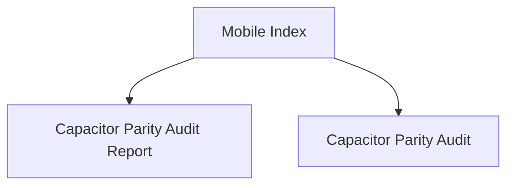

# Hussh Mobile Index

## Visual Map

Use this index for Capacitor parity and release-readiness checks.

These docs describe the mobile side of the platform's `Separation of Duties`: one shared product contract, different transport boundaries, and release gating that proves parity rather than assuming it.

Within the seven-layer platform architecture, mobile is the main Layer 6 and Layer 7 delivery surface.

## Native Continuity Contract

Native checks have two deliberately separate lanes:

- `npm run ios:cold:audit` and `npm run android:cold:audit` are destructive fixture audits. They reset app state and use a reviewer fixture to prove cold-start route behavior. They do not prove retained route, authenticated session, or the memory-only vault across background/resume.
- `npm run ios:continuity:local` and `npm run android:continuity:local` are non-destructive, visible same-session rehearsals. They require an already-installed, normally unlocked app and never install, clear, terminate, or inject reviewer credentials. Use them for rapid interaction, background/resume, and voice-ownership checks.

The vault key and VAULT_OWNER token remain memory-only. A normal background/resume preserves a valid in-memory session; an actual WebView/process restart requires the normal unlock path. The app shell is the single native lifecycle collector; vault, auth, and notification consumers subscribe to its lifecycle signal rather than registering competing Capacitor listeners.

## Native Test Safety Contract

Native verification has four distinct kinds of evidence. They must never be
substituted for one another:

- Static and host-native tests compile the bridge, generated runner, and
  debug-only test policy without launching an app.
- Cold route and UI audits intentionally reset a test installation. They may
  run only with `HUSHH_ALLOW_DESTRUCTIVE_NATIVE_AUDIT=true` and always
  terminate their test process in `finally` and on `SIGINT`/`SIGTERM`.
- Continuity rehearsal launches the already-installed normal app and leaves
  its route, in-memory vault, and user data alone. It is the only valid
  evidence for background/resume and rapid interaction behavior.
- Physical-device tests use a separately authorised test session and terminate
  their launched app even when an XCTest assertion fails.

The iOS standard target is the existing iPhone 14 Plus
`9C5B1D61-028C-474A-BDFC-523BACC3B02C`. A cold runner has a 45-second internal
bootstrap deadline; on expiry it writes a sanitized terminal timeout result and
stops its interval. No audit may leave a `runui` bootstrap polling after its
host stops.

## References

- [capacitor-parity-audit.md](./capacitor-parity-audit.md): parity contract and audit gate.
- [capacitor-parity-audit-report.md](./capacitor-parity-audit-report.md): latest release-ready audit findings.
- [../architecture/frontend-native-surface-map.md](../architecture/frontend-native-surface-map.md): route to API/native/plugin/voice mapper scaffold.
