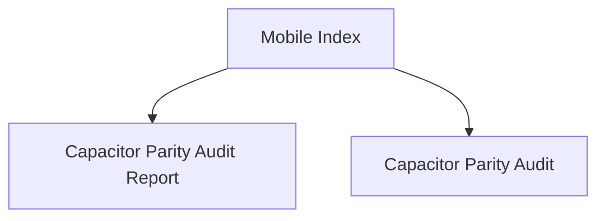

# Hussh Mobile Index

## Visual Map

Use this index for Capacitor parity and release-readiness checks.

These docs describe the mobile side of the platform's `Separation of Duties`: one shared product contract, different transport boundaries, and release gating that proves parity rather than assuming it.

Within the seven-layer platform architecture, mobile is the main Layer 6 and Layer 7 delivery surface.

## Native Continuity Contract

Native checks have two deliberately separate lanes:

- `npm run ios:cold:audit` and `npm run android:cold:audit` are destructive fixture audits. They reset app state and use a reviewer fixture to prove cold-start route behavior. They do not prove retained route, authenticated session, or the memory-only vault across background/resume.
- `npm run ios:continuity:local` and `npm run android:continuity:local` are non-destructive same-session rehearsals. The iOS runner stays headless by default; use `npm run ios:continuity:local -- --visible` only when a desktop window is requested. They require an already-installed, normally unlocked app and never install, clear, terminate, or inject reviewer credentials. Use them for rapid interaction, background/resume, and voice-ownership checks.

The vault key and VAULT_OWNER token remain memory-only. A normal background/resume preserves a valid in-memory session; an actual WebView/process restart requires the normal unlock path. The app shell is the single native lifecycle collector; vault, auth, and notification consumers subscribe to its lifecycle signal rather than registering competing Capacitor listeners.

## Native Authentication Settlement

- `AuthProvider` is the only React publication authority for native identity.
  Native restoration and explicit provider settlement may publish a user; the
  Firebase JS observer must not independently mutate native React auth state.
- A completed Apple/Google provider result enters a post-auth settlement before
  setup or vault guards can render. The provider-issued Firebase ID token is
  reused for the authoritative pre-vault bootstrap, and the settlement ends
  only after the destination and onboarding mirror are resolved.
- A native cold restore landing on `/` resolves the same authoritative
  post-auth destination once before entering `/one`, `/one/setup`, or the phone
  mandate. It must not enter `/one` first and let vault, phone, setup, and page
  effects compete to redirect afterward.
- Organic sign-in and unlock resolve to `/one`. RIA is a private-agent
  capability reached by explicit navigation; stored IAM persona fields must
  never promote login, unlock, resume, or setup admission to `/ria`.
- `/one/setup` and its capability setup routes are authenticated and
  phone-gated, but never wrapped in the general hard vault gate. The setup hub
  owns its progress bootstrap; a capability may request the shared scoped vault
  prerequisite only when that individual operation needs protected storage.
- Native sign-out is terminal and exactly-once for the current WebView: block
  lifecycle restoration, attempt native and Firebase JS credential cleanup
  independently, clear user-scoped local state, then replace the document at
  the public route. The web-only Next.js session-cookie endpoint is not called
  from a native static build.
- iOS app uninstall does not clear Keychain. The explicit debug-only cold-reset
  path therefore clears both Firebase Auth and the app-owned HushhAuth Keychain
  service before a reinstall can be treated as fresh-user evidence.
- Capacitor static-export paths are transport paths and may end in `/` (for
  example, `/register-phone/`). Authentication, phone, setup, public-route, and
  capability admission must compare the normalized logical route. A raw string
  comparison can turn a prerequisite route into a self-redirect loop that web
  development does not reproduce.

## Resume Privacy Shield Contract

- iOS and Android cover the native WebView before the app becomes inactive, so
  stale authenticated or vault content cannot appear in an app-switcher
  snapshot or the first resumed frame. Android also owns `FLAG_SECURE` while
  the cover is visible.
- Every inactive cycle receives a process-local generation and a cause:
  `inactive`, `background`, or `restart`. An inactive-only return, including a
  biometric or permission sheet, reuses settled account validation. Actual
  backgrounding requires bounded account/session validation; that debt survives
  later transient inactivity until acknowledged. `HushhSessionPrivacy` publishes
  retained state events after actual activation, independently of the shared
  interaction coordinator's background-only `pause`/`resume` events.
- `AuthProvider` reconciles a subscription with a state read, treats unknown
  bridge state as recovery, and checks refused acknowledgements. It acknowledges
  the current generation only after React commits the validated destination or
  safe recovery gate. Older acknowledgements cannot uncover a newer shield.
- The shared Vault guard's checking/recovery surface is an opaque browser-modal
  top-layer dialog. Previously mounted and newly appended route portals remain
  covered and implicitly inert; focus and Escape stay with the safe gate. This
  preserves mounted route state on supported hosts. If modal isolation is
  unavailable, the guard drops retained route descendants before showing its
  ordinary modal fallback; it never assumes a hidden parent contains portals.
- Resume itself never removes the cover. Native code accepts release only while
  the app/activity is active and the requested generation is current. A
  terminal account or session result keeps the cover in place through the
  document replacement that returns the person to Login.
- If a cover remains for eight seconds after activation, native controls expose
  `Try again` and `Restart session`, stop the progress indicator, and explain
  that verification could not complete. Retry starts another bounded check
  without removing those escape controls. Restart
  advances the generation and retires the observed JavaScript document IDs
  before reloading the current app document, keeps the cover present, and
  preserves Firebase identity. An old document cannot acknowledge even a newly
  read restart generation. The fresh JavaScript runtime
  has no decrypted main-vault key and uses the normal unlock/recovery flow; only
  its rendered safe destination can release the cover. Neither action grants
  access or releases the cover on a timer.
- The cover is visual and accessible: iOS presents it as a modal accessibility
  surface; Android hides the underlying WebView descendants from TalkBack and
  restores the WebView's previous accessibility mode only after an accepted
  release or activity teardown.
- A fresh process starts unshielded because it has no prior WebView content to
  expose. The normal auth/loading gates still withhold authenticated surfaces
  during cold restoration; the shield is not authentication persistence and
  never stores a credential, vault key, or account identifier.

## Vault setup and runtime session

- Setup creates the existing passphrase/recovery wrappers once. Existing Vaults
  are opened, never recreated. The optional quick-unlock choice is applied from
  the final recovery-key continuation; cancellation does not invalidate setup.
- The app-root `VaultProvider` owns the memory-only unlocked main-app key. Route
  changes, focus, transient OS sheets and background returns preserve it. There
  is no inactivity lock. Explicit lock, sign-out, account change and a fresh
  document/process require unlock again. Browser storage never holds the key.
- Owner-token validity is separate from local key availability. Expired tokens
  cannot authorize calls. Temporary validation/renewal outages hide protected
  UI behind retryable recovery without discarding the key; terminal invalidation
  clears it. Late unlock, renewal and native Messages publication are scoped to
  the current identity/runtime epoch.
- Native enrollment prefers the available Face ID/Touch ID Keychain path;
  existing native passkeys remain supported. New protected secrets have unique
  device-wrapper references and retain `WhenUnlockedThisDeviceOnly` plus
  `biometryCurrentSet`. Enrollment verifies Keychain recovery and persisted
  encrypted-wrapper readback before changing the primary method. Legacy
  `default` references remain compatible; another device's wrapper is not
  selected as a local biometric enrollment.
- `Unlock One` exposes the actual biometric label, passphrase, recovery key and
  the hard gate's sign-out escape. Native quick unlock gets one automatic
  attempt; cancellation requires an explicit retry. Browser passkeys start only
  from an explicit button. Switching methods invalidates the current attempt
  and cancels its native/WebAuthn request. The form scrolls within the available
  safe-area/keyboard space instead of pushing fallback controls below it.
- The existing Messages extension custody contract remains a distinct native
  Keychain exception, not a way to restore the main-app key after process death.
  Native generation checks reject publication after clearing that custody entry.

## Native Test Safety Contract

Native verification has four distinct kinds of evidence. They must never be
substituted for one another:

- Static and host-native tests compile the bridge, generated runner, and
  debug-only test policy without launching an app.
- Cold route and UI audits intentionally reset a test installation. They may
  run only with `HUSHH_ALLOW_DESTRUCTIVE_NATIVE_AUDIT=true` and always
  terminate their test process in `finally` and on `SIGINT`/`SIGTERM`.
- Continuity rehearsal launches the already-installed normal app and leaves
  its route, in-memory vault, and user data alone. It is the only valid
  evidence for background/resume and rapid interaction behavior.
- Physical-device tests use a separately authorised test session and terminate
  their launched app even when an XCTest assertion fails.

Build commands use the portable `generic/platform=iOS Simulator` destination
rather than a pinned simulator UDID, because Xcode updates retire device types
and a pinned id fails only after a full build. Interactive runs resolve a
concrete simulator at launch time (see `.claude/skills/run-ios-sim/launch.sh`).
A cold runner has a 45-second internal
bootstrap deadline; on expiry it writes a sanitized terminal timeout result and
stops its interval. No audit may leave a `runui` bootstrap polling after its
host stops.

## References

- [capacitor-parity-audit.md](./capacitor-parity-audit.md): parity contract and audit gate.
- [capacitor-parity-audit-report.md](./capacitor-parity-audit-report.md): latest release-ready audit findings.
- [../architecture/frontend-native-surface-map.md](../architecture/frontend-native-surface-map.md): route to API/native/plugin/voice mapper scaffold.
