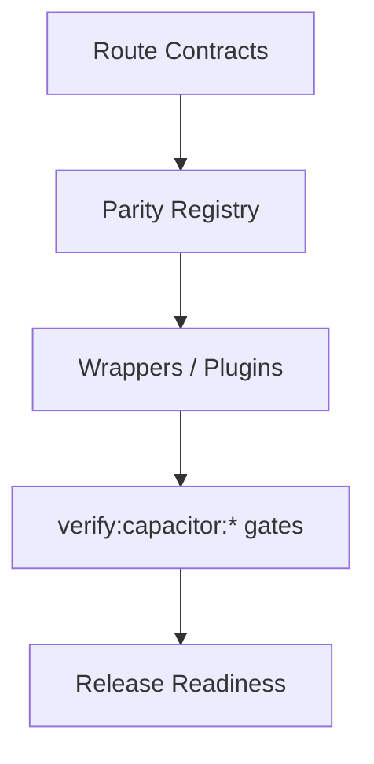

# Capacitor Parity Audit


## Visual Map



This is the release-gate contract for calling iOS/Android parity complete.

Founder-language note: this audit is one of the concrete proofs behind the platform's `Separation of Duties` claim. It shows that changing the transport boundary from Next.js proxy to native plugin does not change the visible product contract.

## Source Of Truth

- Canonical app routes: `hushh-webapp/lib/navigation/routes.ts`
- Route governance reference: `docs/reference/architecture/route-contracts.md`
- Frontend/native surface map: `hushh-webapp/frontend-native-surface-map.generated.json`
- Native route inventory: `hushh-webapp/native-route-inventory.json`
- Native route evidence:
  - `hushh-webapp/native-ios-parity-report.json`
  - `hushh-webapp/native-android-parity-report.json`
- Mobile parity reference: `docs/reference/mobile/capacitor-parity-audit.md`
- Docs/runtime verification: `bash scripts/ci/docs-parity-check.sh`
- Full CI lane: `bash scripts/ci/orchestrate.sh all`

## Required Local Commands

Non-destructive contract check:

```bash
cd hushh-webapp && npm run verify:capacitor:static
```

Intentional destructive cold-start audit:

```bash
cd hushh-webapp && npm run verify:capacitor:cold:audit
```

The cold audit resets native app state and signs in the governed reviewer fixture. It is route/parity evidence only, never vault or route-continuity evidence. For a visible, non-destructive same-session rehearsal, start the already-installed app with `npm run ios:continuity:local` or `npm run android:continuity:local`, then drive the specified interactions in the device.

## Route Classification Policy

Every visible page in the canonical app route contract must be classified in the parity docs as one of:

- native-supported and required
- intentionally web-only and explicitly exempt

Current policy keeps the full visible app surface in scope, including:

- product routes
- `/developers`
- public/auth content routes

Calendar is intentionally web-only until the app has a native browser/deep-link
OAuth return handoff. `/one/calendar` and `/one/setup/calendar` must remain
explicit exclusions rather than presenting a native Google authorization flow
that cannot complete.

Current inventory policy:

- Native-required routes must pass on iOS and Android. Derive coverage and counts
  from `hushh-webapp/native-route-inventory.json`.
- 17 routes are explicit exclusions: `/blog`, `/blog/[slug]`, `/circle/join`,
  `/developers`, `/kai/optimize`, `/oauth/authorize`, `/one/calendar`,
  `/one/kai/optimize`, `/one/location/check-in/hotel`, `/one/profile/google/oauth/return`,
  `/one/profile/integrations`, `/one/profile/pkm-agent-lab`, `/one/puppy`,
  `/one/setup/calendar`, `/research`, `/research/protocol`, and `/welcome`.
- New parity exceptions are not accepted unless this document and the route inventory change in the same PR.

Nested route families are classified explicitly even when they render through a shared web workspace. The profile family uses `/one/profile/<panel>` routes with the shared `native-route-profile` marker; dynamic detail identifiers remain query-backed fixtures in `native-route-inventory.json` so Capacitor static export does not require unbounded dynamic paths.

The consent-aware public person surface is the narrow exception. Its sole
product route remains `/people/[personRef]`; Capacitor emits one inert UUID
fixture to include the dynamic client bundle, then resolves the actual opaque
reference through the shared native-aware API transport. No public identity,
scope metadata, grant, or plaintext value is compiled into the application.

## Browser API Policy

Route-facing code must not directly own browser-only APIs when a shared wrapper should exist.
Internal route changes must use Next.js routing (`router.push` / `router.replace`) or the shared internal navigation event handled by `app/providers.tsx`; direct `window.location` mutation is reserved for wrapper-owned external navigation because it can discard the in-memory BYOK vault key.
Before changing a route that calls a service or plugin, run
`cd hushh-webapp && npm run verify:surface-map` and update the generated map
when the route's Next.js proxy, backend endpoint family, native transport, or
voice/action contract changes.

Current shared wrappers:

- clipboard: `hushh-webapp/lib/utils/clipboard.ts`
- navigation mutations / external open: `hushh-webapp/lib/utils/browser-navigation.ts`
- local/session storage access: `hushh-webapp/lib/utils/session-storage.ts`
- download/export: `hushh-webapp/lib/utils/native-download.ts`
- foreground location: `hushh-webapp/lib/capacitor/index.ts` via
  `HushhLocation`

Direct usage is allowed only in:

- the wrapper files above
- explicitly exempt web-only plugin implementations
- documented accepted exceptions in the mobile docs

## Notification Lifecycle Parity

Web, iOS, and Android share one Feed-first contract for every routine push
family. While the app is active, receipt refreshes `/one/feed` and the owning
domain state without a popup toast, foreground system banner, or sound. While
an iOS or Android app is backgrounded or terminated, the operating system owns
the notification; the same applies when no visible web client can claim it. A
notification body tap opens `/one/feed` through the shared internal navigation
event when a warm client exists, preserving the memory-only vault; cold launch
opens that same route and follows the normal auth/unlock recovery path. On iOS,
registered consent action buttons remain confirmation-only deep links. Save My
Soul is the sole foreground presentation exception and must not produce both a
native banner and the shared emergency alarm. Capacitor's Firebase Messaging
router remains the iOS notification delegate and presents only the badge in the
foreground, while the shared UI owns the emergency card and alarm. Its explicit
iOS `Open live location` safety action retains a validated direct One Location
route; ordinary notification body taps still enter Feed. Consent request
identity survives the Feed handoff so the backend can stop reminders after the
user attends the system notification.

## Gemini runtime configuration parity

Connections setup and settings use the shared web vault/PKM path inside both
native WebViews. No Capacitor secret-storage plugin or native preference is
added for a Gemini API key. The shared One voice client sends provider mode and,
only for BYOK, a one-time first authenticated relay bootstrap frame; native code
does not log, persist, or replay the credential. iOS and Android therefore use
the same lock, background, reconnect, and managed-mode fallback behavior as web.
During first-run setup, the explicit provider choice is a required root-setup
prerequisite. Its non-secret completion marker is written through the same
authenticated pre-vault API on web and the native direct-backend mapping; no
platform plugin owns a second copy. The setup gate revalidates the marker before
Skip/Finish can settle, while BYOK credentials remain vault-only.

## Accepted Exceptions

Current accepted parity exceptions are:

- None.

Cloud-backed vault preference flows are the canonical cross-platform behavior, and Android passkey PRF is part of the parity contract rather than an exception. If a new exception is ever needed, document it in the mobile docs in the same change.

## Native Project Sanity

Parity is not complete until both projects still load structurally:

- iOS: `xcodebuild -list -project ios/App/App.xcodeproj`
- Android: `./gradlew tasks --all`

Cold route parity is not complete until the native reports are fresh against the current inventory:

- `cd hushh-webapp && npm run ios:cold:audit`
- `cd hushh-webapp && npm run android:cold:audit`
- `cd hushh-webapp && HUSHH_ALLOW_DESTRUCTIVE_NATIVE_AUDIT=true npm run ios:voice:test`
- `cd hushh-webapp && HUSHH_ALLOW_DESTRUCTIVE_NATIVE_AUDIT=true npm run android:voice:test`
- `cd hushh-webapp && npm run verify:capacitor:reports`

`verify:capacitor:reports` fails when either platform audits fewer native-required routes than the current inventory, or when an `ok: true` result lacks `ready=1`, `found=1`, the expected marker, route match, auth match, or allowed data state.

`ios:voice:test` and `android:voice:test` run the shared
`native-one-voice-control-smoke` flow. The flow signs in with the native test
bridge, opens `/one/kai`, verifies the stable One Voice control hook, starts the
realtime voice surface, waits for a recognized voice state or simulator-safe
permission/provider fallback, and ends the active session when possible. These
tests verify control wiring and recovery; live microphone quality, latency, and
provider ranking still require device/provider benchmark artifacts.

## Continuity Evidence

Before treating a native change as safe for an active user, run the matching non-destructive continuity lane against a normal app session. Confirm rapid tab taps settle to the final destination, background/resume retains the valid vault and route, and a second voice start does not acquire a competing session. Do not use test-mode launches, injected credentials, an uninstall, a clear-data operation, or a cold route report as continuity evidence.

## Native Test Runtime Safety

Cold audits are a controlled test runtime, not a resident app mode. The host
must require explicit destructive authority before it resolves reviewer state;
it must stop the test package on normal completion, exception, `SIGINT`, and
`SIGTERM`. The page runner independently has a 45-second bootstrap deadline,
which writes a sanitized terminal `timeout` report and clears the bootstrap
interval. This dual termination is intentional: a stopped host can never leave
the simulator repeatedly routing in test mode.

iOS and Android use the same checkpoint model: each UI cold run receives a
unique metadata-only flow-run ID, so a partial session checkpoint cannot be
reused by another launch. Android accepts native-test extras only when the
installed app is debuggable; release builds do not install the bridge. The
obsolete Android `resetAppState` extra has no meaning and must not be added
back—cold scripts own explicit uninstall/clear behavior.

Run source and generated-runner consistency as part of static verification.
Then compile the host-native tests before considering device execution:

```bash
cd hushh-webapp && npm run verify:capacitor:static
cd hushh-webapp && ./android/gradlew -p android :app:testDebugUnitTest --no-daemon
cd hushh-webapp && xcodebuild -project ios/App/App.xcodeproj -scheme App -sdk iphonesimulator -destination 'generic/platform=iOS Simulator' -derivedDataPath ios/App/build/DerivedData build-for-testing
```

Only then, and only with explicit authority, run the destructive audit. Do not
run a cold audit merely to inspect a normally unlocked session.

## Authentication Provider Parity

Native parity for authenticated flows now includes the verified phone mandate after login.

- `HushhSessionPrivacy` is the native resume boundary on both iOS and Android.
  The host must cover the WebView before inactivity, expose the current
  process-local generation through `getState`, and accept
  `completeSessionValidation` only for the same generation while active.
  Neither platform may auto-release its cover from a resume callback.
- The shield must block more than taps. iOS keeps the cover accessibility-modal;
  Android applies `FLAG_SECURE`, hides the underlying WebView descendants from
  TalkBack, and restores the exact prior accessibility mode only after an
  accepted release or activity destruction.
- The TypeScript bridge remains a web-safe no-op. `AuthProvider` is the sole
  caller that may acknowledge a native generation after bounded session
  validation; route and vault components do not release the native cover.

- `FirebaseAuthentication.providers` must include `"phone"` alongside the existing provider list.
- `/register-phone` is a contract route even though it bypasses the standard shell.
- One Voice/Kai compatibility surfaces require native microphone permission metadata:
  `NSMicrophoneUsageDescription` on iOS and `android.permission.RECORD_AUDIO` on Android.
- Siri/App Shortcuts is an explicit iOS system-surface specialization. Its
  `HushhVoiceInvocation` bridge exposes metadata-only pending/claim/complete
  handoff methods on iOS; Android and web return unsupported/no pending
  invocation and do not create a parallel assistant integration.
- One Location Agent requires foreground location parity:
  `NSLocationWhenInUseUsageDescription` on iOS,
  `android.permission.ACCESS_FINE_LOCATION` / `ACCESS_COARSE_LOCATION` on
  Android, and the `HushhLocation` plugin on web, iOS, and Android.
- Background sharing is implemented on iOS with explicit permission and background
  location mode. Android currently returns `android_background_share_unavailable`;
  method-name parity does not prove equivalent background behavior.
- `/one/kai/funding-trade` is part of the native route inventory because voice/action parity can
  land users on the funding trade surface.
- `/one/location` is part of the native route inventory because live location is
  a platform permission surface, not a web-only route.
- `/one/location/check-in/hotel` is explicitly excluded until a supported hotel
  stay provider exists. The route fails closed and must not become a native
  functional screen without updating the provider, inventory, and route
  contracts together.
- Web, iOS, and Android must all produce the same product truth: a signed-in user without
  `FirebaseAuth.currentUser.phoneNumber` cannot continue past the mandate.
- Android still requires a documented OTP smoke on device or UAT because the repo does not
  currently ship a dedicated Android OTP automation harness.

## Release Standard

Treat docs/runtime drift as a blocker. A route, native contract, or browser-sensitive flow is not parity-ready if the docs and audit registry do not describe it correctly.

Native plugin drift is also a blocker. `cd hushh-webapp && npm run verify:capacitor:plugins` compares TypeScript `registerPlugin` contracts with iOS `CAPBridgedPlugin` metadata and Android `@CapacitorPlugin` / `@PluginMethod` declarations.
